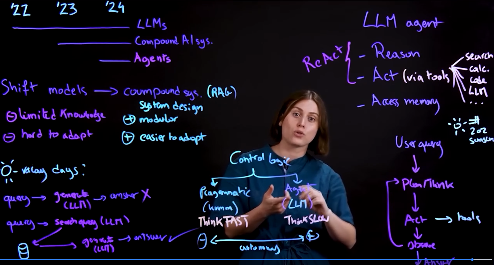
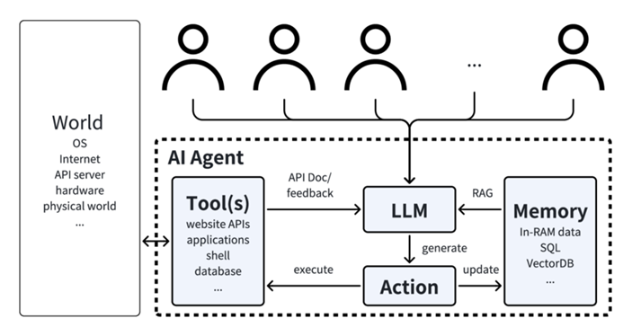
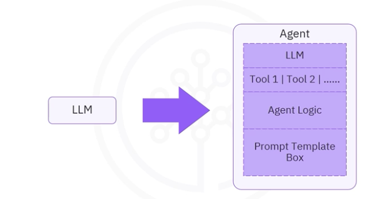
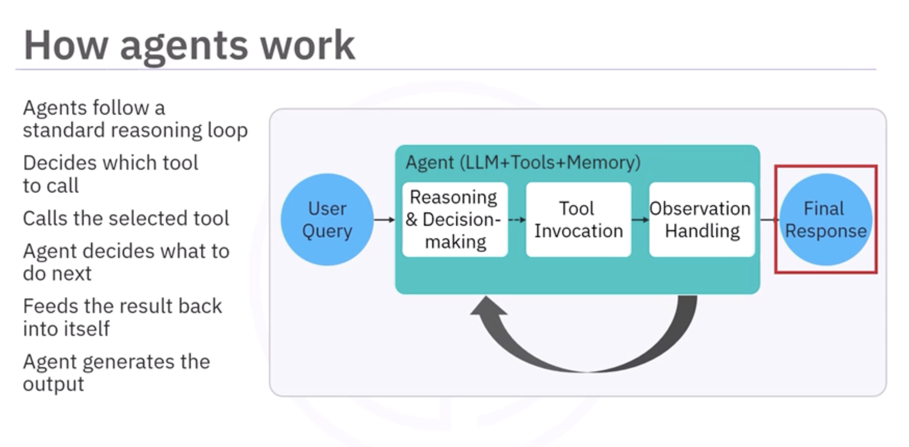
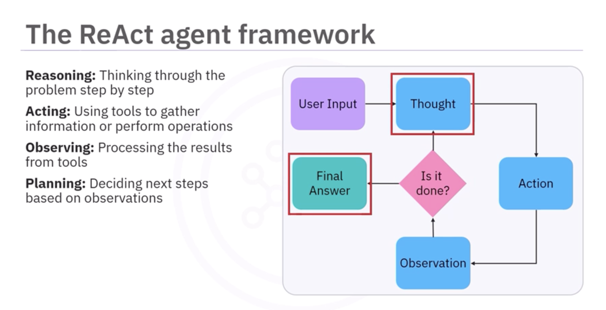
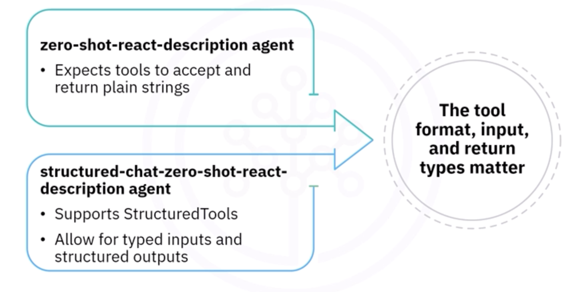
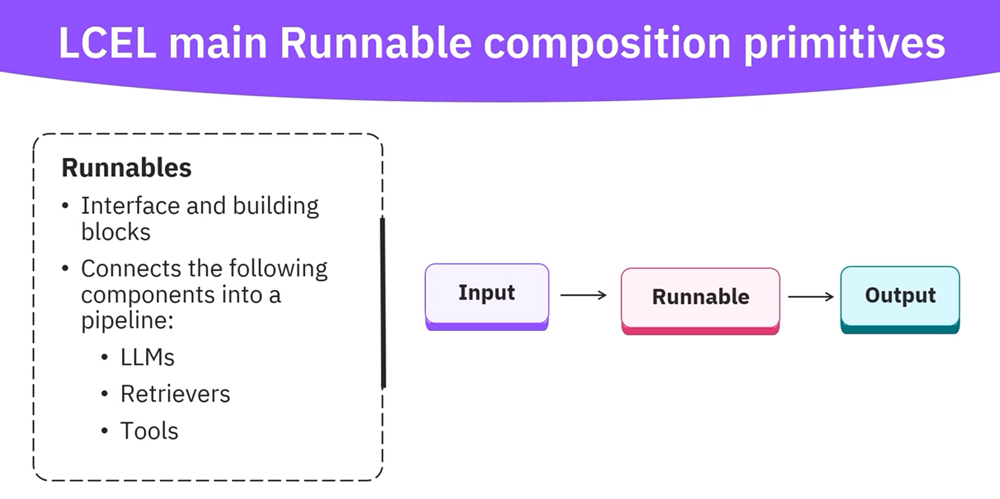
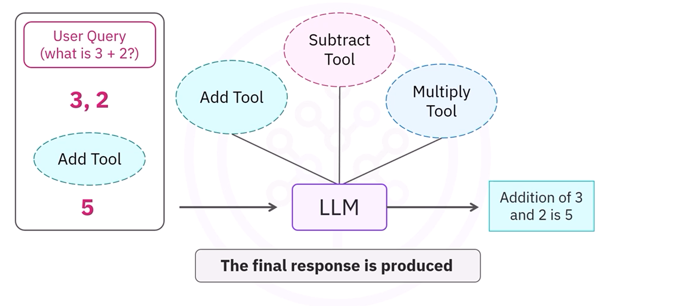

# Building AI Agents and Agentic Workflows: Fundamentals of Building AI Agents

This is a compilation of notes from the Coursera Specialization [Building AI Agents and Agentic Workflows (IBM)](https://www.coursera.org/programs/deutsche-telekom-learning-program-ddjuh/specializations/building-ai-agents-and-agentic-workflows), which is composed of the following courses:

- [Fundamentals of Building AI Agents](https://www.coursera.org/programs/deutsche-telekom-learning-program-ddjuh/learn/fundamentals-of-building-ai-agents?authProvider=deutschetelekom)
- [Agentic AI with LangChain and LangGraph](https://www.coursera.org/programs/deutsche-telekom-learning-program-ddjuh/learn/agentic-ai-with-langchain-and-langgraph)
- [Agentic AI with LangGraph, CrewAI, AutoGen and BeeAI](https://www.coursera.org/programs/deutsche-telekom-learning-program-ddjuh/learn/agentic-ai-with-langgraph-crewai-autogen-and-beeai)

This folder contains notes of the first course: **Fundamentals of Building AI Agents**.

Table of contents:

- [Building AI Agents and Agentic Workflows: Fundamentals of Building AI Agents](#building-ai-agents-and-agentic-workflows-fundamentals-of-building-ai-agents)
  - [1. Foundations of Tool Calling and Chaining](#1-foundations-of-tool-calling-and-chaining)
    - [Welcome to the Course](#welcome-to-the-course)
    - [Introduction to AI Agents](#introduction-to-ai-agents)
      - [What Are AI Agents?](#what-are-ai-agents)
      - [Comparing AI System Designs](#comparing-ai-system-designs)
      - [When Should We Use Agents?](#when-should-we-use-agents)
        - [AI System Spectrum](#ai-system-spectrum)
        - [When to Use AI Agents: 4-Criteria Framework](#when-to-use-ai-agents-4-criteria-framework)
        - [Common Challenges of Agents](#common-challenges-of-agents)
        - [When NOT to Use Agents](#when-not-to-use-agents)
        - [Risk Management Strategies](#risk-management-strategies)
        - [Key Elements of Agent Architecture](#key-elements-of-agent-architecture)
        - [Deployment Best Practices](#deployment-best-practices)
        - [Key Takeaways](#key-takeaways)
    - [Getting Started with Tool Calling](#getting-started-with-tool-calling)
      - [Tool Calling for LLMs](#tool-calling-for-llms)
      - [Why LLMs Need Tools](#why-llms-need-tools)
      - [Tools, Agents, and Function Calling in LangChain](#tools-agents-and-function-calling-in-langchain)
    - [Building and Orchestrating Tools](#building-and-orchestrating-tools)
      - [Build Effective AI Tools for Advanced LLMs](#build-effective-ai-tools-for-advanced-llms)
      - [Build Intelligent Agents for Dynamic LLM Tool Use](#build-intelligent-agents-for-dynamic-llm-tool-use)
      - [Exercises: Tool Calling](#exercises-tool-calling)
      - [Popular Built-in Tools in LangChain](#popular-built-in-tools-in-langchain)
        - [Search tools](#search-tools)
        - [Code interpretation and data analysis](#code-interpretation-and-data-analysis)
        - [Web browsing and interaction](#web-browsing-and-interaction)
        - [Productivity and collaboration](#productivity-and-collaboration)
        - [File and document processing](#file-and-document-processing)
        - [Financial and business tools](#financial-and-business-tools)
        - [AI and machine learning integration](#ai-and-machine-learning-integration)
      - [Summary](#summary)
        - [1. Tool calling fundamentals](#1-tool-calling-fundamentals)
        - [2. Tool calling workflow](#2-tool-calling-workflow)
        - [3. Tool creation methods (LangChain)](#3-tool-creation-methods-langchain)
        - [4. Inspecting and using tools](#4-inspecting-and-using-tools)
        - [5. Built-in tools (by use case)](#5-built-in-tools-by-use-case)
        - [6. Agents (LangChain)](#6-agents-langchain)
        - [7. LCEL (LangChain Expression Language)](#7-lcel-langchain-expression-language)
        - [Key takeaways](#key-takeaways-1)
  - [2. LCEL and Manual Tool Calling in LangChain](#2-lcel-and-manual-tool-calling-in-langchain)
    - [Introduction Chaining and LCEL Basics (LangChain Expression Language)](#introduction-chaining-and-lcel-basics-langchain-expression-language)
      - [LangChain Expression Language (LCEL) and Chaining](#langchain-expression-language-lcel-and-chaining)
      - [Exercise: AI-Powered Data Analysis with LCEL](#exercise-ai-powered-data-analysis-with-lcel)
      - [LCEL Cheat Sheet](#lcel-cheat-sheet)
        - [What changed in v1](#what-changed-in-v1)
        - [Why LCEL is useful](#why-lcel-is-useful)
        - [Core Runnable types](#core-runnable-types)
        - [Common LCEL operations](#common-lcel-operations)
        - [Common LCEL patterns](#common-lcel-patterns)
        - [Minimal example](#minimal-example)
        - [When to use what](#when-to-use-what)
    - [Manual Tooling Calling Basics](#manual-tooling-calling-basics)
      - [When to Call Tools Manually](#when-to-call-tools-manually)
      - [Structured Outputs for Tool Calling](#structured-outputs-for-tool-calling)
    - [Parsing and Validating Tool Calls](#parsing-and-validating-tool-calls)
      - [LLM Agents with Tools](#llm-agents-with-tools)
      - [Interactive LLM Agents](#interactive-llm-agents)
      - [Exercise: Build Interactive Agents with Tools](#exercise-build-interactive-agents-with-tools)
      - [Exercise: Build a Tool-Calling Agent](#exercise-build-a-tool-calling-agent)
    - [Summary](#summary-1)
  - [3. Using Built-In Agents in LangChain](#3-using-built-in-agents-in-langchain)

## 1. Foundations of Tool Calling and Chaining

### Welcome to the Course

Course Outline:

- Module 1: Foundations of Tool Calling and Chaining
  - Lesson 0: Welcome
  - Lesson 1: Introduction to AI Agents
  - Lesson 2: Getting Started with Tool Calling 
  - Lesson 3: Building and Orchestrating Tools
  - Lesson 4: Module Summary and Evaluation  

- Module 2:  LCEL and Manual Tool Calling in LangChain  
  - Lesson 1: Introduction to Chaining and LCEL Basics
  - Lesson 2: Manual Tool Calling Basics
  - Lesson 3: Parsing and Validating Tool Calls  
  - Lesson 4: Module Summary and Evaluation  

- Module 3: Using Built-in Agents in LangChain 
  - Lesson 1: Natural Language Data Visualization 
  - Lesson 2: Conversational Database Access
  - Lesson 3: Module Summary and Evaluation
  - Lesson 4: Course Wrap-Up

Tools/Software:

- LangChain: To design and implement structured AI workflows, orchestrate large language models (LLMs) with external tools, and build intelligent agents. 

- LangChain Expression Language (LCEL): For building custom chains and flexible, production-ready AI workflows. 

- Large Language Models (LLMs): To experiment with different AI models, understand their capabilities, and integrate them into agent applications. 

- LangGraph: To serve as an extension for building advanced agents with LangChain.

- Python: For coding AI applications, defining custom tools, integrating APIs, and implementing LangChain's functionalities effectively. 

- LangChain's Built-in Agents (e.g., DataFrame Agent and SQL Agent): For natural language data analysis, visualization, and conversational database access.

### Introduction to AI Agents

#### What Are AI Agents?



* Generative AI is shifting from standalone models to compound AI systems.
* Standalone models are limited by training data and lack access to real-time or private information.
* Compound systems combine models with tools, databases, and programmatic components.
* This modular approach is more flexible and easier to adapt than retraining models.
* Retrieval augmented generation (RAG) is a common example.
* Traditional systems rely on fixed, human-defined control logic, which can fail outside predefined paths.
* AI agents move control logic to the model itself.
* This is enabled by improved reasoning in large language models.
* Agents follow a "think slow" approach: plan, act, evaluate, and iterate.
* Core components of AI agents:
  * Reasoning: The model plans and breaks down tasks.
  * Acting: The model uses external tools such as APIs, search, or code.
  * Memory: The system stores past interactions and intermediate steps.
* ReAct (Reason + Act) is a common agent pattern.
* The agent plans, uses tools, observes results, and iterates to a final answer.
* Agents handle complex, multi-step problems across multiple data sources.
* Systems exist on a spectrum from low autonomy (fixed logic) to high autonomy (agentic).
* Fixed systems are efficient for narrow tasks, while agents are better for complex tasks.
* There is a trade-off between efficiency and flexibility.
* The field is evolving toward more agentic systems, with human oversight still important.

#### Comparing AI System Designs

| AI System Type | Process | Use Case | Pros | Cons |
| --- | --- | --- | --- | --- |
| Single LLM | Input --> LLM --> Output | Summarization, classification | Simple, fast, low cost | Not adaptable, lacks context |
| Workflow | Parallel LLMs --> Aggregation --> Output | Structured multi-step tasks | Predictable, easy to audit | Rigid, not dynamic |
| Agent | Plan --> Act --> Observe --> (repeat agent loop) | Complex, adaptive automation | Flexible, learns from feedback | Unpredictable, complex, pricier |

#### When Should We Use Agents?

##### AI System Spectrum

| Type                   | Description                                              | Best Use Cases                 |
| ---------------------- | -------------------------------------------------------- | ------------------------------ |
| Simple AI Features     | Single-task models (e.g., classification, summarization) | Fast, repeatable tasks         |
| Orchestrated Workflows | Predefined multi-step pipelines                          | Structured processes           |
| Autonomous Agents      | Adaptive, decision-making systems                        | Complex reasoning and strategy |

##### When to Use AI Agents: 4-Criteria Framework

| Criterion      | Use Agents When...                  | Use Workflows When...          |
| -------------- | ----------------------------------- | ------------------------------ |
| Task Nature    | Ambiguous, exploratory, creative    | Predictable, rule-based        |
| Value vs Cost  | High-value tasks justify cost       | Low-value or high-volume tasks |
| Capabilities   | Agent passes key skill tests        | Agent fails reliability checks |
| Risk of Errors | Errors are manageable or reversible | Errors are costly or critical  |


##### Common Challenges of Agents

| Challenge               | Why It Matters                              |
| ----------------------- | ------------------------------------------- |
| Reasoning inconsistency | Unreliable performance across similar tasks |
| Unpredictable costs     | Token usage can vary widely                 |
| Tool integration issues | Requires stable APIs and tooling            |

##### When NOT to Use Agents

* High-volume, low-margin tasks
* Real-time systems (e.g., fraud detection)
* Zero-error domains (e.g., medical, security)
* Highly regulated environments

##### Risk Management Strategies

| Risk Level                  | Strategy                            |
| --------------------------- | ----------------------------------- |
| High-stakes, hard to detect | Human review + multiple validations |
| High-stakes, visible        | Automated checks + oversight        |
| Low-stakes                  | Monitoring + lightweight validation |

##### Key Elements of Agent Architecture

* Environment: Where the agent operates
* Tools: External systems/APIs it uses
* System prompts: Rules and goals guiding behavior

##### Deployment Best Practices

* Start simple and increase complexity gradually
* Begin with read-only tool access
* Add human approval for critical steps
* Use staged deployment (PoC --> Pilot --> Production)
* Enable logging and monitoring

##### Key Takeaways

* Agents are best for complex, ambiguous, high-value tasks
* Workflows are better for predictable and repeatable tasks
* Agents are powerful but costly and less reliable
* Human oversight and risk control are essential
* Start simple and scale cautiously as reliability improves

### Getting Started with Tool Calling

#### Tool Calling for LLMs

* Tool calling connects an LLM to external tools like APIs, databases, or code to access real-time data.
* A client sends user messages and tool definitions, and the LLM decides which tool to use.
* The client executes the tool and returns the result, and the LLM produces the final answer or another tool call.
* Tool definitions include name, description, and input parameters, and can represent APIs, databases, or code.
* Traditional tool calling can fail due to hallucinations or incorrect tool calls.
* Embedded tool calling uses a library between the client and LLM to manage tools and execution.
* The library sends messages with tools, executes tool calls, retries if needed, and returns final answers.
* This reduces errors and simplifies the system by centralizing tool handling. 

#### Why LLMs Need Tools

* LLMs are strong at text generation but cannot access real-time data, perform reliable calculations, or interact with external systems, so they often "guess."
* Tools extend LLM capabilities by enabling actions like math computation, API calls, data retrieval, and interaction with software.
* Without tools, LLMs rely only on training data patterns, which leads to hallucinations and errors, especially in tasks like math or logic.
* Tools improve accuracy and reliability by allowing the model to execute precise operations instead of guessing.
* Tools enable retrieval-augmented generation (RAG), letting LLMs access external data such as company documents or databases.
* They also support multimodal processing, including images, audio, and other non-text inputs.
* Tools help overcome limitations like lack of memory across sessions and restricted context window size.
* They allow LLMs to interact with APIs, databases, and digital services to perform real-world tasks.
* Examples include calculators for exact math, web tools for real-time information, code execution tools, and SQL queries.
* With tools, LLMs evolve into agents that follow a loop: understand the request, choose a tool, execute it, and return a result.
* Tools transform LLMs from passive text generators into active systems capable of solving real-world problems.

#### Tools, Agents, and Function Calling in LangChain

* Tools are functions (APIs, code, databases) that extend LLM capabilities.
* Tool calling means the LLM generates a structured request (not execution).
* An external system executes the tool and returns results for the final answer.
* Function calling and tool calling are the same concept (different naming).

Tool structure:

| Component   | Purpose         |
| ----------- | --------------- |
| Name        | Identifier      |
| Description | When/how to use |
| Parameters  | Inputs          |

Workflow:

* User query --> LLM selects tool.
* LLM outputs structured call (e.g., JSON).
* System executes tool.
* Result --> LLM --> final answer.

Tools in LangChain:

* Built-in (Wikipedia, search, math).
* Custom (`@tool`, `Tool`).
* Toolkits = grouped tools.
* Can be bound to OpenAI function calling.

Agents vs tools:

| Tools             | Agents                   |
| ----------------- | ------------------------ |
| Execute functions | Decide + orchestrate     |
| No reasoning      | Use LLM + tools + memory |

Agent architecture:

* LLM: decides actions.
* Tools: external capabilities.
* Memory: context (RAM, SQL, vector DB).
* Actions: structured tool calls.
* External world: APIs, OS, etc.

Agent flow: 

* Query --> decide tool --> call tool --> get result --> respond.



### Building and Orchestrating Tools

#### Build Effective AI Tools for Advanced LLMs



* An agent extends an LLM by using tools to act, access data, and perform multi-step reasoning; tools are the mechanism that enables real-world interaction.
* Tool calling workflow: the LLM selects a tool, extracts parameters from the user query, calls the tool with structured inputs, and returns the result.
* A tool is a Python function with a clear purpose, well-defined inputs (string or JSON), a descriptive name, a docstring (critical for tool selection), and a consistent output format (usually a dictionary).
* Simple tools use unstructured string inputs and basic parsing; they are fragile and limited.
* Structured tools define typed inputs (e.g., lists, booleans), support multiple parameters, and integrate better with function-calling LLMs.
* Inputs must be JSON-serializable; outputs should be simple and predictable because some LLMs struggle with complex formats.
* Tools can return flexible outputs using typing (e.g., Union), but this increases parsing complexity.
* Not all LLMs support multi-argument tools reliably; testing and version control are important due to LangChain instability.

```python
# Simple tool (fragile)
def add_numbers(inputs: str) -> dict:
    """
    Adds all integer numbers found in a string.

    Parameters:
    - inputs (str): A string containing numbers separated by spaces or text.

    Returns:
    - dict: A dictionary with key 'result' containing the sum of extracted integers.

    Example:
    >>> add_numbers("10 20 30")
    {'result': 60}
    """
    digits = [int(x) for x in inputs.split() if x.isdigit()]
    return {"result": sum(digits)}  # We return a dictionary

# LangChain Tool wrapper
from langchain.tools import Tool

add_tool = Tool(
    name="add_numbers",
    func=add_numbers,
    description="Adds numbers from a string input"  # complements docstring
)

result = add_tool.invoke("10 20 30")  # {'result': 60}

# Accessing metadata
print(add_tool.name)  # "add_numbers"
print(add_tool.description)  # "Adds numbers from a string input"
print(getattr(add_tool, "args", None))  # Depends on version


# Tool decorator: same as Tool, but cleaner syntax
from langchain.tools import tool
import re

@tool
def add_numbers(inputs: str) -> dict:
    """
    Extracts and sums all integers from a string using regex.

    Parameters:
    - inputs (str): A string possibly containing numbers.

    Returns:
    - dict: A dictionary with key 'result' containing the sum.

    Example:
    >>> add_numbers("The numbers are 10 and 20")
    {'result': 30}
    """
    numbers = [int(x) for x in re.findall(r"\d+", inputs)]
    return {"result": sum(numbers)}


# Structured tool with multiple typed inputs and detailed docstring
# Better!
from typing import List
from langchain.tools import tool

@tool
def add_numbers_with_options(numbers: List[float], absolute: bool = False) -> float:
    """
    Sums a list of numbers, optionally using absolute values.

    Parameters:
    - numbers (List[float]): List of numbers to sum.
    - absolute (bool): If True, sums absolute values of the numbers.

    Returns:
    - float: The computed sum.

    Examples:
    >>> add_numbers_with_options([1.0, -2.0], absolute=False)
    -1.0
    >>> add_numbers_with_options([1.0, -2.0], absolute=True)
    3.0
    """
    if absolute:
        numbers = [abs(x) for x in numbers]
    return sum(numbers)

# Invocation: We pass a dictionary matching the parameter names
result = add_numbers_with_options.invoke({
    "numbers": [-1.2, -5.0],
    "absolute": True
})  # 6.2

# Accessing metadata (structured)
print(add_numbers_with_options.name)  # "add_numbers_with_options"
print(add_numbers_with_options.description)  # extracted from docstring
# args is a JSON-like schema
print(add_numbers_with_options.args)
# Full tool schema (often available)
print(getattr(add_numbers_with_options, "args_schema", None))  # Pydantic model if present


# Tool with flexible output
from typing import Dict, Union

def safe_add(inputs: str) -> Dict[str, Union[float, str]]:
    """
    Attempts to sum integers in a string; returns an error message if none are found.

    Parameters:
    - inputs (str): Input string containing numbers.

    Returns:
    - Dict[str, Union[float, str]]:
        - 'result' (float): Sum if numbers are found.
        - 'result' (str): Error message if no numbers are found.

    Example:
    >>> safe_add("no numbers here")
    {'result': 'No numbers found'}
    """
    numbers = [int(x) for x in inputs.split() if x.isdigit()]
    if not numbers:
        return {"result": "No numbers found"}
    return {"result": sum(numbers)}

```

#### Build Intelligent Agents for Dynamic LLM Tool Use

* An agent combines an LLM with tools to reason, decide, and act; it follows a loop: receive query, reason, call tools, observe results, iterate, and produce an answer.
* Key design factors:
    * LLM choice determines tool-use and reasoning capabilities.
    * Tools must use JSON-serializable inputs/outputs; structured tools are preferred.
    * Agent strategy matters: simple agents vs ReAct (multi-step reasoning + tool use).
* ReAct pattern: think --> act (call tool) --> observe --> plan next step --> repeat or answer; zero-shot ReAct solves tasks without examples using step-by-step reasoning.
* Agent initialization in LangChain uses `initialize_agent` to bind LLM + tools + strategy.
* Agent types depend on tool format; `agent` parameter specifies the reasoning strategy and tool handling:
    1. `zero-shot-react-description` --> expects string inputs/outputs.
    2. `structured-chat-zero-shot-react-description` --> supports typed inputs (`StructuredTools`).
    3. `openai-functions` --> supports structured outputs (JSON/dicts).
* `invoke` is preferred over `run` for debugging and structured I/O; `verbose=True` exposes reasoning; `handle_parsing_errors=True` improves robustness.
* Different LLM-agent-tool combinations behave differently; structured outputs may break weaker combinations and require compatible agents.







```python
# Initialize an LLM (example with IBM Granite via langchain_ibm)
from langchain_ibm import ChatWatsonx

llm = ChatWatsonx(
    model_id="ibm/granite-3-2-8b-instruct",
    url="https://xxx.ml.cloud.ibm.com",  # placeholder
    project_id="your_project_id",
    apikey="YOUR_API_KEY"
)

# Alternative LLM:
# from langchain_openai import ChatOpenAI
# llm = ChatOpenAI(model="gpt-4.1-nano")

# Basic usage
response = llm.invoke("What is 2 + 2?")

# 1. Zero-shot ReAct agent (string tools)
# First, we define simple tool + tool wrapper (string-based, for zero-shot-react-description)
from langchain.tools import Tool

def add_numbers(inputs: str) -> str:
    """
    Adds numbers from a string input.
    Parameters:
    - inputs (str): Numbers in text form.
    Returns:
    - str: Sum as string (important for this agent type).
    """
    digits = [int(x) for x in inputs.split() if x.isdigit()]
    return str(sum(digits))  # must return string for this agent

add_tool = Tool(
    name="add_numbers",
    func=add_numbers,
    description="Adds numbers from a string"
)


# Zero-shot ReAct agent (string tools)
from langchain.agents import initialize_agent

agent = initialize_agent(
    tools=[add_tool],  # We pass a list of tools
    llm=llm,  # The LLM that powers the agent's reasoning
    agent="zero-shot-react-description",
    verbose=True,  # prints reasoning steps
    handle_parsing_errors=True  # recovers from malformed outputs
)

# Run query (internally: think -> act -> observe loop)
result = agent.invoke(
    "What is the sum of 27.72, 2.14, and 1.79?"
)

print(result)


# 2. Structured tool (typed inputs) for structured-chat agent
from langchain.tools import tool
from typing import List

@tool
def add_numbers_with_options(numbers: List[float], absolute: bool = False) -> float:
    """
    Sums a list of numbers, optionally using absolute values.
    Parameters:
    - numbers (List[float]): List of numbers.
    - absolute (bool): Whether to use absolute values.
    Returns:
    - float: Sum result.
    """
    if absolute:
        numbers = [abs(x) for x in numbers]
    return sum(numbers)

# Structured ReAct agent (supports typed inputs)
structured_agent = initialize_agent(
    tools=[add_numbers_with_options],
    llm=llm,
    agent="structured-chat-zero-shot-react-description",
    verbose=True
)

# Structured invocation (input/output wrapped in dict)
result = structured_agent.invoke({
    "input": "Sum -1.2 and -5.0 using absolute values"
})

print(result["output"])


# 3. Agent supporting structured outputs (e.g., OpenAI functions)
from langchain_openai import ChatOpenAI

# OpenAI function calling agent (supports structured outputs, i.e., dict/JSON)
llm_openai = ChatOpenAI(model="gpt-4.1-nano")

agent_functions = initialize_agent(
    tools=[add_numbers_with_options],
    llm=llm_openai,
    agent="openai-functions",  # supports JSON/dict outputs
    verbose=True
)

result = agent_functions.invoke({
    "input": "Sum -1.2 and -5.0 using absolute values"
})

print(result)

# Notes:
# - zero-shot-react-description: string I/O tools only
# - structured-chat-zero-shot-react-description: supports typed inputs
# - openai-functions: supports structured outputs (dict/JSON)
# - invoke(): preferred for structured debugging
# - verbose=True: shows internal reasoning loop (ReAct trace)
```

#### Exercises: Tool Calling

Notebooks and contents:

- [`01_tools.ipynb`](./lab/01_tools.ipynb): automatically generated notebook which covers the basics of tool calling in LangChain.
  - Introduces the notebook as a runnable companion to the README section on building and orchestrating tools.
  - Loads `dotenv`, LangChain tool utilities, and basic Python typing/helpers.
  - Demonstrates a simple string-based addition function wrapped as a LangChain tool.
  - Shows the `@tool` decorator approach with a regex-based addition tool.
  - Builds a structured tool with typed inputs and an `absolute` flag.
  - Inspects tool metadata such as `name`, `description`, `args`, and `args_schema`.
  - Includes a `safe_add` example with flexible output for success and error cases.
  - Uses OpenAI models only for the agent section.
  - Creates agents with the current `create_agent(...)` API for string tools and structured tools.
  - Adds a structured final-output example using a Pydantic schema.
  - Ends with takeaways comparing fragile string tools, structured tools, and modern agent orchestration.
- [`02_AI-Math-Assistant-Tool-Calling.ipynb`](./lab/02_AI-Math-Assistant-Tool-Calling.ipynb): lab exercise from the course, where tool calling is covered.
  - Starts as a guided lab on building an AI math assistant with LangChain tool calling.
  - Covers setup, required libraries, and environment preparation.
  - Introduces IBM `ChatWatsonx` as the main model in the original lab, with notes for local OpenAI and IBM configuration.
  - Explains the difference between plain functions and LangChain tools.
  - Builds and tests a basic `add_numbers` function.
  - Wraps functions with both the `Tool` class and the `@tool` decorator.
  - Demonstrates structured tools with multiple inputs using `add_numbers_with_options`.
  - Explores typed and flexible tool return values, including complex dictionary outputs.
  - Introduces classic agent setup with `initialize_agent(...)`.
  - Demonstrates multiple agent styles, including `zero-shot-react-description`, `structured-chat-zero-shot-react-description`, and `openai-functions`.
  - Introduces `create_react_agent` from LangGraph as a newer alternative.
  - Builds a multi-tool math toolkit with addition, subtraction, multiplication, and division.
  - Tests the math agent, diagnoses a subtraction mismatch, and fixes the tool behavior.
  - Rebuilds the agent and runs automated test cases across multiple prompts.
  - Discusses stronger validation and error handling for the math tools.
  - Adds a built-in/community Wikipedia tool and combines factual lookup with math reasoning.
  - Ends with an exercise to build, wrap, and test a power/exponentiation tool.

In the second notebook [`02_AI-Math-Assistant-Tool-Calling.ipynb`](./lab/02_AI-Math-Assistant-Tool-Calling.ipynb)

- `create_react_agent(...)` is used to build a graph-based loop where the model can reason, pick a tool, observe the result, and keep going until it has enough information. That makes it especially useful for multi-step tasks, multi-tool orchestration, and inspecting the full message/tool-call sequence. It is also closer to the LangGraph-style direction the ecosystem is moving toward, so it is better suited for more agentic workflows than a simple one-shot tool demo.
- `WikipediaAPIWrapper` is used, which allows the agent to fetch information from Wikipedia. This means the agent is no longer limited to computation from user-provided numbers. It can fetch outside factual context first, then use your math tools on top of that result. That is the big practical advantage: the agent can combine retrieval plus computation in one flow, which is much closer to real-world agent behavior.

#### Popular Built-in Tools in LangChain

##### Search tools

| Tool/Toolkit  | Function              | Purpose                                                                |
| ------------- | --------------------- | ---------------------------------------------------------------------- |
| SerpAPI       | Web search            | Performs web searches and returns answers                              |
| Google Search | Web search            | Executes Google searches and returns URLs, snippets, and titles        |
| Tavily Search | AI-optimized search   | Designed for AI agents; returns URLs, content, titles, images, answers |
| Wikipedia     | Knowledge base search | Searches Wikipedia and returns relevant summaries                      |


##### Code interpretation and data analysis

| Tool/Toolkit         | Function                 | Purpose                                                     |
| -------------------- | ------------------------ | ----------------------------------------------------------- |
| Python REPL          | Code execution           | Executes Python code for calculations, analysis, automation |
| Pandas DataFrame     | Data manipulation        | Enables interaction with tabular data                       |
| SQL Database Toolkit | Database querying        | Queries and manipulates SQL databases via natural language  |
| LLMMathChain         | Mathematical computation | Solves math problems via Python execution                   |
| JSON Toolkit         | JSON manipulation        | Handles large JSON/dictionary objects efficiently           |

##### Web browsing and interaction

| Tool/Toolkit       | Function                | Purpose                                      |
| ------------------ | ----------------------- | -------------------------------------------- |
| Requests Toolkit   | HTTP requests           | Sends HTTP requests and fetches web content  |
| PlayWright Browser | Browser automation      | Automates browser navigation and interaction |
| MultiOn Toolkit    | Web app interaction     | Enables interaction with web applications    |
| ArXiv              | Scientific paper search | Retrieves scientific papers from arXiv       |

##### Productivity and collaboration

| Tool/Toolkit      | Function            | Purpose                                |
| ----------------- | ------------------- | -------------------------------------- |
| Gmail Toolkit     | Email management    | Reads, sends, and manages Gmail emails |
| Office365 Toolkit | Office integration  | Interacts with Microsoft 365 apps      |
| Slack Toolkit     | Team communication  | Sends and reads Slack messages         |
| Github Toolkit    | Repo management     | Manages repositories, issues, PRs      |
| Google Calendar   | Calendar management | Creates and manages calendar events    |

##### File and document processing

| Tool/Toolkit     | Function              | Purpose                                      |
| ---------------- | --------------------- | -------------------------------------------- |
| File System      | Local file operations | Reads, writes, and manages local files       |
| Google Drive     | Cloud storage         | Accesses and manages files in Google Drive   |
| VectorStoreQA    | Document querying     | Queries documents stored in vector databases |
| Document Loaders | Content extraction    | Extracts content from formats like PDF, DOCX |

##### Financial and business tools

| Tool/Toolkit  | Function               | Purpose                                       |
| ------------- | ---------------------- | --------------------------------------------- |
| Yahoo Finance | Financial news         | Retrieves financial news and market data      |
| GOAT          | Financial transactions | Handles payments, purchases, investments      |
| Polygon IO    | Market data            | Provides real-time and historical market data |
| Stripe        | Payment processing     | Manages payments and subscriptions            |

##### AI and machine learning integration

| Tool/Toolkit           | Function         | Purpose                                 |
| ---------------------- | ---------------- | --------------------------------------- |
| DALL·E Image Generator | Image creation   | Generates images from text              |
| HuggingFace Hub Tools  | Model access     | Connects to ML models on HuggingFace    |
| Google Imagen          | Image generation | Uses Google Vertex AI image generation  |
| Nuclia Understanding   | Data indexing    | Indexes unstructured data for retrieval |

#### Summary

##### 1. Tool calling fundamentals

* Tool calling lets an LLM decide which tool to use and generate arguments, but the application executes the tool.
* The model does not execute code; it only proposes structured tool calls.

##### 2. Tool calling workflow

* Define tools + ask question.
* LLM selects tool and generates arguments.
* Application executes tool.
* Tool returns structured output (dict/JSON).
* Result is passed back to LLM.
* LLM produces final natural language answer.

```python
# Example tool
def get_weather(location: str) -> dict:
    return {"temperature": 14}

# Simulated flow
query = "What's the weather in Paris?"
tool_call = {"tool": "get_weather", "args": {"location": "paris"}}

result = get_weather(**tool_call["args"])  # {"temperature": 14}

final_answer = f"It's currently {result['temperature']}°C in Paris."
```

##### 3. Tool creation methods (LangChain)

* BaseTool (subclassing)

  * Maximum control, supports sync/async, custom logic.
  * More boilerplate.

* `Tool` class

  * Wraps a function with metadata.
  * Mostly single string input.
  * Legacy compatibility.

* `@tool` decorator (recommended)

  * Infers name, description, args from signature + docstring.
  * Creates StructuredTool automatically.

* StructuredTool

  * Supports multiple typed inputs and complex schemas.
  * Best for modern function-calling LLMs.

```python
# @tool (recommended)
from langchain.tools import tool
from typing import List

@tool
def add_numbers(numbers: List[float]) -> float:
    """Sum a list of numbers."""
    return sum(numbers)
```

##### 4. Inspecting and using tools

* Inspect schema (name, description, args)

```python
print(add_numbers.name)
print(add_numbers.description)
print(add_numbers.args)
```

* Direct invocation (useful for testing)

```python
add_numbers.invoke({"numbers": [1, 2, 3]})  # 6
```

* Bind tools to model

```python
llm_with_tools = llm.bind_tools([add_numbers])
```

* Model generates tool call (app executes it)

```python
response = llm_with_tools.invoke("Sum 1, 2, 3")
# response contains tool call info (not execution)
```

##### 5. Built-in tools (by use case)

* Search: SerpAPI, Wikipedia, Tavily --> web/knowledge search
* Math & Code: LLMMathChain, Python REPL, Pandas --> computation, analysis
* Web/API: Requests Toolkit, PlayWright --> HTTP, scraping
* Productivity: Gmail, Calendar, Slack, GitHub --> communication, scheduling
* Files/Docs: FileSystem, Google Drive, VectorStoreQA --> file/document access
* Finance: Stripe, Yahoo Finance, Polygon --> payments, market data
* ML: DALL·E, HuggingFace --> model/image generation


##### 6. Agents (LangChain)

* Agent = LLM + Tools + Memory + Execution loop

* Iteratively:

  * reason --> act (tool call) --> observe --> repeat --> answer

* Components:

  * LLM: reasoning
  * Tools: actions
  * Memory: context
  * Executor: loop controller

* Common agent types:

  * zero-shot-react-description
  * chat-zero-shot-react-description
  * create_openai_functions_agent
  * LangGraph agents

##### 7. LCEL (LangChain Expression Language)

* Used to build chains (pipelines) using `|`
* Based on Runnables (standard interface)
* Enables composable, readable workflows

```python
# LCEL chain example
from langchain_core.runnables import RunnableLambda

chain = (
    RunnableLambda(lambda x: x + 1)
    | RunnableLambda(lambda x: x * 2)
)

chain.invoke(3)  # (3 + 1) * 2 = 8
```

##### Key takeaways

* LLM decides tool usage; application executes it.
* Structured tools are preferred for reliability and flexibility.
* Agents implement iterative reasoning loops with tools.
* LCEL enables clean chaining of components.
* Always validate tool schemas and compatibility with chosen LLM/agent.

## 2. LCEL and Manual Tool Calling in LangChain

### Introduction Chaining and LCEL Basics (LangChain Expression Language)

#### LangChain Expression Language (LCEL) and Chaining

* [LangChain Expression Language (LCEL)](https://langchain-opentutorial.gitbook.io/langchain-opentutorial/01-basic/07-lcel-interface) is the modern LangChain pattern for composing workflows by chaining components with the **pipe** operator (`|`), improving readability, composability, and data flow clarity over legacy `LLMChain`.
* It is built on runnables (standard interfaces for prompts, LLMs, tools, etc.), enabling consistent chaining and execution.
  * Runnables can be chained in a pipe: `chain = Runnable1 | Runnable2 | Runnable3`
* Basic workflow:
  * Define a prompt template with variables.
  * Instantiate the template.
  * Connect components with the pipe operator.
  * Invoke with input data.
* Execution patterns:
  * Sequential: output flows step-by-step (pipe `|` replaces `RunnableSequence`).
  * Parallel: multiple components run on the same input (`dict` --> `RunnableParallel`).
* Automatic type coercion, i.e., regular code functions can be used as runnables without manual wrapping, making it easy to integrate custom logic.
  * Functions become `RunnableLambda`.
  * Dictionaries become `RunnableParallel`.
  * No manual wrapping required.
* Data flow example: input --> prompt formatting --> LLM --> output parser.
* Parallel use case: same input processed into multiple outputs (e.g., summary, translation, sentiment).
* LCEL supports async execution, streaming, tracing, and reusable pipelines.
* Best suited for simple to medium workflows; use LangGraph for complex orchestration, embedding LCEL inside nodes.



```python
from langchain.schema.runnable import RunnableLambda, RunnableParallel
from langchain.output_parsers import StrOutputParser
from langchain.chat_models import ChatOpenAI
from langchain.prompts import ChatPromptTemplate

llm = ChatOpenAI(model_name="gpt-4")

## Sequential LCEL chain
def format_prompt(inputs):
    return f"Tell me a {inputs['adjective']} joke about {inputs['content']}"

chain = (
    RunnableLambda(format_prompt)  # function auto-converted
    | llm
    | StrOutputParser()
)

chain.invoke({"adjective": "funny", "content": "AI"})

## Prompt template + pipe
prompt = ChatPromptTemplate.from_template(
    "Write a {adjective} story about {topic}"
)
chain = prompt | llm

chain.invoke({"adjective": "short", "topic": "robots"})

## Parallel execution (dict --> RunnableParallel) 
parallel_chain = {
  "summary": ChatPromptTemplate.from_template("Summarize: {text}") | llm,
  "translation": ChatPromptTemplate.from_template("Translate to French: {text}") | llm,
  "sentiment": ChatPromptTemplate.from_template("Analyze sentiment: {text}") | llm
}

chain = RunnableParallel(parallel_chain)

result = chain.invoke({"text": "LangChain is powerful"})
# returns dict with all outputs
```

#### Exercise: AI-Powered Data Analysis with LCEL

Notebook: [`03_LLM-Powered Data Science-v1.ipynb`](./lab/03_LLM-Powered%20Data%20Science-v1.ipynb)

This exercise builds a small data-analysis assistant that can inspect CSV files, summarize their structure, and choose the right evaluation path for classification vs. regression. The notebook starts with plain LangChain tools and then wires them into a LangChain v1 agent.

Key ideas:

- Use tools to expose concrete dataset operations such as file discovery, caching, summarization, dataframe inspection, and ML evaluation.
- Cache loaded dataframes in memory so the agent can work across multiple tool calls without reloading files every time.
- Let the agent decide which tool to call next based on the dataset structure and the user's question.
- Use the newer LangChain v1 interface: `create_agent(...)`, `system_prompt=...`, and `agent.invoke({"messages": [...]})`.
- Keep notebook usage and CLI usage separate: a notebook helper function for interactive cells, plus a terminal-style `while` loop example for scripts.

Core dataset tools:

```python
from langchain_core.tools import tool

@tool
def list_csv_files() -> Optional[List[str]]:
    """List all CSV file names in the local directory."""
    csv_files = glob.glob(os.path.join(os.getcwd(), "*.csv"))
    if not csv_files:
        return None
    return [os.path.basename(file) for file in csv_files]

DATAFRAME_CACHE = {}

@tool
def preload_datasets(paths: List[str]) -> str:
    loaded = []
    cached = []
    for path in paths:
        if path not in DATAFRAME_CACHE:
            DATAFRAME_CACHE[path] = pd.read_csv(path)
            loaded.append(path)
        else:
            cached.append(path)
    return f"Loaded datasets: {loaded}\nAlready cached: {cached}"
```

The notebook then adds two especially useful analysis tools:

- `get_dataset_summaries(...)` returns column names and dtypes for each CSV.
- `call_dataframe_method(...)` lets the agent call simple dataframe methods such as `head()` or `describe()` on cached datasets.

It also includes lightweight ML evaluation tools so the agent can move from inspection to actual scoring:

```python
@tool
def evaluate_classification_dataset(file_name: str, target_column: str) -> Dict[str, float]:
    X = df.drop(columns=[target_column])
    y = df[target_column]
    X_train, X_test, y_train, y_test = train_test_split(X, y, test_size=0.2, random_state=42)
    model = RandomForestClassifier()
    model.fit(X_train, y_train)
    y_pred = model.predict(X_test)
    return {"accuracy": accuracy_score(y_test, y_pred)}

@tool
def evaluate_regression_dataset(file_name: str, target_column: str) -> Dict[str, float]:
    X = df.drop(columns=[target_column])
    y = df[target_column]
    X_train, X_test, y_train, y_test = train_test_split(X, y, test_size=0.2, random_state=42)
    model = RandomForestRegressor()
    model.fit(X_train, y_train)
    y_pred = model.predict(X_test)
    return {
        "r2_score": r2_score(y_test, y_pred),
        "mean_squared_error": mean_squared_error(y_test, y_pred),
    }
```

The agent wiring is the part that was updated to align with the newer LangChain v1 interface:

```python
from langchain.agents import create_agent
from langchain.chat_models import init_chat_model

llm = init_chat_model("gpt-4o-mini", model_provider="openai", streaming=False)

system_prompt = (
    "You are a data science assistant. Use the available tools to analyze CSV files. "
    "Your job is to determine whether each dataset is for classification or regression, based on its structure."
)

tools = [
    list_csv_files,
    preload_datasets,
    get_dataset_summaries,
    call_dataframe_method,
    evaluate_classification_dataset,
    evaluate_regression_dataset,
]

agent = create_agent(model=llm, tools=tools, system_prompt=system_prompt)
```

Instead of older `AgentExecutor`-style code, the notebook now uses the v1 message format directly:

```python
response = agent.invoke({
    "messages": [
        {"role": "user", "content": "Can you summarize the dataset?"}
    ]
})
```

For notebook usage, the cleanest entry point is a helper like this:

```python
def ask_datawizard(user_input: str):
    result = agent.invoke({
        "messages": [
            {"role": "user", "content": user_input}
        ]
    })
    answer = get_final_text(result)
    print(f"my Agent: {answer}")
    return result
```

And for terminal usage, the notebook keeps a CLI-style loop example at the end:

```python
# Run in a Python script or terminal, not inside the notebook UI.
while True:
    user_input = input(" You:")
    if user_input.strip().lower() in ["exit", "quit"]:
        print("see ya later")
        break
    ask_datawizard(user_input)
```

#### LCEL Cheat Sheet

LangChain Expression Language (LCEL) is LangChain's compositional layer for building deterministic chains from reusable `Runnable` components. In LangChain v1, LCEL is still the right tool for prompt-model-parser pipelines, retrieval pipelines, and lightweight orchestration. For higher-level agent loops, the newer v1 interface centers on `create_agent(...)`, which is built on LangGraph.

##### What changed in v1

- LCEL and `Runnable` concepts are still current and widely used.
- Agent-building examples have shifted toward `create_agent(...)` and `{"messages": [...]}` inputs.
- `AgentExecutor`-style examples are older patterns; for many common cases, v1 agents manage the tool loop for you.
- A good rule of thumb is: use LCEL for predictable dataflows, use `create_agent(...)` for tool-calling agents, and use LangGraph when you need explicit state, branching, loops, or multi-agent workflows.

##### Why LCEL is useful

- It gives you a concise way to connect components with the `|` pipe operator.
- It supports synchronous, async, batching, and streaming workflows through a shared interface.
- It makes it easy to compose prompts, models, retrievers, parsers, and custom Python functions.
- It works well for RAG pipelines and other structured transformations where the flow is mostly linear.

##### Core Runnable types

- `ChatModel`: calls an LLM or chat model.
- `PromptTemplate` or `ChatPromptTemplate`: formats structured prompts from variables.
- `OutputParser`: converts model output into plain text or structured data.
- `RunnableLambda`: wraps custom Python logic as a runnable step.
- `RunnableParallel`: runs multiple branches concurrently on the same input.
- `RunnablePassthrough`: forwards input unchanged or augments dictionary-shaped state.

##### Common LCEL operations

- `invoke()` / `ainvoke()`: run one input through a chain.
- `batch()` / `abatch()`: process many inputs efficiently.
- `stream()` / `astream()`: stream incremental output.
- `|` or `.pipe()`: compose steps into a sequence.
- `.bind()`: preset model or runnable arguments.
- `.with_retry()`: retry transient failures automatically.
- `.with_fallbacks()`: try backup runnables if the primary path fails.
- `.with_config()`: attach reusable runtime configuration.
- `astream_events()`: inspect detailed execution events.

##### Common LCEL patterns

- Simple QA: `prompt | model | StrOutputParser()`
- RAG: `{"context": retriever | format_docs, "question": RunnablePassthrough()} | prompt | model | StrOutputParser()`
- Structured output: `prompt | model | parser`
- Parallel fan-out: `RunnableParallel(summary=chain_a, keywords=chain_b)`

##### Minimal example

```python
from langchain_core.output_parsers import StrOutputParser
from langchain_core.prompts import ChatPromptTemplate
from langchain_openai import ChatOpenAI

prompt = ChatPromptTemplate.from_messages([
    ("system", "You are a helpful assistant."),
    ("user", "{input}"),
])

model = ChatOpenAI(model="gpt-4o-mini")
chain = prompt | model | StrOutputParser()

response = chain.invoke({"input": "Summarize LCEL in one sentence."})
print(response)
```

##### When to use what

- Use a direct model call when you just need one prompt and one response.
- Use LCEL when you have a mostly linear pipeline of prompts, retrieval, parsing, and small transformations.
- Use `create_agent(...)` in LangChain v1 when the model needs to decide which tools to call.
- Use LangGraph when you need durable state, explicit branching, loops, interrupts, or multi-agent coordination.

### Manual Tooling Calling Basics

#### When to Call Tools Manually

* Automated agents follow: user prompt --> LLM selects tool + parameters --> agent executes --> result returned, with no manual validation.
* This automation is efficient but risky, especially in sensitive domains (e.g., finance), where incorrect actions can cause serious consequences.
* Manual tool invocation provides control by allowing developers to review tool selection, validate parameters, and verify outputs before execution.
* Key advantages of manual invocation:
  * Safety: prevents unintended or harmful actions.
  * Cost control: avoids unnecessary or excessive API/tool calls.
  * Accuracy: ensures correct tool usage and parameter selection.
* Manual control enables input/output validation, alignment with intent, and selective execution of only safe and necessary operations.
* Trade-off: automation increases speed and convenience, while manual invocation increases reliability, precision, and oversight.
* Best practice: choose between automation and manual control depending on risk level, required accuracy, and system constraints.

#### Structured Outputs for Tool Calling

* Structured outputs enforce LLM responses to follow a predefined schema (instead of free text), enabling reliable use in databases, APIs, and programmatic workflows.
* Benefits:
  * Consistent data formats
  * Easy programmatic processing
  * Guaranteed presence of required fields
  * Schema validation
* Two-step process:
  * Define schema (expected structure).
  * Generate output conforming to that schema.
* Schema definition options:
  * JSON-like (dict/list): simple, lightweight.
  * Pydantic models: preferred for type validation, field descriptions, and integration with LangChain.
* Two methods to generate structured outputs:
  * Tool calling:
    * Bind schema as a tool.
    * LLM returns arguments matching schema.
    * Extract as dict and optionally parse to Pydantic.
  * JSON mode:
    * Supported by some models.
    * Forces valid JSON output directly.
    * Returns ready-to-use dictionary.
* LangChain helper:
  * with_structured_output():
    * Binds schema as a tool.
    * Forces model to use it.
    * Parses output automatically into schema.
* Use cases:
  * Database storage
  * API integration
  * UI formatting
  * Multi-step workflows
  * Data extraction from text
* Key idea: structured outputs turn LLMs from text generators into reliable data producers with enforceable formats.

Practical examples:

1. Extract entities from free text into a validated schema

```python
from pydantic import BaseModel, Field
from langchain.chat_models import init_chat_model

model = init_chat_model("gpt-4o-mini", model_provider="openai")

class SupportTicket(BaseModel):
    customer_name: str = Field(description="Customer full name")
    issue_type: str = Field(description="Short category such as billing, login, or bug")
    priority: str = Field(description="low, medium, or high")
    summary: str = Field(description="One-sentence summary of the issue")

structured_model = model.with_structured_output(SupportTicket)

ticket = structured_model.invoke(
    "Maria Gomez cannot log in after resetting her password. She needs access today."
)

print(ticket)
```

This is useful when you want to move directly from raw user language to a typed object you can store in a database or send to another service.

2. Use a schema as a tool and inspect the generated arguments

```python
from pydantic import BaseModel, Field
from langchain.chat_models import init_chat_model

model = init_chat_model("gpt-4o-mini", model_provider="openai")

class CreateCalendarEvent(BaseModel):
    title: str = Field(description="Short title of the event")
    date: str = Field(description="Date in YYYY-MM-DD format")
    start_time: str = Field(description="Start time in HH:MM format")
    attendees: list[str] = Field(description="List of attendee email addresses")

llm_with_tools = model.bind_tools([CreateCalendarEvent])

ai_msg = llm_with_tools.invoke(
    "Set up a planning meeting called Q3 roadmap on 2026-05-03 at 14:00 with ana@acme.com and lee@acme.com"
)

print(ai_msg.tool_calls)
# Example shape:
# [{'name': 'CreateCalendarEvent',
#   'args': {'title': 'Q3 roadmap', 'date': '2026-05-03', 'start_time': '14:00',
#            'attendees': ['ana@acme.com', 'lee@acme.com']}}]
```

This is the manual tool-calling flavor: the model does not create the calendar event itself. It returns validated arguments, and your application decides whether and how to execute the action.

3. Produce API-ready JSON-style output for a downstream workflow

```python
from typing import Literal
from pydantic import BaseModel
from langchain.chat_models import init_chat_model

model = init_chat_model("gpt-4o-mini", model_provider="openai")

class ReviewLabel(BaseModel):
    sentiment: Literal["positive", "neutral", "negative"]
    needs_followup: bool
    short_summary: str

structured_model = model.with_structured_output(ReviewLabel)

result = structured_model.invoke(
    "The delivery was late and the box was damaged, but support fixed it quickly."
)

payload = result.model_dump()
print(payload)
```

This pattern is handy when the next step is programmatic, such as:

- inserting a row into a database
- sending a JSON payload to an API
- routing a case in a workflow engine
- rendering a predictable UI card


### Parsing and Validating Tool Calls

#### LLM Agents with Tools

* Manual tool calling enables an LLM to act as an agent by selecting tools, extracting parameters, invoking functions, and incorporating results into responses.
* Workflow: user query --> LLM selects tool + extracts parameters --> tool executes --> result returned --> LLM generates final answer.
* Setup:
  * Initialize a chat model (e.g., GPT-4 mini) as the central interface (`llm.invoke`).
  * Define tools using the `@tool` decorator; docstrings guide tool selection.
  * Bind tools to the model so it can recognize and use them.
* Extend capability by adding multiple tools (e.g., add, subtract, multiply).
* Use a mapping dictionary to dynamically call tools by name, enabling flexible function execution based on LLM output.
* Inputs are passed as dictionaries matching function parameters; `invoke()` maps keys to arguments automatically.
* Binding tools wraps the LLM into a tool-aware model capable of handling queries requiring computation.
* Chat history can be maintained to improve context and response quality.



```python
from langchain.chat_models import init_chat_model
from langchain.tools import tool

# Initialize chat model
llm = init_chat_model("gpt-4o-mini", model_provider="openai")
# llm.invoke(...) uses this instance

# Define tools with @tool (docstring guides LLM)
# The docstring is used  by the agent to understand when to use the tool!
@tool
def add(a: int, b: int) -> int:
    """Add two integers."""
    return a + b

@tool
def subtract(a: int, b: int) -> int:
    """Subtract b from a."""
    return a - b

@tool
def multiply(a: int, b: int) -> int:
    """Multiply two integers."""
    return a * b

# Bind tools to LLM
tools = [add, subtract, multiply]
llm_with_tools = llm.bind_tools(tools)
# Model can now select and call these tools

# Dynamic tool invocation via mapping dictionary
tool_map = {
    "add": add,
    "subtract": subtract,
    "multiply": multiply
}

inputs = {"a": 1, "b": 2}
result = tool_map["add"].invoke(inputs)  # 3
# invoke() maps dict keys to function parameters automatically

# Use LLM looping tool calls and results manually
# This is an ALTERNATIVE to create_agent.
# Here, we loop manually instead of letting the agent do it for us, which gives us more control and visibility into the process.
# create_agent(...) abstracts this entire loop (it does it on its own or asks LLM to choose a tool).
# So it is preferable to use create_agent, unless we want to have full control.
messages = [("human", "Add 1 and 2, then multiply 3 and 4.")]
response = llm_with_tools.invoke(messages)

# Call all tools, collect results, and tool descriptions
tool_messages = []
for tool_call in response.tool_calls:
    result = tool_map[tool_call["name"]].invoke(tool_call["args"])
    tool_messages.append(
        ToolMessage(content=str(result), tool_call_id=tool_call["id"])
    )
# Collect all messages (original + tool results) and invoke the model again to get the final answer.
final_response = llm_with_tools.invoke([*messages, response, *tool_messages])
```

#### Interactive LLM Agents

Here, the example above is extended.

* Interactive agents extend manual tool calling by managing full conversation state (chat history), extracting tool calls from LLM outputs, executing them, and feeding results back for final responses.
* Workflow:
  * Convert user query into a `HumanMessage` and store in `chat_history`.
  * Invoke LLM with tools using full chat history.
  * LLM returns an `AIMessage` containing `tool_calls` (not final text).
  * Extract tool name, arguments, and call ID from `tool_calls`.
  * Manually execute the tool using these parameters.
  * Wrap result in a `ToolMessage` and append to `chat_history`.
  * Re-invoke LLM with updated history to generate final natural language answer.
* Tool call structure includes:
  * name: tool to call.
  * args: JSON parameters.
  * id: links tool response to request (important for multiple calls).
  * type: indicates tool call.
* Chat history maintains full context: user input → model tool request → tool result → final response.
* Mapping dictionaries are used to dynamically resolve tool names to functions for execution.
* This loop enables precise control while supporting multi-step reasoning and multiple tool calls.
* Encapsulating this logic in an agent class (e.g., ToolCallingAgent) automates:
  * tool binding
  * chat history management
  * tool extraction and execution
  * response generation
* Result: transforms LLM into a context-aware, multi-step agent capable of interpreting intent, selecting tools, and producing coherent final answers even from imperfect input.

```python
from langchain.chat_models import init_chat_model
from langchain.messages import HumanMessage, ToolMessage
from langchain.tools import tool

llm = init_chat_model("gpt-4o-mini", model_provider="openai")

@tool
def add(a: int, b: int) -> int:
    """Add two integers."""
    return a + b

@tool
def subtract(a: int, b: int) -> int:
    """Subtract b from a."""
    return a - b

@tool
def multiply(a: int, b: int) -> int:
    """Multiply two integers."""
    return a * b

tools = [add, subtract, multiply]
tool_map = {tool.name: tool for tool in tools}

# This tool agent class encapsulates the manual tool-calling loop,
# managing chat history and tool execution.
# Note that we can reset the history for each new query, or keep it for multi-turn conversations.
# For our case, it makes sense to reset the history for each new query.
class ToolCallingAgent:
    def __init__(self, llm):
        self.llm_with_tools = llm.bind_tools(tools)
        self.tool_map = tool_map
        self.chat_history = []

    def run(self, query: str, reset_history: bool = True) -> str:
        if reset_history:
            self.chat_history = []

        self.chat_history.append(HumanMessage(content=query))
        response = self.llm_with_tools.invoke(self.chat_history)
        if not response.tool_calls:
            self.chat_history.append(response)
            return response.content

        while response.tool_calls:
            self.chat_history.append(response)

            tool_messages = []
            for tool_call in response.tool_calls:
                tool_name = tool_call["name"]
                tool_args = tool_call["args"]
                tool_call_id = tool_call["id"]

                tool_result = self.tool_map[tool_name].invoke(tool_args)
                tool_messages.append(
                    ToolMessage(content=str(tool_result), tool_call_id=tool_call_id)
                )

            self.chat_history.extend(tool_messages)
            response = self.llm_with_tools.invoke(self.chat_history)

        self.chat_history.append(response)
        return response.content


my_agent = ToolCallingAgent(llm)

my_agent.run("one plus 2")  # fresh conversation
my_agent.run("one - 2")  # fresh conversation

# Multi-turn usage:
my_agent.run("one plus 2", reset_history=True)
my_agent.run("now multiply that by 3", reset_history=False)
```

#### Exercise: Build Interactive Agents with Tools

Notebook: [`04_Interactive Tool-Calling Agent-v1.ipynb`](./lab/04_Interactive%20Tool-Calling%20Agent-v1.ipynb)

#### Exercise: Build a Tool-Calling Agent

Notebook: [`05_Tool-Calling Agent-v1.ipynb`](./lab/05_Tool-Calling-v1.ipynb)

### Summary

## 3. Using Built-In Agents in LangChain


