# Building AI Agents and Agentic Workflows: Fundamentals of Building AI Agents

This is a compilation of notes from the Coursera Specialization [Building AI Agents and Agentic Workflows (IBM)](https://www.coursera.org/programs/deutsche-telekom-learning-program-ddjuh/specializations/building-ai-agents-and-agentic-workflows), which is composed of the following courses:

- [Fundamentals of Building AI Agents](https://www.coursera.org/programs/deutsche-telekom-learning-program-ddjuh/learn/fundamentals-of-building-ai-agents?authProvider=deutschetelekom)
- [Agentic AI with LangChain and LangGraph](https://www.coursera.org/programs/deutsche-telekom-learning-program-ddjuh/learn/agentic-ai-with-langchain-and-langgraph)
- [Agentic AI with LangGraph, CrewAI, AutoGen and BeeAI](https://www.coursera.org/programs/deutsche-telekom-learning-program-ddjuh/learn/agentic-ai-with-langgraph-crewai-autogen-and-beeai)

This folder contains notes of the second course: **Agentic AI with LangChain and LangGraph**.

Table of contents:

- [Building AI Agents and Agentic Workflows: Fundamentals of Building AI Agents](#building-ai-agents-and-agentic-workflows-fundamentals-of-building-ai-agents)
  - [1. Introduction to LangGraph](#1-introduction-to-langgraph)
    - [Introduction to Agentic AI](#introduction-to-agentic-ai)
      - [Generative AI vs Agentic AI](#generative-ai-vs-agentic-ai)
      - [Agentic AI](#agentic-ai)
    - [LangChain and LangGraph](#langchain-and-langgraph)
      - [Core Components of LangGraph](#core-components-of-langgraph)
      - [Designing Effective LangGraph Workflows](#designing-effective-langgraph-workflows)
      - [When to use LangGraph vs LangChain](#when-to-use-langgraph-vs-langchain)
    - [Build a LangGraph Workflow](#build-a-langgraph-workflow)
      - [LangGraph 101](#langgraph-101)
      - [Exercise: Build a Stateful Workflow with LangGraph](#exercise-build-a-stateful-workflow-with-langgraph)
    - [Summary and Cheat Sheet: Introduction to LangGraph](#summary-and-cheat-sheet-introduction-to-langgraph)
      - [Getting Started With LangGraph](#getting-started-with-langgraph)
      - [Why Graph-Based Agents?](#why-graph-based-agents)
      - [When To Use LangGraph](#when-to-use-langgraph)
      - [Core Concepts](#core-concepts)
      - [Complete Example: Increment Counter](#complete-example-increment-counter)
  - [2. Build Self-Improving Agents with LangGraph](#2-build-self-improving-agents-with-langgraph)
    - [Build Reflection Agents](#build-reflection-agents)
      - [Overview: Type of Agents](#overview-type-of-agents)
      - [Building Reflection Agents with LangGraph](#building-reflection-agents-with-langgraph)
      - [Exercise: Build a Reflection Agent with LangGraph](#exercise-build-a-reflection-agent-with-langgraph)
    - [Advanced Self-Reflexion Agents](#advanced-self-reflexion-agents)
      - [Structuring LLM Tool Calls with Pydantic and JSON Serialization](#structuring-llm-tool-calls-with-pydantic-and-json-serialization)
        - [Why This Matters](#why-this-matters)
        - [Real Example: Addition Tool With Pydantic](#real-example-addition-tool-with-pydantic)
        - [Why Use Pydantic Models for Tool Calls?](#why-use-pydantic-models-for-tool-calls)
        - [Reusable Math Tool Schemas](#reusable-math-tool-schemas)
        - [What Does `Literal` Do?](#what-does-literal-do)
        - [Why JSON-Serializable Pydantic Models Are Powerful](#why-json-serializable-pydantic-models-are-powerful)
        - [Final Thoughts and Alternatives](#final-thoughts-and-alternatives)
      - [Understanding Reflexion Agents: Reflection + Tools + Real-Time Data + Verifiable Outputs](#understanding-reflexion-agents-reflection--tools--real-time-data--verifiable-outputs)
      - [Building Reflexion Agents](#building-reflexion-agents)
      - [Exercise: Building a Reflexion Agent with External Knowledge Integration](#exercise-building-a-reflexion-agent-with-external-knowledge-integration)
    - [ReAct: Reasoning + Action](#react-reasoning--action)
      - [Building Agents that Reason before Acting](#building-agents-that-reason-before-acting)
      - [Exercise: Build a ReAct Agent with LangGraph](#exercise-build-a-react-agent-with-langgraph)
    - [Summary and Cheat Sheet: Build Self-Improving Agents with LangGraph](#summary-and-cheat-sheet-build-self-improving-agents-with-langgraph)
      - [Core Idea](#core-idea)
      - [Agent Types Overview](#agent-types-overview)
      - [Reflection Agents](#reflection-agents)
      - [Reflexion Agents](#reflexion-agents)
      - [ReAct Agents](#react-agents)
      - [Comparison](#comparison)
      - [Key Takeaways](#key-takeaways)
      - [Practical Guidance](#practical-guidance)
  - [3. Multi-Agent Systems and Agentic RAG with LangGraph](#3-multi-agent-systems-and-agentic-rag-with-langgraph)


## 1. Introduction to LangGraph

### Introduction to Agentic AI

#### Generative AI vs Agentic AI

* Generative AI is reactive: it waits for a prompt and generates content (text, images, code, audio) based on learned patterns; it does not act beyond generation without further input.
* Agentic AI is proactive: it uses a prompt to pursue goals through a loop of perception --> decision --> action --> feedback, with minimal human intervention.
* Both often rely on LLMs:
  * Generative AI uses them for content generation.
  * Agentic AI uses them for reasoning (e.g., chain-of-thought to break tasks into steps).
* Key difference:
  * Generative AI --> produces possibilities; human directs and refines.
  * Agentic AI --> executes multi-step tasks autonomously.
* Use cases:
  * Generative AI: content creation, scripting, media generation, assisted workflows.
  * Agentic AI: task automation (e.g., shopping agents monitoring prices, handling purchases).
* Agent behavior:
  * Breaks complex tasks into steps (planning).
  * Iteratively acts and adapts based on results.
* Future direction:
  * Hybrid systems combining both approaches:
    * generation for exploration
    * agentic execution for action
* Key idea: generative AI "creates", agentic AI "acts"; the most powerful systems will integrate both.

#### Agentic AI

* The evolution of LLMs (e.g., after ChatGPT) moved from simple text generation to tool use, memory, and function calling, enabling the emergence of AI agents.
* AI agents:
  * Single autonomous entities designed for specific tasks.
  * Capabilities: autonomy, task-specificity, and reactivity.
  * Operate with a simple loop: perceive --> reason --> act.
  * Use cases: chatbots, search assistants, email automation.
* Agentic AI:
  * Systems composed of multiple collaborating agents.
  * Capabilities:
    * Task decomposition (break goals into subtasks)
    * Inter-agent communication
    * Shared memory and learning
    * Centralized or distributed orchestration
  * Enables complex, multi-step, and parallel workflows.
* Key differences:
  * AI agent: single, linear, limited scope.
  * Agentic AI: multi-agent, collaborative, adaptive, scalable.
  * Agentic systems support iterative reasoning, planning, and re-planning.
* Architectural advancements in Agentic AI:
  * Multi-agent coordination via messaging/shared memory
  * Advanced reasoning (ReAct, Chain-of-Thought, Tree-of-Thoughts)
    * Chain-of-Thoughts: linear reasoning steps, internal monologue
  * Persistent memory (episodic, semantic, vector-based)
* Applications:
  * AI agents: customer support, internal tools, automation
  * Agentic AI: research assistants, robotics, healthcare systems, enterprise workflows
* Challenges:
  * AI agents: hallucinations, limited reasoning, weak long-horizon planning
  * Agentic AI: coordination failures, error propagation, scalability, explainability
* Emerging solutions:
  * RAG for grounding and shared knowledge
  * Tool/function calling for real-world interaction
  * Advanced memory systems for long-term reasoning
* Future trends:
  * Agents becoming proactive, learning, and more capable
  * Agentic AI evolving into coordinated multi-agent teams with governance
* Tooling ecosystem:
  * LangChain: building blocks for agents (tools, memory, chains)
  * LangGraph: graph-based multi-agent workflows
  * Other frameworks: CrewAI, AutoGen, etc.
* Key idea: AI is evolving from single-task agents to coordinated multi-agent systems (Agentic AI) that can solve complex, real-world problems through collaboration, planning, and memory.


### LangChain and LangGraph

#### Core Components of LangGraph

* LangGraph is a low-level framework (within the LangChain ecosystem) for building **stateful, multi-agent workflows** using graph structures.
* Core primitives:
  * Nodes: computation steps (functions).
  * Edges: define execution flow between nodes.
  * State: shared memory that persists context across the workflow.
* Key capabilities:
  * Looping and branching for dynamic decision-making.
  * State persistence for long-running, context-aware interactions.
  * Human-in-the-loop for manual intervention during execution.
  * Time travel for debugging by reverting to previous states.
* Advantages over traditional control flow (loops/conditionals):
  * Explicit state management across steps.
  * Runtime conditional transitions (dynamic branching).
  * Modular design (independent, reusable nodes).
  * Better observability and debugging of execution paths.
* Use case:
  * Ideal for complex agents requiring memory, adaptability, and multi-step reasoning (e.g., customer support agents that track context and escalate when needed).
* Visualization:
  * Workflows can be represented as graphs (e.g., Mermaid diagrams) to improve understanding and debugging.
* Key idea: LangGraph replaces linear control flow with graph-based orchestration, enabling flexible, stateful, and inspectable AI agent workflows.


#### Designing Effective LangGraph Workflows

* Graph architecture (LangGraph) enables flexible, stateful workflows beyond traditional loops by supporting dynamic branching, clear visualization, and modular reusable components.
* State design:
  * Stores shared context across nodes.
  * Use clear, descriptive names and keep structures flat.
* Node design:
  * Each node should have a single responsibility.
  * Types: processing, validation, integration, decision.
  * Nodes read from state, perform logic, and update state.
* Edges:
  * Control execution flow and enable conditional routing.
* Error handling:
  * Plan explicitly using retries, error states, and fallback/human intervention paths.
* Testing/debugging:
  * Test nodes independently.
  * Ensure predictable state transitions.
  * Build incrementally.
* Performance:
  * Keep state simple.
  * isolate expensive operations.
  * Use caching where needed.
* Integration:
  * Separate external system logic.
  * handle failures and timeouts.
  * design clear human-in-the-loop checkpoints.
* Common pitfalls:
  * oversized nodes
  * complex nested state
  * missing error handling
* Key idea: design workflows as modular, state-driven graphs with clear responsibilities and robust error handling.

```python
# State design: clear, flat, explicit schema
from typing import TypedDict

class SupportAgentState(TypedDict):
    user_input: str
    agent_response: str
    issue_type: str
    retry_count: int


# Node pattern: read state --> process --> update state
def process_request(state: SupportAgentState) -> SupportAgentState:
    # example processing logic
    state["agent_response"] = f"Processing: {state['user_input']}"
    return state


# Decision node: controls branching via edges
def route_decision(state: SupportAgentState) -> str:
    if state["retry_count"] > 2:
        return "human_review"        # route to human node
    elif state["issue_type"] == "resolved":
        return "end_interaction"     # terminate workflow
    else:
        return "continue_processing" # loop or next step


# Error handling pattern
# can be combined with routing logic to escalate
def error_handler(state: SupportAgentState) -> SupportAgentState:
    # increment retry count and log error
    state["retry_count"] += 1
    return state


# Example state for a document processing workflow
from typing import TypedDict

class DocumentProcessingState(TypedDict):
    file_path: str
    text_content: str
    summary: str
    analysis_results: dict

# Example node sequence (conceptual pipeline)
def extract_text(state: DocumentProcessingState) -> DocumentProcessingState:
    # simulate extraction
    state["text_content"] = "extracted text"
    return state

def analyze_text(state: DocumentProcessingState) -> DocumentProcessingState:
    # simulate analysis
    state["analysis_results"] = {"sentiment": "positive"}
    return state

def summarize(state: DocumentProcessingState) -> DocumentProcessingState:
    # simulate summarization
    state["summary"] = "short summary"
    return state
```

#### When to use LangGraph vs LangChain

* Both LangChain and LangGraph are open-source frameworks for building LLM-based applications, but they target different workflow complexities.
* LangChain:
  * Focus: building LLM applications via **sequential chains of operations**.
  * Structure: chain (DAG) --> fixed, forward execution flow.
  * Components: document loaders, text splitters, prompts, LLMs, memory, chains.
  * State: limited; mainly passed forward or handled via memory components.
  * Best for:
    * linear workflows (retrieve --> summarize --> answer)
    * well-defined pipelines with known steps.
* LangGraph:
  * Focus: **stateful, multi-agent systems** and complex workflows.
  * Structure: graph --> nodes (actions), edges (transitions), state (shared memory).
  * Supports loops, branching, and revisiting steps.
  * State: central, persistent, and shared across all nodes.
  * Best for:
    * dynamic, interactive systems
    * long-running, context-aware agents.
* Key differences:
  * Execution:
    * LangChain --> linear, predefined flow.
    * LangGraph --> dynamic, non-linear flow with loops.
  * State:
    * LangChain --> limited/passed along chain.
    * LangGraph --> core shared memory across workflow.
  * Complexity:
    * LangChain --> simpler pipelines.
    * LangGraph --> complex, adaptive multi-agent systems.
* Example contrast:
  * LangChain: retrieve data --> summarize --> answer (fixed sequence).
  * LangGraph: task manager agent --> process input --> branch to add/complete/summarize tasks --> loop back with updated state.
* Key idea:
  * LangChain is for **composing LLM pipelines**,
  * LangGraph is for **orchestrating stateful, adaptive agent systems**.

### Build a LangGraph Workflow

#### LangGraph 101

* LangGraph models workflows as graphs with state, enabling looping, branching, and dynamic execution.
* Core concepts:
    * State: shared data (e.g., variables like n, letter) that evolves across steps.
    * Nodes: functions that read state and return state updates or perform side effects.
    * Edges: define transitions between nodes.
    * `START` and `END`: explicit graph boundaries.
* State is typically defined using `TypedDict` for structured, typed data.
* Nodes usually return **partial state updates** (only changed fields); LangGraph merges those updates into the current state.
* Reducers control how repeated updates are merged:
    * default behavior replaces a state key
    * `Annotated[..., reducer]` can append/merge values (e.g., `operator.add` for lists)
    * chat workflows commonly use `MessagesState` or `add_messages` for message history
* Workflow example (below):
    * Initialize state `(n=1, letter="")`
    * Increment `n` and generate a random letter
    * Print values
    * Loop until `n >= 13`, then stop
* Conditional edges:
    * Control flow based on state (e.g., continue loop or end).
* Building a LangGraph app:
    * Define state schema
    * Create node functions
    * Add nodes and edges
    * Connect `START` to the first node and terminal paths to `END`
    * Compile graph
    * Run with `invoke(initial_state)` or `stream(initial_state)`
* Persistence and long-running workflows:
    * Compile with a checkpointer (e.g., `compile(checkpointer=...)`) to persist state.
    * Use a `thread_id` in the run config to continue the same conversation/workflow later.
    * Checkpoints enable human-in-the-loop interrupts, resume with `Command(resume=...)`, and time travel/debugging.
* Advanced routing:
    * `add_conditional_edges` routes based on state.
    * `Command` can combine a state update with a routing or resume instruction.
* Key idea: execution flows through nodes while state is updated and passed along, enabling dynamic, iterative workflows.

In the following, this graph is created:


```python
# 1. Define the graph state.
# Every node receives this state as input. A node can then return updates
# for one or more keys, and LangGraph merges those updates into the state.
from typing import Literal
from typing_extensions import TypedDict

class ChainState(TypedDict):
    # Counter used to decide when the loop should stop.
    n: int
    # Latest generated letter. This is replaced on every "add" node run.
    letter: str

# 2. Define a node that updates state.
# This node does not need to return the full state. It returns only the
# fields that changed: n and letter.
import random
import string

def add_node(state: ChainState) -> dict:
    return {
        "n": state["n"] + 1,
        "letter": random.choice(string.ascii_lowercase)
    }


# 3. Define a node that performs a side effect.
# It reads the current state and prints it. Since it does not change state,
# it returns an empty update.
def print_node(state: ChainState) -> dict:
    print(f"n={state['n']}, letter={state['letter']}")
    return {}  # no state update


# 4. Define conditional routing logic.
# After "print" runs, LangGraph calls this function with the latest state.
# The returned label is mapped to the next graph destination below.
def should_continue(state: ChainState) -> Literal["add", "end"]:
    if state["n"] >= 13:
        return "end"
    return "add"


# 5. Build the graph.
# START is the explicit graph entry boundary, and END is the explicit
# terminal boundary. The graph loops from "print" back to "add" until the
# conditional route returns "end".
from langgraph.graph import StateGraph, START, END

workflow = StateGraph(ChainState)
workflow.add_node("add", add_node)
workflow.add_node("print", print_node)
workflow.add_edge(START, "add")  # Entry point
workflow.add_edge("add", "print")

# Conditional edge: after print --> either loop or end
# this mapping translates labels into graph destinations
# Note: should_continue is not a node, but a routing function attached to conditional edges
workflow.add_conditional_edges(
    "print",  # 1. source node
    should_continue,  # 2. routing function
    {  # 3. routing map: outputs from should_continue are mapped to these nodes
        "add": "add",
        "end": END
    }
)

# compile() validates the graph and produces a runnable app.
app = workflow.compile()


# 6. Run the workflow.
# The initial_state starts with n=1 and an empty letter. The first node run
# increments n to 2, generates a letter, prints it, and then the loop repeats.
result = app.invoke({
    "n": 1,
    "letter": ""
})

print("Final state:", result)
# Execution behavior:
# add --> print --> (check condition)
# --> loop until n >= 13 --> END
#
# Example state evolution:
# initial state: {"n": 1, "letter": ""}
# after add_node: {"n": 2, "letter": "q"}  # random letter
# after print_node: {"n": 2, "letter": "q"}  # unchanged
# should_continue returns "add" because n < 13
# after add_node: {"n": 3, "letter": "m"}
# after print_node: {"n": 3, "letter": "m"}
# ...
# after add_node: {"n": 13, "letter": "x"}
# after print_node: {"n": 13, "letter": "x"}
# should_continue returns "end" because n >= 13
# final state: {"n": 13, "letter": "x"}
```

#### Exercise: Build a Stateful Workflow with LangGraph

Notebook: [`lab/01_LangGraph101-v1.ipynb`](./lab/01_LangGraph101-v1.ipynb).

This lab introduces LangGraph by building stateful workflows from small, explicit pieces:

* Setup:
    * installs current `langgraph`, `langchain[openai]`, and `python-dotenv`
    * loads `OPENAI_API_KEY` from `.env`
    * creates an OpenAI chat model with `init_chat_model`
* LangGraph basics:
    * defines typed state with `TypedDict`
    * creates node functions that read state and return partial updates
    * connects nodes with normal edges and conditional edges
    * uses explicit `START` and `END` graph boundaries
* Example 1: Authentication workflow:
    * collects username/password input
    * validates credentials (it looks for exact password)
    * routes to success or failure with a conditional edge
    * loops back to the input node after failed authentication
* Example 2: QA workflow:
    * validates a user question (looking for keywords)
    * adds LangGraph-specific context when the question is relevant
    * calls an OpenAI model to answer from the provided context
    * returns a fallback answer when no context is available
* Final exercise:
    * builds a small looping counter graph
    * increments `n`, generates a random letter, prints state, and loops until `n >= 13`
    * reinforces the modern `START -> node -> ... -> END` style

Example 1: authentication workflow:

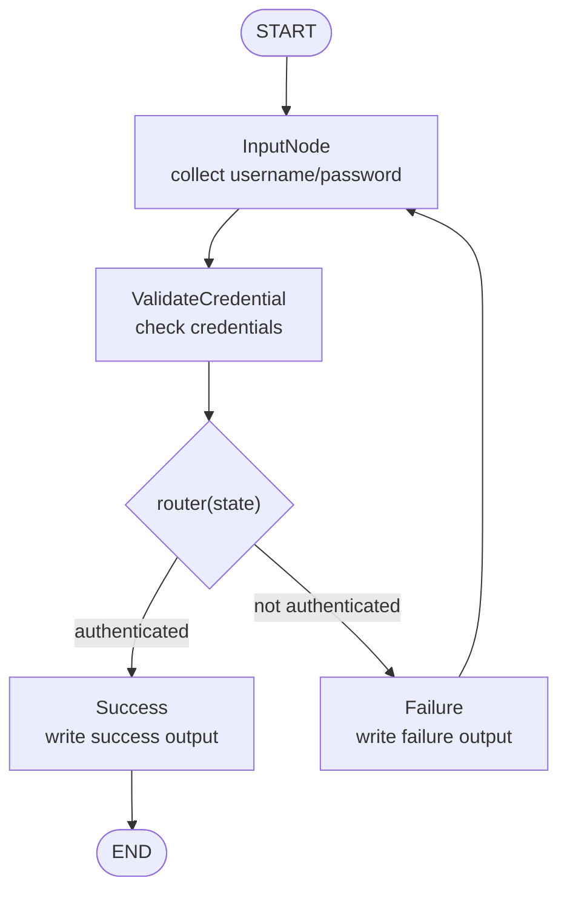

Code summary:

```python
class AuthState(TypedDict):
    username: Optional[str]
    password: Optional[str]
    is_authenticated: Optional[bool]
    output: Optional[str]

def input_node(state):
    if state.get("username", "") == "":
        username = input("What is your username?")
    else:
        username = state["username"]

    password = input("Enter your password: ")
    return {
        "username": username,
        "password": password,
    }

def validate_credentials_node(state):
    username = state.get("username", "")
    password = state.get("password", "")
    return {
        "is_authenticated": (
            username == "test_user" and password == "secure_password"
        )
    }

def success_node(state):
    return {"output": "Authentication successful! Welcome."}

def failure_node(state):
    return {"output": "Not successful, please try again!"}

def router(state):
    if state["is_authenticated"]:
        return "success_node"
    return "failure_node"

workflow = StateGraph(AuthState)
workflow.add_node("InputNode", input_node)
workflow.add_node("ValidateCredential", validate_credentials_node)
workflow.add_node("Success", success_node)
workflow.add_node("Failure", failure_node)

workflow.add_edge(START, "InputNode")
workflow.add_edge("InputNode", "ValidateCredential")
workflow.add_conditional_edges(
    "ValidateCredential",
    router,
    {
        "success_node": "Success",
        "failure_node": "Failure",
    },
)
workflow.add_edge("Success", END)
workflow.add_edge("Failure", "InputNode")

app = workflow.compile()
result = app.invoke({"username": "test_user"})
```

Example 2: QA workflow:

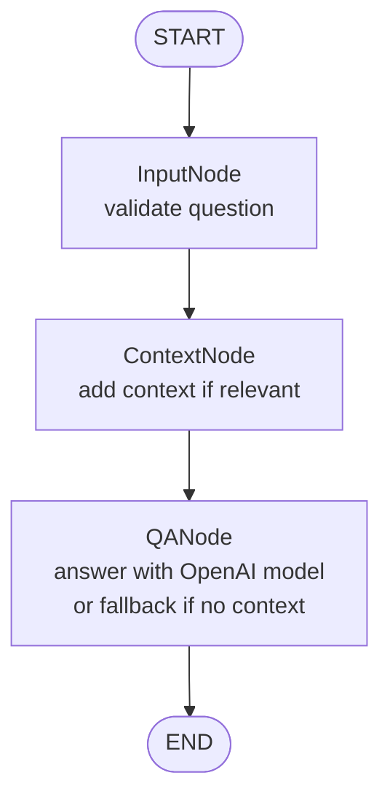

Code summary:

```python
class QAState(TypedDict):
    question: Optional[str]
    valid: Optional[bool]
    error: Optional[str]
    context: Optional[str]
    answer: Optional[str]

def input_validation_node(state):
    question = state.get("question", "").strip()
    if not question:
        return {
            "valid": False,
            "error": "Question cannot be empty.",
        }
    return {"valid": True, "error": None}

def context_provider_node(state):
    question = state.get("question", "").lower()
    if "langgraph" in question or "guided project" in question:
        return {
            "context": (
                "This guided project is about using LangGraph, a Python "
                "library to design state-based workflows. LangGraph connects "
                "modular nodes with normal and conditional edges."
            )
        }
    return {"context": None}

def llm_qa_node(state):
    question = state.get("question", "")
    context = state.get("context")

    if not context:
        return {"answer": "I don't have enough context to answer your question."}

    messages = [
        {"role": "system", "content": "Answer using only the provided context."},
        {"role": "user", "content": f"Context: {context}\n\nQuestion: {question}"},
    ]
    response = qa_llm.invoke(messages)
    return {"answer": response.content.strip()}

qa_workflow = StateGraph(QAState)
qa_workflow.add_node("InputNode", input_validation_node)
qa_workflow.add_node("ContextNode", context_provider_node)
qa_workflow.add_node("QANode", llm_qa_node)

qa_workflow.add_edge(START, "InputNode")
qa_workflow.add_edge("InputNode", "ContextNode")
qa_workflow.add_edge("ContextNode", "QANode")
qa_workflow.add_edge("QANode", END)

qa_app = qa_workflow.compile()
qa_app.invoke({"question": "What is LangGraph?"})
```

### Summary and Cheat Sheet: Introduction to LangGraph

LangGraph is an open-source framework for **stateful, graph-based AI agents**.

* Extends LangChain with explicit control flow.
* Uses shared state across workflow steps.
* Supports branching, loops, persistence, human review, and debugging.
* Works with LangChain models, tools, retrievers, and LangSmith.

#### Getting Started With LangGraph

| Topic | Summary |
| --- | --- |
| Overview | Build graph-shaped AI workflows. |
| LangChain extension | Adds stateful orchestration to LangChain components. |
| State | Shared `TypedDict` or Pydantic object. |
| Flow | Branching, loops, retries, and routing. |
| Agents | Iterative reasoning, tools, review, and coordination. |
| Execution | Durable runs, checkpoints, resume, streaming. |
| Observability | Graph diagrams and LangSmith traces. |

Install:

```bash
pip install langgraph "langchain[openai]" python-dotenv
```

#### Why Graph-Based Agents?

* Linear chains are good for fixed flows: retrieve, call model, parse, answer.
* Agents often need loops: retry a tool, revise a query, or ask for approval.
* LangGraph models workflows as state machines.
* The graph can revisit nodes, branch by state, and stop only when a condition is met.
* Example: poor retrieval -> rewrite query -> retrieve again -> evaluate -> answer.

#### When To Use LangGraph

| Use case | Why LangGraph helps |
| --- | --- |
| Loops | Repeat until a goal is met. |
| Branching | Route with explicit if/else logic. |
| Long runs | Persist and resume with checkpoints. |
| Complex state | Keep workflow data in one shared object. |
| Multi-agent flows | Coordinate agents, tools, or reviewers. |
| Human review | Pause and resume with `Command(resume=...)`. |
| Debugging | Inspect graph, state, streams, and traces. |

#### Core Concepts

| Concept | Explanation |
| --- | --- |
| State | Shared data passed between nodes. |
| `StateGraph` | Blueprint for nodes, edges, and state. |
| Nodes | Functions or `Runnable`s that return state updates. |
| Edges | Fixed or conditional transitions. |
| `START` / `END` | Special graph boundaries. |
| `compile()` | Builds the runnable app. |
| `invoke()` / `stream()` | Run the compiled graph. |
| Checkpointers | Save state for resume and time travel. |
| Reducers | Control how updates merge into state. |

State and graph:

```python
from typing_extensions import TypedDict
from langgraph.graph import StateGraph, START, END

class WorkflowState(TypedDict):
    user_query: str
    summary: str
    step_count: int

graph = StateGraph(WorkflowState)
```

Define a node:

```python
def summarize(state: WorkflowState) -> dict:
    text = state["user_query"]
    summary = llm_summarize(text)

    return {
        "summary": summary,
        "step_count": state["step_count"] + 1,
    }

graph.add_node("summarize", summarize)
```

Edges:

```python
graph.add_edge(START, "summarize")
graph.add_edge("summarize", "finalize")
graph.add_edge("finalize", END)
```

Conditional edges:

```python
from typing import Literal

def decide(state: WorkflowState) -> Literal["repeat", "done"]:
    if state["step_count"] < 2:
        return "repeat"
    return "done"

graph.add_conditional_edges(
    "summarize",
    decide,
    {
        "repeat": "summarize",
        "done": END,
    },
)
```

Run and visualize:

```python
app = graph.compile()
final_state = app.invoke({
    "user_query": "Hello",
    "summary": "",
    "step_count": 0,
})
print(app.get_graph().draw_mermaid())
```

Note: the routing function is **not** a node. It returns a label; the mapping chooses the destination.

#### Complete Example: Increment Counter

This graph increments `count` until it reaches `3`.

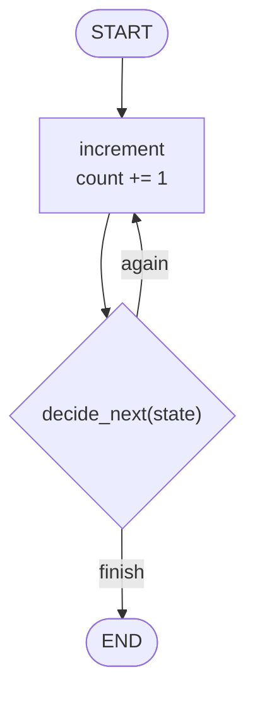

```python
from typing import Literal
from typing_extensions import TypedDict
from langgraph.graph import StateGraph, START, END

class GraphState(TypedDict):
    count: int
    message: str

def increment(state: GraphState) -> dict:
    new_count = state["count"] + 1
    return {
        "count": new_count,
        "message": f"Count is now {new_count}",
    }

def decide_next(state: GraphState) -> Literal["again", "finish"]:
    if state["count"] < 3:
        return "again"
    return "finish"

graph = StateGraph(GraphState)
graph.add_node("increment", increment)

graph.add_edge(START, "increment")
graph.add_conditional_edges(
    "increment",
    decide_next,
    {
        "again": "increment",
        "finish": END,
    },
)

app = graph.compile()
result = app.invoke({
    "count": 0,
    "message": "",
})

print(result)
# {"count": 3, "message": "Count is now 3"}
```

Key takeaways:

* Use LangGraph for state, branching, loops, retries, or durable execution.
* State is the data; `StateGraph` is the structure.
* Nodes return updates.
* Edges move execution.
* Conditional edges route at runtime.
* `START` and `END` are special boundaries.
* `compile()` builds the app; `invoke()` or `stream()` runs it.
* Mermaid and LangSmith help debug behavior.

## 2. Build Self-Improving Agents with LangGraph

### Build Reflection Agents

#### Overview: Type of Agents

* AI agents are classified by how they make decisions and interact with their environment, ranging from simple rule-based systems to adaptive learning systems.
* Five main types of agents:
    * Simple reflex agents: it *reacts*
        * Use condition–action rules (if --> then).
          * Percept environment with sensors, match conditions, execute actions.
        * No memory or history.
        * Work well in predictable environments.
        * Limitation: fail in dynamic or unseen situations.
    * Model-based reflex agents: it *remembers*
        * Maintain an internal state (memory of the world).
        * Track how the environment evolves and how actions affect it.
        * Still reactive (no planning), but more robust than simple reflex agents.
    * Goal-based agents: it *aims*
        * It builds on the model-based agent by adding a goal or objective to achieve.
        * Make decisions based on achieving a goal.
          * Internal question: which action will lead me closer to the goal?
        * Simulate future outcomes of actions.
        * Choose actions that lead toward the goal.
        * Limitation: any solution meeting the goal is acceptable (no quality ranking).
    * Utility-based agents: it *evaluates*
        * Extend goal-based agents by optimizing for the best outcome.
          * A goal is a binary condition (achieved/not achieved), while utility is a measure of desirability.
        * Use a utility function to evaluate desirability (e.g., speed, cost, safety).
        * Select actions that maximize overall utility.
    * Learning agents: the most adaptable and powerful type. It *improves*.
        * Improve over time through experience and feedback.
        * Components:
            * performance element (acts)
            * critic (evaluates outcome, provides feedback/reward)
            * learning element (updates strategy)
            * problem generator (explores new actions)
        * Most powerful but data-intensive and slower to train.
* Key progression:
    * reflex --> remembers --> plans --> optimizes --> learns
* Multi-agent systems: That's what we want usually to improve performance and capabilities.
    * Combine multiple agents working together in a shared environment.
    * Enable more complex, collaborative problem-solving.
* Key idea:
    * Agent sophistication increases from fixed rules to adaptive learning, but real-world systems often combine multiple agent types and still benefit from human oversight.


#### Building Reflection Agents with LangGraph

* Reflection agents improve outputs through an iterative feedback loop:
    * Generator produces an initial response.
    * Reflector critiques it.
    * Generator refines based on feedback.
    * Loop repeats for several iterations.
* Two roles:
    * Generator: creates content.
    * Reflector: evaluates and suggests improvements.
* State:
    * Maintains full conversation history across iterations.
    * Each iteration adds messages (input, outputs, critiques).
* Implementation:
    * Use LangChain for prompt + LLM chains.
    * Use LangGraph for workflow orchestration.
* LangGraph setup:
    * State = `MessagesState`, which stores and appends conversation messages.
    * Nodes:
        * generate --> produces output
        * reflect --> critiques output
    * Edges:
        * START --> generate
        * reflect --> generate
    * Conditional routing:
        * after generate, either stop or go to reflect.
* Key idea:
    * Reflection agents simulate "self-critique", improving quality over multiple passes.


Example graph flow:

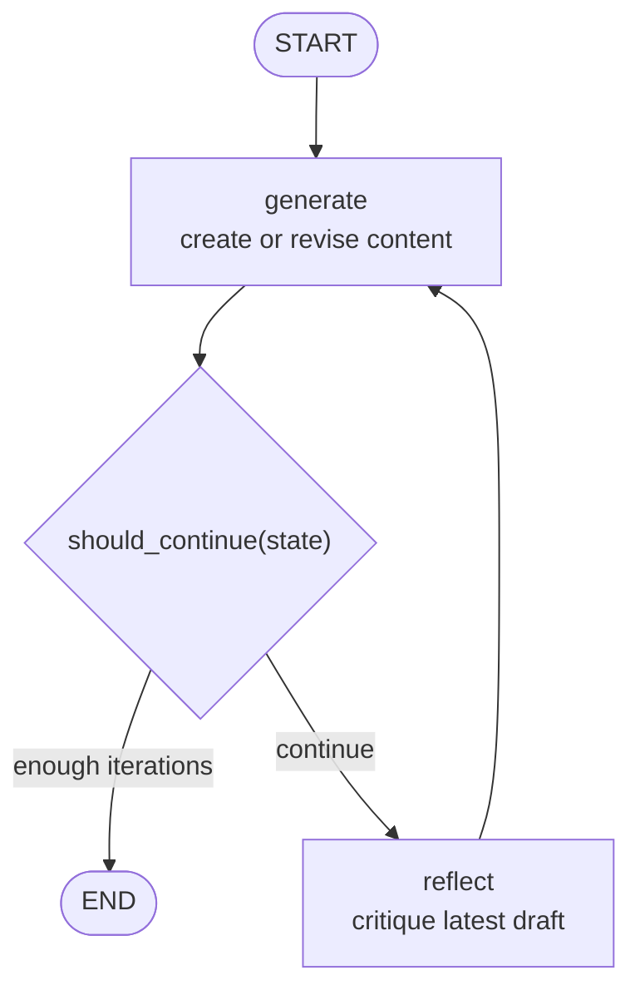

```python
# 1. Generator and reflector chains (LangChain)
import os
from dotenv import load_dotenv
from langchain_core.prompts import ChatPromptTemplate, MessagesPlaceholder
from langchain.chat_models import init_chat_model

load_dotenv()

if not os.getenv("OPENAI_API_KEY"):
    raise ValueError("OPENAI_API_KEY is not set.")

llm = init_chat_model(
    os.getenv("OPENAI_MODEL", "gpt-5-nano"),
    model_provider="openai",
)

# Generator prompt
generation_prompt = ChatPromptTemplate.from_messages([
    ("system", "You are a helpful content creator. Create a high-quality post."),
    MessagesPlaceholder(variable_name="messages")
])
generate_chain = generation_prompt | llm  # pipe operator builds chain

# Reflector prompt
reflect_prompt = ChatPromptTemplate.from_messages([
    ("system", "You are a critical reviewer. Give feedback."),
    MessagesPlaceholder(variable_name="messages")
])
reflect_chain = reflect_prompt | llm


# 2. LangGraph nodes
from langchain_core.messages import HumanMessage, AIMessage
from langgraph.graph import MessagesState

def generate_node(state: MessagesState) -> dict:
    # Generate content based on full conversation history.
    response = generate_chain.invoke({"messages": state["messages"]})
    return {"messages": [AIMessage(content=response.content)]}

def reflect_node(state: MessagesState) -> dict:
    # Critique the latest AI draft.
    critique = reflect_chain.invoke({"messages": state["messages"]})
    # Wrap the critique as HumanMessage so the generator treats it as feedback.
    # NOTE: There is no human input in reality, but this is the way to feed the critique back into the generator chain.
    return {"messages": [HumanMessage(content=critique.content)]}


# 3. Build LangGraph workflow
# MessagesState is a built-in state schema with a "messages" key.
# LangGraph appends returned messages instead of replacing the history.
from typing import Literal
from langgraph.graph import StateGraph, START, END

graph = StateGraph(MessagesState)
graph.add_node("generate", generate_node)
graph.add_node("reflect", reflect_node)

# Flow: START --> generate --> reflect --> generate ...
graph.add_edge(START, "generate")
graph.add_edge("reflect", "generate")

# Routing function: stop after several messages, otherwise critique.
def should_continue(state: MessagesState) -> Literal["reflect", END]:
    if len(state["messages"]) > 6:
        return END
    return "reflect"

graph.add_conditional_edges("generate", should_continue)
app = graph.compile()


# 4. Run reflection agent
initial_state = {
    "messages": [
        HumanMessage(
            content="Write a LinkedIn post about getting a dev job under 160 chars"
        )
    ]
}

result = app.invoke(initial_state)

# final refined output
print(result["messages"][-1].content)
# Execution pattern:
# Human --> generate --> reflect --> generate --> reflect --> ... --> END
# Each loop improves the output
```

#### Exercise: Build a Reflection Agent with LangGraph

Notebook: [`lab/02_Tweet-Reflection-Agent-v1.ipynb`](./lab/02_Tweet-Reflection-Agent-v1.ipynb).

This notebook implements the reflection agent as explained in the previous section:

* Setup:
    * installs current `langgraph`, `langchain[openai]`, and `python-dotenv`
    * loads `OPENAI_API_KEY` and optional `OPENAI_MODEL` from `.env`
    * initializes an OpenAI chat model with `init_chat_model`
* Reflection workflow:
    * builds a LinkedIn post generator prompt
    * builds a critique prompt for content strategy feedback
    * chains each prompt to the same OpenAI model
* LangGraph implementation:
    * uses `StateGraph(MessagesState)` instead of the older `MessageGraph`
    * defines `generate` and `reflect` nodes
    * returns partial message updates with `{"messages": [...]}`
    * starts with `START -> generate`
    * loops `reflect -> generate`
    * uses `add_conditional_edges` after `generate` to stop at `END`
* Execution:
    * invokes the graph with an initial `HumanMessage`
    * inspects the first draft, first critique, and final revised post
    * renders the graph as Mermaid with `draw_mermaid()`

Important code (in the notebook the prompts are more detailed):

```python
import os
from typing import Literal

from dotenv import load_dotenv
from langchain.chat_models import init_chat_model
from langchain_core.messages import AIMessage, HumanMessage
from langchain_core.prompts import ChatPromptTemplate, MessagesPlaceholder
from langgraph.graph import END, START, MessagesState, StateGraph

load_dotenv()

if not os.getenv("OPENAI_API_KEY"):
    raise ValueError("OPENAI_API_KEY is not set.")

llm = init_chat_model(
    os.getenv("OPENAI_MODEL", "gpt-5-nano"),
    model_provider="openai",
)

generation_prompt = ChatPromptTemplate.from_messages([
    (
        "system",
        "You are a professional LinkedIn content assistant. Generate the "
        "best LinkedIn post possible. If feedback is provided, revise the "
        "previous draft.",
    ),
    MessagesPlaceholder(variable_name="messages"),
])
generate_chain = generation_prompt | llm

reflection_prompt = ChatPromptTemplate.from_messages([
    (
        "system",
        "You are a professional LinkedIn content strategist. Critique the "
        "post and provide actionable feedback for the next revision.",
    ),
    MessagesPlaceholder(variable_name="messages"),
])
reflect_chain = reflection_prompt | llm

def generation_node(state: MessagesState) -> dict:
    generated_post = generate_chain.invoke({"messages": state["messages"]})
    return {"messages": [AIMessage(content=generated_post.content)]}

def reflection_node(state: MessagesState) -> dict:
    critique = reflect_chain.invoke({"messages": state["messages"]})
    return {"messages": [HumanMessage(content=critique.content)]}

def should_continue(state: MessagesState) -> Literal["reflect", END]:
    if len(state["messages"]) > 6:
        return END
    return "reflect"

graph = StateGraph(MessagesState)
graph.add_node("generate", generation_node)
graph.add_node("reflect", reflection_node)

graph.add_edge(START, "generate")
graph.add_edge("reflect", "generate")
graph.add_conditional_edges("generate", should_continue)

workflow = graph.compile()

response = workflow.invoke({
    "messages": [
        HumanMessage(
            content="Write a LinkedIn post about getting a software developer job under 160 characters"
        )
    ]
})

print(response["messages"][-1].content)
```

### Advanced Self-Reflexion Agents

#### Structuring LLM Tool Calls with Pydantic and JSON Serialization

LLMs can produce free-form text, but real applications often need structured data that can be passed to APIs, databases, tools, or downstream functions.

* Tool binding lets the model extract arguments for a function-like schema.
* Pydantic models define that schema in Python.
* The model output becomes predictable, typed, validated, and JSON-serializable.
* This is useful for agentic workflows where LLM output becomes another system's input.

##### Why This Matters

Example: a weather API may expect:

* `condition`: weather condition, such as `sunny`, `rainy`, or `cloudy`
* `temperature`: integer value
* `unit`: `celsius` or `fahrenheit`

You can express that contract as a Pydantic model:

```python
from pydantic import BaseModel, Field

class WeatherSchema(BaseModel):
    """Weather information extracted from user text."""

    condition: str = Field(
        description="Weather condition such as sunny, rainy, cloudy"
    )
    temperature: int = Field(description="Temperature value")
    unit: str = Field(
        description="Temperature unit such as fahrenheit or celsius"
    )
```

Bind the schema as a tool:

```python
from langchain.chat_models import init_chat_model

llm = init_chat_model("gpt-5-nano", model_provider="openai")
weather_llm = llm.bind_tools([WeatherSchema])

response = weather_llm.invoke("It's sunny and 75 degrees")

print(response.tool_calls[0]["args"])
# {"condition": "sunny", "temperature": 75, "unit": "fahrenheit"}
```

The tool call arguments are a dictionary of key-value pairs that can be validated, transformed, or passed to a real weather API.

Another conceptual example: spam detection.

```python
class SpamSchema(BaseModel):
    """Classify whether an email is spam."""

    classification: str = Field(description="Email classification: spam or not_spam")
    confidence: float = Field(description="Confidence score between 0 and 1")
    reason: str = Field(description="Reason for the classification")

spam_llm = llm.bind_tools([SpamSchema])
response = spam_llm.invoke("I'm a Nigerian prince, you want to be rich")

print(response.tool_calls[0]["args"])
# {
#   "classification": "spam",
#   "confidence": 0.95,
#   "reason": "Nigerian prince scam"
# }
```

These are conceptual examples. The exact output depends on the model and prompt, but the schema gives the model a structured target.

##### Real Example: Addition Tool With Pydantic

In a real workflow, this pattern could extract flight-booking fields such as origin, destination, date, and time before calling an API. A smaller example is addition: the model extracts two numbers, and Python performs the actual calculation.

```python
from pydantic import BaseModel, Field
from langchain.chat_models import init_chat_model
from langchain_core.messages import HumanMessage

class Add(BaseModel):
    """Add two numbers together."""

    a: int = Field(description="First number")
    b: int = Field(description="Second number")

llm = init_chat_model("gpt-5-nano", model_provider="openai")
initial_chain = llm.bind_tools([Add])

question = "add 1 and 10"
response = initial_chain.invoke([HumanMessage(content=question)])

def extract_and_add(response) -> int:
    tool_call = response.tool_calls[0]
    args = tool_call["args"]
    return args["a"] + args["b"]

result = extract_and_add(response)

print(
    f"LLM extracted: a={response.tool_calls[0]['args']['a']}, "
    f"b={response.tool_calls[0]['args']['b']}"
)
print(f"Result: {result}")
```

Key point:

* The LLM does **extraction and tool selection**.
* Your code performs the deterministic operation.
* The schema makes the handoff reliable.

##### Why Use Pydantic Models for Tool Calls?

In tool-augmented LLM applications, inputs and outputs should be:

* structured
* validated
* easy to serialize as JSON
* easy to deserialize from JSON
* reusable across tools

Pydantic provides runtime validation, type hints, helpful errors, and JSON serialization.

##### Reusable Math Tool Schemas

```python
from typing import Literal
from pydantic import BaseModel

class TwoOperands(BaseModel):
    a: float
    b: float

class AddInput(TwoOperands):
    operation: Literal["add"]

class SubtractInput(TwoOperands):
    operation: Literal["subtract"]

class MathToolRequest(TwoOperands):
    operation: Literal["add", "subtract"]

class MathOutput(BaseModel):
    result: float
```

Tool functions can accept and return Pydantic models:

```python
def add_tool(data: AddInput) -> MathOutput:
    return MathOutput(result=data.a + data.b)

def subtract_tool(data: SubtractInput) -> MathOutput:
    return MathOutput(result=data.a - data.b)
```

Dispatch from JSON input:

```python
incoming_json = '{"a": 7, "b": 3, "operation": "subtract"}'

def dispatch_tool(json_payload: str) -> str:
    # Pydantic v2: parse and validate raw JSON.
    request = MathToolRequest.model_validate_json(json_payload)

    if request.operation == "add":
        output = add_tool(AddInput.model_validate_json(json_payload))
    elif request.operation == "subtract":
        output = subtract_tool(SubtractInput.model_validate_json(json_payload))
    else:
        raise ValueError("Unsupported operation")

    # Pydantic v2: serialize model to JSON.
    return output.model_dump_json()

result_json = dispatch_tool(incoming_json)
print(result_json)
# {"result":4.0}
```

`MathToolRequest` validates the shared fields and allowed operation. The operation-specific model then validates the exact tool payload.

##### What Does `Literal` Do?

`Literal` restricts a field to specific constant values. This prevents unsupported operations from reaching your tool logic.

```python
from typing import Literal
from pydantic import BaseModel, Field

class CalculatorSchema(BaseModel):
    operation: Literal["add", "subtract", "multiply", "divide"] = Field(
        description="The mathematical operation to perform"
    )
    a: float = Field(description="First number")
    b: float = Field(description="Second number")

calculator_llm = llm.bind_tools([CalculatorSchema])

response = calculator_llm.invoke("Add 15 and 23")
print(response.tool_calls[0]["args"])
# {"operation": "add", "a": 15.0, "b": 23.0}

response = calculator_llm.invoke("Multiply 7 by 8")
print(response.tool_calls[0]["args"])
# {"operation": "multiply", "a": 7.0, "b": 8.0}
```

##### Why JSON-Serializable Pydantic Models Are Powerful

| Feature | Benefit |
| --- | --- |
| Type validation | Rejects malformed inputs early. |
| Reusability | Share base schemas across tools. |
| JSON serialization | Use `model_dump_json()` for APIs and storage. |
| JSON parsing | Use `model_validate_json()` for incoming payloads. |
| Extensibility | Add tools such as multiply or divide easily. |
| Testability | Validate tool behavior without an LLM. |

##### Final Thoughts and Alternatives

Pydantic schemas make LLM applications:

* more robust
* easier to test
* easier to maintain
* safer to connect to APIs and databases
* easier to orchestrate in LangChain, LangGraph, CrewAI, and similar frameworks

Python `dataclasses` can also define lightweight data containers. However, Pydantic is usually preferred for LLM tool calls because it provides:

* runtime validation
* field descriptions for tool schemas
* JSON parsing and serialization
* custom validators
* strong integration with LangChain, FastAPI, and other Python frameworks

Key idea: Pydantic turns model output from "some text" into a typed contract your software can trust.

#### Understanding Reflexion Agents: Reflection + Tools + Real-Time Data + Verifiable Outputs

* Reflexion agents extend reflection agents by adding tool use, real-time data, and verifiable outputs (citations).
* Core loop:
    * Generator (responder) creates an initial answer.
    * Self-critique identifies weaknesses.
    * Tool (e.g., web search) retrieves external information.
    * Revisor refines the response using critique + tool outputs.
    * Loop repeats for multiple iterations.
* Key capabilities:
    * Continuous self-improvement across iterations.
    * Detection and correction of errors in prior outputs.
    * Integration of up-to-date external data (post-training knowledge).
    * Transparent outputs with citations and references.
* Structured outputs:
    * Responses are not plain text but follow a schema, a kind of a dict/table; example initial query: "I need more minerals in my diet"
      * response: "you can get more minerals by eating rocks"
      * self-critique: "this is not a good answer because humans can't eat rocks"
      * queries: "what are good dietary sources of minerals?"
        * for each query, tool(s) return results (content + URLs); in this case we have a search tool
      * references (created by the revisor by using the tool results)
    * Enables clear separation between reasoning, tool inputs, and final answers.
* Workflow:
    * User query --> responder outputs structured response + search query
    * Tool executes query --> returns results (content, URLs)
    * Revisor updates response using critique + tool data + references
    * Repeat until stopping condition
* State:
    * Maintained as a list (e.g., response_list) containing:
        * original query
        * generated responses
        * critiques
        * tool outputs
        * revised responses
* Key idea:
    * Reflexion agents combine self-critique + external knowledge + structured reasoning to produce more accurate, grounded, and explainable results than standard reflection agents.

#### Building Reflexion Agents

* Reflexion agents are built by combining LLM generation, self-critique, tool use (search), and iterative revision using structured schemas.
* Setup:
    * Configure a search tool (e.g., Tavily) to retrieve external data.
    * Initialize an LLM with `init_chat_model`.
    * Define system prompts for the responder and revisor personas.
    * Load API keys from `.env` (`OPENAI_API_KEY`, and `TAVILY_API_KEY` if using Tavily).
    * Install provider packages such as `langchain-tavily` when using Tavily.
* Structured outputs:
    * Define schemas (e.g., AnswerQuestion, Reflection) to enforce fields like:
        * answer
        * critique (missing / superfluous)
        * search queries
        * citations (for revised outputs)
    * LLM outputs structured objects instead of plain text.
* Workflow:
    * Responder node:
        * Generates initial answer + critique + search queries.
    * Tool node:
        * Executes search queries and returns results.
    * Revisor node:
        * Improves answer using critique + tool results + citations.
    * Loop:
        * Repeat tools --> revisor until iteration limit.
* State:
    * Maintained with `MessagesState`, which appends:
        * user query
        * AI responses
        * tool outputs
        * revisions
* LangGraph orchestration:
    * Nodes: responder, tool executor, revisor.
    * Edges: `START -> respond -> tools -> revise`.
    * Loop: `revise -> tools` until `END`.
    * Conditional routing controls iteration count.
* Key idea:
    * Reflexion agents produce higher-quality, evidence-backed answers by combining structured reasoning, external knowledge, and iterative self-improvement.

Example graph flow:

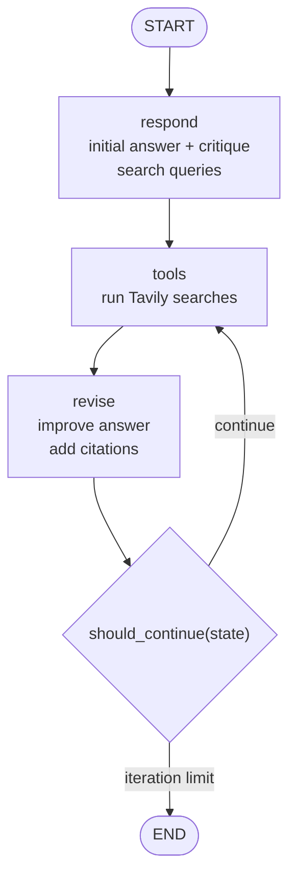

```python
# pip install -U langgraph langchain langchain-openai langchain-tavily python-dotenv
# We need to create a Tavily account + TAVILY_API_KEY

# 1. Setup model + search tool
import os
from typing import Literal

from dotenv import load_dotenv
from langchain.chat_models import init_chat_model
from langchain_core.messages import HumanMessage, SystemMessage, ToolMessage
from langchain_tavily import TavilySearch
from langgraph.graph import END, START, MessagesState, StateGraph
from pydantic import BaseModel, Field

load_dotenv()

llm = init_chat_model(
    os.getenv("OPENAI_MODEL", "gpt-5-nano"),
    model_provider="openai",
)

search_tool = TavilySearch(max_results=5, topic="general")


# 2. Define agent personas / system prompts
responder_system_prompt = """\
You are a careful research assistant.

Your job:
- answer the user's question with the best information you currently have
- critique your own answer
- identify missing information and unsupported claims
- propose search queries that would verify or improve the answer

Do not pretend to have external evidence yet. If evidence is needed, add
search queries. Keep the draft answer concise and practical.
"""

revisor_system_prompt = """\
You are a rigorous answer revisor.

Your job:
- use the previous draft, self-critique, and tool results
- revise the answer so it is more accurate and better supported
- remove unsupported or superfluous claims
- include citations as URLs when tool results provide them
- propose more search queries only if another revision would materially help

Prefer clear, actionable, evidence-backed answers.
"""


# 3. Define structured output schemas

class Reflection(BaseModel):
    missing: str = Field(description="Important missing information")
    superfluous: str = Field(description="Unnecessary or unsupported information")

class AnswerQuestion(BaseModel):
    answer: str = Field(description="Draft answer to the user's question")
    reflection: Reflection = Field(description="Self-critique of the answer")
    search_queries: list[str] = Field(
        description="Search queries for external verification"
    )

class ReviseAnswer(AnswerQuestion):
    citations: list[str] = Field(description="URLs supporting the revised answer")


# 4. Bind schemas as model tools
responder_chain = llm.bind_tools([AnswerQuestion])
revisor_chain = llm.bind_tools([ReviseAnswer])


# 5. LangGraph nodes
def respond_node(state: MessagesState) -> dict:
    response = responder_chain.invoke(
        [SystemMessage(content=responder_system_prompt)] + state["messages"]
    )
    return {"messages": [response]}

def execute_tools(state: MessagesState) -> dict:
    last_ai_msg = state["messages"][-1]
    tool_call = last_ai_msg.tool_calls[0]
    queries = tool_call["args"]["search_queries"]

    tool_results = []
    for query in queries:
        tool_results.append(search_tool.invoke(query))

    return {
        "messages": [
            ToolMessage(
                content=str(tool_results),
                tool_call_id=tool_call["id"],
                name=tool_call["name"],
            )
        ]
    }

def revise_node(state: MessagesState) -> dict:
    response = revisor_chain.invoke(
        [SystemMessage(content=revisor_system_prompt)] + state["messages"]
    )
    return {"messages": [response]}


# 6. LangGraph workflow
graph = StateGraph(MessagesState)
graph.add_node("respond", respond_node)
graph.add_node("tools", execute_tools)
graph.add_node("revise", revise_node)

graph.add_edge(START, "respond")
graph.add_edge("respond", "tools")
graph.add_edge("tools", "revise")

def should_continue(state: MessagesState) -> Literal["tools", END]:
    if len(state["messages"]) > 6:
        return END
    return "tools"

graph.add_conditional_edges("revise", should_continue)
app = graph.compile()


# 7. Run Reflexion agent
result = app.invoke({
    "messages": [
        HumanMessage(content="I'm pre-diabetic and need to lower blood sugar")
    ]
})

# Final revised answer is stored in the final AIMessage tool call.
final_tool_call = result["messages"][-1].tool_calls[0]
print(final_tool_call["args"]["answer"])
print(final_tool_call["args"]["citations"])

# Execution pattern:
# Human --> respond --> tools --> revise --> tools --> revise --> END
# Each iteration improves answer using critique + external data
```

#### Exercise: Building a Reflexion Agent with External Knowledge Integration

Notebook: [`lab/03_Reflexion Agent-v1.ipynb`](./lab/03_Reflexion%20Agent-v1.ipynb)

This notebook builds a Reflexion-style research agent that critiques, searches, and revises its own answer:

* Setup:
    * installs current `langgraph`, `langchain[openai]`, `langchain-tavily`, and `python-dotenv`
    * loads `OPENAI_API_KEY`, optional `OPENAI_MODEL`, and `TAVILY_API_KEY` from `.env`
    * initializes an OpenAI chat model with `init_chat_model`
    * initializes Tavily search with `TavilySearch`
* Prompting:
    * defines a responder persona for drafting, self-critiquing, and proposing searches
    * defines a revisor persona for using search results, removing unsupported claims, and adding citations
* Structured outputs:
    * uses Pydantic models for `Reflection`, `AnswerQuestion`, and `ReviseAnswer`
    * binds those schemas as tools so model outputs have predictable fields
* Tool execution:
    * extracts `search_queries` from the model tool call
    * runs Tavily searches
    * returns results as `ToolMessage` objects with `tool_call_id`
* LangGraph workflow:
    * uses `StateGraph(MessagesState)`
    * starts with `START -> respond`
    * runs `respond -> execute_tools -> revisor`
    * loops `revisor -> execute_tools` until `MAX_ITERATIONS`
    * renders the graph as Mermaid

Example: diet recommendation agent::

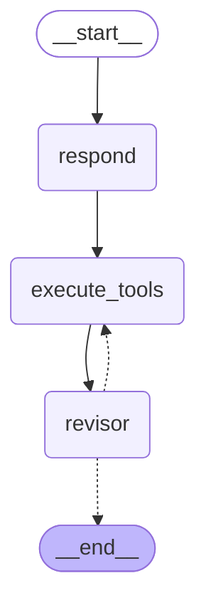

Code highlights:

```python
import json
import os
from typing import Literal

from dotenv import load_dotenv
from langchain.chat_models import init_chat_model
from langchain_core.messages import HumanMessage, ToolMessage
from langchain_core.prompts import ChatPromptTemplate, MessagesPlaceholder
from langchain_tavily import TavilySearch
from langgraph.graph import END, START, MessagesState, StateGraph
from pydantic import BaseModel, Field

load_dotenv()

llm = init_chat_model(
    os.getenv("OPENAI_MODEL", "gpt-5-nano"),
    model_provider="openai",
)
tavily_tool = TavilySearch(max_results=3, topic="general")

responder_prompt = ChatPromptTemplate.from_messages([
    ("system", "Draft an answer, critique it, and propose search queries."),
    MessagesPlaceholder(variable_name="messages"),
])
revisor_prompt = ChatPromptTemplate.from_messages([
    ("system", "Revise using critique and tool results. Include citations."),
    MessagesPlaceholder(variable_name="messages"),
])

class Reflection(BaseModel):
    missing: str = Field(description="Important missing information")
    superfluous: str = Field(description="Unnecessary or unsupported information")

class AnswerQuestion(BaseModel):
    answer: str
    reflection: Reflection
    search_queries: list[str]

class ReviseAnswer(AnswerQuestion):
    citations: list[str]

initial_chain = responder_prompt | llm.bind_tools([AnswerQuestion])
revisor_chain = revisor_prompt | llm.bind_tools([ReviseAnswer])

def execute_tools(state: MessagesState) -> dict:
    last_ai_message = state["messages"][-1]
    tool_messages = []

    for tool_call in last_ai_message.tool_calls:
        query_results = {}
        for query in tool_call["args"].get("search_queries", []):
            query_results[query] = tavily_tool.invoke(query)

        tool_messages.append(
            ToolMessage(
                content=json.dumps(query_results, default=str),
                tool_call_id=tool_call["id"],
                name=tool_call["name"],
            )
        )

    return {"messages": tool_messages}

MAX_ITERATIONS = 4

def event_loop(state: MessagesState) -> Literal["execute_tools", END]:
    tool_visits = sum(
        isinstance(message, ToolMessage)
        for message in state["messages"]
    )
    if tool_visits >= MAX_ITERATIONS:
        return END
    return "execute_tools"

graph = StateGraph(MessagesState)
graph.add_node("respond", lambda state: {
    "messages": [initial_chain.invoke({"messages": state["messages"]})]
})
graph.add_node("execute_tools", execute_tools)
graph.add_node("revisor", lambda state: {
    "messages": [revisor_chain.invoke({"messages": state["messages"]})]
})

graph.add_edge(START, "respond")
graph.add_edge("respond", "execute_tools")
graph.add_edge("execute_tools", "revisor")
graph.add_conditional_edges("revisor", event_loop)

app = graph.compile()

responses = app.invoke({
    "messages": [
        HumanMessage(
            content="I'm pre-diabetic and have heart issues. What breakfast foods should I eat and avoid?"
        )
    ]
})

final_answer = responses["messages"][-1].tool_calls[0]["args"]["answer"]
```

### ReAct: Reasoning + Action

#### Building Agents that Reason before Acting

* ReAct agents combine reasoning + tool use in an iterative loop to solve complex tasks step by step.
* Core pattern:
    * Thought --> reasoning about next step
    * Action --> select tool
    * Action Input --> input to tool
    * Observation --> tool result
    * Final Answer --> response after all steps
* Workflow:
    * LLM reasons, calls tools, receives observations, and continues reasoning until no more tool calls are needed.
* Key idea:
    * Observations feed back into reasoning, enabling multi-step problem solving.
* Use case example:
    * Query: "What's the weather and what should I wear?"
    * Agent:
        * calls weather tool
        * uses result to call clothing tool
        * produces final answer
* Implementation (LangGraph):
    * State: `MessagesState` (conversation + tool outputs)
    * Nodes:
        * agent node (LLM reasoning)
        * tools node (execute tool calls)
    * Conditional routing:
        * if tool call --> go to tools node
        * else --> end
* Loop continues until final answer is generated.

Graph flow:

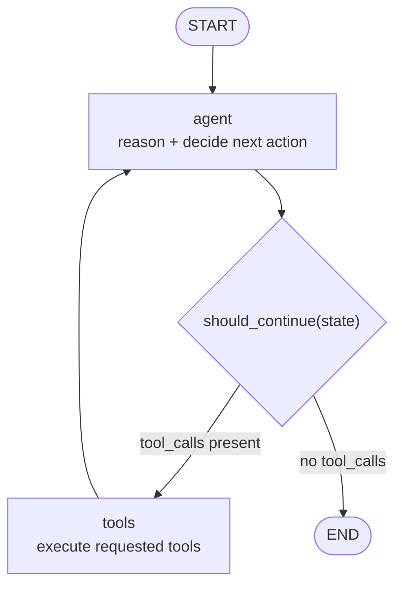

```python
# pip install -U langgraph langchain langchain-openai langchain-tavily python-dotenv

# 1. Define tools and model
import os
from typing import Literal

from dotenv import load_dotenv
from langchain.chat_models import init_chat_model
from langchain_core.messages import HumanMessage, SystemMessage, ToolMessage
from langchain_core.tools import tool
from langchain_tavily import TavilySearch
from langgraph.graph import END, START, MessagesState, StateGraph

load_dotenv()

llm = init_chat_model(
    os.getenv("OPENAI_MODEL", "gpt-5-nano"),
    model_provider="openai",
)

search = TavilySearch(max_results=3, topic="general")

@tool
def recommend_clothing(weather: str) -> str:
    """Recommend clothing based on weather description."""
    if "rain" in weather.lower():
        return "Wear a raincoat and waterproof shoes."
    if "sunny" in weather.lower():
        return "Wear light clothes like a t-shirt and sunglasses."
    return "Wear comfortable everyday clothing."


# 2. Bind tools to the model
tools = [search, recommend_clothing]
tool_map = {t.name: t for t in tools}
# When we bind tools, we simultaneously tell the model 
# "you may answer normally, or you may request one of these tools with structured arguments."
llm_with_tools = llm.bind_tools(tools)


# 3. Agent node: reason and decide whether to call tools
agent_system_prompt = """\
You are a practical assistant.
Reason step by step. Use tools when you need current facts or weather-specific
information. When enough information is available, answer the user directly.
"""

def call_model(state: MessagesState) -> dict:
    response = llm_with_tools.invoke(
        [SystemMessage(content=agent_system_prompt)] + state["messages"]
    )
    return {"messages": [response]}


# 4. Tool execution node
def tool_node(state: MessagesState) -> dict:
    last_msg = state["messages"][-1]
    tool_messages = []

    for tool_call in last_msg.tool_calls:
        tool = tool_map[tool_call["name"]]
        result = tool.invoke(tool_call["args"])
        tool_messages.append(
            ToolMessage(
                content=str(result),
                tool_call_id=tool_call["id"],
                name=tool_call["name"],
            )
        )

    return {"messages": tool_messages}


# 5. Conditional routing
# If the model answered with a tool call, we need to continue to the tools node. If there are no tool calls, we can end the workflow.
def should_continue(state: MessagesState) -> Literal["tools", END]:
    last_msg = state["messages"][-1]
    if not getattr(last_msg, "tool_calls", None):
        return END
    return "tools"


# 6. Build graph
graph = StateGraph(MessagesState)
graph.add_node("agent", call_model)
graph.add_node("tools", tool_node)
graph.add_edge(START, "agent")
graph.add_conditional_edges("agent", should_continue)
graph.add_edge("tools", "agent")
app = graph.compile()


result = app.invoke({
    "messages": [HumanMessage(content="What's the weather in Zurich and what should I wear?")]
})

# final answer
print(result["messages"][-1].content)
# Execution loop:
# Human --> agent (Thought/Action) --> tools (Observation) --> agent --> ... --> END

# Example flow:
# Human: "Weather in Zurich and what should I wear?"
# 
# AIMessage: tool_calls=[search_tool("Zurich weather today")]
# ToolMessage: "Zurich is 12°C and rainy"
# 
# AIMessage: tool_calls=[recommend_clothing("12°C and rainy")]
# ToolMessage: "Bring a raincoat and waterproof shoes"
# 
# AIMessage: "It is rainy and around 12°C in Zurich. Wear..."
# No tool_calls --> END
#
```

#### Exercise: Build a ReAct Agent with LangGraph

Notebook: [`lab/04_ReAct-v1.ipynb`](./lab/04_ReAct-v1.ipynb).

The notebook builds a current LangGraph ReAct agent end to end:

* Loads `OPENAI_API_KEY`, `TAVILY_API_KEY`, and optional `OPENAI_MODEL` from `.env`.
* Uses `init_chat_model(..., model_provider="openai")` instead of provider-specific notebook credentials.
* Defines tool-calling behavior with LangChain tools: web search, clothing recommendation, calculator, and news summarization.
* Uses `MessagesState`, `START`, `END`, and `StateGraph` for the current LangGraph graph API.
* Shows the ReAct loop manually before automating it with a graph.
* Completes the exercises by adding a safe AST-based calculator and a search-result summarizer.

Core ReAct graph:

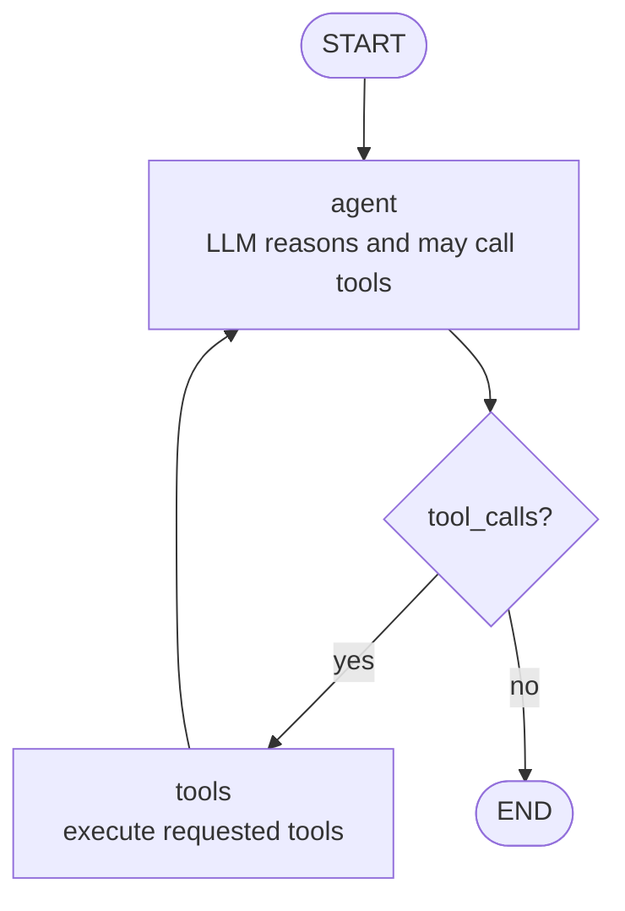

Extended tool dispatch:

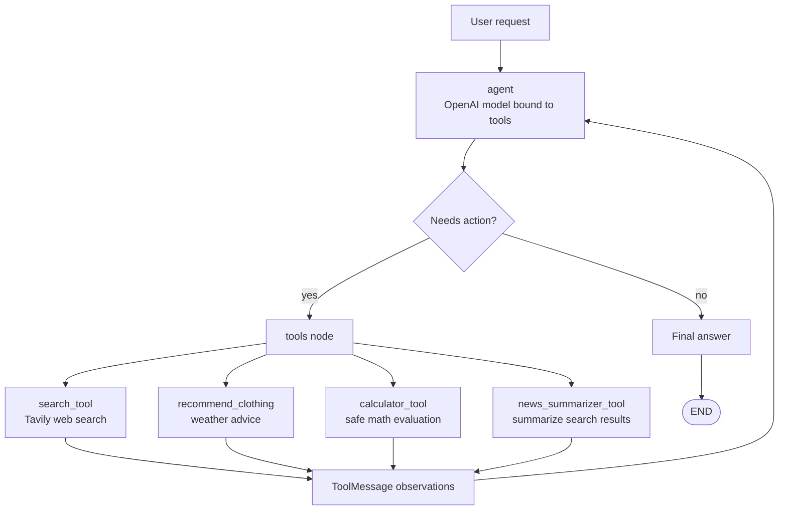

Important code pieces:

```python
import ast
import json
import math
import operator
import os
from typing import Literal

from dotenv import load_dotenv
from langchain.chat_models import init_chat_model
from langchain_core.messages import HumanMessage, SystemMessage, ToolMessage
from langchain_core.tools import tool
from langchain_tavily import TavilySearch
from langgraph.graph import END, START, MessagesState, StateGraph

load_dotenv()

model = init_chat_model(
    os.getenv("OPENAI_MODEL", "gpt-5-nano"),
    model_provider="openai",
)
search = TavilySearch(max_results=3, topic="general")

@tool
def search_tool(query: str) -> str:
    """Search the web for current information."""
    return json.dumps(search.invoke({"query": query}), ensure_ascii=False)

@tool
def recommend_clothing(weather: str) -> str:
    """Recommend clothing from a weather description."""
    text = weather.lower()
    if "snow" in text or "freezing" in text:
        return "Wear a heavy coat, gloves, and boots."
    if "rain" in text or "wet" in text:
        return "Bring a raincoat and waterproof shoes."
    if "hot" in text or "85" in text:
        return "T-shirt, shorts, and sunscreen recommended."
    return "A light jacket should be fine."

@tool
def calculator_tool(expression: str) -> str:
    """Safely evaluate a math expression such as sqrt(144) + 10."""
    operators = {
        ast.Add: operator.add,
        ast.Sub: operator.sub,
        ast.Mult: operator.mul,
        ast.Div: operator.truediv,
        ast.Pow: operator.pow,
        ast.USub: operator.neg,
    }
    functions = {"sqrt": math.sqrt, "sin": math.sin, "cos": math.cos}
    constants = {"pi": math.pi, "e": math.e}

    def eval_node(node):
        if isinstance(node, ast.Constant) and isinstance(node.value, (int, float)):
            return node.value
        if isinstance(node, ast.Name) and node.id in constants:
            return constants[node.id]
        if isinstance(node, ast.BinOp) and type(node.op) in operators:
            return operators[type(node.op)](eval_node(node.left), eval_node(node.right))
        if isinstance(node, ast.UnaryOp) and type(node.op) in operators:
            return operators[type(node.op)](eval_node(node.operand))
        if isinstance(node, ast.Call) and isinstance(node.func, ast.Name):
            return functions[node.func.id](*[eval_node(arg) for arg in node.args])
        raise ValueError("Unsupported expression")

    tree = ast.parse(expression.replace("π", "pi"), mode="eval")
    return str(eval_node(tree.body))

@tool
def news_summarizer_tool(news_content: str) -> str:
    """Turn Tavily-style search results into three concise bullets."""
    parsed = json.loads(news_content)
    articles = parsed.get("results", [])[:3]
    return "\n\n".join(
        f"{i}. {article.get('title', 'Untitled')}\n"
        f"   Source: {article.get('url', 'No URL')}\n"
        f"   Main point: {article.get('content', '')[:350]}"
        for i, article in enumerate(articles, start=1)
    )

tools = [search_tool, recommend_clothing, calculator_tool, news_summarizer_tool]
tools_by_name = {tool.name: tool for tool in tools}
model_with_tools = model.bind_tools(tools)

system_prompt = "You are a helpful ReAct assistant. Use tools when needed."

def call_model(state: MessagesState) -> dict:
    response = model_with_tools.invoke(
        [SystemMessage(content=system_prompt)] + state["messages"]
    )
    return {"messages": [response]}

def tool_node(state: MessagesState) -> dict:
    messages = []
    for tool_call in state["messages"][-1].tool_calls:
        result = tools_by_name[tool_call["name"]].invoke(tool_call["args"])
        messages.append(
            ToolMessage(
                content=str(result),
                name=tool_call["name"],
                tool_call_id=tool_call["id"],
            )
        )
    return {"messages": messages}

def should_continue(state: MessagesState) -> Literal["tools", END]:
    return "tools" if state["messages"][-1].tool_calls else END

workflow = StateGraph(MessagesState)
workflow.add_node("agent", call_model)
workflow.add_node("tools", tool_node)
workflow.add_edge(START, "agent")
workflow.add_conditional_edges("agent", should_continue, ["tools", END])
workflow.add_edge("tools", "agent")
graph = workflow.compile()

result = graph.invoke({
    "messages": [HumanMessage(content="Calculate 15% of 250 plus sqrt(144).")]
})
print(result["messages"][-1].content)
```

### Summary and Cheat Sheet: Build Self-Improving Agents with LangGraph

#### Core Idea

Self-improving agents refine their own outputs through explicit feedback loops. In current LangGraph, build these loops with:

* **State**: a typed state object, usually `TypedDict`, `MessagesState`, or a subclass of `MessagesState`.
* **Nodes**: Python functions, LangChain runnables, model calls, tool executors, or validators.
* **Edges**: graph transitions, including `START`, `END`, and `add_conditional_edges(...)`.
* **Reducers**: merge behavior for state keys. `MessagesState` already uses the message reducer, so nodes can return only newly produced messages.

Current API defaults:

| Need | Current API |
| --- | --- |
| Build a custom loop | `StateGraph(State)` |
| Store chat history | `MessagesState` |
| Mark graph boundaries | `START`, `END` |
| Execute tool calls | `ToolNode(tools)` |
| Route based on tool calls | `tools_condition` |
| Initialize chat models | `init_chat_model(...)` |
| Create a high-level LangChain agent | `create_agent(...)` |

#### Agent Types Overview

| Agent Type | Strategy | Best fit |
| --- | --- | --- |
| Reflection | Generate, critique, revise using only the model. | Drafting, explanations, style improvement. |
| Reflexion | Generate, critique, retrieve evidence, revise. | Research, factual QA, coding help, verification-heavy tasks. |
| ReAct | Reason, call tools, observe results, repeat. | Tool orchestration, APIs, current facts, multi-step tasks. |

#### Reflection Agents

**Concept**

* Iterative loop: generate --> critique --> refine.
* Uses only internal model reasoning; no external tools or new facts.
* Good for improving clarity, structure, tone, and completeness.

**Workflow**

1. `generate`: produce a draft from the current messages.
2. `reflect`: critique the latest draft and convert the critique into feedback.
3. Conditional edge: loop until a maximum number of drafts is reached.

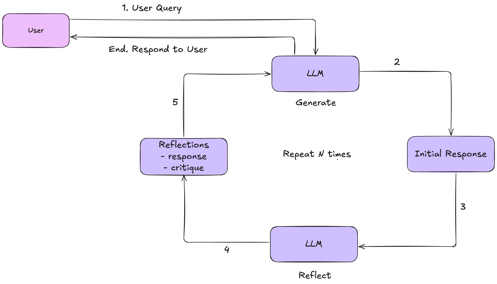

**Current LangGraph code**

```python
import os
from typing import Literal

from dotenv import load_dotenv
from langchain.chat_models import init_chat_model
from langchain_core.messages import HumanMessage, SystemMessage
from langgraph.graph import END, START, MessagesState, StateGraph

load_dotenv()

model = init_chat_model(
    os.getenv("OPENAI_MODEL", "gpt-4.1-mini"),
    model_provider="openai",
    temperature=0,
)

MAX_DRAFTS = 3


class ReflectionState(MessagesState):
    draft_count: int


def generate(state: ReflectionState) -> dict:
    """Generate or revise the answer using the conversation and feedback."""
    response = model.invoke(
        [
            SystemMessage(
                content=(
                    "You are a precise technical writer. Produce the best answer "
                    "you can. If critique is present, revise accordingly."
                )
            ),
            *state["messages"],
        ]
    )
    return {
        "messages": [response],
        "draft_count": state.get("draft_count", 0) + 1,
    }


def reflect(state: ReflectionState) -> dict:
    """Critique the latest draft and feed that critique back to the generator."""
    critique = model.invoke(
        [
            SystemMessage(
                content=(
                    "Critique the latest answer. Be specific about missing "
                    "details, inaccuracies, unclear wording, and improvements."
                )
            ),
            state["messages"][-1],
        ]
    )
    return {
        "messages": [
            HumanMessage(content=f"Critique this draft and revise it:\n{critique.content}")
        ]
    }


def should_continue(state: ReflectionState) -> Literal["reflect", END]:
    if state.get("draft_count", 0) >= MAX_DRAFTS:
        return END
    return "reflect"


builder = StateGraph(ReflectionState)
builder.add_node("generate", generate)
builder.add_node("reflect", reflect)
builder.add_edge(START, "generate")
builder.add_conditional_edges("generate", should_continue)
builder.add_edge("reflect", "generate")

graph = builder.compile()

result = graph.invoke(
    {
        "messages": [
            HumanMessage(content="Explain photosynthesis to a high-school student.")
        ],
        "draft_count": 0,
    }
)

print(result["messages"][-1].content)
```

#### Reflexion Agents

**Concept**

* Extends reflection with external grounding from search, APIs, databases, tests, or other tools.
* Separates answer drafting, evidence gathering, and revision.
* Useful when the agent must cite sources, verify claims, or correct factual gaps.

**Workflow**

1. Draft answer
2. Execute tools from generated search/tool requests
3. Revise answer using results
4. Repeat until the revision is good enough or a loop limit is reached

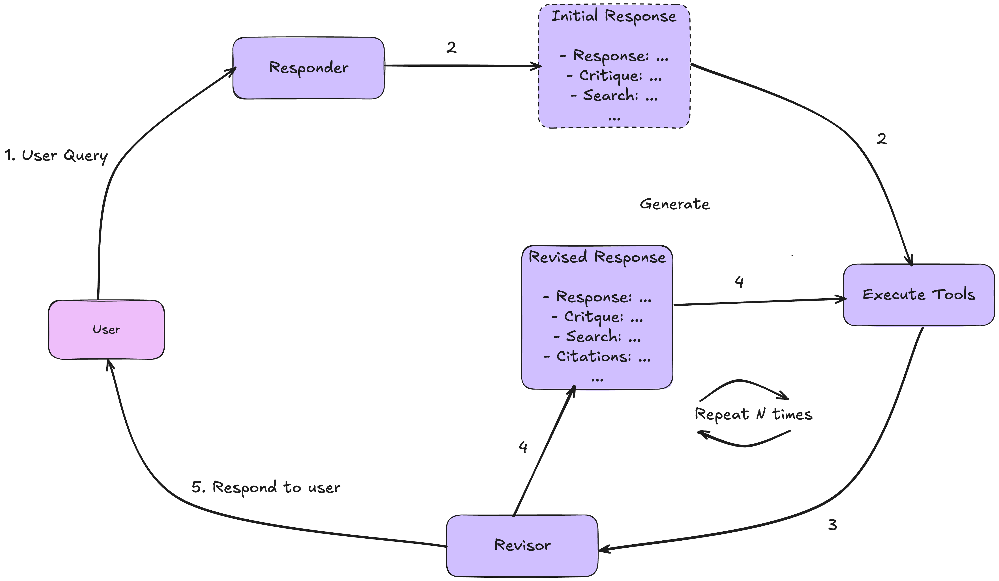

**Current LangChain + LangGraph code**

```python
import json
import os
from typing import Literal
from typing_extensions import TypedDict

from dotenv import load_dotenv
from langchain.chat_models import init_chat_model
from langchain_tavily import TavilySearch
from langgraph.graph import END, START, StateGraph
from pydantic import BaseModel, Field

load_dotenv()

model = init_chat_model(
    os.getenv("OPENAI_MODEL", "gpt-4.1-mini"),
    model_provider="openai",
    temperature=0,
)
search = TavilySearch(max_results=3, topic="general")


class AnswerQuestion(BaseModel):
    """Initial answer plus self-reflection and search requests."""

    answer: str = Field(description="The best answer currently possible.")
    reflection: str = Field(description="Missing information or weaknesses.")
    search_queries: list[str] = Field(
        description="Search queries that would improve or verify the answer."
    )


class ReviseAnswer(AnswerQuestion):
    """Revised answer grounded in evidence."""

    citations: list[str] = Field(description="URLs or source names used as evidence.")


class ReflexionState(TypedDict):
    question: str
    draft: AnswerQuestion | None
    evidence: list[str]
    revision: ReviseAnswer | None
    iterations: int


draft_chain = model.with_structured_output(AnswerQuestion)
revise_chain = model.with_structured_output(ReviseAnswer)
MAX_REVISIONS = 2


def draft_answer(state: ReflexionState) -> dict:
    draft = draft_chain.invoke(
        [
            (
                "system",
                "Answer the question. Also reflect on weaknesses and propose "
                "search queries needed for verification.",
            ),
            ("user", state["question"]),
        ]
    )
    return {"draft": draft}


def execute_tools(state: ReflexionState) -> dict:
    search_queries = (
        state["revision"].search_queries
        if state.get("revision")
        else state["draft"].search_queries
    )

    evidence = []
    for query in search_queries:
        result = search.invoke({"query": query})
        evidence.append(json.dumps(result, ensure_ascii=False, default=str))

    return {"evidence": evidence}


def revise_answer(state: ReflexionState) -> dict:
    previous_answer = state["revision"] or state["draft"]
    revision = revise_chain.invoke(
        [
            (
                "system",
                "Revise the answer using the evidence. Keep useful citations. "
                "If more evidence is needed, include new search queries.",
            ),
            (
                "user",
                json.dumps(
                    {
                        "question": state["question"],
                        "previous_answer": previous_answer.model_dump(),
                        "evidence": state["evidence"],
                    },
                    ensure_ascii=False,
                ),
            ),
        ]
    )
    return {
        "revision": revision,
        "iterations": state.get("iterations", 0) + 1,
    }


def continue_reflexion(state: ReflexionState) -> Literal["execute_tools", END]:
    if state.get("iterations", 0) >= MAX_REVISIONS:
        return END
    if not state["revision"].search_queries:
        return END
    return "execute_tools"


builder = StateGraph(ReflexionState)
builder.add_node("draft", draft_answer)
builder.add_node("execute_tools", execute_tools)
builder.add_node("revise", revise_answer)
builder.add_edge(START, "draft")
builder.add_edge("draft", "execute_tools")
builder.add_edge("execute_tools", "revise")
builder.add_conditional_edges("revise", continue_reflexion)

graph = builder.compile()

result = graph.invoke(
    {
        "question": "What breakfast foods should someone with prediabetes avoid?",
        "draft": None,
        "evidence": [],
        "revision": None,
        "iterations": 0,
    }
)

print(result["revision"].answer)
print(result["revision"].citations)
```

#### ReAct Agents

**Concept**

* Interleaves reasoning and action.
* Pattern: user message --> model decides tool call --> tool result --> model continues.
* In current LangGraph, use `ToolNode` and `tools_condition` for the common ReAct tool loop.

**Workflow**

1. Bind tools to the model with `model.bind_tools(tools)`.
2. Agent node calls the tool-aware model.
3. `tools_condition` checks whether the latest AI message has tool calls.
4. `ToolNode` executes requested tools and returns `ToolMessage` objects.
5. Loop back to the agent until no tool call is present.

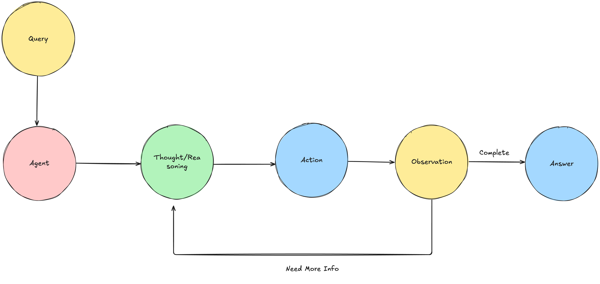

**Current LangGraph code**

```python
import os

from dotenv import load_dotenv
from langchain.chat_models import init_chat_model
from langchain_core.messages import HumanMessage, SystemMessage
from langchain_core.tools import tool
from langgraph.graph import START, MessagesState, StateGraph
from langgraph.prebuilt import ToolNode, tools_condition

load_dotenv()

model = init_chat_model(
    os.getenv("OPENAI_MODEL", "gpt-4.1-mini"),
    model_provider="openai",
    temperature=0,
)


@tool
def get_weather(city: str) -> str:
    """Get a short weather report for a city."""
    examples = {
        "zurich": "Zurich is 12 C and rainy.",
        "new york": "New York is 25 C and sunny.",
    }
    return examples.get(city.lower(), f"No weather report available for {city}.")


@tool
def recommend_clothing(weather: str) -> str:
    """Recommend clothing from a weather description."""
    text = weather.lower()
    if "rain" in text:
        return "Wear a raincoat and waterproof shoes."
    if "sunny" in text:
        return "Wear light clothes and sunglasses."
    return "Wear comfortable layers."


tools = [get_weather, recommend_clothing]
model_with_tools = model.bind_tools(tools)


def call_model(state: MessagesState) -> dict:
    response = model_with_tools.invoke(
        [
            SystemMessage(
                content=(
                    "You are a practical assistant. Use tools when weather or "
                    "clothing recommendations require concrete information."
                )
            ),
            *state["messages"],
        ]
    )
    return {"messages": [response]}


builder = StateGraph(MessagesState)
builder.add_node("agent", call_model)
builder.add_node("tools", ToolNode(tools))
builder.add_edge(START, "agent")
builder.add_conditional_edges("agent", tools_condition)
builder.add_edge("tools", "agent")

graph = builder.compile()

result = graph.invoke(
    {
        "messages": [
            HumanMessage(content="What is the weather in Zurich, and what should I wear?")
        ]
    }
)

print(result["messages"][-1].content)
```

#### Comparison

| Aspect | Reflection | Reflexion | ReAct |
| --- | --- | --- | --- |
| Feedback | Internal critique | External evidence + internal critique | Tool observations |
| Structure | Generate <--> Reflect | Draft --> Tool --> Revise | Agent <--> Tools |
| Main state | `MessagesState` plus counters | Typed state with draft, evidence, revision | `MessagesState` |
| Current helper APIs | `StateGraph`, `MessagesState` | `StateGraph`, `with_structured_output`, tools | `ToolNode`, `tools_condition`, `bind_tools` |
| Complexity | Low | High | Medium |
| Strength | Improves wording and completeness | Improves factuality and citation quality | Handles dynamic tool workflows |
| Weakness | No new knowledge | Slower and more expensive | Depends on tool quality |

#### Key Takeaways

* `MessageGraph` is no longer the preferred pattern for new examples; use `StateGraph` with `MessagesState` or a typed custom state.
* Reflection is the simplest self-improvement loop, but it cannot add external knowledge.
* Reflexion adds grounding, evidence, and verification with structured outputs and tools.
* ReAct is the standard pattern for model-directed tool use.
* For a high-level tool-using LangChain agent, use `create_agent(...)`; for custom self-improvement loops, use LangGraph directly.
* Increasing capability usually increases latency, cost, and the need for evaluation.

#### Practical Guidance

* Start with `create_agent(...)` or a ReAct-style graph for most tool-using assistants.
* Add Reflection when output quality matters more than factual grounding.
* Use Reflexion when correctness, citations, tests, or evidence are critical.
* Add explicit loop limits such as `MAX_DRAFTS` or `MAX_REVISIONS`.
* Keep tool outputs JSON-serializable and state schemas explicit.
* Use checkpointing when loops are long-running or require human review.

LangGraph enables all three patterns through explicit, inspectable graph workflows.

## 3. Multi-Agent Systems and Agentic RAG with LangGraph
