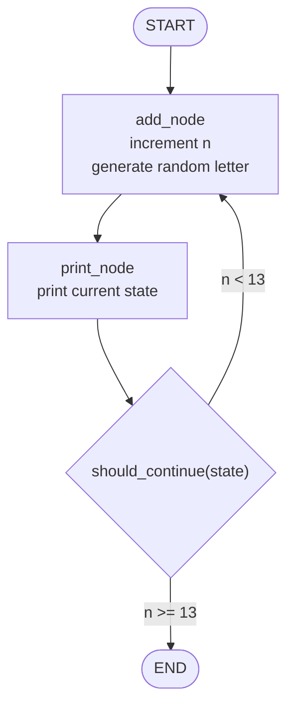

# Building AI Agents and Agentic Workflows: Fundamentals of Building AI Agents

This is a compilation of notes from the Coursera Specialization [Building AI Agents and Agentic Workflows (IBM)](https://www.coursera.org/programs/deutsche-telekom-learning-program-ddjuh/specializations/building-ai-agents-and-agentic-workflows), which is composed of the following courses:

- [Fundamentals of Building AI Agents](https://www.coursera.org/programs/deutsche-telekom-learning-program-ddjuh/learn/fundamentals-of-building-ai-agents?authProvider=deutschetelekom)
- [Agentic AI with LangChain and LangGraph](https://www.coursera.org/programs/deutsche-telekom-learning-program-ddjuh/learn/agentic-ai-with-langchain-and-langgraph)
- [Agentic AI with LangGraph, CrewAI, AutoGen and BeeAI](https://www.coursera.org/programs/deutsche-telekom-learning-program-ddjuh/learn/agentic-ai-with-langgraph-crewai-autogen-and-beeai)

This folder contains notes of the second course: **Agentic AI with LangChain and LangGraph**.

Table of contents:

- [Building AI Agents and Agentic Workflows: Fundamentals of Building AI Agents](#building-ai-agents-and-agentic-workflows-fundamentals-of-building-ai-agents)
  - [1. Introduction to LangGraph](#1-introduction-to-langgraph)
    - [Introduction to Agentic AI](#introduction-to-agentic-ai)
      - [Generative AI vs Agentic AI](#generative-ai-vs-agentic-ai)
      - [Agentic AI](#agentic-ai)
    - [LangChain and LangGraph](#langchain-and-langgraph)
      - [Core Components of LangGraph](#core-components-of-langgraph)
      - [Designing Effective LangGraph Workflows](#designing-effective-langgraph-workflows)
      - [When to use LangGraph vs LangChain](#when-to-use-langgraph-vs-langchain)
    - [Build a LangGraph Workflow](#build-a-langgraph-workflow)
      - [LangGraph 101](#langgraph-101)
      - [Exercise: Build a Stateful Workflow with LangGraph](#exercise-build-a-stateful-workflow-with-langgraph)
    - [Summary and Cheat Sheet: Introduction to LangGraph](#summary-and-cheat-sheet-introduction-to-langgraph)
      - [Getting Started With LangGraph](#getting-started-with-langgraph)
      - [Why Graph-Based Agents?](#why-graph-based-agents)
      - [When To Use LangGraph](#when-to-use-langgraph)
      - [Core Concepts](#core-concepts)
      - [Complete Example: Increment Counter](#complete-example-increment-counter)
  - [2. Build Self-Improving Agents with LangGraph](#2-build-self-improving-agents-with-langgraph)
  - [3. Multi-Agent Systems and Agentic RAG with LangGraph](#3-multi-agent-systems-and-agentic-rag-with-langgraph)


## 1. Introduction to LangGraph

### Introduction to Agentic AI

#### Generative AI vs Agentic AI

* Generative AI is reactive: it waits for a prompt and generates content (text, images, code, audio) based on learned patterns; it does not act beyond generation without further input.
* Agentic AI is proactive: it uses a prompt to pursue goals through a loop of perception --> decision --> action --> feedback, with minimal human intervention.
* Both often rely on LLMs:
  * Generative AI uses them for content generation.
  * Agentic AI uses them for reasoning (e.g., chain-of-thought to break tasks into steps).
* Key difference:
  * Generative AI --> produces possibilities; human directs and refines.
  * Agentic AI --> executes multi-step tasks autonomously.
* Use cases:
  * Generative AI: content creation, scripting, media generation, assisted workflows.
  * Agentic AI: task automation (e.g., shopping agents monitoring prices, handling purchases).
* Agent behavior:
  * Breaks complex tasks into steps (planning).
  * Iteratively acts and adapts based on results.
* Future direction:
  * Hybrid systems combining both approaches:
    * generation for exploration
    * agentic execution for action
* Key idea: generative AI "creates", agentic AI "acts"; the most powerful systems will integrate both.

#### Agentic AI

* The evolution of LLMs (e.g., after ChatGPT) moved from simple text generation to tool use, memory, and function calling, enabling the emergence of AI agents.
* AI agents:
  * Single autonomous entities designed for specific tasks.
  * Capabilities: autonomy, task-specificity, and reactivity.
  * Operate with a simple loop: perceive --> reason --> act.
  * Use cases: chatbots, search assistants, email automation.
* Agentic AI:
  * Systems composed of multiple collaborating agents.
  * Capabilities:
    * Task decomposition (break goals into subtasks)
    * Inter-agent communication
    * Shared memory and learning
    * Centralized or distributed orchestration
  * Enables complex, multi-step, and parallel workflows.
* Key differences:
  * AI agent: single, linear, limited scope.
  * Agentic AI: multi-agent, collaborative, adaptive, scalable.
  * Agentic systems support iterative reasoning, planning, and re-planning.
* Architectural advancements in Agentic AI:
  * Multi-agent coordination via messaging/shared memory
  * Advanced reasoning (ReAct, Chain-of-Thought, Tree-of-Thoughts)
    * Chain-of-Thoughts: linear reasoning steps, internal monologue
  * Persistent memory (episodic, semantic, vector-based)
* Applications:
  * AI agents: customer support, internal tools, automation
  * Agentic AI: research assistants, robotics, healthcare systems, enterprise workflows
* Challenges:
  * AI agents: hallucinations, limited reasoning, weak long-horizon planning
  * Agentic AI: coordination failures, error propagation, scalability, explainability
* Emerging solutions:
  * RAG for grounding and shared knowledge
  * Tool/function calling for real-world interaction
  * Advanced memory systems for long-term reasoning
* Future trends:
  * Agents becoming proactive, learning, and more capable
  * Agentic AI evolving into coordinated multi-agent teams with governance
* Tooling ecosystem:
  * LangChain: building blocks for agents (tools, memory, chains)
  * LangGraph: graph-based multi-agent workflows
  * Other frameworks: CrewAI, AutoGen, etc.
* Key idea: AI is evolving from single-task agents to coordinated multi-agent systems (Agentic AI) that can solve complex, real-world problems through collaboration, planning, and memory.


### LangChain and LangGraph

#### Core Components of LangGraph

* LangGraph is a low-level framework (within the LangChain ecosystem) for building **stateful, multi-agent workflows** using graph structures.
* Core primitives:
  * Nodes: computation steps (functions).
  * Edges: define execution flow between nodes.
  * State: shared memory that persists context across the workflow.
* Key capabilities:
  * Looping and branching for dynamic decision-making.
  * State persistence for long-running, context-aware interactions.
  * Human-in-the-loop for manual intervention during execution.
  * Time travel for debugging by reverting to previous states.
* Advantages over traditional control flow (loops/conditionals):
  * Explicit state management across steps.
  * Runtime conditional transitions (dynamic branching).
  * Modular design (independent, reusable nodes).
  * Better observability and debugging of execution paths.
* Use case:
  * Ideal for complex agents requiring memory, adaptability, and multi-step reasoning (e.g., customer support agents that track context and escalate when needed).
* Visualization:
  * Workflows can be represented as graphs (e.g., Mermaid diagrams) to improve understanding and debugging.
* Key idea: LangGraph replaces linear control flow with graph-based orchestration, enabling flexible, stateful, and inspectable AI agent workflows.


#### Designing Effective LangGraph Workflows

* Graph architecture (LangGraph) enables flexible, stateful workflows beyond traditional loops by supporting dynamic branching, clear visualization, and modular reusable components.
* State design:
  * Stores shared context across nodes.
  * Use clear, descriptive names and keep structures flat.
* Node design:
  * Each node should have a single responsibility.
  * Types: processing, validation, integration, decision.
  * Nodes read from state, perform logic, and update state.
* Edges:
  * Control execution flow and enable conditional routing.
* Error handling:
  * Plan explicitly using retries, error states, and fallback/human intervention paths.
* Testing/debugging:
  * Test nodes independently.
  * Ensure predictable state transitions.
  * Build incrementally.
* Performance:
  * Keep state simple.
  * isolate expensive operations.
  * Use caching where needed.
* Integration:
  * Separate external system logic.
  * handle failures and timeouts.
  * design clear human-in-the-loop checkpoints.
* Common pitfalls:
  * oversized nodes
  * complex nested state
  * missing error handling
* Key idea: design workflows as modular, state-driven graphs with clear responsibilities and robust error handling.

```python
# State design: clear, flat, explicit schema
from typing import TypedDict

class SupportAgentState(TypedDict):
    user_input: str
    agent_response: str
    issue_type: str
    retry_count: int


# Node pattern: read state --> process --> update state
def process_request(state: SupportAgentState) -> SupportAgentState:
    # example processing logic
    state["agent_response"] = f"Processing: {state['user_input']}"
    return state


# Decision node: controls branching via edges
def route_decision(state: SupportAgentState) -> str:
    if state["retry_count"] > 2:
        return "human_review"        # route to human node
    elif state["issue_type"] == "resolved":
        return "end_interaction"     # terminate workflow
    else:
        return "continue_processing" # loop or next step


# Error handling pattern
# can be combined with routing logic to escalate
def error_handler(state: SupportAgentState) -> SupportAgentState:
    # increment retry count and log error
    state["retry_count"] += 1
    return state


# Example state for a document processing workflow
from typing import TypedDict

class DocumentProcessingState(TypedDict):
    file_path: str
    text_content: str
    summary: str
    analysis_results: dict

# Example node sequence (conceptual pipeline)
def extract_text(state: DocumentProcessingState) -> DocumentProcessingState:
    # simulate extraction
    state["text_content"] = "extracted text"
    return state

def analyze_text(state: DocumentProcessingState) -> DocumentProcessingState:
    # simulate analysis
    state["analysis_results"] = {"sentiment": "positive"}
    return state

def summarize(state: DocumentProcessingState) -> DocumentProcessingState:
    # simulate summarization
    state["summary"] = "short summary"
    return state
```

#### When to use LangGraph vs LangChain

* Both LangChain and LangGraph are open-source frameworks for building LLM-based applications, but they target different workflow complexities.
* LangChain:
  * Focus: building LLM applications via **sequential chains of operations**.
  * Structure: chain (DAG) --> fixed, forward execution flow.
  * Components: document loaders, text splitters, prompts, LLMs, memory, chains.
  * State: limited; mainly passed forward or handled via memory components.
  * Best for:
    * linear workflows (retrieve --> summarize --> answer)
    * well-defined pipelines with known steps.
* LangGraph:
  * Focus: **stateful, multi-agent systems** and complex workflows.
  * Structure: graph --> nodes (actions), edges (transitions), state (shared memory).
  * Supports loops, branching, and revisiting steps.
  * State: central, persistent, and shared across all nodes.
  * Best for:
    * dynamic, interactive systems
    * long-running, context-aware agents.
* Key differences:
  * Execution:
    * LangChain --> linear, predefined flow.
    * LangGraph --> dynamic, non-linear flow with loops.
  * State:
    * LangChain --> limited/passed along chain.
    * LangGraph --> core shared memory across workflow.
  * Complexity:
    * LangChain --> simpler pipelines.
    * LangGraph --> complex, adaptive multi-agent systems.
* Example contrast:
  * LangChain: retrieve data --> summarize --> answer (fixed sequence).
  * LangGraph: task manager agent --> process input --> branch to add/complete/summarize tasks --> loop back with updated state.
* Key idea:
  * LangChain is for **composing LLM pipelines**,
  * LangGraph is for **orchestrating stateful, adaptive agent systems**.

### Build a LangGraph Workflow

#### LangGraph 101

* LangGraph models workflows as graphs with state, enabling looping, branching, and dynamic execution.
* Core concepts:
    * State: shared data (e.g., variables like n, letter) that evolves across steps.
    * Nodes: functions that read state and return state updates or perform side effects.
    * Edges: define transitions between nodes.
    * `START` and `END`: explicit graph boundaries.
* State is typically defined using `TypedDict` for structured, typed data.
* Nodes usually return **partial state updates** (only changed fields); LangGraph merges those updates into the current state.
* Reducers control how repeated updates are merged:
    * default behavior replaces a state key
    * `Annotated[..., reducer]` can append/merge values (e.g., `operator.add` for lists)
    * chat workflows commonly use `MessagesState` or `add_messages` for message history
* Workflow example (below):
    * Initialize state `(n=1, letter="")`
    * Increment `n` and generate a random letter
    * Print values
    * Loop until `n >= 13`, then stop
* Conditional edges:
    * Control flow based on state (e.g., continue loop or end).
* Building a LangGraph app:
    * Define state schema
    * Create node functions
    * Add nodes and edges
    * Connect `START` to the first node and terminal paths to `END`
    * Compile graph
    * Run with `invoke(initial_state)` or `stream(initial_state)`
* Persistence and long-running workflows:
    * Compile with a checkpointer (e.g., `compile(checkpointer=...)`) to persist state.
    * Use a `thread_id` in the run config to continue the same conversation/workflow later.
    * Checkpoints enable human-in-the-loop interrupts, resume with `Command(resume=...)`, and time travel/debugging.
* Advanced routing:
    * `add_conditional_edges` routes based on state.
    * `Command` can combine a state update with a routing or resume instruction.
* Key idea: execution flows through nodes while state is updated and passed along, enabling dynamic, iterative workflows.

In the following, this graph is created:



```python
# 1. Define the graph state.
# Every node receives this state as input. A node can then return updates
# for one or more keys, and LangGraph merges those updates into the state.
from typing import Literal
from typing_extensions import TypedDict

class ChainState(TypedDict):
    # Counter used to decide when the loop should stop.
    n: int
    # Latest generated letter. This is replaced on every "add" node run.
    letter: str

# 2. Define a node that updates state.
# This node does not need to return the full state. It returns only the
# fields that changed: n and letter.
import random
import string

def add_node(state: ChainState) -> dict:
    return {
        "n": state["n"] + 1,
        "letter": random.choice(string.ascii_lowercase)
    }


# 3. Define a node that performs a side effect.
# It reads the current state and prints it. Since it does not change state,
# it returns an empty update.
def print_node(state: ChainState) -> dict:
    print(f"n={state['n']}, letter={state['letter']}")
    return {}  # no state update


# 4. Define conditional routing logic.
# After "print" runs, LangGraph calls this function with the latest state.
# The returned label is mapped to the next graph destination below.
def should_continue(state: ChainState) -> Literal["add", "end"]:
    if state["n"] >= 13:
        return "end"
    return "add"


# 5. Build the graph.
# START is the explicit graph entry boundary, and END is the explicit
# terminal boundary. The graph loops from "print" back to "add" until the
# conditional route returns "end".
from langgraph.graph import StateGraph, START, END

workflow = StateGraph(ChainState)
workflow.add_node("add", add_node)
workflow.add_node("print", print_node)
workflow.add_edge(START, "add")  # Entry point
workflow.add_edge("add", "print")

# Conditional edge: after print --> either loop or end
# this mapping translates labels into graph destinations
# Note: should_continue is not a node, but a routing function attached to conditional edges
workflow.add_conditional_edges(
    "print",  # 1. source node
    should_continue,  # 2. routing function
    {  # 3. routing map: outputs from should_continue are mapped to these nodes
        "add": "add",
        "end": END
    }
)

# compile() validates the graph and produces a runnable app.
app = workflow.compile()


# 6. Run the workflow.
# The initial_state starts with n=1 and an empty letter. The first node run
# increments n to 2, generates a letter, prints it, and then the loop repeats.
result = app.invoke({
    "n": 1,
    "letter": ""
})

print("Final state:", result)
# Execution behavior:
# add --> print --> (check condition)
# --> loop until n >= 13 --> END
#
# Example state evolution:
# initial state: {"n": 1, "letter": ""}
# after add_node: {"n": 2, "letter": "q"}  # random letter
# after print_node: {"n": 2, "letter": "q"}  # unchanged
# should_continue returns "add" because n < 13
# after add_node: {"n": 3, "letter": "m"}
# after print_node: {"n": 3, "letter": "m"}
# ...
# after add_node: {"n": 13, "letter": "x"}
# after print_node: {"n": 13, "letter": "x"}
# should_continue returns "end" because n >= 13
# final state: {"n": 13, "letter": "x"}
```

#### Exercise: Build a Stateful Workflow with LangGraph

Notebook: [`lab/01_LangGraph101-v1.ipynb`](./lab/01_LangGraph101-v1.ipynb).

This lab introduces LangGraph by building stateful workflows from small, explicit pieces:

* Setup:
    * installs current `langgraph`, `langchain[openai]`, and `python-dotenv`
    * loads `OPENAI_API_KEY` from `.env`
    * creates an OpenAI chat model with `init_chat_model`
* LangGraph basics:
    * defines typed state with `TypedDict`
    * creates node functions that read state and return partial updates
    * connects nodes with normal edges and conditional edges
    * uses explicit `START` and `END` graph boundaries
* Example 1: Authentication workflow:
    * collects username/password input
    * validates credentials (it looks for exact password)
    * routes to success or failure with a conditional edge
    * loops back to the input node after failed authentication
* Example 2: QA workflow:
    * validates a user question (looking for keywords)
    * adds LangGraph-specific context when the question is relevant
    * calls an OpenAI model to answer from the provided context
    * returns a fallback answer when no context is available
* Final exercise:
    * builds a small looping counter graph
    * increments `n`, generates a random letter, prints state, and loops until `n >= 13`
    * reinforces the modern `START -> node -> ... -> END` style

Example 1: authentication workflow:


Code summary:

```python
class AuthState(TypedDict):
    username: Optional[str]
    password: Optional[str]
    is_authenticated: Optional[bool]
    output: Optional[str]

def input_node(state):
    if state.get("username", "") == "":
        username = input("What is your username?")
    else:
        username = state["username"]

    password = input("Enter your password: ")
    return {
        "username": username,
        "password": password,
    }

def validate_credentials_node(state):
    username = state.get("username", "")
    password = state.get("password", "")
    return {
        "is_authenticated": (
            username == "test_user" and password == "secure_password"
        )
    }

def success_node(state):
    return {"output": "Authentication successful! Welcome."}

def failure_node(state):
    return {"output": "Not successful, please try again!"}

def router(state):
    if state["is_authenticated"]:
        return "success_node"
    return "failure_node"

workflow = StateGraph(AuthState)
workflow.add_node("InputNode", input_node)
workflow.add_node("ValidateCredential", validate_credentials_node)
workflow.add_node("Success", success_node)
workflow.add_node("Failure", failure_node)

workflow.add_edge(START, "InputNode")
workflow.add_edge("InputNode", "ValidateCredential")
workflow.add_conditional_edges(
    "ValidateCredential",
    router,
    {
        "success_node": "Success",
        "failure_node": "Failure",
    },
)
workflow.add_edge("Success", END)
workflow.add_edge("Failure", "InputNode")

app = workflow.compile()
result = app.invoke({"username": "test_user"})
```

Example 2: QA workflow:


Code summary:

```python
class QAState(TypedDict):
    question: Optional[str]
    valid: Optional[bool]
    error: Optional[str]
    context: Optional[str]
    answer: Optional[str]

def input_validation_node(state):
    question = state.get("question", "").strip()
    if not question:
        return {
            "valid": False,
            "error": "Question cannot be empty.",
        }
    return {"valid": True, "error": None}

def context_provider_node(state):
    question = state.get("question", "").lower()
    if "langgraph" in question or "guided project" in question:
        return {
            "context": (
                "This guided project is about using LangGraph, a Python "
                "library to design state-based workflows. LangGraph connects "
                "modular nodes with normal and conditional edges."
            )
        }
    return {"context": None}

def llm_qa_node(state):
    question = state.get("question", "")
    context = state.get("context")

    if not context:
        return {"answer": "I don't have enough context to answer your question."}

    messages = [
        {"role": "system", "content": "Answer using only the provided context."},
        {"role": "user", "content": f"Context: {context}\n\nQuestion: {question}"},
    ]
    response = qa_llm.invoke(messages)
    return {"answer": response.content.strip()}

qa_workflow = StateGraph(QAState)
qa_workflow.add_node("InputNode", input_validation_node)
qa_workflow.add_node("ContextNode", context_provider_node)
qa_workflow.add_node("QANode", llm_qa_node)

qa_workflow.add_edge(START, "InputNode")
qa_workflow.add_edge("InputNode", "ContextNode")
qa_workflow.add_edge("ContextNode", "QANode")
qa_workflow.add_edge("QANode", END)

qa_app = qa_workflow.compile()
qa_app.invoke({"question": "What is LangGraph?"})
```

### Summary and Cheat Sheet: Introduction to LangGraph

LangGraph is an open-source framework for **stateful, graph-based AI agents**.

* Extends LangChain with explicit control flow.
* Uses shared state across workflow steps.
* Supports branching, loops, persistence, human review, and debugging.
* Works with LangChain models, tools, retrievers, and LangSmith.

#### Getting Started With LangGraph

| Topic | Summary |
| --- | --- |
| Overview | Build graph-shaped AI workflows. |
| LangChain extension | Adds stateful orchestration to LangChain components. |
| State | Shared `TypedDict` or Pydantic object. |
| Flow | Branching, loops, retries, and routing. |
| Agents | Iterative reasoning, tools, review, and coordination. |
| Execution | Durable runs, checkpoints, resume, streaming. |
| Observability | Graph diagrams and LangSmith traces. |

Install:

```bash
pip install langgraph "langchain[openai]" python-dotenv
```

#### Why Graph-Based Agents?

* Linear chains are good for fixed flows: retrieve, call model, parse, answer.
* Agents often need loops: retry a tool, revise a query, or ask for approval.
* LangGraph models workflows as state machines.
* The graph can revisit nodes, branch by state, and stop only when a condition is met.
* Example: poor retrieval -> rewrite query -> retrieve again -> evaluate -> answer.

#### When To Use LangGraph

| Use case | Why LangGraph helps |
| --- | --- |
| Loops | Repeat until a goal is met. |
| Branching | Route with explicit if/else logic. |
| Long runs | Persist and resume with checkpoints. |
| Complex state | Keep workflow data in one shared object. |
| Multi-agent flows | Coordinate agents, tools, or reviewers. |
| Human review | Pause and resume with `Command(resume=...)`. |
| Debugging | Inspect graph, state, streams, and traces. |

#### Core Concepts

| Concept | Explanation |
| --- | --- |
| State | Shared data passed between nodes. |
| `StateGraph` | Blueprint for nodes, edges, and state. |
| Nodes | Functions or `Runnable`s that return state updates. |
| Edges | Fixed or conditional transitions. |
| `START` / `END` | Special graph boundaries. |
| `compile()` | Builds the runnable app. |
| `invoke()` / `stream()` | Run the compiled graph. |
| Checkpointers | Save state for resume and time travel. |
| Reducers | Control how updates merge into state. |

State and graph:

```python
from typing_extensions import TypedDict
from langgraph.graph import StateGraph, START, END

class WorkflowState(TypedDict):
    user_query: str
    summary: str
    step_count: int

graph = StateGraph(WorkflowState)
```

Define a node:

```python
def summarize(state: WorkflowState) -> dict:
    text = state["user_query"]
    summary = llm_summarize(text)

    return {
        "summary": summary,
        "step_count": state["step_count"] + 1,
    }

graph.add_node("summarize", summarize)
```

Edges:

```python
graph.add_edge(START, "summarize")
graph.add_edge("summarize", "finalize")
graph.add_edge("finalize", END)
```

Conditional edges:

```python
from typing import Literal

def decide(state: WorkflowState) -> Literal["repeat", "done"]:
    if state["step_count"] < 2:
        return "repeat"
    return "done"

graph.add_conditional_edges(
    "summarize",
    decide,
    {
        "repeat": "summarize",
        "done": END,
    },
)
```

Run and visualize:

```python
app = graph.compile()
final_state = app.invoke({
    "user_query": "Hello",
    "summary": "",
    "step_count": 0,
})
print(app.get_graph().draw_mermaid())
```

Note: the routing function is **not** a node. It returns a label; the mapping chooses the destination.

#### Complete Example: Increment Counter

This graph increments `count` until it reaches `3`.


```python
from typing import Literal
from typing_extensions import TypedDict
from langgraph.graph import StateGraph, START, END

class GraphState(TypedDict):
    count: int
    message: str

def increment(state: GraphState) -> dict:
    new_count = state["count"] + 1
    return {
        "count": new_count,
        "message": f"Count is now {new_count}",
    }

def decide_next(state: GraphState) -> Literal["again", "finish"]:
    if state["count"] < 3:
        return "again"
    return "finish"

graph = StateGraph(GraphState)
graph.add_node("increment", increment)

graph.add_edge(START, "increment")
graph.add_conditional_edges(
    "increment",
    decide_next,
    {
        "again": "increment",
        "finish": END,
    },
)

app = graph.compile()
result = app.invoke({
    "count": 0,
    "message": "",
})

print(result)
# {"count": 3, "message": "Count is now 3"}
```

Key takeaways:

* Use LangGraph for state, branching, loops, retries, or durable execution.
* State is the data; `StateGraph` is the structure.
* Nodes return updates.
* Edges move execution.
* Conditional edges route at runtime.
* `START` and `END` are special boundaries.
* `compile()` builds the app; `invoke()` or `stream()` runs it.
* Mermaid and LangSmith help debug behavior.

## 2. Build Self-Improving Agents with LangGraph

## 3. Multi-Agent Systems and Agentic RAG with LangGraph
