# Building AI Agents and Agentic Workflows: Agentic AI with LangGraph, CrewAI, AutoGen and BeeAI

This is a compilation of notes from the Coursera Specialization [Building AI Agents and Agentic Workflows (IBM)](https://www.coursera.org/programs/deutsche-telekom-learning-program-ddjuh/specializations/building-ai-agents-and-agentic-workflows), which is composed of the following courses:

- [Fundamentals of Building AI Agents](https://www.coursera.org/programs/deutsche-telekom-learning-program-ddjuh/learn/fundamentals-of-building-ai-agents?authProvider=deutschetelekom)
- [Agentic AI with LangChain and LangGraph](https://www.coursera.org/programs/deutsche-telekom-learning-program-ddjuh/learn/agentic-ai-with-langchain-and-langgraph)
- [Agentic AI with LangGraph, CrewAI, AutoGen and BeeAI](https://www.coursera.org/programs/deutsche-telekom-learning-program-ddjuh/learn/agentic-ai-with-langgraph-crewai-autogen-and-beeai)

This folder contains notes of the third course: **Agentic AI with LangGraph, CrewAI, AutoGen and BeeAI**.

Table of Contents:

- [Building AI Agents and Agentic Workflows: Agentic AI with LangGraph, CrewAI, AutoGen and BeeAI](#building-ai-agents-and-agentic-workflows-agentic-ai-with-langgraph-crewai-autogen-and-beeai)
  - [1. Agentic Frameworks and LangGraph Design Patterns for Effective AI Systems](#1-agentic-frameworks-and-langgraph-design-patterns-for-effective-ai-systems)
    - [Introduction to Agentic Frameworks](#introduction-to-agentic-frameworks)
    - [Understanding AI System Design Patterns](#understanding-ai-system-design-patterns)
      - [Essential Design Patterns for Agentic AI Systems: Sequential, Routing, and Parallelization](#essential-design-patterns-for-agentic-ai-systems-sequential-routing-and-parallelization)
      - [Orchestrator Design Pattern](#orchestrator-design-pattern)
      - [Evaluator-Optimizer Design Pattern](#evaluator-optimizer-design-pattern)
      - [Exercise: Prompt Chaining, Routing and Parallelization Patterns in LangGraph](#exercise-prompt-chaining-routing-and-parallelization-patterns-in-langgraph)
      - [Exercise: Orchestration and Evaluation Patterns in LangGraph](#exercise-orchestration-and-evaluation-patterns-in-langgraph)
    - [Summary and Cheat Sheet: Agentic Frameworks and LangGraph Design Patterns](#summary-and-cheat-sheet-agentic-frameworks-and-langgraph-design-patterns)
      - [Framework Setup](#framework-setup)
      - [Core LangGraph Building Blocks](#core-langgraph-building-blocks)
      - [Structured Output](#structured-output)
      - [State And Node Functions](#state-and-node-functions)
      - [Minimal Graph](#minimal-graph)
      - [Pattern Cheat Sheet](#pattern-cheat-sheet)
      - [Sequential Pattern](#sequential-pattern)
      - [Routing Pattern](#routing-pattern)
      - [Static Parallelization Pattern](#static-parallelization-pattern)
      - [Dynamic Fan-Out With Send](#dynamic-fan-out-with-send)
      - [Evaluator-Optimizer Loop](#evaluator-optimizer-loop)
      - [Visualization](#visualization)
      - [Key Takeaway](#key-takeaway)
  - [2. CrewAI Fundamentals and Advanced Applications](#2-crewai-fundamentals-and-advanced-applications)
    - [Introduction to CrewAI](#introduction-to-crewai)
      - [Crew Core Concepts and Architecture](#crew-core-concepts-and-architecture)
      - [Exercise: Building a CrewAI Workflow](#exercise-building-a-crewai-workflow)
    - [Structured Outputs in CrewAI](#structured-outputs-in-crewai)
      - [CrewAI Structured Outputs, YAML and CrewBase](#crewai-structured-outputs-yaml-and-crewbase)
      - [Exercise: Meal Planer with Structured Outputs and YAML Configuration](#exercise-meal-planer-with-structured-outputs-and-yaml-configuration)
      - [Summary: Structured Outputs in CrewAI](#summary-structured-outputs-in-crewai)
    - [Functions and CrewAI](#functions-and-crewai)
      - [Extending CrewAI with Custom Functions](#extending-crewai-with-custom-functions)
      - [Exercise: Custom Tools in CrewAI - Agents with Tools vs. Tasks with Tools](#exercise-custom-tools-in-crewai---agents-with-tools-vs-tasks-with-tools)
    - [Summary and Evaluation](#summary-and-evaluation)
      - [Exercise: Building your own AI Nutrition Coach using a Multi-Agent System and Multimodal AI](#exercise-building-your-own-ai-nutrition-coach-using-a-multi-agent-system-and-multimodal-ai)
      - [Summary and Cheat Sheet: Custom Tools in CrewAI](#summary-and-cheat-sheet-custom-tools-in-crewai)
        - [1. What is CrewAI?](#1-what-is-crewai)
        - [2. Current Setup Pattern](#2-current-setup-pattern)
        - [3. Agents](#3-agents)
        - [4. Tasks](#4-tasks)
        - [5. Crews](#5-crews)
        - [6. Custom Function Tools](#6-custom-function-tools)
        - [7. Agent-Centric Tools](#7-agent-centric-tools)
        - [8. Task-Centric Tools](#8-task-centric-tools)
        - [9. Structured Outputs with Pydantic](#9-structured-outputs-with-pydantic)
        - [10. CrewBase and YAML](#10-crewbase-and-yaml)
        - [11. Quick Design Rules](#11-quick-design-rules)
    - [Extra: Combining CrewAI with LangGraph](#extra-combining-crewai-with-langgraph)
      - [Pattern 1: Call a CrewAI Crew from a LangGraph Node](#pattern-1-call-a-crewai-crew-from-a-langgraph-node)
      - [Pattern 2: Use LangGraph to Route Between Crews](#pattern-2-use-langgraph-to-route-between-crews)
      - [Pattern 3: Call a LangGraph Workflow from a CrewAI Tool](#pattern-3-call-a-langgraph-workflow-from-a-crewai-tool)
      - [Practical Guidance](#practical-guidance)
  - [3. Alternative Agentic Frameworks: BeeAI and AutoGen (AG2)](#3-alternative-agentic-frameworks-beeai-and-autogen-ag2)
    - [BeeAI Core Concepts and Architecture](#beeai-core-concepts-and-architecture)
      - [BeeAI Core Components](#beeai-core-components)
      - [BeeAI Agents](#beeai-agents)
      - [Custom Tools](#custom-tools)
      - [Exercise: Building Agentic AI Systems with the BeeAI Framework](#exercise-building-agentic-ai-systems-with-the-beeai-framework)
    - [AG2 (AutoGen) Core Concepts, Architecture and Conversation Patterns](#ag2-autogen-core-concepts-architecture-and-conversation-patterns)
    - [Summary and Cheat Sheet: BeeAI and AG2](#summary-and-cheat-sheet-beeai-and-ag2)
  - [4. Extra: Pydantic AI](#4-extra-pydantic-ai)


## 1. Agentic Frameworks and LangGraph Design Patterns for Effective AI Systems

### Introduction to Agentic Frameworks

* Agentic AI systems are autonomous AI systems that make decisions and take actions to achieve goals rather than simply reacting to prompts.
  * Core traits:
    * multi-step reasoning
    * decision-making
    * tool/API usage
    * memory/context retention
    * goal-oriented behavior
* Agentic AI differs from reactive AI because it proactively decomposes problems, gathers information, invokes tools or other agents, and continues until the objective is achieved.
* Frameworks exist because building agentic systems from scratch is complex.
  * Common infrastructure challenges:
    * memory/state management
    * tool integration
    * agent communication
    * coordination logic
    * distributed error handling
    * monitoring/debugging
    * routing/orchestration logic
    * fallback/retry mechanisms
* Multi-agent systems (MAS) use multiple specialized agents instead of one general-purpose agent.
  * Benefits:
    * specialization: each agent focuses on one task
    * parallelism: agents work simultaneously
    * fault tolerance: partial failures do not break the whole system
    * scalability: agents can be added as needed
    * modularity: components can be independently replaced
    * clearer debugging: failures are easier to isolate
* Common collaboration patterns:
  * sequential pipelines:
    * agent A --> agent B --> agent C
    * example: research --> writing --> review
  * evaluator-generator loops:
    * generator creates output
    * evaluator critiques/refines
    * loop until accepted
  * conversational collaboration:
    * agents exchange messages in turns
  * router-based workflows:
    * next agent selected dynamically based on state
  * parallel execution + synthesis:
    * multiple agents work independently
    * final agent combines outputs
* Framework comparison:
  * CrewAI
    * role-based agent collaboration ("team of agents")
    * easy onboarding
    * structured outputs
    * explicit concepts:
      * agents with role, goal, backstory, tools
      * tasks with description, expected output, assigned agent
      * `Crew` object orchestrates execution
    * strong for:
      * evaluator/generator workflows
      * role delegation
      * content pipelines
      * reporting
    * drawbacks:
      * less flexible
      * debugging can be harder
  * LangGraph
    * graph-based workflows with nodes, edges, and shared state
    * agents/LLMs represented as explicit workflow nodes
    * routing via conditional router functions
    * fine-grained control over:
      * routing
      * memory/state
      * retries
      * failure handling
      * human-in-the-loop
    * supports reflection/evaluator workflows naturally
    * best for:
      * complex workflows
      * document pipelines
      * decision trees
      * customer service
      * regulated enterprise workflows
    * tradeoff:
      * more verbose / lower-level
  * AutoGen (AG2)
    * conversational agent-to-agent and human-agent collaboration
    * supports:
      * personas via system prompts
      * delegation
      * live code execution
      * group chat orchestration
    * implementation model:
      * agents interact in managed conversations
      * group chat manager controls turns
      * round-robin / scheduled interactions possible
    * best for:
      * collaborative coding
      * education
      * technical support
      * HITL workflows
      * research assistants
  * Pydantic AI
    * schema-first, type-safe structured outputs
    * reduces ambiguity and runtime errors
    * strong validation and deterministic interfaces
    * best for:
      * APIs
      * enterprise integrations
      * production reliability
  * BeeAI
    * enterprise-focused multi-agent orchestration
    * modular workflow design
    * supports:
      * multiple model providers
      * MCP tools
      * memory
      * telemetry
      * persistence
      * structured outputs
      * sequential + parallel execution
    * good for tool-enabled interoperable agent systems
    * best for scalable production agent systems
* Workflow styles by framework:
  * CrewAI:
    * role delegation / team simulation
  * LangGraph:
    * explicit state machines / workflow orchestration
  * AutoGen:
    * conversational collaboration
  * Pydantic AI:
    * structured deterministic API workflows
  * BeeAI:
    * modular enterprise orchestration
* Practical positioning:
  * easiest to start:
    * CrewAI
    * AutoGen
  * most control:
    * LangGraph
    * Pydantic AI
  * strongest enterprise focus:
    * BeeAI
  * fastest prototyping:
    * CrewAI
    * AutoGen
  * best debugging/observability:
    * LangGraph
* Example production uses:
  * CrewAI:
    * reporting
    * content workflows
    * delegated knowledge work
  * LangGraph:
    * structured automation
    * customer workflows
    * multi-step enterprise workflows
  * AutoGen:
    * collaborative technical systems
    * tutoring
    * conversational assistants
  * Pydantic AI:
    * reliable API services
    * structured backend systems
  * BeeAI:
    * enterprise automation
    * scalable multi-agent orchestration


### Understanding AI System Design Patterns

#### Essential Design Patterns for Agentic AI Systems: Sequential, Routing, and Parallelization

* Three core LLM workflow design patterns were introduced: sequential (prompt chaining), routing, and parallelization.
* These patterns can be implemented in LangGraph using the current `StateGraph` API:
  * a typed shared state, usually a `TypedDict`
  * nodes that return partial state updates as dictionaries
  * `START` and `END` sentinels for graph entry/exit
  * `add_edge(...)` for fixed execution flow
  * `add_conditional_edges(...)` for routing and dynamic fan-out
  * reducers such as `Annotated[list[T], operator.add]` when multiple parallel branches update the same state key
* Sequential / prompt chaining
  * One LLM/agent's output becomes the next agent's input.
  * This is useful when a complex task can be decomposed into specialized subtasks.
  * Example:
    * agent 1 summarizes job requirements from a job description
    * agent 2 uses that summary plus the original input to generate a tailored cover letter
  * Benefits:
    * modular decomposition
    * specialization
    * easier reasoning/debugging
  * Best for:
    * multi-step transformations
    * document generation
    * staged reasoning workflows
* Routing pattern
  * A router agent first analyzes the input and decides which downstream workflow to execute.
  * Routing is dynamic and based on runtime classification.
  * Example:
    * router decides whether user input requires summarization or translation
    * workflow routes to the corresponding specialized node
  * Implementation concepts:
    * shared state includes:
      * input
      * task type
      * final output
    * `llm.with_structured_output(...)` can constrain routing decisions to a schema
    * conditional edges route execution
  * Benefits:
    * dynamic task selection
    * modular branching
    * cleaner separation of responsibilities
  * Best for:
    * task classification
    * intent routing
    * multi-capability assistants
* Parallelization pattern
  * Multiple independent tasks run simultaneously rather than sequentially.
  * Results are later merged by an aggregator node.
  * Example:
    * translate one input into French, Spanish, and Japanese in parallel
    * aggregator combines all translations
  * Implementation concepts:
    * multiple nodes receive the same initial state
    * outputs are written to different state fields
    * aggregator merges results
    * for dynamic map-reduce style parallelism, conditional edges can return `Send(...)` objects with branch-specific state
  * Dynamic parallelization with `Send`
    * Use `Send(...)` when the number of parallel tasks is not known until runtime.
    * Instead of hard-coding one node per branch, a routing function returns a list of `Send("node_name", branch_state)` objects.
    * LangGraph schedules one execution of the target node for each `Send`.
    * Each branch can receive a smaller or different state than the main graph state.
    * This is useful for map-reduce workflows, such as processing an arbitrary list of documents, URLs, languages, search queries, or data rows.
    * When many branches write to the same state key, define a reducer such as `Annotated[list[str], operator.add]` so LangGraph knows how to merge the branch outputs.
    * In the example below, each language creates one translation job, and the reducer combines all returned translations into one list.
  * Benefits:
    * lower latency
    * higher throughput
    * efficient decomposition of independent subtasks
  * Best for:
    * concurrent analysis
    * multi-output generation
    * ensemble-style workflows
* Conceptual mapping:
  * sequential:
    * pipeline / assembly line
  * routing:
    * dispatcher / traffic controller
  * parallelization:
    * concurrent workers + aggregator
* LangGraph is particularly suitable because it explicitly models these patterns through graph execution rather than hidden orchestration logic. This also makes routing, fan-out, and fan-in visible in graph diagrams and easier to debug.

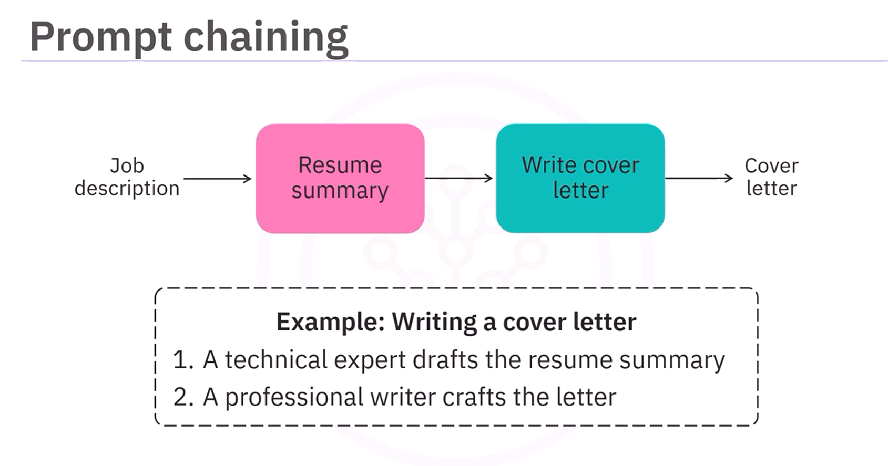

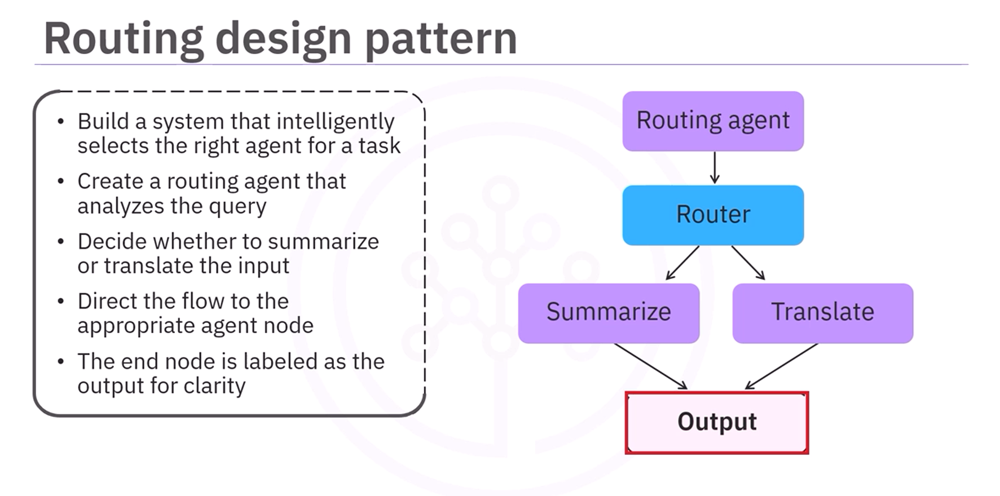

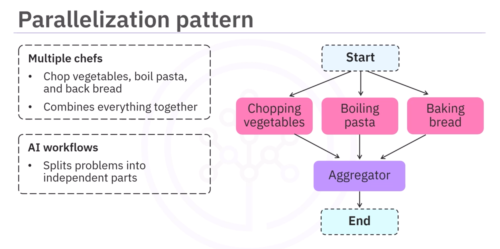

| Aspect | Sequential (Prompt Chaining) | Routing | Parallelization |
| --- | --- | --- | --- |
| Core idea | One agent's output becomes the next agent's input | A router agent decides which workflow branch to execute | Independent tasks run simultaneously, then outputs are merged |
| Execution flow | Linear pipeline | Conditional branching | Fan-out --> aggregation |
| Example | Job description --> resume summary --> cover letter | Input classified as **translate** or **summarize**, then routed accordingly | English text translated in parallel into French, Spanish, Japanese, then merged |
| State contents | Intermediate outputs from each stage (`job_description`, `resume_summary`, `cover_letter`) | Input, routing decision, final output (`user_input`, `task_type`, `output`) | Shared input, per-task outputs, merged result (`text`, `french`, `spanish`, `japanese`, `combined_output`) |
| LangGraph mechanism | `START`/node/`END` edges with `add_edge(...)` | `add_conditional_edges(...)` from a router node | Static fan-out with multiple edges, or dynamic fan-out with `Send(...)` + reducer |
| Main benefit | Simplicity, modularity, easier debugging, task specialization | Dynamic task selection and flexible branching | Speed, concurrency, improved throughput |
| Best use cases | Multi-step reasoning, staged content generation, document workflows | Intent classification, assistants with multiple capabilities, decision trees | Concurrent processing, ensemble workflows, multi-output generation |

```python
# Shared setup for the examples below.
# Requires: pip install -U langchain langchain-openai langgraph
from langchain.chat_models import init_chat_model

llm = init_chat_model(model="gpt-5.4", model_provider="openai", temperature=0)


# --- 1. Sequential / prompt chaining with LangGraph
# Flow: job_description -> resume_summary -> cover_letter

from typing import TypedDict
from langgraph.graph import START, END, StateGraph

class ChainState(TypedDict):
    job_description: str
    resume_summary: str
    cover_letter: str

def generate_resume_summary(state: ChainState) -> dict:
    prompt = f"""
    You're a resume assistant. Read the following job description and summarize
    the key qualifications and experience the ideal candidate should have.

    Job Description:
    {state["job_description"]}
    """
    response = llm.invoke(prompt)
    return {"resume_summary": response.content.strip()}

def generate_cover_letter(state: ChainState) -> dict:
    prompt = f"""
    You're a professional cover letter writer.

    Use the job description and resume summary to write a tailored cover letter.

    Job Description:
    {state["job_description"]}

    Resume Summary:
    {state["resume_summary"]}
    """
    response = llm.invoke(prompt)
    return {"cover_letter": response.content.strip()}

workflow = StateGraph(ChainState)

workflow.add_node("resume_summary", generate_resume_summary)
workflow.add_node("cover_letter", generate_cover_letter)

workflow.add_edge(START, "resume_summary")
workflow.add_edge("resume_summary", "cover_letter")
workflow.add_edge("cover_letter", END)

app = workflow.compile()

result = app.invoke({
    "job_description": "We need a Python ML engineer with API and cloud experience.",
})

print(result["resume_summary"])
print(result["cover_letter"])


# --- 2. Routing with LangGraph
# Flow: router -> summarize OR translate -> END

# Routing with LangGraph + Pydantic schema
# Flow: router -> summarize OR translate -> END

from typing import Literal, TypedDict
from pydantic import BaseModel, Field
from langgraph.graph import START, END, StateGraph

class RouterState(TypedDict):
    user_input: str
    task_type: str
    output: str

class RouteDecision(BaseModel):
    task_type: Literal["summarize", "translate"] = Field(
        ...,
        description="Decide whether the user wants summarization or translation."
    )

# Use LangChain structured output so the model returns a validated object.
router_llm = llm.with_structured_output(RouteDecision)

def router_node(state: RouterState) -> dict:
    decision = router_llm.invoke(
        f"Classify the task as either summarize or translate: {state['user_input']}"
    )
    return {"task_type": decision.task_type}

def route_task(state: RouterState) -> Literal["summarize", "translate"]:
    return state["task_type"]

def summarize_node(state: RouterState) -> dict:
    response = llm.invoke(f"Summarize this text:\n\n{state['user_input']}")
    return {"output": response.content.strip()}

def translate_node(state: RouterState) -> dict:
    response = llm.invoke(f"Translate this text to Spanish:\n\n{state['user_input']}")
    return {"output": response.content.strip()}

workflow = StateGraph(RouterState)

workflow.add_node("router", router_node)
workflow.add_node("summarize", summarize_node)
workflow.add_node("translate", translate_node)

workflow.add_edge(START, "router")
workflow.add_conditional_edges(
    "router",
    route_task,
    {
        "summarize": "summarize",
        "translate": "translate",
    },
)

workflow.add_edge("summarize", END)
workflow.add_edge("translate", END)

app = workflow.compile()


# --- 3. Parallelization with LangGraph
# Flow: START -> french/spanish/japanese in parallel -> aggregator -> END

from typing import TypedDict
from langgraph.graph import StateGraph, START, END

class ParallelState(TypedDict):
    text: str
    french: str
    spanish: str
    japanese: str
    combined_output: str

def translate_french(state: ParallelState) -> dict:
    response = llm.invoke(f"Translate to French:\n\n{state['text']}")
    return {"french": response.content.strip()}

def translate_spanish(state: ParallelState) -> dict:
    response = llm.invoke(f"Translate to Spanish:\n\n{state['text']}")
    return {"spanish": response.content.strip()}

def translate_japanese(state: ParallelState) -> dict:
    response = llm.invoke(f"Translate to Japanese:\n\n{state['text']}")
    return {"japanese": response.content.strip()}

def aggregate_translations(state: ParallelState) -> dict:
    return {
        "combined_output": (
            f"French: {state['french']}\n"
            f"Spanish: {state['spanish']}\n"
            f"Japanese: {state['japanese']}"
        )
    }

workflow = StateGraph(ParallelState)

workflow.add_node("french", translate_french)
workflow.add_node("spanish", translate_spanish)
workflow.add_node("japanese", translate_japanese)
workflow.add_node("aggregate", aggregate_translations)

workflow.add_edge(START, "french")
workflow.add_edge(START, "spanish")
workflow.add_edge(START, "japanese")

workflow.add_edge("french", "aggregate")
workflow.add_edge("spanish", "aggregate")
workflow.add_edge("japanese", "aggregate")

workflow.add_edge("aggregate", END)

app = workflow.compile()

result = app.invoke({
    "text": "Hello, how are you?",
})

print(result["combined_output"])


# --- 4. Dynamic parallelization with Send
# Flow: START -> many translate jobs -> END
# Use Send when the number of parallel branches is only known at runtime.
# A conditional edge can return a list of Send("node_name", branch_state) objects.
# LangGraph schedules one execution of the target node for each Send object.
# Each branch can receive branch-specific state instead of the full graph state.
# If many branches write to the same key, use a reducer such as operator.add
# so LangGraph knows how to merge the branch outputs.
# This is map-reduce style fan-out/fan-in: map each language to one translation
# job, then reduce all returned translations into one list.

import operator
from typing import Annotated, TypedDict
from langgraph.graph import START, END, StateGraph
from langgraph.types import Send

class DynamicParallelState(TypedDict):
    text: str
    languages: list[str]
    translations: Annotated[list[str], operator.add]

class TranslationJob(TypedDict):
    text: str
    language: str

def fan_out_translations(state: DynamicParallelState) -> list[Send]:
    return [
        Send("translate_one", {"text": state["text"], "language": language})
        for language in state["languages"]
    ]

def translate_one(state: TranslationJob) -> dict:
    response = llm.invoke(f"Translate to {state['language']}:\n\n{state['text']}")
    return {"translations": [f"{state['language']}: {response.content.strip()}"]}

workflow = StateGraph(DynamicParallelState)
workflow.add_node("translate_one", translate_one)
workflow.add_conditional_edges(START, fan_out_translations)
workflow.add_edge("translate_one", END)

app = workflow.compile()

result = app.invoke({
    "text": "Hello, how are you?",
    "languages": ["French", "Spanish", "Japanese"],
})

print("\n".join(result["translations"]))
```

#### Orchestrator Design Pattern

* The orchestrator pattern is designed for **dynamic workflows** where the number and type of tasks are not known in advance, unlike static sequential/routing/parallel workflows.
* Core idea:
  * a central **orchestrator agent** analyzes the request
  * decomposes it into subtasks (aka. sections in the example)
  * dynamically creates worker assignments
  * workers execute tasks in parallel
  * a **synthesizer** combines all outputs into one final result
* Analogy:
  * like a head chef receiving a complex dinner request
  * the head chef decides how many specialist chefs are needed
  * each chef prepares one dish in parallel
  * the final meal guide combines all dishes
* Core components:
  * **orchestrator node**
    * receives the original request
    * breaks it into structured work packages
    * outputs a list of task objects
  * **assign workers node**
    * reads the orchestrator output
    * dynamically spawns workers using `Send`
    * routes one task object per worker
  * **worker nodes**
    * specialized agents processing individual subtasks
    * operate in parallel
    * produce partial outputs
  * **synthesizer node**
    * aggregates all worker outputs
    * produces the unified final response
* State management:
  * uses two state containers:
    * **shared state**
      * global workflow context
      * original request
      * task list
      * accumulated worker outputs
      * final synthesized result
    * **worker state**
      * branch-specific context for each worker
      * individual assigned task details
      * can be smaller than the full shared state
  * nodes should return partial state updates rather than mutating the state object in place
  * shared aggregation can use reducers such as `Annotated[list[T], operator.add]` to merge worker outputs automatically
  * `Send("worker", branch_state)` lets each worker receive a custom state payload while still writing updates back to the parent graph state
* Workflow execution:
  * user submits a complex request
  * orchestrator uses an LLM with structured output to decompose it into typed subtasks
  * assigner dynamically creates parallel worker executions with `Send`
  * each worker receives its own structured task
  * each worker invokes an LLM to solve its subproblem
  * results are merged into shared output storage through the reducer
  * synthesizer merges all outputs into the final response
* Key LangGraph concepts:
  * `StateGraph` for workflow definition
  * `START` and `END` for graph entry/exit
  * `Send` from `langgraph.types` for dynamic worker spawning
  * `add_conditional_edges(...)` for dynamic fan-out
  * partial state updates returned from node functions
  * reducers for automatic aggregation of worker outputs
* Benefits:
  * handles unknown task complexity
  * dynamically scales worker count
  * parallel execution improves performance
  * modular worker specialization
  * adaptable runtime decomposition
  * suitable for large, unpredictable tasks
* Best use cases:
  * research decomposition
  * document analysis
  * report generation
  * multi-step enterprise workflows
  * planning systems
  * any task requiring dynamic decomposition

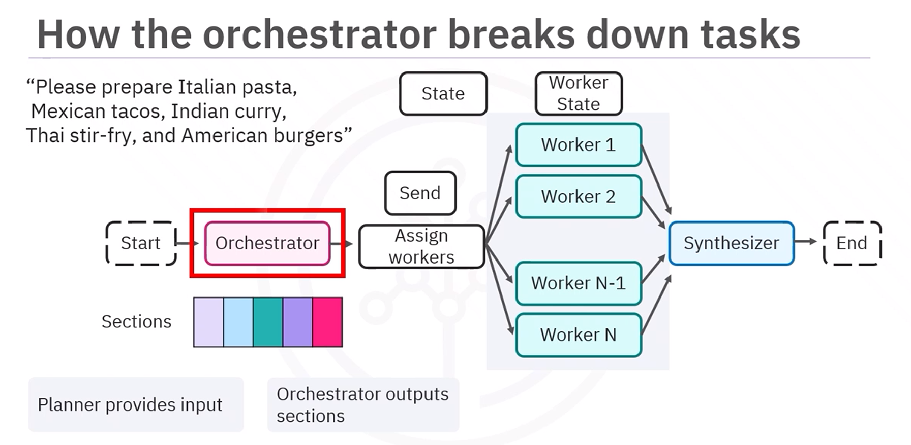

```python
# Orchestrator pattern with LangGraph
# Flow:
# START -> orchestrator -> dynamically spawned workers -> synthesizer -> END

import operator
from typing import Annotated, TypedDict

from langchain.chat_models import init_chat_model
from pydantic import BaseModel, Field
from langgraph.graph import StateGraph, START, END
from langgraph.types import Send

llm = init_chat_model(model="gpt-5.4", model_provider="openai", temperature=0)

# Section in the example
class Task(TypedDict):
    name: str
    description: str

class TaskSpec(BaseModel):
    name: str = Field(description="Short task name.")
    description: str = Field(description="Specific work the worker should complete.")

class TaskPlan(BaseModel):
    tasks: list[TaskSpec] = Field(
        ...,
        description="Independent tasks that can be completed in parallel."
    )

class MainState(TypedDict):
    request: str
    tasks: list[Task]
    completed_outputs: Annotated[list[str], operator.add]
    final_result: str

class WorkerState(TypedDict):
    task: Task

planner_llm = llm.with_structured_output(TaskPlan)

def orchestrator(state: MainState) -> dict:
    prompt = f"""
    Break this request into independent tasks:

    {state["request"]}
    """
    plan = planner_llm.invoke(prompt)
    return {"tasks": [task.model_dump() for task in plan.tasks]}

def assign_workers(state: MainState) -> list[Send]:
    # dynamically spawn one worker per task
    return [
        Send("worker", {"task": task})
        for task in state["tasks"]
    ]

def worker(state: WorkerState) -> dict:
    prompt = f"""
    Solve this task:

    {state["task"]["description"]}
    """
    response = llm.invoke(prompt)

    return {
        "completed_outputs": [response.content.strip()]
    }

def synthesizer(state: MainState) -> dict:
    combined = "\n\n---\n\n".join(state["completed_outputs"])

    prompt = f"""
    Combine these partial outputs into one final response:

    {combined}
    """
    response = llm.invoke(prompt)

    return {
        "final_result": response.content
    }

workflow = StateGraph(MainState)

workflow.add_node("orchestrator", orchestrator)
workflow.add_node("worker", worker)
workflow.add_node("synthesizer", synthesizer)

workflow.add_edge(START, "orchestrator")

workflow.add_conditional_edges(
    "orchestrator",
    assign_workers
)

workflow.add_edge("worker", "synthesizer")
workflow.add_edge("synthesizer", END)

app = workflow.compile()

result = app.invoke({
    "request": "Create a report about AI trends in healthcare and finance",
})

print(result["final_result"])
```

Comparison with previous patterns:

| Pattern         | Task (work section) count known beforehand? | Dynamic routing? | Parallel workers? |
| --------------- | ---------------------------: | ---------------: | ----------------: |
| Sequential      |                          Yes |               No |                No |
| Routing         |                          Yes |              Yes |                No |
| Parallelization |                          Yes |               No |               Yes |
| Orchestrator    |                           No |              Yes |               Yes |


#### Evaluator-Optimizer Design Pattern

* The Evaluator-Optimizer pattern iteratively improves an output until it meets target criteria.
  * generator LLM creates an initial answer
  * evaluator LLM grades/critiques it
  * if rejected, feedback is passed back to the generator
  * loop continues until accepted or max iterations are reached
* Example: multi-agent investment advisor.
  * investor profile is provided as input
  * grading LLM assigns a target risk grade
  * Kathy Wood persona generates an initial high-growth investment plan
  * Warren Buffett persona evaluates the plan conservatively and returns a risk grade + feedback
  * Ray Dalio persona revises the plan using evaluator feedback
  * workflow stops when current risk grade matches target grade or iteration limit is reached
* State variables track:
  * `investor_profile`: user profile
  * `target_grade`: desired risk level
  * `investment_plan`: generated/revised plan
  * `current_grade`: evaluator-assigned risk level
  * `feedback`: evaluator critique
  * `iterations`: refinement count
* Core nodes:
  * risk grading node: determines target risk grade from investor profile using structured output
  * generator node: creates or revises investment plan
  * evaluator node: grades plan and produces structured feedback
  * router function: decides whether to end or loop back to the generator
* Key LangGraph / LangChain concepts:
  * `StateGraph` models the loop explicitly.
  * `START` and `END` define graph entry and exit.
  * Nodes return partial state updates as dictionaries.
  * `llm.with_structured_output(...)` replaces ad hoc parsing or tool-call extraction for evaluator decisions.
  * `add_conditional_edges(...)` routes either to `END` or back to the generator.
* Key idea:
  * the pattern combines generation, evaluation, feedback, and routing into a reflection loop

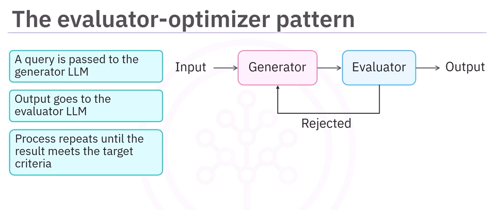

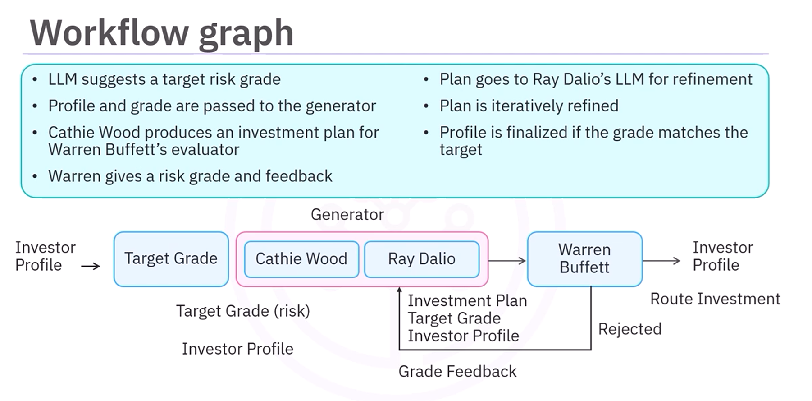


```python
from typing import Literal, TypedDict

from langchain.chat_models import init_chat_model
from pydantic import BaseModel, Field
from langgraph.graph import START, END, StateGraph

llm = init_chat_model(model="gpt-5.4", model_provider="openai", temperature=0)

RiskGrade = Literal[
    "ultra_conservative",
    "conservative",
    "moderate",
    "growth",
    "high_risk",
]

class InvestmentState(TypedDict):
    investor_profile: str
    target_grade: str
    investment_plan: str
    current_grade: str
    feedback: str
    iterations: int

class RiskProfile(BaseModel):
    grade: RiskGrade = Field(..., description="Target risk grade for the investor.")

class Evaluation(BaseModel):
    grade: RiskGrade = Field(..., description="Risk grade of the investment plan.")
    feedback: str = Field(..., description="Feedback explaining how to improve the plan.")

MAX_ITERATIONS = 3

risk_grader_llm = llm.with_structured_output(RiskProfile)
evaluator_llm = llm.with_structured_output(Evaluation)

def grade_risk_node(state: InvestmentState) -> dict:
    prompt = f"""
    Classify this investor profile into one risk grade:
    ultra_conservative, conservative, moderate, growth, high_risk.

    Investor profile:
    {state["investor_profile"]}
    """
    result = risk_grader_llm.invoke(prompt)
    return {"target_grade": result.grade}

def generate_plan_node(state: InvestmentState) -> dict:
    # First draft uses Kathy Wood persona; revisions use Ray Dalio persona + evaluator feedback.
    if state.get("feedback"):
        prompt = f"""
        You are Ray Dalio. Revise the investment plan using the feedback.

        Investor profile:
        {state["investor_profile"]}

        Target risk grade:
        {state["target_grade"]}

        Previous plan:
        {state["investment_plan"]}

        Evaluator feedback:
        {state["feedback"]}
        """
    else:
        prompt = f"""
        You are Kathy Wood. Create an innovation-driven investment plan.

        Investor profile:
        {state["investor_profile"]}

        Target risk grade:
        {state["target_grade"]}
        """
    response = llm.invoke(prompt)
    return {"investment_plan": response.content.strip()}

def evaluate_plan_node(state: InvestmentState) -> dict:
    prompt = f"""
    You are Warren Buffett. Evaluate this investment plan conservatively.
    Focus on capital preservation, fundamentals, and risk alignment.

    Investor profile:
    {state["investor_profile"]}

    Target risk grade:
    {state["target_grade"]}

    Investment plan:
    {state["investment_plan"]}
    """
    result = evaluator_llm.invoke(prompt)
    return {
        "current_grade": result.grade,
        "feedback": result.feedback,
        "iterations": state["iterations"] + 1,
    }

def route_investment(state: InvestmentState) -> Literal["accepted", "rejected"]:
    # Accept if risk matches target or max iterations reached; otherwise revise.
    if state["current_grade"] == state["target_grade"]:
        return "accepted"
    if state["iterations"] >= MAX_ITERATIONS:
        return "accepted"
    return "rejected"

workflow = StateGraph(InvestmentState)

workflow.add_node("grade_risk", grade_risk_node)
workflow.add_node("generate_plan", generate_plan_node)
workflow.add_node("evaluate_plan", evaluate_plan_node)

workflow.add_edge(START, "grade_risk")
workflow.add_edge("grade_risk", "generate_plan")
workflow.add_edge("generate_plan", "evaluate_plan")

workflow.add_conditional_edges(
    "evaluate_plan",
    route_investment,
    {
        "accepted": END,
        "rejected": "generate_plan",
    },
)

app = workflow.compile()

result = app.invoke({
    "investor_profile": "45-year-old investor, medium income, retirement in 20 years, wants growth but dislikes large losses.",
    "iterations": 0,
})

print(result["investment_plan"])
print(result["current_grade"])
print(result["feedback"])
```


#### Exercise: Prompt Chaining, Routing and Parallelization Patterns in LangGraph

Notebook: [`lab/01_design-patterns-v1.ipynb`](./lab/01_design-patterns-v1.ipynb)

* The notebook implements three core LangGraph workflow patterns with current LangChain/LangGraph APIs: sequential/prompt chaining, routing, and parallelization.
* Setup loads environment variables from `.env` with `load_dotenv()`, then uses OpenAI through `init_chat_model(model="gpt-5.4", model_provider="openai", temperature=0)`.
* Prompt chaining builds a job-application assistant where `resume_summary` runs first and `cover_letter` runs second through explicit `START -> node -> node -> END` edges.
* Routing uses `llm.with_structured_output(...)` with a Pydantic schema to classify user input as `summarize` or `translate`, then `add_conditional_edges(...)` dispatches to the correct node.
* Parallelization fans out from `START` to French, Spanish, and Japanese translation nodes, then uses `add_edge([node_a, node_b, node_c], "aggregator")` so the aggregator waits for all branches.
* The completed exercises extend routing into a multi-service assistant with branches for ride hailing, restaurant orders, groceries, and a default handler.
* The exercise solutions define the state/schema, implement all service handler nodes, assemble the graph, and run representative test cases.
* All nodes return partial state updates as dictionaries; the notebook avoids older `set_entry_point(...)`, `set_finish_point(...)`, and `bind_tools(...)` patterns.

Summary code from the notebook:

```python
# %% Cell 1
from typing import Literal, TypedDict

from dotenv import load_dotenv
from langchain.chat_models import init_chat_model
from pydantic import BaseModel, Field
from langgraph.graph import START, END, StateGraph

load_dotenv()

llm = init_chat_model(model="gpt-5.4", model_provider="openai", temperature=0)


# %% Cell 2
def show_graph(app):
    """Display a graph visualization when notebook rendering support is available."""
    try:
        from IPython.display import Image, display

        display(Image(app.get_graph().draw_mermaid_png()))
    except Exception as exc:
        print(f"Graph visualization skipped: {exc}")


# %% Cell 3
class ChainState(TypedDict):
    job_description: str
    resume_summary: str
    cover_letter: str


def generate_resume_summary(state: ChainState) -> dict:
    prompt = f"""
    You're a resume assistant. Read the job description and summarize the key
    qualifications and experience the ideal candidate should have.

    Job Description:
    {state["job_description"]}
    """
    response = llm.invoke(prompt)
    return {"resume_summary": response.content.strip()}


def generate_cover_letter(state: ChainState) -> dict:
    prompt = f"""
    You're a professional cover letter writer. Use the job description and
    resume summary to write a tailored cover letter.

    Job Description:
    {state["job_description"]}

    Resume Summary:
    {state["resume_summary"]}
    """
    response = llm.invoke(prompt)
    return {"cover_letter": response.content.strip()}


# %% Cell 4
prompt_chain = StateGraph(ChainState)
prompt_chain.add_node("resume_summary", generate_resume_summary)
prompt_chain.add_node("cover_letter", generate_cover_letter)

prompt_chain.add_edge(START, "resume_summary")
prompt_chain.add_edge("resume_summary", "cover_letter")
prompt_chain.add_edge("cover_letter", END)

prompt_chain_app = prompt_chain.compile()
show_graph(prompt_chain_app)


# %% Cell 5
chain_result = prompt_chain_app.invoke({
    "job_description": (
        "We are looking for a data scientist with experience in machine learning, "
        "NLP, Python, large datasets, and production model deployment."
    )
})

print(chain_result["resume_summary"])
print("\n--- COVER LETTER ---\n")
print(chain_result["cover_letter"])


# %% Cell 6
class RouterState(TypedDict):
    user_input: str
    task_type: str
    output: str


class RouteDecision(BaseModel):
    task_type: Literal["summarize", "translate"] = Field(
        description="Route to summarize for summaries, or translate for French translation."
    )


router_llm = llm.with_structured_output(RouteDecision)


def router_node(state: RouterState) -> dict:
    decision = router_llm.invoke(
        f"Classify the user request as summarize or translate: {state['user_input']}"
    )
    return {"task_type": decision.task_type}


def route_task(state: RouterState) -> Literal["summarize", "translate"]:
    return state["task_type"]


def summarize_node(state: RouterState) -> dict:
    response = llm.invoke(f"Summarize this text:\n\n{state['user_input']}")
    return {"output": response.content.strip()}


def translate_node(state: RouterState) -> dict:
    response = llm.invoke(f"Translate this text to French:\n\n{state['user_input']}")
    return {"output": response.content.strip()}


# %% Cell 7
routing_graph = StateGraph(RouterState)
routing_graph.add_node("router", router_node)
routing_graph.add_node("summarize", summarize_node)
routing_graph.add_node("translate", translate_node)

routing_graph.add_edge(START, "router")
routing_graph.add_conditional_edges(
    "router",
    route_task,
    {
        "summarize": "summarize",
        "translate": "translate",
    },
)
routing_graph.add_edge("summarize", END)
routing_graph.add_edge("translate", END)

routing_app = routing_graph.compile()
show_graph(routing_app)


# %% Cell 8
for user_input in [
    "Can you translate this sentence: I love programming?",
    "Can you summarize this sentence: I love programming so much that it is all I want to do?",
]:
    result = routing_app.invoke({"user_input": user_input})
    print(f"Input: {user_input}")
    print(f"Route: {result['task_type']}")
    print(f"Output: {result['output']}\n")


# %% Cell 9
class TranslationState(TypedDict):
    text: str
    french: str
    spanish: str
    japanese: str
    combined_output: str


def translate_french(state: TranslationState) -> dict:
    response = llm.invoke(f"Translate to French:\n\n{state['text']}")
    return {"french": response.content.strip()}


def translate_spanish(state: TranslationState) -> dict:
    response = llm.invoke(f"Translate to Spanish:\n\n{state['text']}")
    return {"spanish": response.content.strip()}


def translate_japanese(state: TranslationState) -> dict:
    response = llm.invoke(f"Translate to Japanese:\n\n{state['text']}")
    return {"japanese": response.content.strip()}


def aggregate_translations(state: TranslationState) -> dict:
    combined = (
        f"Original Text: {state['text']}\n\n"
        f"French: {state['french']}\n\n"
        f"Spanish: {state['spanish']}\n\n"
        f"Japanese: {state['japanese']}"
    )
    return {"combined_output": combined}


# %% Cell 10
parallel_graph = StateGraph(TranslationState)
parallel_graph.add_node("translate_french", translate_french)
parallel_graph.add_node("translate_spanish", translate_spanish)
parallel_graph.add_node("translate_japanese", translate_japanese)
parallel_graph.add_node("aggregator", aggregate_translations)

parallel_graph.add_edge(START, "translate_french")
parallel_graph.add_edge(START, "translate_spanish")
parallel_graph.add_edge(START, "translate_japanese")
parallel_graph.add_edge(
    ["translate_french", "translate_spanish", "translate_japanese"],
    "aggregator",
)
parallel_graph.add_edge("aggregator", END)

parallel_app = parallel_graph.compile()
show_graph(parallel_app)


# %% Cell 11
parallel_result = parallel_app.invoke({
    "text": "Good morning! I hope you have a wonderful day."
})

print(parallel_result["combined_output"])


# %% Cell 12
class ServiceRouterState(TypedDict):
    user_input: str
    task_type: str
    output: str


ServiceRoute = Literal[
    "ride_hailing_call",
    "restaurant_order",
    "groceries",
    "default_handler",
]


class ServiceRouteDecision(BaseModel):
    task_type: ServiceRoute = Field(
        description="Classify the request into the best matching service branch."
    )


service_router_llm = llm.with_structured_output(ServiceRouteDecision)


def service_router_node(state: ServiceRouterState) -> dict:
    decision = service_router_llm.invoke(
        "Classify this request as ride_hailing_call, restaurant_order, "
        f"groceries, or default_handler:\n\n{state['user_input']}"
    )
    return {"task_type": decision.task_type}


def route_service(state: ServiceRouterState) -> ServiceRoute:
    return state["task_type"]


# %% Cell 13
def ride_hailing_node(state: ServiceRouterState) -> dict:
    prompt = f"""
    You are a ride hailing assistant. Extract pickup, destination, timing,
    ride preferences, and special requirements from this request:

    {state["user_input"]}
    """
    response = llm.invoke(prompt)
    return {"output": response.content.strip()}


def restaurant_order_node(state: ServiceRouterState) -> dict:
    prompt = f"""
    You are a restaurant ordering assistant. Extract food items, quantities,
    delivery or pickup details, and missing information from this request:

    {state["user_input"]}
    """
    response = llm.invoke(prompt)
    return {"output": response.content.strip()}


def groceries_node(state: ServiceRouterState) -> dict:
    prompt = f"""
    You are a grocery assistant. Organize this request into a clear shopping list
    and note any missing quantities or preferences:

    {state["user_input"]}
    """
    response = llm.invoke(prompt)
    return {"output": response.content.strip()}


def default_handler_node(state: ServiceRouterState) -> dict:
    response = llm.invoke(
        "Politely explain that this assistant handles rides, restaurant orders, "
        f"and groceries. User request:\n\n{state['user_input']}"
    )
    return {"output": response.content.strip()}


# %% Cell 14
service_graph = StateGraph(ServiceRouterState)
service_graph.add_node("router", service_router_node)
service_graph.add_node("ride_hailing_call", ride_hailing_node)
service_graph.add_node("restaurant_order", restaurant_order_node)
service_graph.add_node("groceries", groceries_node)
service_graph.add_node("default_handler", default_handler_node)

service_graph.add_edge(START, "router")
service_graph.add_conditional_edges(
    "router",
    route_service,
    {
        "ride_hailing_call": "ride_hailing_call",
        "restaurant_order": "restaurant_order",
        "groceries": "groceries",
        "default_handler": "default_handler",
    },
)
service_graph.add_edge("ride_hailing_call", END)
service_graph.add_edge("restaurant_order", END)
service_graph.add_edge("groceries", END)
service_graph.add_edge("default_handler", END)

service_app = service_graph.compile()
show_graph(service_app)


# %% Cell 15
test_cases = [
    "I need a ride from downtown to the airport at 3pm.",
    "I want to order 2 large pepperoni pizzas for delivery.",
    "I need milk, bread, eggs, and vegetables for the week.",
    "What's the weather like today?",
]

for user_input in test_cases:
    result = service_app.invoke({"user_input": user_input})
    print(f"Question: {user_input}")
    print(f"Route: {result['task_type']}")
    print(f"Output: {result['output']}")
    print("-" * 80)
```

#### Exercise: Orchestration and Evaluation Patterns in LangGraph

Notebook: [`lab/02_Agentic_Design_Patterns_in_LangGraph-v1.ipynb`](./lab/02_Agentic_Design_Patterns_in_LangGraph-v1.ipynb)

* The notebook implements two completed agentic design patterns with current LangChain/LangGraph APIs: orchestration-worker and evaluator-optimizer.
* Setup loads environment variables from `.env` with `load_dotenv()`, then initializes OpenAI with `init_chat_model(model="gpt-5.4", model_provider="openai", temperature=0)`.
* The orchestrator-worker exercise builds a meal planning workflow where an orchestrator produces structured dish tasks with `llm.with_structured_output(...)`.
* Dynamic worker fan-out uses `Send` from `langgraph.types`; each chef worker receives branch-specific state for one dish.
* Worker outputs are merged with `Annotated[list[str], operator.add]`, then a synthesizer combines the parallel results into `final_meal_guide`.
* The evaluator-optimizer exercise builds an investment-plan reflection loop with a target-risk classifier, generator, evaluator, and conditional router.
* Structured Pydantic outputs are used for both risk-profile classification and investment-plan evaluation.
* The loop uses `add_conditional_edges(...)` to either end at `END` or route back to the generator until the grade matches or the iteration limit is reached.
* All graph nodes return partial state updates as dictionaries; the notebook avoids older pinned install cells, direct `ChatOpenAI` setup, `set_entry_point(...)`, `set_finish_point(...)`, and tool-call parsing patterns.

Summary code from the notebook:

```python
# %% Cell 1
import operator
from typing import Annotated, Literal, TypedDict

from dotenv import load_dotenv
from langchain.chat_models import init_chat_model
from langgraph.graph import START, END, StateGraph
from langgraph.types import Send
from pydantic import BaseModel, Field

load_dotenv()

llm = init_chat_model(model="gpt-5.4", model_provider="openai", temperature=0)


# %% Cell 2
def show_graph(app):
    """Display a Mermaid graph when notebook rendering support is available."""
    try:
        from IPython.display import Image, display

        display(Image(app.get_graph().draw_mermaid_png()))
    except Exception as exc:
        print(f"Graph visualization skipped: {exc}")


# %% Cell 3
class DishTask(BaseModel):
    name: str = Field(description="Name of the dish to prepare.")
    cuisine: str = Field(description="Cuisine or cultural origin of the dish.")
    ingredients: list[str] = Field(description="Ingredients needed for the dish.")


class MealPlan(BaseModel):
    dishes: list[DishTask] = Field(
        description="Independent dish tasks that can be assigned to chef workers."
    )


class MealState(TypedDict):
    request: str
    dishes: list[dict]
    completed_menu: Annotated[list[str], operator.add]
    final_meal_guide: str


class ChefWorkerState(TypedDict):
    dish: dict


meal_planner_llm = llm.with_structured_output(MealPlan)


# %% Cell 4
def orchestrator(state: MealState) -> dict:
    plan = meal_planner_llm.invoke(
        "Break this meal request into independent dishes. For each dish, "
        "include a cuisine and ingredient list.\n\n"
        f"Meal request: {state['request']}"
    )
    return {"dishes": [dish.model_dump() for dish in plan.dishes]}


def assign_workers(state: MealState) -> list[Send]:
    return [Send("chef_worker", {"dish": dish}) for dish in state["dishes"]]


def chef_worker(state: ChefWorkerState) -> dict:
    dish = state["dish"]
    response = llm.invoke(
        f"""
        You are a world-class chef specializing in {dish['cuisine']} cuisine.
        Create a practical cooking guide for this dish.

        Dish: {dish['name']}
        Ingredients: {', '.join(dish['ingredients'])}

        Include preparation steps, cooking guidance, and serving notes.
        """
    )
    return {"completed_menu": [response.content.strip()]}


def synthesize_menu(state: MealState) -> dict:
    guide = "\n\n---\n\n".join(state["completed_menu"])
    return {"final_meal_guide": guide}


# %% Cell 5
meal_graph = StateGraph(MealState)
meal_graph.add_node("orchestrator", orchestrator)
meal_graph.add_node("chef_worker", chef_worker)
meal_graph.add_node("synthesizer", synthesize_menu)

meal_graph.add_edge(START, "orchestrator")
meal_graph.add_conditional_edges("orchestrator", assign_workers)
meal_graph.add_edge("chef_worker", "synthesizer")
meal_graph.add_edge("synthesizer", END)

meal_app = meal_graph.compile()
show_graph(meal_app)


# %% Cell 6
meal_result = meal_app.invoke({
    "request": "Plan a dinner with spaghetti bolognese, chicken stir fry, and carrot cake."
})

print(meal_result["final_meal_guide"][:2000])


# %% Cell 7
RiskGrade = Literal[
    "ultra_conservative",
    "conservative",
    "moderate",
    "growth",
    "high_risk",
]


class InvestmentState(TypedDict):
    investor_profile: str
    target_grade: RiskGrade
    investment_plan: str
    current_grade: RiskGrade
    feedback: str
    iterations: int


class RiskProfile(BaseModel):
    grade: RiskGrade = Field(description="Target risk grade for the investor profile.")


class InvestmentEvaluation(BaseModel):
    grade: RiskGrade = Field(description="Risk grade assigned to the investment plan.")
    feedback: str = Field(description="Specific feedback for improving risk alignment.")


MAX_ITERATIONS = 3
risk_profile_llm = llm.with_structured_output(RiskProfile)
investment_evaluator_llm = llm.with_structured_output(InvestmentEvaluation)


# %% Cell 8
def determine_target_grade(state: InvestmentState) -> dict:
    result = risk_profile_llm.invoke(
        "Classify this investor profile into one risk grade: "
        "ultra_conservative, conservative, moderate, growth, or high_risk.\n\n"
        f"Investor profile: {state['investor_profile']}"
    )
    return {"target_grade": result.grade}


def generate_investment_plan(state: InvestmentState) -> dict:
    if state.get("feedback"):
        prompt = f"""
        You are a diversified, risk-aware investment strategist. Revise the plan
        using the evaluator feedback while targeting this risk grade: {state['target_grade']}.

        Investor profile:
        {state['investor_profile']}

        Previous plan:
        {state['investment_plan']}

        Evaluator feedback:
        {state['feedback']}
        """
    else:
        prompt = f"""
        You are a growth-oriented investment strategist. Create an initial plan
        for the investor below while respecting the target risk grade: {state['target_grade']}.

        Investor profile:
        {state['investor_profile']}
        """

    response = llm.invoke(prompt)
    return {"investment_plan": response.content.strip()}


def evaluate_investment_plan(state: InvestmentState) -> dict:
    result = investment_evaluator_llm.invoke(
        f"""
        Evaluate this investment plan against the investor profile and target risk grade.
        Return a risk grade and concrete feedback.

        Investor profile:
        {state['investor_profile']}

        Target risk grade:
        {state['target_grade']}

        Investment plan:
        {state['investment_plan']}
        """
    )
    return {
        "current_grade": result.grade,
        "feedback": result.feedback,
        "iterations": state.get("iterations", 0) + 1,
    }


def route_investment(state: InvestmentState) -> Literal["accepted", "revise"]:
    if state["current_grade"] == state["target_grade"]:
        return "accepted"
    if state["iterations"] >= MAX_ITERATIONS:
        return "accepted"
    return "revise"


# %% Cell 9
optimizer_graph = StateGraph(InvestmentState)
optimizer_graph.add_node("determine_target_grade", determine_target_grade)
optimizer_graph.add_node("generate_plan", generate_investment_plan)
optimizer_graph.add_node("evaluate_plan", evaluate_investment_plan)

optimizer_graph.add_edge(START, "determine_target_grade")
optimizer_graph.add_edge("determine_target_grade", "generate_plan")
optimizer_graph.add_edge("generate_plan", "evaluate_plan")
optimizer_graph.add_conditional_edges(
    "evaluate_plan",
    route_investment,
    {
        "accepted": END,
        "revise": "generate_plan",
    },
)

optimizer_app = optimizer_graph.compile()
show_graph(optimizer_app)


# %% Cell 10
investment_result = optimizer_app.invoke({
    "investor_profile": (
        "Age: 29\n"
        "Salary: $110,000\n"
        "Assets: $40,000\n"
        "Goal: Achieve financial independence by age 45\n"
        "Risk tolerance: High"
    ),
    "iterations": 0,
})

print("Target grade:", investment_result["target_grade"])
print("Final grade:", investment_result["current_grade"])
print("Iterations:", investment_result["iterations"])
print("\nFeedback:\n", investment_result["feedback"])
print("\nFinal investment plan:\n", investment_result["investment_plan"])
```

### Summary and Cheat Sheet: Agentic Frameworks and LangGraph Design Patterns

* Agentic design patterns are reusable workflow structures for coordinating LLM calls, tools, agents, and deterministic logic.
* LangGraph is well suited for these patterns because the workflow is represented explicitly as a graph:
  * **state** carries shared context between nodes
  * **nodes** do work and return partial state updates
  * **edges** define fixed transitions
  * **conditional edges** define runtime routing, loops, and dynamic fan-out
  * **reducers** define how concurrent updates to the same state key are merged
* Current LangGraph examples should prefer:
  * `StateGraph(...)` for graph construction
  * `START` and `END` for entry/exit
  * `add_edge(...)` for fixed transitions and fan-in
  * `add_conditional_edges(...)` for routers, loops, and `Send(...)` fan-out
  * `Send` from `langgraph.types` for runtime-created worker branches
  * node functions that return partial dictionaries instead of mutating state in place
* Current LangChain examples should prefer:
  * `init_chat_model(..., model_provider="openai")` for model initialization
  * `llm.with_structured_output(PydanticModel)` for schema-constrained model output
  * `.env` loading with `python-dotenv` when credentials are stored locally

#### Framework Setup

```python
from dotenv import load_dotenv
from langchain.chat_models import init_chat_model

load_dotenv()

llm = init_chat_model(
    model="gpt-5.4",
    model_provider="openai",
    temperature=0,
)
```

#### Core LangGraph Building Blocks

| Component | Current API | Purpose |
| --- | --- | --- |
| State schema | `TypedDict` | Defines the graph's shared data contract |
| Node | `builder.add_node("name", fn)` | Executes one processing step and returns partial state updates |
| Fixed edge | `builder.add_edge("a", "b")` | Moves execution from one node to the next |
| Entry edge | `builder.add_edge(START, "node")` | Starts the graph |
| Exit edge | `builder.add_edge("node", END)` | Ends the graph |
| Conditional edge | `builder.add_conditional_edges(...)` | Routes based on runtime state |
| Static fan-out | multiple `add_edge(START, ...)` calls | Starts known parallel branches |
| Fan-in | `add_edge(["a", "b"], "join")` | Waits for multiple nodes before continuing |
| Dynamic fan-out | return `list[Send]` from a conditional edge | Creates worker branches at runtime |
| Reducer | `Annotated[list[T], operator.add]` | Merges parallel updates to the same key |
| Compile | `builder.compile()` | Produces an executable graph |
| Invoke | `graph.invoke(input_state)` | Runs the graph |

#### Structured Output

* Use structured output when a downstream node depends on an LLM decision or parsed fields.
* This is preferred over free-form parsing or manual extraction from tool calls for routing/evaluation examples.

```python
from typing import Literal
from pydantic import BaseModel, Field

class RouteDecision(BaseModel):
    task_type: Literal["summarize", "translate"] = Field(
        description="The workflow branch to run next."
    )

router_llm = llm.with_structured_output(RouteDecision)

decision = router_llm.invoke("Classify this request: translate hello to French")
print(decision.task_type)
```

#### State And Node Functions

* State is the contract between graph nodes.
* A node should read the state and return only the fields it updates.
* LangGraph merges those partial updates into the current state.

```python
from typing import TypedDict

class State(TypedDict):
    input_text: str
    output_text: str


def worker_node(state: State) -> dict:
    response = llm.invoke(f"Rewrite this clearly:\n\n{state['input_text']}")
    return {"output_text": response.content.strip()}
```

#### Minimal Graph

```python
from langgraph.graph import START, END, StateGraph

builder = StateGraph(State)
builder.add_node("worker", worker_node)
builder.add_edge(START, "worker")
builder.add_edge("worker", END)

graph = builder.compile()
result = graph.invoke({"input_text": "Make this easier to read."})
print(result["output_text"])
```

#### Pattern Cheat Sheet

| Pattern | Use When | LangGraph Mechanism |
| --- | --- | --- |
| Prompt chaining / sequential | Steps are known and ordered | `START -> node_a -> node_b -> END` |
| Routing | One branch should run based on input/state | `add_conditional_edges(router, route_fn, path_map)` |
| Static parallelization | Branch count is known beforehand | Multiple edges from `START`, then fan-in with `add_edge([...], "join")` |
| Dynamic parallelization | Branch count is known only at runtime | conditional edge returns `Send(...)` objects |
| Orchestrator-worker | An LLM decomposes work into runtime tasks | orchestrator node + `Send` workers + reducer + synthesizer |
| Evaluator-optimizer | Output should improve through feedback | generator -> evaluator -> conditional loop |

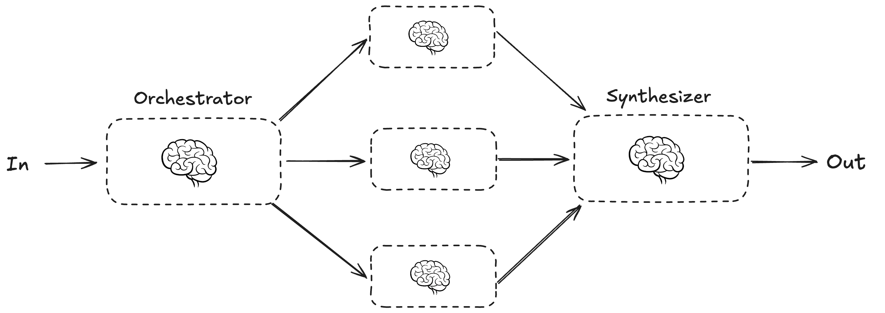

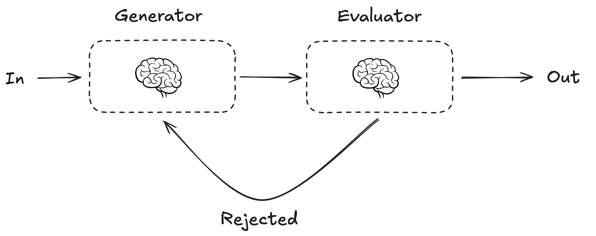

#### Sequential Pattern

```python
class ChainState(TypedDict):
    topic: str
    outline: str
    draft: str


def outline_node(state: ChainState) -> dict:
    response = llm.invoke(f"Create an outline for: {state['topic']}")
    return {"outline": response.content.strip()}


def draft_node(state: ChainState) -> dict:
    response = llm.invoke(f"Write a short draft from this outline:\n\n{state['outline']}")
    return {"draft": response.content.strip()}

builder = StateGraph(ChainState)
builder.add_node("outline", outline_node)
builder.add_node("draft", draft_node)
builder.add_edge(START, "outline")
builder.add_edge("outline", "draft")
builder.add_edge("draft", END)
chain = builder.compile()
```

#### Routing Pattern

```python
from typing import Literal

class RouterState(TypedDict):
    user_input: str
    task_type: str
    output: str

class RouterDecision(BaseModel):
    task_type: Literal["summarize", "translate"]

router_llm = llm.with_structured_output(RouterDecision)


def router_node(state: RouterState) -> dict:
    decision = router_llm.invoke(f"Route this request: {state['user_input']}")
    return {"task_type": decision.task_type}


def route_task(state: RouterState) -> Literal["summarize", "translate"]:
    return state["task_type"]

builder = StateGraph(RouterState)
builder.add_node("router", router_node)
builder.add_node("summarize", lambda state: {"output": "summary"})
builder.add_node("translate", lambda state: {"output": "translation"})
builder.add_edge(START, "router")
builder.add_conditional_edges(
    "router",
    route_task,
    {"summarize": "summarize", "translate": "translate"},
)
builder.add_edge("summarize", END)
builder.add_edge("translate", END)
routing_graph = builder.compile()
```

#### Static Parallelization Pattern

```python
class ParallelState(TypedDict):
    text: str
    french: str
    spanish: str
    combined: str


def french_node(state: ParallelState) -> dict:
    return {"french": llm.invoke(f"Translate to French: {state['text']}").content.strip()}


def spanish_node(state: ParallelState) -> dict:
    return {"spanish": llm.invoke(f"Translate to Spanish:\n\n{state['text']}").content.strip()}


def join_node(state: ParallelState) -> dict:
    return {"combined": f"French: {state['french']}\nSpanish: {state['spanish']}"}

builder = StateGraph(ParallelState)
builder.add_node("french", french_node)
builder.add_node("spanish", spanish_node)
builder.add_node("join", join_node)
builder.add_edge(START, "french")
builder.add_edge(START, "spanish")
builder.add_edge(["french", "spanish"], "join")
builder.add_edge("join", END)
parallel_graph = builder.compile()
```

#### Dynamic Fan-Out With Send

```python
import operator
from typing import Annotated
from langgraph.types import Send

class DynamicState(TypedDict):
    subjects: list[str]
    jokes: Annotated[list[str], operator.add]

class JokeState(TypedDict):
    subject: str


def fan_out(state: DynamicState) -> list[Send]:
    return [Send("write_joke", {"subject": subject}) for subject in state["subjects"]]


def write_joke(state: JokeState) -> dict:
    return {"jokes": [llm.invoke(f"Write one joke about {state['subject']}").content.strip()]}

builder = StateGraph(DynamicState)
builder.add_node("write_joke", write_joke)
builder.add_conditional_edges(START, fan_out)
builder.add_edge("write_joke", END)
dynamic_graph = builder.compile()
```

#### Evaluator-Optimizer Loop

```python
class EvalState(TypedDict):
    request: str
    draft: str
    feedback: str
    accepted: bool
    iterations: int

class Evaluation(BaseModel):
    accepted: bool
    feedback: str

review_llm = llm.with_structured_output(Evaluation)
MAX_ITERATIONS = 3


def generate(state: EvalState) -> dict:
    prompt = f"Request: {state['request']}\nFeedback: {state.get('feedback', '')}"
    response = llm.invoke(f"Create or revise the answer.\n\n{prompt}")
    return {"draft": response.content.strip()}


def evaluate(state: EvalState) -> dict:
    result = review_llm.invoke(f"Evaluate this draft:\n\n{state['draft']}")
    return {
        "accepted": result.accepted,
        "feedback": result.feedback,
        "iterations": state.get("iterations", 0) + 1,
    }


def route_eval(state: EvalState) -> Literal["done", "revise"]:
    if state["accepted"] or state["iterations"] >= MAX_ITERATIONS:
        return "done"
    return "revise"

builder = StateGraph(EvalState)
builder.add_node("generate", generate)
builder.add_node("evaluate", evaluate)
builder.add_edge(START, "generate")
builder.add_edge("generate", "evaluate")
builder.add_conditional_edges(
    "evaluate",
    route_eval,
    {"done": END, "revise": "generate"},
)
optimizer_graph = builder.compile()
```

#### Visualization

```python
from IPython.display import Image, display

display(Image(graph.get_graph().draw_mermaid_png()))
```

#### Key Takeaway

* Use prompt chaining for known ordered steps.
* Use routing when the next step depends on classification or state.
* Use static parallelization when the branch set is known.
* Use `Send` when the branch set is generated at runtime.
* Use reducers when parallel branches write to the same state key.
* Use evaluator-optimizer loops when quality needs iterative feedback.
* Keep graph state typed, node returns partial, and LLM decisions structured.

## 2. CrewAI Fundamentals and Advanced Applications

### Introduction to CrewAI

#### Crew Core Concepts and Architecture

* CrewAI is a framework for building collaborative multi-agent AI workflows.
  * A **crew** is a team of agents working together on one objective.
  * An **agent** defines who does the work: role, goal, backstory, tools, and LLM.
  * A **task** defines what work should be done and what output is expected.
  * A **tool** lets an agent interact with external systems such as search, files, APIs, or databases. Can be used by agents or tasks.
  * A **process** defines how tasks run, such as sequential execution or hierarchical management.
* CrewAI is best suited when you want a role-based team abstraction rather than low-level graph control.
  * Use CrewAI for research/reporting pipelines, content workflows, delegated analysis, and role-based collaboration.
  * Use LangGraph when you need explicit state-machine control, custom routing, durable execution, or fine-grained graph logic.
* The core runtime pattern is:
  * define one or more `Agent` objects
  * define one or more `Task` objects and assign each task to an agent
  * assemble a `Crew` with agents, tasks, and a `Process`
  * run the crew with `crew.kickoff(inputs={...})`
  * inspect `result.raw`, `result.tasks_output`, and `result.token_usage`
* Current CrewAI LLM configuration uses the `LLM` class or a provider/model string.
  * OpenAI models use provider-prefixed names such as `openai/gpt-4o`.
  * `OPENAI_API_KEY` can be loaded from the environment.
  * Tools such as `SerperDevTool` may require their own keys, for example `SERPER_API_KEY`.
* Sequential crews run tasks in order.
  * Later tasks can use earlier task outputs as context.
  * You can make that dependency explicit with `context=[previous_task]`.
* Hierarchical crews are also supported.
  * A manager coordinates task assignment and review.
  * This is useful when work should be delegated more dynamically.

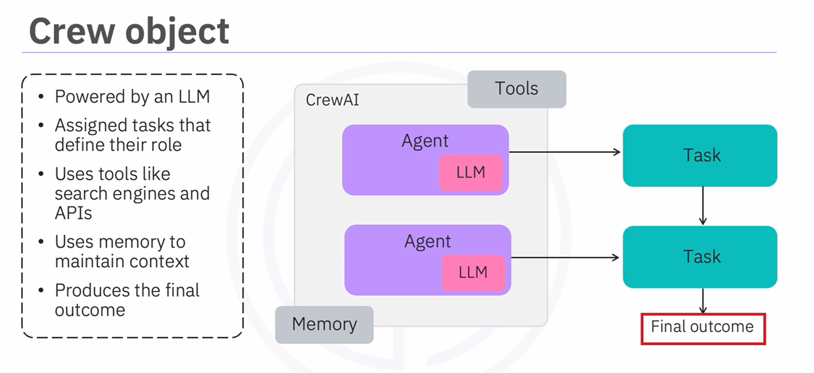

```python
from dotenv import load_dotenv
from crewai import Agent, Crew, LLM, Process, Task
from crewai_tools import SerperDevTool

load_dotenv()

# OPENAI_API_KEY is read from the environment.
# SERPER_API_KEY is also required if you use SerperDevTool.
llm = LLM(
    model="openai/gpt-4o",
    temperature=0.2,
)

# https://serper.dev/
# Google Search API
# Other options:
# from crewai_tools import TavilySearchTool
# from crewai_tools import BraveWebSearchTool, BraveNewsSearchTool
search_tool = SerperDevTool()

researcher = Agent(
    role="Senior Research Analyst",
    goal="Find accurate, current, and useful insights about {topic}",
    backstory=(
        "You are an experienced technology research analyst. You are careful "
        "with sources, good at identifying trends, and concise in your summaries."
    ),
    llm=llm,
    tools=[search_tool],
    verbose=True,
    allow_delegation=False,
)

writer = Agent(
    role="Technology Content Strategist",
    goal="Turn research findings into clear, engaging, executive-ready content",
    backstory=(
        "You are a skilled technical writer who explains complex topics in a "
        "practical, accessible way for business and engineering audiences."
    ),
    llm=llm,
    verbose=True,
    allow_delegation=False,
)

research_task = Task(
    description=(
        "Research the latest important developments about {topic}. Focus on "
        "what changed recently, why it matters, and concrete examples."
    ),
    expected_output=(
        "A concise research brief with key findings, examples, source-aware "
        "observations, and practical implications."
    ),
    agent=researcher,
)

writing_task = Task(
    description=(
        "Using the research brief, write a polished short article about {topic}. "
        "Make it clear, structured, and useful for a technical business audience."
    ),
    expected_output=(
        "A well-structured article with a clear title, short introduction, "
        "3-5 key sections, and a concise conclusion."
    ),
    agent=writer,
    context=[research_task],
)

content_crew = Crew(
    agents=[researcher, writer],
    tasks=[research_task, writing_task],
    process=Process.sequential,
    verbose=True,
)

result = content_crew.kickoff(
    inputs={"topic": "generative AI breakthroughs"}
)

print("Final answer:")
print(result.raw)

print("\nTask outputs:")
for task_output in result.tasks_output:
    print(task_output)
    print("-" * 80)

print("\nToken usage:")
print(result.token_usage)


```

#### Exercise: Building a CrewAI Workflow

Notebook: [`lab/03_CrewAI-101-v1.ipynb`](./lab/03_CrewAI-101-v1.ipynb).

* The notebook builds a current CrewAI content workflow using OpenAI models, dotenv, and Tavily search.
* Setup loads `.env` with `load_dotenv()`, initializes `LLM(model="openai/gpt-4o")`, and creates a `TavilySearchTool`.
* The workflow defines three agents: a research analyst, a technology content strategist, and a social media strategist.
* The research agent uses Tavily search to gather current information about the input topic.
* The writer task uses `context=[research_task]` so the article is grounded in the research output.
* The social task uses `context=[writer_task]` to generate LinkedIn and X/Twitter-ready posts.
* The crew runs with `Process.sequential`, so the tasks execute as research -> writing -> social content.
* The notebook inspects `result.raw`, `result.tasks_output`, and `result.token_usage`.
* The original exercises are included and completed explicitly at the end: create the social media agent, create its task, then assemble and run the complete crew.
* Tavily may offer free/trial usage, but CrewAI's `TavilySearchTool` normally expects `TAVILY_API_KEY` in the environment.

Summary code from the notebook:

```python
# %% Cell 1
from dotenv import load_dotenv
from crewai import Agent, Crew, LLM, Process, Task
from crewai_tools import TavilySearchTool

load_dotenv()

# SWITCH OFF CrewAI's OpenTelemetry (OTEL) data gathering!
import os
os.environ["OTEL_SDK_DISABLED"] = "true"

# %% Cell 2
llm = LLM(
    model="openai/gpt-4o",
    temperature=0.2,
)

search_tool = TavilySearchTool()


# %% Cell 3
research_agent = Agent(
    role="Senior Research Analyst",
    goal="Find current, accurate, source-aware insights about {topic}",
    backstory=(
        "You are an experienced technology researcher. You identify relevant "
        "developments, separate signal from hype, and summarize findings clearly."
    ),
    llm=llm,
    tools=[search_tool],
    verbose=True,
    allow_delegation=False,
)

writer_agent = Agent(
    role="Technology Content Strategist",
    goal="Turn research findings into clear, useful, engaging long-form content",
    backstory=(
        "You are a technical content strategist who explains complex topics for "
        "business and engineering audiences without losing important nuance."
    ),
    llm=llm,
    verbose=True,
    allow_delegation=False,
)

social_agent = Agent(
    role="Social Media Strategist",
    goal="Create concise platform-ready posts that amplify the article's main ideas",
    backstory=(
        "You are a digital storyteller who turns long-form technical content into "
        "clear, engaging LinkedIn and X/Twitter posts."
    ),
    llm=llm,
    verbose=True,
    allow_delegation=False,
)


# %% Cell 4
research_task = Task(
    description=(
        "Research the latest important developments about {topic}. Use Tavily "
        "search to find current information. Focus on concrete examples, trends, "
        "and practical implications."
    ),
    expected_output=(
        "A concise research brief with key findings, recent examples, relevant "
        "source-aware observations, and practical implications."
    ),
    agent=research_agent,
)

writer_task = Task(
    description=(
        "Using the research brief, write a polished short article about {topic}. "
        "Make it clear, structured, and useful for a technical business audience."
    ),
    expected_output=(
        "A well-structured article with a clear title, short introduction, 3-5 "
        "key sections, and a concise conclusion."
    ),
    agent=writer_agent,
    context=[research_task],
)

social_task = Task(
    description=(
        "Using the final article, create platform-ready social media content about {topic}. "
        "Include 2 LinkedIn post options and 3 short X/Twitter-style posts."
    ),
    expected_output=(
        "Two LinkedIn posts and three short X/Twitter posts with clear hooks, "
        "practical takeaways, and no unsupported claims."
    ),
    agent=social_agent,
    context=[writer_task],
)


# %% Cell 5
content_crew = Crew(
    agents=[research_agent, writer_agent, social_agent],
    tasks=[research_task, writer_task, social_task],
    process=Process.sequential,
    verbose=True,
)


# %% Cell 6
result = content_crew.kickoff(
    inputs={"topic": "latest generative AI breakthroughs"}
)

print("Final output:\n")
print(result.raw)


# %% Cell 7
print("Task outputs:\n")
for index, task_output in enumerate(result.tasks_output, start=1):
    print(f"Task {index}: {task_output.description}")
    print(task_output.raw)
    print("-" * 80)

print("Token usage:")
print(result.token_usage)


# %% Cell 8
exercise_social_agent = Agent(
    role="Social Media Strategist",
    goal="Generate engaging social media snippets based on the final article about {topic}",
    backstory=(
        "You are a digital storyteller who turns long-form technical content into "
        "clear, engaging LinkedIn and X/Twitter posts that drive readers back to "
        "the full article."
    ),
    llm=llm,
    verbose=True,
    allow_delegation=False,
)


# %% Cell 9
exercise_social_task = Task(
    description=(
        "Summarize the article about {topic} into platform-ready social media content. "
        "Create 2 LinkedIn post options and 3 concise X/Twitter-style posts. "
        "Keep the tone professional, useful, and grounded in the article."
    ),
    expected_output=(
        "Two LinkedIn post options and three X/Twitter-style posts with clear hooks, "
        "practical takeaways, and no unsupported claims."
    ),
    agent=exercise_social_agent,
    context=[writer_task],
)


# %% Cell 10
exercise_crew = Crew(
    agents=[research_agent, writer_agent, exercise_social_agent],
    tasks=[research_task, writer_task, exercise_social_task],
    process=Process.sequential,
    verbose=True,
)

exercise_result = exercise_crew.kickoff(
    inputs={"topic": "latest generative AI breakthroughs"}
)

print("Exercise final output:\n")
print(exercise_result.raw)
```

### Structured Outputs in CrewAI

#### CrewAI Structured Outputs, YAML and CrewBase

* The video explains how to build a multi-agent meal planning system with CrewAI.
* The workflow combines several CrewAI features:
  * Structured outputs with Pydantic.
  * YAML-based agent and task definitions.
  * `@CrewBase` classes.
  * Sequential multi-agent execution.
  * Shared LLM usage.
  * External tools such as Tavily web search.
* The meal planning system uses five specialized agents:
  * A meal planner.
  * A shopping organizer.
  * A budget advisor.
  * A leftovers manager.
  * A summary agent.
* Each agent has a clear responsibility.
  * The meal planner finds recipes based on dietary needs and budget.
  * The shopping organizer converts meal ingredients into a structured shopping list.
  * The budget advisor checks whether the plan stays within budget and suggests savings.
  * The leftovers manager suggests ways to reuse leftover ingredients.
  * The summary agent combines all previous outputs into a final meal planning guide.
* The agents run sequentially.
  * The output of one task becomes context for the next task.
  * This allows the workflow to build progressively:
    * Meal planning.
    * Shopping organization.
    * Budget checking.
    * Leftover planning.
    * Final summary.
* A shared LLM powers all agents.
  * In this updated example, the workflow uses OpenAI through CrewAI's `LLM` class.
  * The same LLM is passed to each agent.
  * This keeps reasoning consistent across the workflow.
* Pydantic is used to enforce structured outputs.
  * This ensures that agents return clean, validated, reusable data.
  * Structured outputs are important because later agents depend on earlier outputs.
  * Instead of passing unstructured text, agents exchange typed objects.
* The main Pydantic models are:
  * `GroceryItem`.
  * `MealPlan`.
  * `ShoppingCategory`.
  * `GroceryShoppingPlan`.
* `GroceryItem` represents a single item in the shopping list.
  * It includes:
    * Item name.
    * Quantity.
    * Estimated price.
    * Store category.
* `MealPlan` represents a complete meal.
  * It includes:
    * Meal name.
    * Cooking difficulty.
    * Number of servings.
    * Ingredients.
* `ShoppingCategory` groups grocery items by store section.
  * For example:
    * Produce.
    * Meat.
    * Dairy.
    * Pantry.
  * It also includes a total estimated cost for that section.
* `GroceryShoppingPlan` combines the complete shopping and meal plan.
  * It includes:
    * Total budget.
    * A list of meal plans.
    * Shopping categories.
    * Shopping tips.
  * It provides a structured view of recipes, ingredients, store navigation, and budget tracking.
* Some agents use tools.
  * The meal planner uses Tavily web search to find current recipe ideas.
  * The budget advisor uses Tavily web search to estimate prices and savings ideas.
  * The shopping organizer does not need external tools because it works from the meal plan context.
* Tasks can specify structured outputs.
  * The meal planning task uses `output_pydantic=MealPlan`.
  * The shopping organizer task uses `output_pydantic=GroceryShoppingPlan`.
  * This forces the LLM output into predefined Pydantic schemas.
* Outputs can be saved to files.
  * Shopping-related outputs can be saved as `.json`.
  * The budget guide or final guide can be saved as `.md`.
  * The format depends on the needs of the task.
* YAML is introduced to separate configuration from Python code.
  * Instead of defining every agent and task directly in Python, agents and tasks can be described in YAML files.
  * This makes the system easier to update.
  * You can change an agent’s role, goal, backstory, or task description without editing Python logic.
  * The main advantage is separation of concerns:
    * YAML stores prompt-like configuration that changes often.
    * Python stores reusable orchestration logic, tools, structured-output schemas, and custom behavior.
  * YAML is useful when non-engineers may tune agent/task wording, when prompts need review, or when the same crew structure should run with different configurations.
  * YAML is not required for small notebooks or quick experiments; direct Python definitions are usually simpler there.
* The leftovers agent is defined using YAML.
  * The YAML file contains the agent’s role, goal, and backstory.
  * Another YAML entry defines the leftover task.
  * This demonstrates how CrewAI can load components from configuration files.
* `@CrewBase` is used to connect YAML configuration with Python.
  * A class marked with `@CrewBase` becomes a crew container.
  * CrewAI decorators such as `@agent`, `@task`, and `@crew` define the components.
  * Methods decorated with `@agent` or `@task` return valid CrewAI objects.
  * CrewBase can automatically locate the config folder.
  * The decorators also let CrewAI collect agents and tasks automatically, so the final `@crew` method can assemble `self.agents` and `self.tasks`.
  * This pattern is helpful for larger projects because it keeps the crew definition organized, reusable, and closer to the structure generated by CrewAI project scaffolding.
* In Jupyter Notebook, the CrewBase class should be defined in a separate Python file.
  * Then it can be imported into the notebook.
  * This avoids issues with how CrewBase loads configuration.
* The final workflow creates a complete grocery crew.
  * It can combine agents defined in Python and agents defined in YAML; the code below uses a Python-first version for notebook readability.
  * It runs all tasks sequentially.
  * It starts with `.kickoff()` and user inputs such as dietary needs, budget, and preferences.
  * The final result is a complete meal planning guide.
* The main takeaway is that CrewAI can combine:
  * Multi-agent workflows.
  * Structured outputs.
  * Tool usage.
  * YAML configuration.
  * Reusable CrewBase classes when YAML-based configuration is useful.
  * Sequential execution.
  * Final report generation.

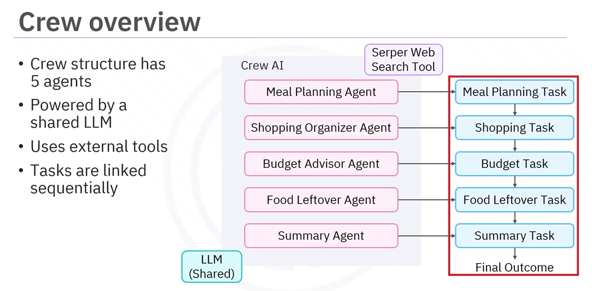

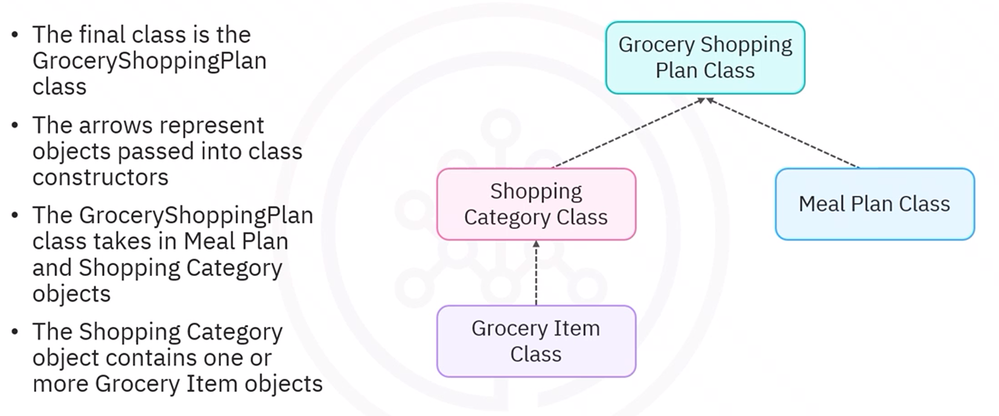

Python-first version for notebooks and quick experiments:

```python
from typing import List

from dotenv import load_dotenv
from pydantic import BaseModel, Field

from crewai import Agent, Crew, LLM, Process, Task
from crewai_tools import TavilySearchTool

load_dotenv()

# OPENAI_API_KEY is read from the environment.
# TavilySearchTool normally expects TAVILY_API_KEY in the environment.
llm = LLM(
    model="openai/gpt-4o",
    temperature=0.2,
)

search_tool = TavilySearchTool()


# ============================================================
# 1. Define Pydantic structured output models
# ============================================================

class GroceryItem(BaseModel):
    """One item in a grocery list."""

    name: str = Field(description="Name of the grocery item.")
    quantity: str = Field(description="Amount needed, including units when useful.")
    estimated_price: float = Field(description="Estimated item price.")
    store_category: str = Field(description="Store section, such as Produce or Pantry.")


class MealPlan(BaseModel):
    """One planned meal."""

    meal_name: str = Field(description="Name of the meal.")
    cooking_difficulty: str = Field(description="Easy, medium, or advanced.")
    servings: int = Field(description="Number of servings.")
    ingredients: List[GroceryItem] = Field(description="Ingredients required for the meal.")


class ShoppingCategory(BaseModel):
    """A store section containing related grocery items."""

    section_name: str = Field(description="Store section name.")
    items: List[GroceryItem] = Field(description="Items in this store section.")
    total_estimated_cost: float = Field(description="Estimated cost for this section.")


class GroceryShoppingPlan(BaseModel):
    """Complete structured shopping plan."""

    total_budget: float = Field(description="User budget as a number.")
    meal_plans: List[MealPlan] = Field(description="Meals included in the plan.")
    shopping_categories: List[ShoppingCategory] = Field(description="Items grouped by store section.")
    shopping_tips: List[str] = Field(description="Practical budget and shopping tips.")


# ============================================================
# 2. Define agents
# ============================================================

meal_planner = Agent(
    role="Meal Planner",
    goal="Create realistic meals matching the user's budget, servings, diet, and preferences",
    backstory=(
        "You are an expert meal planner who designs affordable, practical, "
        "balanced meals for busy households."
    ),
    llm=llm,
    tools=[search_tool],
    verbose=True,
    allow_delegation=False,
)

shopping_organizer = Agent(
    role="Shopping Organizer",
    goal="Convert meal ingredients into a categorized, budget-aware grocery plan",
    backstory=(
        "You are highly organized and know how to group groceries by store section "
        "to make shopping faster and easier."
    ),
    llm=llm,
    verbose=True,
    allow_delegation=False,
)

budget_advisor = Agent(
    role="Budget Advisor",
    goal="Check whether the shopping plan fits the budget and suggest savings",
    backstory=(
        "You are a practical household budget advisor who reduces grocery costs "
        "without sacrificing nutrition or quality."
    ),
    llm=llm,
    tools=[search_tool],
    verbose=True,
    allow_delegation=False,
)

summary_agent = Agent(
    role="Meal Planning Summary Writer",
    goal="Compile meal, shopping, and budget details into one usable guide",
    backstory="You create clear, practical household planning guides.",
    llm=llm,
    verbose=True,
    allow_delegation=False,
)


# ============================================================
# 3. Define structured-output tasks
# ============================================================

meal_planning_task = Task(
    description=(
        "Create a meal plan from these inputs:\n"
        "- Dietary needs: {dietary_needs}\n"
        "- Budget: {budget}\n"
        "- Number of servings: {servings}\n"
        "- Food preferences: {food_preferences}\n\n"
        "Use Tavily search if useful for current recipe ideas."
    ),
    expected_output=(
        "A structured meal plan with a meal name, difficulty, servings, "
        "and grocery ingredients."
    ),
    agent=meal_planner,
    output_pydantic=MealPlan,
    output_file="meal_plan.json",
)

shopping_task = Task(
    description=(
        "Using the meal plan, create a structured grocery shopping plan. "
        "Group items by store section, estimate costs, and include practical shopping tips."
    ),
    expected_output="A complete structured grocery shopping plan.",
    agent=shopping_organizer,
    context=[meal_planning_task],
    output_pydantic=GroceryShoppingPlan,
    output_file="shopping_list.json",
)

budget_task = Task(
    description=(
        "Analyze whether the meal plan and grocery shopping plan fit the budget of {budget}. "
        "Use Tavily search if useful for current savings ideas or price context. "
        "Suggest substitutions and practical cost-saving changes."
    ),
    expected_output="A markdown budget analysis with estimated costs and savings recommendations.",
    agent=budget_advisor,
    context=[meal_planning_task, shopping_task],
    output_file="shopping_budget_guide.md",
)

summary_task = Task(
    description=(
        "Create a complete meal planning guide using the meal plan, shopping list, "
        "and budget analysis."
    ),
    expected_output="A complete, well-structured meal planning guide in markdown format.",
    agent=summary_agent,
    context=[meal_planning_task, shopping_task, budget_task],
    output_file="final_meal_planning_guide.md",
)


# ============================================================
# 4. Assemble and run the crew
# ============================================================

meal_planning_crew = Crew(
    agents=[meal_planner, shopping_organizer, budget_advisor, summary_agent],
    tasks=[meal_planning_task, shopping_task, budget_task, summary_task],
    process=Process.sequential,
    verbose=True,
)

result = meal_planning_crew.kickoff(
    inputs={
        "dietary_needs": "high-protein, no shellfish",
        "budget": "60 euros",
        "servings": 4,
        "food_preferences": "Mediterranean and easy weeknight meals",
    }
)

print("Final meal planning guide:")
print(result.raw)

print("\nIndividual task outputs:")
for task_output in result.tasks_output:
    print(task_output)
    print("-" * 80)

print("\nToken usage:")
print(result.token_usage)
```

CrewBase/decorator version for a project layout:

```python
# ============================================================
# 5. Optional CrewBase/decorator version for YAML configuration
# ============================================================
# In a real project, put this class in a Python module such as crew.py,
# and put agent/task configuration in config/agents.yaml and config/tasks.yaml.
# The decorators connect YAML configuration to Python objects.

from crewai.agents.agent_builder.base_agent import BaseAgent
from crewai.project import CrewBase, agent, crew, task


@CrewBase
class MealPlanningCrew:
    """Meal planning crew configured with CrewAI decorators."""

    agents: List[BaseAgent]
    tasks: List[Task]

    agents_config = "config/agents.yaml"
    tasks_config = "config/tasks.yaml"

    @agent
    def meal_planner(self) -> Agent:
        return Agent(
            config=self.agents_config["meal_planner"],  # type: ignore[index]
            llm=llm,
            tools=[search_tool],
            verbose=True,
        )

    @agent
    def shopping_organizer(self) -> Agent:
        return Agent(
            config=self.agents_config["shopping_organizer"],  # type: ignore[index]
            llm=llm,
            verbose=True,
        )

    @agent
    def budget_advisor(self) -> Agent:
        return Agent(
            config=self.agents_config["budget_advisor"],  # type: ignore[index]
            llm=llm,
            tools=[search_tool],
            verbose=True,
        )

    @agent
    def summary_agent(self) -> Agent:
        return Agent(
            config=self.agents_config["summary_agent"],  # type: ignore[index]
            llm=llm,
            verbose=True,
        )

    @task
    def meal_planning_task(self) -> Task:
        return Task(
            config=self.tasks_config["meal_planning_task"],  # type: ignore[index]
            output_pydantic=MealPlan,
            output_file="meal_plan.json",
        )

    @task
    def shopping_task(self) -> Task:
        return Task(
            config=self.tasks_config["shopping_task"],  # type: ignore[index]
            output_pydantic=GroceryShoppingPlan,
            output_file="shopping_list.json",
        )

    @task
    def budget_task(self) -> Task:
        return Task(
            config=self.tasks_config["budget_task"],  # type: ignore[index]
            output_file="shopping_budget_guide.md",
        )

    @task
    def summary_task(self) -> Task:
        return Task(
            config=self.tasks_config["summary_task"],  # type: ignore[index]
            output_file="final_meal_planning_guide.md",
        )

    @crew
    def crew(self) -> Crew:
        return Crew(
            agents=self.agents,
            tasks=self.tasks,
            process=Process.sequential,
            verbose=True,
        )


# Example usage when config/agents.yaml and config/tasks.yaml exist:
# decorated_result = MealPlanningCrew().crew().kickoff(
#     inputs={
#         "dietary_needs": "high-protein, no shellfish",
#         "budget": "60 euros",
#         "servings": 4,
#         "food_preferences": "Mediterranean and easy weeknight meals",
#     }
# )
```

YAML configuration used by the `CrewBase` example:

```yaml
# config/agents.yaml
meal_planner:
  role: Meal Planner
  goal: Create realistic meals matching the user's budget, servings, diet, and preferences
  backstory: >
    You are an expert meal planner who designs affordable, practical,
    balanced meals for busy households.

shopping_organizer:
  role: Shopping Organizer
  goal: Convert meal ingredients into a categorized, budget-aware grocery plan
  backstory: >
    You are highly organized and know how to group groceries by store section
    to make shopping faster and easier.

budget_advisor:
  role: Budget Advisor
  goal: Check whether the shopping plan fits the budget and suggest savings
  backstory: >
    You are a practical household budget advisor who reduces grocery costs
    without sacrificing nutrition or quality.

summary_agent:
  role: Meal Planning Summary Writer
  goal: Compile meal, shopping, and budget details into one usable guide
  backstory: You create clear, practical household planning guides.
```

```yaml
# config/tasks.yaml
meal_planning_task:
  description: >
    Create a meal plan from these inputs:
    - Dietary needs: {dietary_needs}
    - Budget: {budget}
    - Number of servings: {servings}
    - Food preferences: {food_preferences}

    Use Tavily search if useful for current recipe ideas.
  expected_output: >
    A structured meal plan with a meal name, difficulty, servings,
    and grocery ingredients.
  agent: meal_planner

shopping_task:
  description: >
    Using the meal plan, create a structured grocery shopping plan.
    Group items by store section, estimate costs, and include practical shopping tips.
  expected_output: A complete structured grocery shopping plan.
  agent: shopping_organizer
  context:
    - meal_planning_task

budget_task:
  description: >
    Analyze whether the meal plan and grocery shopping plan fit the budget of {budget}.
    Use Tavily search if useful for current savings ideas or price context.
    Suggest substitutions and practical cost-saving changes.
  expected_output: A markdown budget analysis with estimated costs and savings recommendations.
  agent: budget_advisor
  context:
    - meal_planning_task
    - shopping_task

summary_task:
  description: >
    Create a complete meal planning guide using the meal plan, shopping list,
    and budget analysis.
  expected_output: A complete, well-structured meal planning guide in markdown format.
  agent: summary_agent
  context:
    - meal_planning_task
    - shopping_task
    - budget_task
```

#### Exercise: Meal Planer with Structured Outputs and YAML Configuration

Notebook: [`lab/04_crewai_structured/04_meal_planner_structured.ipynb`](./lab/04_crewai_structured/04_meal_planner_structured.ipynb).

* The notebook builds a structured meal and grocery planning workflow with CrewAI.
* It defines Pydantic schemas for grocery items, meal plans, store sections, complete shopping plans, and weekly meal planning.
* It uses `python-dotenv` to load `OPENAI_API_KEY` and `TAVILY_API_KEY` from `.env`.
* It initializes CrewAI's current `LLM` interface with an OpenAI model: `LLM(model="openai/gpt-4o")`.
* It uses `TavilySearchTool` for current recipe, ingredient, substitution, and budget research.
* It creates a sequential CrewAI workflow with specialized agents:
  * meal planner and recipe researcher
  * shopping organizer
  * budget advisor
  * YAML-backed leftover manager
  * report compiler
* It demonstrates structured task outputs with `output_pydantic`.
* It demonstrates YAML configuration with `@CrewBase`, `@agent`, `@task`, and `@crew`.
* The exercises are completed:
  * a nutrition analyst agent and task are added to the workflow
  * weekly meal planning Pydantic models are implemented and tested

Summary code:

```python
import os
from enum import Enum
from pathlib import Path
from typing import Dict, List, Optional

from crewai import Agent, Crew, LLM, Process, Task
from crewai.agents.agent_builder.base_agent import BaseAgent
from crewai.project import CrewBase, agent, crew, task
from crewai_tools import TavilySearchTool
from dotenv import load_dotenv
from pydantic import BaseModel, Field

load_dotenv()

llm = LLM(model="openai/gpt-4o", temperature=0.2)
search_tool = TavilySearchTool()


class GroceryItem(BaseModel):
    name: str = Field(description="Name of the grocery item")
    quantity: str = Field(description="Quantity needed")
    estimated_price: str = Field(description="Estimated price")
    category: str = Field(description="Store section")


class MealPlan(BaseModel):
    meal_name: str = Field(description="Name of the meal")
    difficulty_level: str = Field(description="'Easy', 'Medium', 'Hard'")
    servings: int = Field(description="Number of people it serves")
    researched_ingredients: List[str] = Field(description="Ingredients found through research")


class ShoppingCategory(BaseModel):
    section_name: str = Field(description="Store section")
    items: List[GroceryItem] = Field(description="Items in this section")
    estimated_total: str = Field(description="Estimated cost for this section")


class GroceryShoppingPlan(BaseModel):
    total_budget: str = Field(description="Total planned budget")
    meal_plans: List[MealPlan] = Field(description="Planned meals")
    shopping_sections: List[ShoppingCategory] = Field(description="Organized by store sections")
    shopping_tips: List[str] = Field(description="Money-saving and efficiency tips")


meal_planner = Agent(
    role="Meal Planner & Recipe Researcher",
    goal="Search for optimal recipes and create detailed meal plans",
    backstory="A skilled meal planner who considers diet, skill level, and budget.",
    tools=[search_tool],
    llm=llm,
    verbose=False,
)

shopping_organizer = Agent(
    role="Shopping Organizer",
    goal="Organize grocery lists by store sections efficiently",
    backstory="An experienced shopper who creates efficient store-ready lists.",
    llm=llm,
    verbose=False,
)

budget_advisor = Agent(
    role="Budget Advisor",
    goal="Provide cost estimates and money-saving tips",
    backstory="A budget-conscious shopper who helps families save money on groceries.",
    tools=[search_tool],
    llm=llm,
    verbose=False,
)

summary_agent = Agent(
    role="Report Compiler",
    goal="Compile comprehensive meal planning reports from all team outputs",
    backstory="A coordinator who turns specialist outputs into one clear guide.",
    llm=llm,
    verbose=False,
)

meal_planning_task = Task(
    description=(
        "Search for the best '{meal_name}' recipe for {servings} people within a {budget} budget. "
        "Consider dietary restrictions: {dietary_restrictions} and cooking skill level: {cooking_skill}."
    ),
    expected_output="A detailed meal plan with researched ingredients and cooking instructions.",
    agent=meal_planner,
    output_pydantic=MealPlan,
    output_file="meals.json",
)

shopping_task = Task(
    description="Organize the ingredients from the '{meal_name}' meal plan into a grocery shopping list.",
    expected_output="An organized shopping list grouped by store sections with quantities and prices.",
    agent=shopping_organizer,
    context=[meal_planning_task],
    output_pydantic=GroceryShoppingPlan,
    output_file="shopping_list.json",
)

budget_task = Task(
    description="Analyze the shopping plan and provide practical money-saving tips.",
    expected_output="A shopping guide with prices, budget analysis, and substitutions.",
    agent=budget_advisor,
    context=[meal_planning_task, shopping_task],
    output_file="shopping_guide.md",
)


@CrewBase
class LeftoversCrew:
    agents: List[BaseAgent]
    tasks: List[Task]

    agents_config = "config/agents.yaml"
    tasks_config = "config/tasks.yaml"

    @agent
    def leftover_manager(self) -> Agent:
        return Agent(
            config=self.agents_config["leftover_manager"],
            tools=[search_tool],
            llm=llm,
            verbose=False,
        )

    @task
    def leftover_task(self) -> Task:
        return Task(
            config=self.tasks_config["leftover_task"],
            agent=self.leftover_manager(),
        )

    @crew
    def crew(self) -> Crew:
        return Crew(
            agents=self.agents,
            tasks=self.tasks,
            process=Process.sequential,
            verbose=True,
        )


leftovers_cb = LeftoversCrew()
yaml_leftover_manager = leftovers_cb.leftover_manager()
yaml_leftover_task = leftovers_cb.leftover_task()
yaml_leftover_task.context = [meal_planning_task, shopping_task, budget_task]

summary_task = Task(
    description="Compile recipe, shopping, budget, and leftover guidance into one meal planning report.",
    expected_output="A complete, user-friendly meal planning guide.",
    agent=summary_agent,
    context=[meal_planning_task, shopping_task, budget_task, yaml_leftover_task],
)

complete_grocery_crew = Crew(
    agents=[meal_planner, shopping_organizer, budget_advisor, yaml_leftover_manager, summary_agent],
    tasks=[meal_planning_task, shopping_task, budget_task, yaml_leftover_task, summary_task],
    process=Process.sequential,
    verbose=True,
)

complete_result = complete_grocery_crew.kickoff(
    inputs={
        "meal_name": "Chicken Stir Fry",
        "servings": 4,
        "budget": "$25",
        "dietary_restrictions": ["no nuts", "low sodium"],
        "cooking_skill": "beginner",
    }
)


# Completed exercise 1: nutrition analyst.
nutrition_analyst = Agent(
    role="Nutrition Analyst & Health Advisor",
    goal="Analyze meal nutritional content and provide healthy recommendations",
    backstory="A nutrition advisor who estimates calories, macros, and healthier substitutions.",
    tools=[search_tool],
    llm=llm,
    verbose=False,
)

nutrition_task = Task(
    description="Analyze nutrition for '{meal_name}' and suggest improvements within {budget}.",
    expected_output="Calorie, macronutrient, and healthier alternative guidance.",
    agent=nutrition_analyst,
    context=[meal_planning_task, shopping_task, budget_task],
    output_file="nutrition_analysis.md",
)


# Completed exercise 2: weekly planning schemas.
class MealType(str, Enum):
    BREAKFAST = "breakfast"
    LUNCH = "lunch"
    DINNER = "dinner"
    SNACK = "snack"


class DailyMeals(BaseModel):
    date: str = Field(description="Date in YYYY-MM-DD format")
    breakfast: Optional[MealPlan] = None
    lunch: Optional[MealPlan] = None
    dinner: Optional[MealPlan] = None
    snacks: Optional[List[MealPlan]] = None


class WeeklyMealPlan(BaseModel):
    week_start_date: str = Field(description="Start date of the week")
    daily_meals: List[DailyMeals] = Field(description="Meals for each day")
    weekly_themes: List[str] = Field(description="Cooking themes for the week")
    prep_suggestions: List[str] = Field(description="Meal prep recommendations")


class WeeklyGroceryPlan(BaseModel):
    weekly_budget: str = Field(description="Total weekly budget")
    meal_plans: List[DailyMeals] = Field(description="All weekly meals")
    shopping_sections: List[ShoppingCategory] = Field(description="Organized by store sections")
    bulk_items: List[GroceryItem] = Field(description="Items to buy in bulk")
    shopping_tips: List[str] = Field(description="Weekly shopping efficiency tips")
    budget_breakdown: Dict[str, str] = Field(description="Daily budget allocation")
```

YAML used by the `@CrewBase` example:

```yaml
# config/agents.yaml
leftover_manager:
  role: Food Waste Reduction Specialist
  goal: Identify likely leftovers and suggest practical ways to reuse ingredients from the meal and shopping plan.
  backstory: >
    You are a practical home cooking advisor who helps families reduce food waste,
    stretch grocery budgets, and turn leftover ingredients into simple follow-up meals.
  verbose: false
```

```yaml
# config/tasks.yaml
leftover_task:
  description: >
    Review the meal plan, shopping list, and budget guidance for '{meal_name}' serving {servings} people.
    Suggest how to store likely leftovers safely, what ingredients can be reused, and 2-3 simple follow-up meal ideas.
    Consider dietary restrictions: {dietary_restrictions} and cooking skill level: {cooking_skill}.
  expected_output: >
    A practical leftover management plan with storage tips, reuse ideas, and simple follow-up meals.
  agent: leftover_manager
```

#### Summary: Structured Outputs in CrewAI

* Structured outputs turn LLM responses into predictable data objects instead of free-form text.
* CrewAI supports structured task results with Pydantic schemas attached to `Task`.
* Use `output_pydantic=ModelName` when you want the task result as a validated Pydantic object.
* Use `output_json=ModelName` when you want CrewAI to produce schema-shaped JSON/dictionary output.
* Pydantic models define the task contract: required fields, field types, nested objects, lists, optional values, and validation rules.
* Structured outputs make multi-agent workflows more reliable because one task's output can be safely passed into later tasks through `context=[...]`.
* The task output can expose:
  * `raw` for the original model text
  * `json_dict` for JSON/dict output
  * `pydantic` for validated Pydantic output
* YAML can describe agent and task prompts, but Python should attach Pydantic classes because schemas are executable Python objects.
* `@CrewBase`, `@agent`, `@task`, and `@crew` are useful when you want YAML-editable configuration plus Python-defined schemas, tools, and orchestration.
* Structured outputs reduce fragile parsing code and make CrewAI results easier to save, test, display, pass to APIs, or hand to downstream agents.

Basic Pydantic schema:

```python
from pydantic import BaseModel, Field


class BlogSummary(BaseModel):
    title: str = Field(description="Short title for the blog post")
    content: str = Field(description="Concise blog summary")
```

Nested schema for richer task output:

```python
from typing import List

from pydantic import BaseModel, Field


class Ingredient(BaseModel):
    name: str = Field(description="Ingredient name")
    quantity: str = Field(description="Amount needed")


class MealPlan(BaseModel):
    meal_name: str = Field(description="Name of the meal")
    servings: int = Field(description="Number of servings")
    ingredients: List[Ingredient] = Field(description="Ingredients needed for the meal")
```

CrewAI task with `output_pydantic`:

```python
from crewai import Agent, Crew, LLM, Process, Task
from dotenv import load_dotenv

load_dotenv()

llm = LLM(model="openai/gpt-4o", temperature=0.2)

blog_agent = Agent(
    role="Blog Content Generator",
    goal="Create concise structured blog summaries",
    backstory="You write clear summaries with consistent fields for downstream systems.",
    llm=llm,
    verbose=False,
)

blog_task = Task(
    description="Create a blog title and short content about {topic}.",
    expected_output="A title and concise content matching the BlogSummary schema.",
    agent=blog_agent,
    output_pydantic=BlogSummary,
)

crew = Crew(
    agents=[blog_agent],
    tasks=[blog_task],
    process=Process.sequential,
    verbose=True,
)

result = crew.kickoff(inputs={"topic": "structured outputs in agentic workflows"})

print(result.raw)
print(blog_task.output.pydantic.title)
print(blog_task.output.pydantic.content)
```

CrewAI task with `output_json`:

```python
json_task = Task(
    description="Create a blog title and short content about {topic}.",
    expected_output="A JSON object with title and content fields.",
    agent=blog_agent,
    output_json=BlogSummary,
)

json_crew = Crew(
    agents=[blog_agent],
    tasks=[json_task],
    process=Process.sequential,
    verbose=True,
)

json_crew.kickoff(inputs={"topic": "Pydantic schemas"})

print(json_task.output.raw)
print(json_task.output.json_dict["title"])
```

CrewBase with YAML configuration and a Python schema:

```python
from typing import List

from crewai import Agent, Crew, LLM, Process, Task
from crewai.agents.agent_builder.base_agent import BaseAgent
from crewai.project import CrewBase, agent, crew, task
from dotenv import load_dotenv
from pydantic import BaseModel, Field

load_dotenv()

llm = LLM(model="openai/gpt-4o", temperature=0.2)


class BlogSummary(BaseModel):
    title: str = Field(description="Short title for the blog post")
    content: str = Field(description="Concise blog summary")


@CrewBase
class BlogCrew:
    agents: List[BaseAgent]
    tasks: List[Task]

    agents_config = "config/agents.yaml"
    tasks_config = "config/tasks.yaml"

    @agent
    def blog_agent(self) -> Agent:
        return Agent(
            config=self.agents_config["blog_agent"],
            llm=llm,
            verbose=False,
        )

    @task
    def blog_task(self) -> Task:
        return Task(
            config=self.tasks_config["blog_task"],
            output_pydantic=BlogSummary,
        )

    @crew
    def crew(self) -> Crew:
        return Crew(
            agents=self.agents,
            tasks=self.tasks,
            process=Process.sequential,
            verbose=True,
        )
```

YAML configuration:

```yaml
# config/agents.yaml
blog_agent:
  role: Blog Content Generator
  goal: Create concise structured blog summaries
  backstory: >
    You write clear summaries with consistent fields for downstream systems.
```

```yaml
# config/tasks.yaml
blog_task:
  description: >
    Create a blog title and short content about {topic}.
  expected_output: >
    A title and concise content matching the BlogSummary schema.
  agent: blog_agent
```

### Functions and CrewAI

#### Extending CrewAI with Custom Functions

* Custom functions let you expose ordinary Python logic as CrewAI tools.
* Use `@tool` from `crewai.tools` for simple function-based tools.
* Tools can be attached to an `Agent` when the agent should decide which capability to use.
* Tools can be attached to a `Task` when the workflow should control exactly where a capability is available.
* Agent-centric tool assignment gives the agent more autonomy.
* Task-centric tool assignment gives the workflow more structure and traceability.
* Use OpenAI models through CrewAI's `LLM` class and load credentials with `python-dotenv`.
* Use Tavily for web search when an agent needs current external information.

```python
import re

from crewai import Agent, Crew, LLM, Process, Task
from crewai.tools import tool
from crewai_tools import PDFSearchTool, TavilySearchTool
from dotenv import load_dotenv

# Load OPENAI_API_KEY and TAVILY_API_KEY from .env.
# Keep secrets outside the notebook/README code.
load_dotenv()

# Current CrewAI style: use CrewAI's LLM wrapper and the provider/model string.
llm = LLM(model="openai/gpt-4o", temperature=0.2)


# ============================================================
# 1. Custom function tools
# ============================================================
# @tool turns a normal Python function into a CrewAI tool.
# The tool name and docstring matter: the agent uses them to decide
# when the function is relevant and how to call it.

@tool("Add Numbers")
def add_numbers(text: str) -> str:
    """Extract all integers from text and return their sum."""
    numbers = [int(n) for n in re.findall(r"-?\d+", text)]
    return f"Numbers: {numbers}. Sum: {sum(numbers)}."


@tool("Multiply Numbers")
def multiply_numbers(text: str) -> str:
    """Extract all integers from text and return their product."""
    numbers = [int(n) for n in re.findall(r"-?\d+", text)]

    product = 1
    for number in numbers:
        product *= number

    return f"Numbers: {numbers}. Product: {product}."


# ============================================================
# 2. Agent-centric custom tools
# ============================================================
# Agent-centric means the tools are attached to the agent.
# Use this when the agent should choose the right capability from
# the user's request. Here it decides between addition and multiplication.

calculator_agent = Agent(
    role="Calculator",
    goal="Extract, add, or multiply numbers from user instructions.",
    backstory=(
        "You are a precise calculator assistant. You read natural language, "
        "identify the numbers, and choose the correct calculator tool."
    ),
    llm=llm,
    tools=[add_numbers, multiply_numbers],
    verbose=True,
)

calculator_task = Task(
    description=(
        "Read the following instruction and compute the correct result:\n\n"
        "{calculation_request}\n\n"
        "Decide whether the user wants addition or multiplication, then use the correct tool."
    ),
    expected_output="A clear answer showing the extracted numbers and final result.",
    agent=calculator_agent,
)

calculator_crew = Crew(
    agents=[calculator_agent],
    tasks=[calculator_task],
    process=Process.sequential,
    verbose=True,
)

calculator_result = calculator_crew.kickoff(
    inputs={"calculation_request": "Add 7 and 8, also 9, don't forget 10."}
)

print(calculator_result.raw)


# ============================================================
# 3. Agent-centric built-in tools
# ============================================================
# This customer-service agent gets both a PDF tool and Tavily search.
# The agent decides which source to use:
# - PDFSearchTool for official local FAQ information.
# - TavilySearchTool for current web information when the FAQ is not enough.
#
# PDFSearchTool expects the referenced PDF to exist locally.
# TavilySearchTool reads TAVILY_API_KEY from the environment.

pdf_search_tool = PDFSearchTool(pdf="DailyDishFAQ.pdf")
web_search_tool = TavilySearchTool()

inquiry_specialist = Agent(
    role="Inquiry Specialist",
    goal="Answer Daily Dish customer questions using the most accurate available source.",
    backstory=(
        "You are a helpful customer inquiry specialist. Use the official FAQ PDF "
        "for program details, and use web search only when current information is needed."
    ),
    llm=llm,
    tools=[pdf_search_tool, web_search_tool],
    verbose=True,
)

agent_centric_task = Task(
    description=(
        "Answer this customer question:\n\n"
        "{customer_question}\n\n"
        "Prefer the FAQ PDF for official details. Use Tavily only if the FAQ does not contain enough information."
    ),
    expected_output="A professional customer-service answer that directly responds to the question.",
    agent=inquiry_specialist,
)

agent_centric_crew = Crew(
    agents=[inquiry_specialist],
    tasks=[agent_centric_task],
    process=Process.sequential,
    verbose=True,
)

agent_centric_result = agent_centric_crew.kickoff(
    inputs={"customer_question": "What are your phone number, hours, and parking options?"}
)

print(agent_centric_result.raw)


# ============================================================
# 4. Task-centric tool assignment
# ============================================================
# Task-centric means tools are attached to specific tasks, not the agent.
# Use this when you want a fixed, auditable workflow.
# In this example:
# 1. The first task is allowed to search the FAQ PDF.
# 2. The second task drafts the answer using the first task's result as context.

customer_service_specialist = Agent(
    role="Customer Service Specialist",
    goal="Provide clear customer support through a guided process.",
    backstory=(
        "You are a customer service specialist. Follow the task sequence and "
        "use only the tools attached to each task."
    ),
    llm=llm,
    verbose=True,
)

faq_search_task = Task(
    description=(
        "Search the Daily Dish FAQ PDF for information relevant to this customer question:\n\n"
        "{customer_question}\n\n"
        "Extract the most relevant official facts."
    ),
    expected_output="Relevant FAQ facts that answer the customer's question.",
    agent=customer_service_specialist,
    tools=[pdf_search_tool],
)

response_drafting_task = Task(
    description=(
        "Using the FAQ facts from the previous task, write a friendly and professional response."
    ),
    expected_output="A clear, friendly customer-service response.",
    agent=customer_service_specialist,
    context=[faq_search_task],
)

task_centric_crew = Crew(
    agents=[customer_service_specialist],
    tasks=[faq_search_task, response_drafting_task],
    process=Process.sequential,
    verbose=True,
)

task_centric_result = task_centric_crew.kickoff(
    inputs={"customer_question": "What are your phone number, hours, and parking options?"}
)

print(task_centric_result.raw)


# ============================================================
# 5. Optional chatbot loop
# ============================================================
# Choose the agent-centric crew when the assistant should decide which tools to use.
# Choose the task-centric crew when every step should be explicit.

def run_chatbot(crew: Crew) -> None:
    """Run a simple terminal chatbot loop. Type 'exit' or 'quit' to stop."""
    while True:
        question = input("\nCustomer question: ")

        if question.lower() in {"exit", "quit"}:
            break

        result = crew.kickoff(inputs={"customer_question": question})
        print("\nAssistant answer:")
        print(result.raw)


# run_chatbot(agent_centric_crew)
# run_chatbot(task_centric_crew)
```

#### Exercise: Custom Tools in CrewAI - Agents with Tools vs. Tasks with Tools

Notebook: [`lab/05_Agent-Tool_vs_Task-Tool.ipynb`](./lab/05_Agent-Tool_vs_Task-Tool.ipynb).

* The notebook compares two ways to use tools in CrewAI:
  * agent-centric tools, where tools are attached to the agent
  * task-centric tools, where tools are attached to individual tasks
* It uses OpenAI through CrewAI's current `LLM` interface.
* It loads `OPENAI_API_KEY` and `TAVILY_API_KEY` from `.env` with `python-dotenv`.
* It uses `PDFSearchTool` to search The Daily Dish FAQ PDF.
* It uses `TavilySearchTool` for current web search.
* It demonstrates an agent-centric customer support crew where the agent chooses between PDF search and Tavily search.
* It demonstrates a task-centric customer support crew where:
  * one task can use the FAQ PDF tool
  * one task can use Tavily search
  * one task drafts the final answer from prior task context
* It also shows how to create custom CrewAI tools with `@tool` from `crewai.tools`.
* There were no unfinished exercise cells; the custom calculator section is updated and runnable with OpenAI models.

Summary code:

```python
import os
import re
from functools import reduce

from crewai import Agent, Crew, LLM, Process, Task
from crewai.tools import tool
from crewai_tools import PDFSearchTool, TavilySearchTool
from dotenv import load_dotenv

load_dotenv()

llm = LLM(model="openai/gpt-4o", temperature=0.2)

#FAQ_PDF_URL = "https://cf-courses-data.s3.us.cloud-object-storage.appdomain.cloud/7vgNfis17dQfjHAiIKkBOg/The-Daily-Dish-FAQ.pdf"
FAQ_PDF_URL = "./data/The_Daily_Dish_FAQ.pdf"

pdf_search_tool = PDFSearchTool(pdf=FAQ_PDF_URL)
web_search_tool = TavilySearchTool()


# Agent-centric tools: the agent receives all tools and chooses which to use.
agent_centric_agent = Agent(
    role="The Daily Dish Inquiry Specialist",
    goal=(
        "Accurately answer customer questions about The Daily Dish restaurant. "
        "Decide whether to use the restaurant FAQ PDF or Tavily web search."
    ),
    backstory=(
        "You are an AI assistant for The Daily Dish. You can search the official FAQ PDF "
        "for restaurant details and use Tavily web search when current external information is needed."
    ),
    tools=[pdf_search_tool, web_search_tool],
    llm=llm,
    verbose=True,
    allow_delegation=False,
)

agent_centric_task = Task(
    description=(
        "Answer the following customer query: '{customer_query}'. "
        "Use either PDF search or Tavily web search to find the most relevant information."
    ),
    expected_output="A comprehensive and well-formatted answer to the customer's query.",
    agent=agent_centric_agent,
)

agent_centric_crew = Crew(
    agents=[agent_centric_agent],
    tasks=[agent_centric_task],
    process=Process.sequential,
    verbose=True,
)

agent_centric_result = agent_centric_crew.kickoff(
    inputs={"customer_query": "What are your phone number, hours, and parking options?"}
)


# Task-centric tools: each task controls which tool is available.
task_centric_agent = Agent(
    role="Customer Service Specialist",
    goal="Provide customer support by following a structured tool-use workflow.",
    backstory=(
        "You are an AI assistant for The Daily Dish. Use only the tool assigned to each task "
        "and pass useful findings to the next step."
    ),
    tools=[],
    llm=llm,
    verbose=True,
    allow_delegation=False,
)

faq_search_task = Task(
    description=(
        "Search the restaurant FAQ PDF for information related to this customer query: "
        "'{customer_query}'."
    ),
    expected_output="Relevant FAQ information, or a clear note that the FAQ did not contain the answer.",
    tools=[pdf_search_tool],
    agent=task_centric_agent,
)

web_context_task = Task(
    description=(
        "Search the web with Tavily for current public information related to this customer query: "
        "'{customer_query}'."
    ),
    expected_output="Relevant web search findings, or a clear note if web search was not needed.",
    tools=[web_search_tool],
    agent=task_centric_agent,
)

response_drafting_task = Task(
    description=(
        "Using the FAQ findings and Tavily findings from the previous tasks, draft a friendly "
        "customer-facing response to: '{customer_query}'."
    ),
    expected_output="The final customer-facing response.",
    agent=task_centric_agent,
    context=[faq_search_task, web_context_task],
)

task_centric_crew = Crew(
    agents=[task_centric_agent],
    tasks=[faq_search_task, web_context_task, response_drafting_task],
    process=Process.sequential,
    verbose=True,
)

task_centric_result = task_centric_crew.kickoff(
    inputs={"customer_query": "What are your phone number, hours, and parking options?"}
)


# Custom function tools with @tool.
@tool("Add Two Numbers Tool")
def add_numbers(data: str) -> int:
    """Extract integers from text and return their sum."""
    numbers = list(map(int, re.findall(r"-?\d+", data)))
    return sum(numbers)


@tool("Multiply Numbers Tool")
def multiply_numbers(data: str) -> int:
    """Extract integers from text and return their product."""
    numbers = list(map(int, re.findall(r"-?\d+", data)))
    return reduce(lambda x, y: x * y, numbers, 1)


calculator_agent = Agent(
    role="Calculator",
    goal="Extracts, adds, or multiplies numbers when asked.",
    backstory="An expert at parsing numeric instructions and computing sums or products.",
    tools=[add_numbers, multiply_numbers],
    llm=llm,
    verbose=True,
    allow_delegation=False,
)

calculation_task = Task(
    description=(
        "Extract numbers from '{numbers}' and either add or multiply them, "
        "depending on the natural-language instruction."
    ),
    expected_output="An integer result, either sum or product, based on the user's request.",
    agent=calculator_agent,
)

calculator_crew = Crew(
    agents=[calculator_agent],
    tasks=[calculation_task],
    process=Process.sequential,
    verbose=True,
)

sum_result = calculator_crew.kickoff(
    inputs={"numbers": "please add 4, 5, and 6"}
)

product_result = calculator_crew.kickoff(
    inputs={"numbers": "multiply 7 and 8 also 9 dont forget 10"}
)
```

### Summary and Evaluation

#### Exercise: Building your own AI Nutrition Coach using a Multi-Agent System and Multimodal AI

Folder: [`lab/06_nourish_bot/README.md`](./lab/06_nourish_bot/README.md).

Original repository: [Smart-Nutritional-App](https://github.com/HaileyTQuach/Smart-Nutritional-App), included here as the [`lab/06_nourish_bot/NourishBot`](./lab/06_nourish_bot/NourishBot) Git submodule.

NourishBot is a Gradio-based AI nutrition coach built with CrewAI. It accepts a food image, optional dietary restrictions, and a workflow choice. The recipe workflow detects ingredients, filters them against dietary needs, and suggests recipes. The analysis workflow estimates calories, produces a nutrient breakdown, evaluates meal healthiness, and includes a nutrition disclaimer.

The original repository is kept unchanged as a submodule. The completed exercise is a standalone notebook that recreates the core agentic workflows without Gradio, using current CrewAI style, OpenAI models, `python-dotenv`, Tavily search for recipe context, custom `@tool` functions, and Pydantic structured outputs.

Notebook: [`lab/06_nourish_bot/06_nourish_bot.ipynb`](./lab/06_nourish_bot/06_nourish_bot.ipynb).

What the notebook code does:

* Loads `.env` and initializes the OpenAI-backed CrewAI `LLM`, direct `OpenAI()` client, and Tavily search tool.
* Defines Pydantic output models for recipe suggestions and nutrition analysis.
* Converts local food images into base64 data URLs for multimodal OpenAI calls.
* Wraps image and ingredient functions as CrewAI tools with `@tool`.
* Creates specialized agents for ingredient detection, nutrition analysis, and recipe suggestion.
* Builds a `recipe_crew` that detects ingredients first, then passes that task output into recipe generation with `context=[...]`.
* Builds an `analysis_crew` that analyzes a meal image and returns structured nutrition output.
* Leaves the final `kickoff(...)` calls commented so the notebook can be read safely without triggering API calls.

```bash
git submodule update --init --recursive 03_CrewAI_AutoGen_BeeAI/lab/06_nourish_bot/NourishBot
```

Summary code from the notebook:

```python
import base64
import os
from pathlib import Path
from typing import List, Optional

from crewai import Agent, Crew, LLM, Process, Task
from crewai.tools import tool
from crewai_tools import TavilySearchTool
from dotenv import load_dotenv
from openai import OpenAI
from pydantic import BaseModel, Field

load_dotenv()

llm = LLM(model="openai/gpt-4o", temperature=0.2)
openai_client = OpenAI()
tavily_search_tool = TavilySearchTool()


class Recipe(BaseModel):
    title: str = Field(description="Recipe title")
    ingredients: List[str] = Field(description="Ingredients required for the recipe")
    instructions: str = Field(description="Step-by-step cooking instructions")
    calorie_estimate: int = Field(description="Estimated calories per serving")


class RecipeSuggestionOutput(BaseModel):
    recipes: List[Recipe] = Field(description="Suggested recipes")


class VitaminInfo(BaseModel):
    name: str = Field(description="Vitamin name")
    percentage_dv: str = Field(description="Estimated percent daily value")


class MineralInfo(BaseModel):
    name: str = Field(description="Mineral name")
    amount: str = Field(description="Estimated amount and unit")


class NutrientBreakdown(BaseModel):
    protein: Optional[str] = None
    carbohydrates: Optional[str] = None
    fats: Optional[str] = None
    vitamins: List[VitaminInfo] = Field(default_factory=list)
    minerals: List[MineralInfo] = Field(default_factory=list)


class NutrientAnalysisOutput(BaseModel):
    dish: Optional[str] = None
    portion_size: Optional[str] = None
    estimated_calories: Optional[int] = None
    nutrients: NutrientBreakdown = Field(default_factory=NutrientBreakdown)
    health_evaluation: Optional[str] = None


def image_to_data_url(image_path: str) -> str:
    path = Path(image_path)
    encoded = base64.b64encode(path.read_bytes()).decode("utf-8")
    suffix = path.suffix.lower().lstrip(".") or "jpeg"
    mime = "jpeg" if suffix in {"jpg", "jpeg"} else suffix
    return f"data:image/{mime};base64,{encoded}"


def ask_openai_vision(prompt: str, image_path: str, max_tokens: int = 700) -> str:
    response = openai_client.chat.completions.create(
        model="gpt-4o",
        messages=[
            {
                "role": "user",
                "content": [
                    {"type": "text", "text": prompt},
                    {"type": "image_url", "image_url": {"url": image_to_data_url(image_path)}},
                ],
            }
        ],
        temperature=0.2,
        max_tokens=max_tokens,
    )
    return response.choices[0].message.content or ""


@tool("Extract ingredients from food image")
def extract_ingredients(image_path: str) -> str:
    """Identify visible food ingredients in an image and return a comma-separated list."""
    return ask_openai_vision(
        "Identify the visible food ingredients. Return only a comma-separated ingredient list.",
        image_path,
        max_tokens=300,
    )


@tool("Clean ingredient list")
def clean_ingredients(raw_ingredients: str) -> List[str]:
    """Clean a comma-separated ingredient string into a normalized list."""
    return [
        item.strip().lower()
        for item in raw_ingredients.replace("\n", ",").split(",")
        if item.strip()
    ]


@tool("Analyze food image nutrition")
def analyze_food_image(image_path: str) -> str:
    """Analyze a food image and return calories, nutrients, and health guidance."""
    return ask_openai_vision(
        (
            "Analyze this meal image. Identify the dish, estimate portion size and calories, "
            "summarize protein, carbohydrates, fats, vitamins, and minerals, then provide a brief health evaluation. "
            "Include a reminder that estimates are approximate and not medical advice."
        ),
        image_path,
        max_tokens=900,
    )


ingredient_agent = Agent(
    role="Vision Ingredient Specialist",
    goal="Detect food ingredients from uploaded meal or fridge images.",
    backstory="You specialize in interpreting food images and extracting practical ingredient lists.",
    tools=[extract_ingredients, clean_ingredients],
    llm=llm,
    allow_delegation=False,
    verbose=True,
)

nutrition_agent = Agent(
    role="Nutrition Analysis Specialist",
    goal="Assess ingredients and meals for dietary fit, calories, nutrients, and health balance.",
    backstory="You are a careful nutrition assistant who gives useful, non-medical dietary guidance.",
    tools=[analyze_food_image],
    llm=llm,
    allow_delegation=False,
    verbose=True,
)

recipe_agent = Agent(
    role="Recipe Suggestion Specialist",
    goal="Create practical recipes from detected ingredients and dietary restrictions.",
    backstory="You are a creative recipe coach who can use current recipe context when helpful.",
    tools=[tavily_search_tool],
    llm=llm,
    allow_delegation=False,
    verbose=True,
)

ingredient_detection_task = Task(
    description=(
        "Detect ingredients from this image path: {image_path}. "
        "Return a concise list of visible food ingredients."
    ),
    expected_output="A cleaned list of detected ingredients.",
    agent=ingredient_agent,
)

recipe_suggestion_task = Task(
    description=(
        "Using the detected ingredients and dietary restriction '{dietary_restrictions}', "
        "suggest 2-3 realistic recipes. Use Tavily search if useful for current recipe context."
    ),
    expected_output="Structured recipe suggestions with ingredients, instructions, and calorie estimates.",
    agent=recipe_agent,
    context=[ingredient_detection_task],
    output_pydantic=RecipeSuggestionOutput,
)

recipe_crew = Crew(
    agents=[ingredient_agent, recipe_agent],
    tasks=[ingredient_detection_task, recipe_suggestion_task],
    process=Process.sequential,
    verbose=True,
)

nutrition_analysis_task = Task(
    description=(
        "Analyze this food image path: {image_path}. Estimate calories, portion size, nutrients, "
        "and provide a short health evaluation."
    ),
    expected_output="A structured nutrition analysis for the food image.",
    agent=nutrition_agent,
    output_pydantic=NutrientAnalysisOutput,
)

analysis_crew = Crew(
    agents=[nutrition_agent],
    tasks=[nutrition_analysis_task],
    process=Process.sequential,
    verbose=True,
)

# Optional execution:
# image_path = "NourishBot/examples/food-1.jpg"
# recipe_result = recipe_crew.kickoff(
#     inputs={"image_path": image_path, "dietary_restrictions": "vegan"}
# )
# analysis_result = analysis_crew.kickoff(inputs={"image_path": image_path})
```

#### Summary and Cheat Sheet: Custom Tools in CrewAI

##### 1. What is CrewAI?

* CrewAI is a framework for building teams of AI agents that collaborate on multi-step work.
* A CrewAI workflow is usually made from agents, tasks, tools, and a crew process.
* Agents define who is doing the work: role, goal, backstory, model, and available tools.
* Tasks define what work should be done, which agent owns it, which tools are available, and what output is expected.
* Crews coordinate agents and tasks with a process such as `Process.sequential`.

##### 2. Current Setup Pattern

* Load secrets with `python-dotenv` instead of hard-coding keys.
* Use CrewAI's `LLM` wrapper with provider-prefixed OpenAI model names.
* Use `TavilySearchTool` for web search examples.
* Use `@tool` from `crewai.tools` for simple custom Python function tools.

```python
from crewai import Agent, Crew, LLM, Process, Task
from crewai.tools import tool
from crewai_tools import TavilySearchTool
from dotenv import load_dotenv

load_dotenv()

llm = LLM(model="openai/gpt-4o", temperature=0.2)
web_search_tool = TavilySearchTool()
```

##### 3. Agents

* Agents are specialized workers.
* Give each agent a clear role, goal, and backstory.
* Attach tools to the agent when the agent should decide which capability to use.
* Pass the initialized `llm` explicitly so examples are clear and reusable.

```python
research_agent = Agent(
    role="Senior Research Analyst",
    goal="Find and synthesize current information about a topic.",
    backstory="You are a careful researcher who verifies facts before summarizing them.",
    tools=[web_search_tool],
    llm=llm,
    verbose=True,
    allow_delegation=False,
)
```

##### 4. Tasks

* Tasks describe a specific assignment for an agent.
* Use placeholders such as `{topic}` for runtime inputs passed to `crew.kickoff(...)`.
* Use `context=[previous_task]` when a task depends on earlier task output.
* Use `tools=[...]` on a task when that specific step should control tool access.

```python
research_task = Task(
    description="Research the most important recent developments about {topic}.",
    expected_output="A concise report with key findings and source-aware context.",
    agent=research_agent,
)
```

##### 5. Crews

* A crew assembles agents and tasks into an executable workflow.
* `Process.sequential` runs tasks in order and is the clearest default for tutorials.
* `kickoff(inputs={...})` starts the workflow and fills task placeholders.

```python
research_crew = Crew(
    agents=[research_agent],
    tasks=[research_task],
    process=Process.sequential,
    verbose=True,
)

result = research_crew.kickoff(inputs={"topic": "AI in healthcare"})
print(result.raw)
```

##### 6. Custom Function Tools

* Custom tools are normal Python functions exposed to CrewAI.
* Use `@tool("Tool Name")` from `crewai.tools`.
* The function name, type hints, and docstring help the model understand how to call the tool.
* Keep tools narrow and deterministic when possible.

```python
import re

from crewai.tools import tool


@tool("Add Numbers")
def add_numbers(text: str) -> int:
    """Extract integers from text and return their sum."""
    numbers = [int(value) for value in re.findall(r"-?\d+", text)]
    return sum(numbers)


@tool("Multiply Numbers")
def multiply_numbers(text: str) -> int:
    """Extract integers from text and return their product."""
    numbers = [int(value) for value in re.findall(r"-?\d+", text)]
    product = 1
    for number in numbers:
        product *= number
    return product
```

##### 7. Agent-Centric Tools

* In agent-centric tool assignment, tools are attached directly to the agent.
* The agent decides which tool to use during the task.
* This is flexible, but less predictable when many tools are available.

```python
calculator_agent = Agent(
    role="Calculator",
    goal="Extract numbers from user instructions and choose the correct math tool.",
    backstory="You are precise and always use the right arithmetic operation.",
    tools=[add_numbers, multiply_numbers],
    llm=llm,
    verbose=True,
    allow_delegation=False,
)

calculator_task = Task(
    description="Compute the result requested here: {calculation_request}",
    expected_output="The extracted numbers and the final arithmetic result.",
    agent=calculator_agent,
)

calculator_crew = Crew(
    agents=[calculator_agent],
    tasks=[calculator_task],
    process=Process.sequential,
    verbose=True,
)

calculator_result = calculator_crew.kickoff(
    inputs={"calculation_request": "Add 7, 8, 9, and 10."}
)
```

##### 8. Task-Centric Tools

* In task-centric tool assignment, tools are attached to individual tasks.
* This makes each step more explicit and easier to debug.
* Task-level tools are useful when a workflow should control when a capability is available.

```python
customer_service_agent = Agent(
    role="Customer Service Specialist",
    goal="Answer customer questions by following a controlled workflow.",
    backstory="You follow each task carefully and only use tools assigned to that task.",
    tools=[],
    llm=llm,
    verbose=True,
    allow_delegation=False,
)

web_lookup_task = Task(
    description="Search for current public information about this customer question: {question}",
    expected_output="Relevant web findings, or a clear note if nothing useful was found.",
    tools=[web_search_tool],
    agent=customer_service_agent,
)

answer_task = Task(
    description="Use the prior findings to draft a friendly answer to: {question}",
    expected_output="A clear customer-facing answer.",
    agent=customer_service_agent,
    context=[web_lookup_task],
)

support_crew = Crew(
    agents=[customer_service_agent],
    tasks=[web_lookup_task, answer_task],
    process=Process.sequential,
    verbose=True,
)
```

##### 9. Structured Outputs with Pydantic

* Use Pydantic models when downstream code needs predictable fields.
* Attach the schema with `output_pydantic=ModelName`.
* Access the validated object from task output or the crew result when available.

```python
from pydantic import BaseModel, Field


class ShoppingPlan(BaseModel):
    total_budget: str = Field(description="Estimated total budget")
    items: list[str] = Field(description="Shopping list items")
    tips: list[str] = Field(description="Money-saving tips")


shopping_task = Task(
    description="Create a grocery shopping plan for {meal_name}.",
    expected_output="A structured shopping plan.",
    agent=research_agent,
    output_pydantic=ShoppingPlan,
)
```

##### 10. CrewBase and YAML

* `@CrewBase` is useful when a crew grows beyond a small script or notebook.
* YAML stores prompt-like configuration: roles, goals, backstories, task descriptions, expected outputs.
* Python stores executable behavior: tools, schemas, model configuration, and crew assembly.
* Define `@CrewBase` classes in `.py` files so CrewAI can resolve config paths reliably.

```python
from typing import List

from crewai import Agent, Crew, Process, Task
from crewai.agents.agent_builder.base_agent import BaseAgent
from crewai.project import CrewBase, agent, crew, task


@CrewBase
class ResearchCrew:
    agents: List[BaseAgent]
    tasks: List[Task]

    agents_config = "config/agents.yaml"
    tasks_config = "config/tasks.yaml"

    @agent
    def researcher(self) -> Agent:
        return Agent(
            config=self.agents_config["researcher"],  # type: ignore[index]
            tools=[web_search_tool],
            llm=llm,
            verbose=True,
        )

    @task
    def research_task(self) -> Task:
        return Task(
            config=self.tasks_config["research_task"],  # type: ignore[index]
        )

    @crew
    def crew(self) -> Crew:
        return Crew(
            agents=self.agents,
            tasks=self.tasks,
            process=Process.sequential,
            verbose=True,
        )
```

##### 11. Quick Design Rules

* Attach tools to agents when autonomy is useful.
* Attach tools to tasks when the workflow should be controlled and auditable.
* Use custom tools for deterministic domain logic or API calls.
* Use Tavily or another search tool only when current external information is needed.
* Use `output_pydantic` when later code depends on specific fields.
* Keep notebooks Python-first; use `@CrewBase` and YAML for reusable project layouts.

### Extra: Combining CrewAI with LangGraph

CrewAI and LangGraph solve different parts of the agentic design problem, so they can be combined cleanly instead of treated as competing choices.

* Use **LangGraph** when you need explicit state, routing, retries, loops, checkpoints, human approval, or predictable workflow control.
* Use **CrewAI** when you want a readable role/task/process model for a collaborative group of agents.
* A common pattern is to let LangGraph own the outer workflow and call a CrewAI crew inside one node.
* Another useful pattern is to let LangGraph route requests to different crews, such as a research crew, support crew, or planning crew.
* The reverse direction also works: a CrewAI tool can call a compiled LangGraph workflow when an agent needs a deterministic subroutine.
* Keep the boundary explicit: pass plain dictionaries into LangGraph nodes and plain strings or structured outputs out of CrewAI tasks.

#### Pattern 1: Call a CrewAI Crew from a LangGraph Node

In this pattern, LangGraph handles the durable workflow state and CrewAI handles the collaborative multi-agent work inside one step.

```python
from typing_extensions import TypedDict

from crewai import Agent, Crew, LLM, Process, Task
from dotenv import load_dotenv
from langgraph.graph import END, START, StateGraph

load_dotenv()

llm = LLM(model="openai/gpt-4o", temperature=0.2)

researcher = Agent(
    role="Research Analyst",
    goal="Find practical, accurate information about {topic}",
    backstory="You turn broad topics into clear, evidence-aware research notes.",
    llm=llm,
    verbose=True,
)

writer = Agent(
    role="Technical Writer",
    goal="Convert research notes into a concise learner-friendly explanation",
    backstory="You write direct, structured explanations for technical learners.",
    llm=llm,
    verbose=True,
)

research_task = Task(
    description="Research the topic: {topic}. Focus on the most useful points for a short lesson.",
    expected_output="A concise research brief with the key facts and trade-offs.",
    agent=researcher,
)

write_task = Task(
    description="Use the research brief to write a short explanation about {topic}.",
    expected_output="A clear explanation in 4-6 bullet points.",
    agent=writer,
    context=[research_task],
)

content_crew = Crew(
    agents=[researcher, writer],
    tasks=[research_task, write_task],
    process=Process.sequential,
    verbose=True,
)


class ContentState(TypedDict, total=False):
    topic: str
    draft: str


def run_crewai_content_crew(state: ContentState) -> dict:
    """LangGraph node: run the CrewAI crew and write its result back to graph state."""
    result = content_crew.kickoff(inputs={"topic": state["topic"]})
    return {"draft": result.raw}


builder = StateGraph(ContentState)
builder.add_node("run_crewai_content_crew", run_crewai_content_crew)
builder.add_edge(START, "run_crewai_content_crew")
builder.add_edge("run_crewai_content_crew", END)

graph = builder.compile()

result = graph.invoke({"topic": "AI nutrition coaching"})
print(result["draft"])
```

#### Pattern 2: Use LangGraph to Route Between Crews

Here, LangGraph decides which CrewAI crew should handle the request. The crews stay focused on their roles, while the graph owns the branching logic.

```python
from typing_extensions import TypedDict

from crewai import Agent, Crew, LLM, Process, Task
from dotenv import load_dotenv
from langgraph.graph import END, START, StateGraph

load_dotenv()

llm = LLM(model="openai/gpt-4o", temperature=0.2)

research_agent = Agent(
    role="Research Specialist",
    goal="Answer exploratory questions with concise research findings",
    backstory="You are careful, specific, and good at synthesizing open-ended questions.",
    llm=llm,
)

support_agent = Agent(
    role="Support Specialist",
    goal="Answer operational or support-style questions clearly",
    backstory="You help users resolve practical questions with direct next steps.",
    llm=llm,
)

research_task = Task(
    description="Answer this research request: {request}",
    expected_output="A concise research answer with the most relevant points.",
    agent=research_agent,
)

support_task = Task(
    description="Answer this support request: {request}",
    expected_output="A practical support response with next steps.",
    agent=support_agent,
)

research_crew = Crew(
    agents=[research_agent],
    tasks=[research_task],
    process=Process.sequential,
)

support_crew = Crew(
    agents=[support_agent],
    tasks=[support_task],
    process=Process.sequential,
)


class RouterState(TypedDict, total=False):
    request: str
    route: str
    answer: str


def route_request(state: RouterState) -> dict:
    """A graph node can use simple logic, an LLM classifier, or structured routing."""
    text = state["request"].lower()
    route = "support" if any(word in text for word in ["refund", "error", "account"]) else "research"
    return {"route": route}


def choose_crew(state: RouterState) -> str:
    return state["route"]


def run_research_crew(state: RouterState) -> dict:
    result = research_crew.kickoff(inputs={"request": state["request"]})
    return {"answer": result.raw}


def run_support_crew(state: RouterState) -> dict:
    result = support_crew.kickoff(inputs={"request": state["request"]})
    return {"answer": result.raw}


builder = StateGraph(RouterState)
builder.add_node("route_request", route_request)
builder.add_node("research", run_research_crew)
builder.add_node("support", run_support_crew)

builder.add_edge(START, "route_request")
builder.add_conditional_edges(
    "route_request",
    choose_crew,
    {
        "research": "research",
        "support": "support",
    },
)
builder.add_edge("research", END)
builder.add_edge("support", END)

graph = builder.compile()

result = graph.invoke({"request": "What are the benefits of meal planning with AI?"})
print(result["route"])
print(result["answer"])
```

#### Pattern 3: Call a LangGraph Workflow from a CrewAI Tool

In this pattern, CrewAI gives the agent a tool. The tool wraps a compiled LangGraph workflow, which is useful when part of the agent's work should follow fixed state-machine logic.

```python
from typing_extensions import TypedDict

from crewai import Agent, Crew, LLM, Process, Task
from crewai.tools import tool
from dotenv import load_dotenv
from langgraph.graph import END, START, StateGraph

load_dotenv()


class ScoreState(TypedDict):
    text: str
    score: int
    label: str


def score_text(state: ScoreState) -> dict:
    """A deterministic LangGraph step that scores the amount of detail in an answer."""
    score = min(10, max(1, len(state["text"]) // 80))
    return {"score": score}


def label_score(state: ScoreState) -> dict:
    label = "detailed" if state["score"] >= 5 else "brief"
    return {"label": label}


score_builder = StateGraph(ScoreState)
score_builder.add_node("score_text", score_text)
score_builder.add_node("label_score", label_score)
score_builder.add_edge(START, "score_text")
score_builder.add_edge("score_text", "label_score")
score_builder.add_edge("label_score", END)

score_graph = score_builder.compile()


@tool("Assess answer detail")
def assess_answer_detail(answer: str) -> str:
    """CrewAI tool: call the LangGraph workflow and return a compact tool result."""
    result = score_graph.invoke({"text": answer, "score": 0, "label": ""})
    return f"Detail score: {result['score']}/10; label: {result['label']}"


llm = LLM(model="openai/gpt-4o", temperature=0.2)

reviewer = Agent(
    role="Answer Reviewer",
    goal="Review answers and identify whether they need more detail",
    backstory="You use tools to make review decisions more consistent.",
    llm=llm,
    tools=[assess_answer_detail],
)

review_task = Task(
    description=(
        "Review this answer and decide whether it needs more detail:\n\n"
        "{answer}\n\n"
        "Use the detail assessment tool before writing your final recommendation."
    ),
    expected_output="A short recommendation explaining whether the answer is detailed enough.",
    agent=reviewer,
)

review_crew = Crew(
    agents=[reviewer],
    tasks=[review_task],
    process=Process.sequential,
)

result = review_crew.kickoff(
    inputs={
        "answer": "Meal planning with AI can help generate recipes, organize grocery lists, and reduce decision fatigue."
    }
)
print(result.raw)
```

#### Practical Guidance

* Prefer **LangGraph outside, CrewAI inside** when your application needs robust state transitions, checkpointing, routing, approvals, or retries.
* Prefer **CrewAI outside, LangGraph inside a tool** when the user-facing experience is a crew but one capability needs deterministic workflow logic.
* Use `Crew.kickoff(inputs={...})` at the boundary and store the returned `result.raw` or structured task output in graph state.
* Keep CrewAI agents focused on role-based collaboration; keep LangGraph nodes focused on state changes.
* If the workflow becomes mostly edges, retries, and conditional loops, make LangGraph the top-level orchestrator.
* If the workflow is mostly people-like roles and sequential tasks, a CrewAI crew may be enough without LangGraph.

## 3. Alternative Agentic Frameworks: BeeAI and AutoGen (AG2)

### BeeAI Core Concepts and Architecture

#### BeeAI Core Components

* BeeAI is an agentic framework for building autonomous agents and multi-agent systems.
* Core architecture:
  * `ChatModel` abstracts the LLM backend and lets the same agent code work with different model providers.
  * agents combine an LLM, instructions, memory, and tools into a reasoning/action loop.
  * tools extend agents with capabilities such as search, weather, code execution, handoffs, and custom functions.
  * memory stores conversation or execution context so agents can use prior messages while solving a task.
  * workflows orchestrate multiple agents into larger systems, including sequential, parallel, and synthesis-style flows.
  * coroutine-based execution lets agents and workflows run asynchronously with `async` / `await`.
  * events/emitters expose intermediate execution details for logging, tracing, debugging, and observability.
  * serving/adapters can expose agents through APIs or interoperability protocols such as A2A.
* Common BeeAI building blocks:
  * `RequirementAgent`: instruction-driven agent that can call tools to satisfy a user requirement.
  * `ReActAgent`: reason-and-act style agent for iterative tool use.
  * `AgentWorkflow`: coordinates named agents and workflow inputs.
  * `HandoffTool`: lets a coordinator agent delegate work to specialist agents.
  * `UnconstrainedMemory` / `TokenMemory`: memory options for retaining context.
* Typical design pattern:
  * create a shared `ChatModel`
  * define specialist agents with focused instructions and tool access
  * give each agent memory
  * optionally create a coordinator agent or workflow to route tasks
  * run the top-level agent/workflow with `await` and observe events or final messages
* BeeAI is strongest when an application needs production-oriented agent components:
  * provider-independent model access
  * modular tool integration
  * explicit memory
  * multi-agent orchestration
  * async/coroutine execution for concurrent or non-blocking flows
  * observability
  * deployable/servable agent interfaces

```python
import asyncio

from beeai_framework.agents.requirement import RequirementAgent
from beeai_framework.backend import ChatModel
from beeai_framework.memory import UnconstrainedMemory
from beeai_framework.tools.handoff import HandoffTool
from beeai_framework.tools.search.wikipedia import WikipediaTool
from beeai_framework.tools.think import ThinkTool
from beeai_framework.tools.weather import OpenMeteoTool


async def main() -> None:
    llm = ChatModel.from_name("openai:gpt-4o-mini")
    # llm = ChatModel.from_name("ollama:granite3.3")

    research_agent = RequirementAgent(
        llm=llm,
        tools=[ThinkTool(), WikipediaTool()],
        memory=UnconstrainedMemory(),
        instructions="Research factual background and explain it clearly.",
    )

    weather_agent = RequirementAgent(
        llm=llm,
        tools=[ThinkTool(), OpenMeteoTool()],
        memory=UnconstrainedMemory(),
        instructions="Answer weather questions with available forecast data.",
    )

    coordinator = RequirementAgent(
        llm=llm,
        memory=UnconstrainedMemory(),
        tools=[
            HandoffTool(
                target=research_agent,
                name="research_specialist",
                description="Use for history, facts, and general knowledge.",
            ),
            HandoffTool(
                target=weather_agent,
                name="weather_specialist",
                description="Use for current weather and forecast questions.",
            ),
        ],
        instructions="Route the request to the right specialist and combine the results.",
    )

    response = await coordinator.run(
        "What is Paris known for, and what is the weather there today?"
    )
    print(response.last_message.text)


if __name__ == "__main__":
    asyncio.run(main())
```

#### BeeAI Agents

* BeeAI agents are stateful, tool-enabled LLM components that can follow instructions, use memory, call tools, and run asynchronously.
* Main agent types:
  * `RequirementAgent`: general-purpose, controllable agent that supports instructions, tools, memory, and behavioral requirements.
  * `ReActAgent`: reason-and-act agent that iterates through thinking, tool use, observation, and final answer generation.
  * `ToolCallingAgent`: agent optimized for models and workflows that rely on explicit tool calls.
* A typical BeeAI agent is configured with:
  * `llm`: model backend, usually created with `ChatModel.from_name(...)`
  * `role` and `instructions`: behavior, persona, and task boundaries
  * `tools`: external capabilities such as search, weather, code execution, or custom domain tools
  * `memory`: conversation or execution state, such as `UnconstrainedMemory`
  * `requirements`: rules that control tool usage and agent behavior
  * `middlewares`: observability and execution tracking hooks
* BeeAI agents run as coroutines:
  * call `await agent.run(...)` inside an `async` function
  * use `asyncio.run(main())` at the script boundary
  * this makes agents easier to combine with async workflows, APIs, streaming, and concurrent execution
* Requirements add production control over agent behavior:
  * `ConditionalRequirement` can force a tool at a step, limit tool usage, prevent consecutive calls, or require one tool after another.
  * `AskPermissionRequirement` adds human approval before sensitive tool calls.
  * requirements are useful for predictable workflows, compliance, cost control, and safer tool use.
* Tools are the agent's action surface:
  * built-in tools include `ThinkTool`, `WikipediaTool`, `OpenMeteoTool`, and search tools.
  * custom tools can be created for domain-specific actions.
  * `ThinkTool` can be combined with requirements to create a ReAct-style think -> act -> observe loop.
* Middleware and events make agent execution observable:
  * `GlobalTrajectoryMiddleware` can record tool usage and execution flow.
  * `.on(...)` event handlers can inspect starts, successes, model responses, and nested execution events.
* Multi-agent behavior is built by composing agents:
  * specialist agents handle focused tasks.
  * coordinator agents use tools such as `HandoffTool` to delegate work.
  * workflows can orchestrate agents for sequential, parallel, or synthesis-based execution.

```python
import asyncio

from beeai_framework.agents.requirement import RequirementAgent
from beeai_framework.agents.requirement.requirements.conditional import ConditionalRequirement
from beeai_framework.backend import ChatModel
from beeai_framework.memory import UnconstrainedMemory
from beeai_framework.middleware.trajectory import GlobalTrajectoryMiddleware
from beeai_framework.tools import Tool
from beeai_framework.tools.search.wikipedia import WikipediaTool
from beeai_framework.tools.think import ThinkTool
from beeai_framework.tools.weather import OpenMeteoTool


async def main() -> None:
    agent = RequirementAgent(
        llm=ChatModel.from_name("openai:gpt-4o-mini"),
        role="travel research assistant",
        instructions=(
            "Answer with concise, useful travel context. Use tools when current "
            "or factual information is needed."
        ),
        memory=UnconstrainedMemory(),
        tools=[ThinkTool(), WikipediaTool(), OpenMeteoTool()],
        requirements=[
            ConditionalRequirement(
                ThinkTool,
                force_at_step=1,
                force_after=Tool,
                consecutive_allowed=False,
                max_invocations=3,
            ),
            ConditionalRequirement(WikipediaTool, max_invocations=1),
            ConditionalRequirement(OpenMeteoTool, max_invocations=1),
        ],
        middlewares=[GlobalTrajectoryMiddleware(included=[Tool])],
    )

    response = await agent.run(
        "Give me a short travel brief for Paris, including one historical fact and today's weather."
    )
    print(response.last_message.text)


if __name__ == "__main__":
    asyncio.run(main())
```

#### Custom Tools

* Custom tools are used when an agent needs domain-specific actions that are not built into BeeAI.
* A custom tool usually has:
  * a Pydantic input schema
  * a `Tool` subclass
  * a `name` and `description` for the agent
  * an async `_run(...)` method that performs the action
  * a tool output type such as `StringToolOutput`
* After the tool is defined, it can be added to an agent's `tools=[...]` list like any built-in tool.

```python
import asyncio

from pydantic import BaseModel, Field

from beeai_framework.agents.requirement import RequirementAgent
from beeai_framework.backend import ChatModel
from beeai_framework.context import RunContext
from beeai_framework.memory import UnconstrainedMemory
from beeai_framework.tools import StringToolOutput, Tool, ToolRunOptions


class MathInput(BaseModel):
    a: int = Field(description="The first number to add.")
    b: int = Field(description="The second number to add.")


class AddTool(Tool[MathInput, ToolRunOptions, StringToolOutput]):
    name = "Add"
    description = "Adds two integers and returns the result."
    input_schema = MathInput

    async def _run(
        self,
        input: MathInput,
        options: ToolRunOptions | None,
        context: RunContext,
    ) -> StringToolOutput:
        return StringToolOutput(result=f"{input.a} + {input.b} = {input.a + input.b}")


async def main() -> None:
    agent = RequirementAgent(
        llm=ChatModel.from_name("openai:gpt-4o-mini"),
        memory=UnconstrainedMemory(),
        tools=[AddTool()],
        instructions="Use the Add tool when arithmetic is required.",
    )

    response = await agent.run("What is 128 plus 256?")
    print(response.last_message.text)


if __name__ == "__main__":
    asyncio.run(main())
```

#### Exercise: Building Agentic AI Systems with the BeeAI Framework

Notebook: [07_beeai.ipynb](lab/07_beeiai/07_beeai.ipynb).

Instructions: [Instructions.md](lab/07_beeiai/Instructions.md).

* The notebook adapts the BeeAI lab into a runnable local Jupyter workflow.
* It uses OpenAI models through BeeAI's `ChatModel` abstraction.
* It uses top-level `await` because BeeAI agents, tools, and model calls are coroutine-based.
* It covers:
  * basic chat with `ChatModel`
  * reusable prompt templates
  * structured output with Pydantic
  * minimal `RequirementAgent` usage
  * a Tavily-backed custom search tool
  * controlled ReAct-style reasoning with `ThinkTool` and `ConditionalRequirement`
  * a custom calculator tool
  * multi-agent travel planning with `HandoffTool`
* Required environment variables:
  * `OPENAI_API_KEY` for all model-backed cells
  * `TAVILY_API_KEY` for live Tavily web search cells
  * optional `OPENAI_MODEL`, defaulting to `openai:gpt-4o-mini`

```python
# %% Cell 1
import json
import logging
import math
import os
import re
from typing import Any

from dotenv import load_dotenv
from pydantic import BaseModel, Field

# RequirementAgent is the main BeeAI agent class used in these examples.
from beeai_framework.agents.requirement import RequirementAgent

# ConditionalRequirement constrains tool usage: order, frequency, and forced steps.
from beeai_framework.agents.requirement.requirements.conditional import ConditionalRequirement

# ChatModel is BeeAI's provider-agnostic LLM wrapper. Message classes represent chat turns.
from beeai_framework.backend import ChatModel, ChatModelParameters, SystemMessage, UserMessage

# RunContext, Emitter, ToolRunOptions, and output classes are used when defining custom tools.
from beeai_framework.context import RunContext
from beeai_framework.emitter import Emitter

# UnconstrainedMemory keeps the agent conversation/history available during a run.
from beeai_framework.memory import UnconstrainedMemory

# GlobalTrajectoryMiddleware records tool/agent execution flow for observability.
from beeai_framework.middleware.trajectory import GlobalTrajectoryMiddleware

# Tool is the base class for custom tools. StringToolOutput is a simple text result wrapper.
from beeai_framework.tools import StringToolOutput, Tool, ToolRunOptions

# HandoffTool lets one agent delegate work to another agent.
from beeai_framework.tools.handoff import HandoffTool

# ThinkTool gives the agent an explicit reasoning/planning action.
from beeai_framework.tools.think import ThinkTool

# OpenMeteoTool is a built-in weather tool used by the travel examples.
from beeai_framework.tools.weather import OpenMeteoTool

load_dotenv()
logging.getLogger("asyncio").setLevel(logging.CRITICAL)

MODEL_NAME = os.getenv("OPENAI_MODEL", "openai:gpt-4o-mini")

if not os.getenv("OPENAI_API_KEY"):
    raise RuntimeError("Set OPENAI_API_KEY before running this notebook.")

# One shared LLM instance is reused by all examples. temperature=0 keeps outputs steadier.
llm = ChatModel.from_name(MODEL_NAME, ChatModelParameters(temperature=0))

# Small display helper so each cell prints a readable section header.
def show(title: str, text: Any) -> None:
    print(f"\n{'=' * 80}\n{title}\n{'=' * 80}")
    print(text)

# BeeAI response shapes vary slightly by component/version; this extracts the final text.
def agent_text(response: Any) -> str:
    if hasattr(response, "last_message") and response.last_message is not None:
        return response.last_message.text
    if hasattr(response, "answer") and response.answer is not None:
        return response.answer.text
    return str(response)

show("Model", MODEL_NAME)

# %% Cell 2
async def basic_chat_example() -> None:
    # SystemMessage sets the assistant behavior; UserMessage is the actual request.
    messages = [
        SystemMessage("You are a helpful AI assistant and creative writing expert."),
        UserMessage(
            "Help me brainstorm a unique business idea for a food delivery service "
            "that does not exist yet."
        ),
    ]
    # llm.run(...) is asynchronous because model calls are network operations.
    response = await llm.run(messages)
    show("Basic chat", response.get_text_content())

await basic_chat_example()

# %% Cell 3
class SimplePromptTemplate:
    # This tiny class mimics common prompt-template libraries without extra dependencies.
    def __init__(self, template: str):
        self.template = template

    def render(self, variables: dict[str, Any]) -> str:
        rendered = self.template
        for key in variables:
            rendered = rendered.replace(f"{{{{{key}}}}}", f"{{{key}}}")
        return rendered.format(**variables)

async def prompt_template_example() -> None:
    template = SimplePromptTemplate(
        """
You are a senior data scientist evaluating a machine learning project proposal.

Project Details:
- Project Name: {{project_name}}
- Business Problem: {{business_problem}}
- Available Data: {{data_description}}
- Timeline: {{timeline}}
- Success Metrics: {{success_metrics}}

Please provide:
1. Feasibility assessment (1-10 scale)
2. Key technical challenges
3. Recommended approach
4. Risk mitigation strategies
5. Expected outcomes
        """.strip()
    )
    scenario = {
        "project_name": "Smart Inventory Optimization",
        "business_problem": "Reduce inventory costs while maintaining 95% product availability",
        "data_description": "2 years of sales data, supplier lead times, seasonal patterns, 500K records",
        "timeline": "3 months development, 1 month testing",
        "success_metrics": "15% cost reduction, maintain 95% availability, less than 2% forecast error",
    }
    prompt = template.render(scenario)
    response = await llm.run([UserMessage(prompt)])
    show("Rendered prompt", prompt)
    show("Project evaluation", response.get_text_content())

await prompt_template_example()

# %% Cell 4
class BusinessPlan(BaseModel):
    # Pydantic describes the exact structured object we want the model to return.
    business_name: str = Field(description="A concise business name.")
    target_market: str = Field(description="The primary customer segment.")
    value_proposition: str = Field(description="The main customer benefit.")
    revenue_model: str = Field(description="How the business makes money.")
    first_90_days: list[str] = Field(description="Practical launch actions.")

async def structured_output_example() -> None:
    # response_format asks BeeAI/model backend to return data matching BusinessPlan.
    response = await llm.run(
        [UserMessage("Create a concise business plan for a zero-waste meal prep service.")],
        response_format=BusinessPlan,
    )
    show("Structured business plan", json.dumps(response.output_structured.model_dump(), indent=2))

await structured_output_example()

# %% Cell 5
ANALYSIS_QUERY = "Analyze the cybersecurity risks of adopting generative AI in a small financial services company."

async def minimal_agent_example() -> None:
    agent = RequirementAgent(
        # llm is the model used for planning and final answers.
        llm=llm,
        # memory stores conversation state for this agent run/session.
        memory=UnconstrainedMemory(),
        instructions=(
            "You are a careful cybersecurity analyst. Provide concise, practical, "
            "risk-aware recommendations."
        ),
    )
    # agent.run(...) executes the agent loop and returns the final agent response.
    response = await agent.run(ANALYSIS_QUERY)
    show("Minimal agent", agent_text(response))

await minimal_agent_example()

# %% Cell 6
class TavilySearchInput(BaseModel):
    # Tool input schemas tell the LLM which arguments it can pass to the tool.
    query: str = Field(description="Search query to send to Tavily.")
    max_results: int = Field(default=3, ge=1, le=5, description="Maximum number of results.")

class TavilySearchTool(Tool[TavilySearchInput, ToolRunOptions, StringToolOutput]):
    # A BeeAI custom tool wraps normal Python code so an agent can call it.
    name = "TavilySearch"
    description = "Search the web for current information using Tavily."
    input_schema = TavilySearchInput

    def _create_emitter(self) -> Emitter:
        # Emitters label tool events, which helps middleware/debugging identify this tool.
        return Emitter.root().child(namespace=["tool", "search", "tavily"], creator=self)

    async def _run(
        self,
        input: TavilySearchInput,
        options: ToolRunOptions | None,
        context: RunContext,
    ) -> StringToolOutput:
        # _run is the actual tool implementation BeeAI executes after the agent selects it.
        api_key = os.getenv("TAVILY_API_KEY")
        if not api_key:
            return StringToolOutput(
                result="TAVILY_API_KEY is not set, so live web search was skipped."
            )
        from tavily import TavilyClient

        client = TavilyClient(api_key=api_key)
        raw = client.search(query=input.query, max_results=input.max_results)
        results = raw.get("results", [])
        lines = []
        for item in results:
            title = item.get("title", "Untitled")
            url = item.get("url", "")
            content = re.sub(r"\s+", " ", item.get("content", "")).strip()
            lines.append(f"- {title}: {content}\n  Source: {url}")
        return StringToolOutput(result="\n".join(lines) or "No Tavily results found.")

async def tavily_agent_example() -> None:
    agent = RequirementAgent(
        llm=llm,
        memory=UnconstrainedMemory(),
        # tools are the actions the agent may choose during its reasoning loop.
        tools=[ThinkTool(), TavilySearchTool()],
        instructions=(
            "You are a research assistant. Think briefly, search when current facts "
            "are needed, and include source URLs when search results are available."
        ),
        requirements=[
            # Force the agent to plan first, then limit search calls to control cost/noise.
            ConditionalRequirement(ThinkTool, force_at_step=1, consecutive_allowed=False),
            ConditionalRequirement(TavilySearchTool, max_invocations=2),
        ],
        # Middleware records tool calls so you can inspect the trajectory while debugging.
        middlewares=[GlobalTrajectoryMiddleware(included=[Tool])],
    )
    response = await agent.run("What are two current risks companies should consider before deploying AI agents?")
    show("Tavily-enhanced agent", agent_text(response))

await tavily_agent_example()

# %% Cell 7
async def controlled_reasoning_example() -> None:
    agent = RequirementAgent(
        llm=llm,
        memory=UnconstrainedMemory(),
        tools=[ThinkTool(), TavilySearchTool()],
        instructions=(
            "Analyze the problem systematically. Use search only if external facts "
            "would materially improve the answer."
        ),
        requirements=[
            # This creates a ReAct-like pattern: think first, then think again after tool use.
            ConditionalRequirement(
                ThinkTool,
                force_at_step=1,
                force_after=Tool,
                consecutive_allowed=False,
                max_invocations=3,
            ),
            # Search is only allowed after thinking and only once in this compact example.
            ConditionalRequirement(TavilySearchTool, only_after=[ThinkTool], max_invocations=1),
        ],
        middlewares=[GlobalTrajectoryMiddleware(included=[Tool])],
    )
    response = await agent.run(
        "Create a short risk checklist for using AI agents in customer support operations."
    )
    show("Controlled ReAct-style agent", agent_text(response))

await controlled_reasoning_example()

# %% Cell 8
class CalculatorInput(BaseModel):
    # The calculator accepts one string expression from the agent.
    expression: str = Field(description="A simple arithmetic expression, such as '12 * (4 + 5)'.")

class SimpleCalculatorTool(Tool[CalculatorInput, ToolRunOptions, StringToolOutput]):
    # Tool[...] declares: input schema, run options type, and output type.
    name = "SimpleCalculator"
    description = "Safely evaluates simple arithmetic expressions."
    input_schema = CalculatorInput

    def _create_emitter(self) -> Emitter:
        return Emitter.root().child(namespace=["tool", "math", "calculator"], creator=self)

    def _safe_calculate(self, expression: str) -> float:
        # Keep eval tightly sandboxed and limited to simple arithmetic/math helpers.
        allowed = {"abs": abs, "round": round, "sqrt": math.sqrt, "pow": pow}
        if not re.fullmatch(r"[0-9+\-*/()., sqrtpowabslround\s]+", expression):
            raise ValueError("Expression contains unsupported characters.")
        return float(eval(expression, {"__builtins__": {}}, allowed))

    async def _run(
        self,
        input: CalculatorInput,
        options: ToolRunOptions | None,
        context: RunContext,
    ) -> StringToolOutput:
        # Returning StringToolOutput gives the agent a text observation to reason over.
        try:
            result = self._safe_calculate(input.expression)
            return StringToolOutput(result=f"{input.expression} = {result:g}")
        except Exception as exc:
            return StringToolOutput(result=f"Calculation error: {exc}")

async def calculator_agent_example() -> None:
    agent = RequirementAgent(
        llm=llm,
        memory=UnconstrainedMemory(),
        # The agent can decide to call this calculator instead of doing arithmetic in text.
        tools=[SimpleCalculatorTool()],
        instructions="Use the calculator tool for arithmetic. Explain the result briefly.",
    )
    response = await agent.run("A subscription costs 29.99 per month. What is the annual cost plus 8 percent tax?")
    show("Calculator agent", agent_text(response))

await calculator_agent_example()

# %% Cell 9
async def multi_agent_travel_planner() -> None:
    # Specialist 1: researches destination facts and practical travel context.
    destination_expert = RequirementAgent(
        llm=llm,
        tools=[ThinkTool(), TavilySearchTool()],
        memory=UnconstrainedMemory(),
        instructions=(
            "You are a destination research expert. Focus on attractions, practical travel context, "
            "and safety considerations. Use search for current or factual details."
        ),
        requirements=[
            ConditionalRequirement(ThinkTool, force_at_step=1, consecutive_allowed=False),
            ConditionalRequirement(TavilySearchTool, max_invocations=2),
        ],
    )

    # Specialist 2: handles weather and packing/activity implications.
    travel_meteorologist = RequirementAgent(
        llm=llm,
        tools=[ThinkTool(), OpenMeteoTool()],
        memory=UnconstrainedMemory(),
        instructions=(
            "You are a travel meteorologist. Provide weather-aware packing and activity guidance."
        ),
        requirements=[
            ConditionalRequirement(ThinkTool, force_at_step=1, consecutive_allowed=False),
            ConditionalRequirement(OpenMeteoTool, max_invocations=1),
        ],
    )

    # Specialist 3: handles language, etiquette, and cultural guidance.
    language_expert = RequirementAgent(
        llm=llm,
        tools=[ThinkTool(), TavilySearchTool()],
        memory=UnconstrainedMemory(),
        instructions=(
            "You are a language and cultural etiquette expert. Give practical phrases, customs, "
            "and respectful communication advice."
        ),
        requirements=[ConditionalRequirement(ThinkTool, force_at_step=1, consecutive_allowed=False)],
    )

    # The coordinator is the user-facing agent. It delegates to specialists via HandoffTool.
    coordinator = RequirementAgent(
        llm=llm,
        memory=UnconstrainedMemory(),
        tools=[
            ThinkTool(),
            # Each HandoffTool exposes a specialist agent as a callable tool.
            HandoffTool(
                target=destination_expert,
                name="DestinationResearch",
                description="Consult for destination attractions, logistics, safety, and practical guidance.",
            ),
            HandoffTool(
                target=travel_meteorologist,
                name="WeatherPlanning",
                description="Consult for weather, packing, and activity planning.",
            ),
            HandoffTool(
                target=language_expert,
                name="LanguageCulturalGuidance",
                description="Consult for phrases, etiquette, customs, and cultural awareness.",
            ),
        ],
        instructions=(
            "You are the travel coordinator. Delegate to specialists when helpful, then synthesize "
            "a concise travel plan with destination, weather, and cultural guidance."
        ),
        requirements=[ConditionalRequirement(ThinkTool, force_at_step=1, consecutive_allowed=False)],
        middlewares=[GlobalTrajectoryMiddleware(included=[Tool])],
    )

    query = (
        "I am planning a 10-day first-time cultural trip to Japan, split between Tokyo and Kyoto. "
        "I speak English only. What destination, weather, and etiquette guidance should I know?"
    )
    response = await coordinator.run(query)
    show("Multi-agent travel planner", agent_text(response))

await multi_agent_travel_planner()
```

### AG2 (AutoGen) Core Concepts, Architecture and Conversation Patterns

### Summary and Cheat Sheet: BeeAI and AG2

## 4. Extra: Pydantic AI

