# Monitoring LLMs with LangFuse

There are several libraries and tools available for monitoring LLMs, for instance:

- [LangSmith](https://smith.langchain.com/)
- [LangFuse](https://langfuse.com/)

I have already a brief [LangSmith Guide](https://github.com/mxagar/generative_ai_udacity/blob/main/06_RAGs_DeepDive/01_RAG_from_Scratch/README.md#extra-langsmith).

This module is focused on LangFuse, which is a self-hosted open-source alternative to LangSmith. It provides similar features for monitoring and analyzing LLM interactions, but with the flexibility of hosting it on your own infrastructure.

The main resources for this module are:

- [LLM Observability and Cost Management: Langfuse, Monitoring (Udemy Course, Paulo Dichone)](https://www.udemy.com/course/llm-observability-cost). The repository related to this course is available in [`lab/udemy-langfuse/`](./lab/udemy-langfuse/), cloned as a submodule from the original [pdichone/llm-observability-course](https://github.com/pdichone/llm-observability-course).
- [LLM Observability with Self-Hosted Langfuse and vLLM (PyImageSearch, Vikram Singh)](https://pyimagesearch.com/2026/05/18/llm-observability-with-self-hosted-langfuse-and-vllm/). The code related to this tutorial is available in [`lab/pyimagesearch/`](./lab/pyimagesearch/).

Table of Contents:

- [Monitoring LLMs with LangFuse](#monitoring-llms-with-langfuse)
  - [1. Introduction to LangFuse](#1-introduction-to-langfuse)
    - [Local Setup and Quick Start](#local-setup-and-quick-start)
      - [Where Is the Data Stored?](#where-is-the-data-stored)
      - [CLI 101](#cli-101)
    - [Why LLM Observability?](#why-llm-observability)
    - [Traditional Monitoring vs LLM Observability](#traditional-monitoring-vs-llm-observability)
    - [The Three Pillars of LLM Observability](#the-three-pillars-of-llm-observability)
    - [ROI Calculation](#roi-calculation)
  - [2. Understanding LLM Costs](#2-understanding-llm-costs)
    - [Input and Output Tokens](#input-and-output-tokens)
    - [Where Costs Hide: RAG and Agentic Pipelines](#where-costs-hide-rag-and-agentic-pipelines)
    - [The Hidden Cost Multipliers](#the-hidden-cost-multipliers)
  - [3. LangFuse as Observability Platform](#3-langfuse-as-observability-platform)
    - [LLM Monitoring Platforms](#llm-monitoring-platforms)
    - [Setting Up LangFuse on the Cloud](#setting-up-langfuse-on-the-cloud)
    - [Creating First Trace with `@observe()`](#creating-first-trace-with-observe)
      - [LangFuse Data Model](#langfuse-data-model)
    - [First LLM Trace with LangFuse with OpenAI Wrapper](#first-llm-trace-with-langfuse-with-openai-wrapper)
    - [LangFuse API Levels: Decorator, Context Manager, Low-Level, Drop-in](#langfuse-api-levels-decorator-context-manager-low-level-drop-in)
      - [Decorator API Example](#decorator-api-example)
      - [Context Manager API Example](#context-manager-api-example)
      - [Low-Level API Example](#low-level-api-example)
  - [4. Instrumenting LLM Applications with LangFuse](#4-instrumenting-llm-applications-with-langfuse)
    - [LLM App for Production](#llm-app-for-production)
    - [RAG Pipeline](#rag-pipeline)
    - [LangChain Integration](#langchain-integration)
  - [5. Cost Optimization Strategies](#5-cost-optimization-strategies)
    - [Overview](#overview)
    - [Prompt Optimization](#prompt-optimization)
    - [Semantic Caching](#semantic-caching)
    - [Smart Model Routing](#smart-model-routing)
  - [6. Monitoring, Alerting, and Debugging](#6-monitoring-alerting-and-debugging)
    - [Local Webhook Server](#local-webhook-server)
  - [7. Production Patterns and Security](#7-production-patterns-and-security)

## 1. Introduction to LangFuse

### Local Setup and Quick Start

The repository related to this course is available in [`lab/udemy-langfuse/`](./lab/udemy-langfuse/), cloned as a submodule from the original [pdichone/llm-observability-course](https://github.com/pdichone/llm-observability-course).

To locally install and use LangFuse with docker-compose, follow this link: [LangFuse Docker Compose Deployment](https://langfuse.com/self-hosting/deployment/docker-compose).

```bash
# Install the necessary dependencies
# See ../README.md

# Clone the LangFuse repository
git clone https://github.com/langfuse/langfuse.git

# Navigate to the LangFuse directory and start the services
cd langfuse
docker compose up
# Access the LangFuse dashboard at http://localhost:3000
```

Sometimes, some of the ports are taken, and we need to change them. For instance, in case the Postgres port is taken, we can change them in the `docker-compose.yml` file:

```yaml
services:
  postgres:
    ports:
      - "5433:5432"  # Change the host port from 5432 to 5433
```

To start using LangFuse in your Python code...

After the Docker Compose stack is running, open the Langfuse UI at
[`http://localhost:3000`](http://localhost:3000), create an account, create a
project, and create API keys from the project settings. A local Python client
usually needs these environment variables:

```bash
# Each project has its own keys!
LANGFUSE_PUBLIC_KEY=pk-lf-...
LANGFUSE_SECRET_KEY=sk-lf-...
LANGFUSE_BASE_URL=http://localhost:3000
```

We can also add the Cursor/Claude/Copilot skill with this prompt:

```text
Install the Langfuse AI skill from github.com/langfuse/skills and use it to add tracing to this application with Langfuse following best practices.
```

Some older examples use `LANGFUSE_HOST` instead of `LANGFUSE_BASE_URL`. For
course notebooks and mixed SDK versions, setting both to `http://localhost:3000`
is harmless and can avoid confusion.

A **project** is the main workspace boundary inside Langfuse. API keys belong to
one project, and traces sent with those keys appear in that project's tracing,
metrics, prompts, datasets, and evaluation views. For this course, the two
LLM examples and the smoke test below should use the same project so the simple
Python trace, the LangChain/OpenAI trace, and the direct OpenAI trace are easy to
compare side by side. In real systems, use
separate projects when you want isolation, for example `dev` vs. `prod`, separate
applications, separate teams, or separate customers.

The Langfuse Python SDK reads these values automatically, so they can be stored
in a local `.env` file and loaded with `python-dotenv`. The minimal workflow is:

1. Start the Langfuse services with Docker Compose.
2. Create a project and copy the public/secret API keys.
3. Set `LANGFUSE_PUBLIC_KEY`, `LANGFUSE_SECRET_KEY`, and `LANGFUSE_BASE_URL`.
4. Add tracing to Python functions with `@observe()`.
5. Call `get_client().flush()` in notebooks and short-lived scripts so buffered
   traces are sent before the process exits.

A minimal notebook is available at
[`lab/01_langfuse_test.ipynb`](./lab/01_langfuse_test.ipynb). It traces a small
Python function without calling an LLM, which makes it useful as a first
connection test:

```python
from langfuse import observe, get_client
 
 
@observe(name="local-langfuse-smoke-test")
def greet(name: str) -> str:
    message = f"Hello, {name}!"
    get_client().update_current_span(
        input={"name": name},
        output={"message": message},
        metadata={
            "module": "04_Monitoring_LangFuse",
            "example": "01_langfuse_test",
            "user_id": "course-student",
            "session_id": "notebook-01",
            "tags": ["local", "notebook", "smoke-test"],
        },
    )
    get_client().set_current_trace_io(input={"name": name}, output={"message": message})
    return message


message = greet("Langfuse")
get_client().flush()
 
print(message)
```

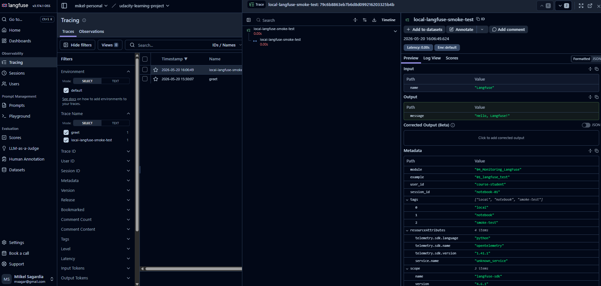

The same notebook also contains a minimal LangChain/OpenAI example. It uses the
same Langfuse project keys plus `OPENAI_API_KEY`, then attaches the Langfuse
callback handler to a small `ChatOpenAI` chain:

```bash
OPENAI_API_KEY=sk-...
```

```python
from langchain_core.prompts import ChatPromptTemplate
from langchain_openai import ChatOpenAI
from langfuse import get_client
from langfuse.langchain import CallbackHandler

langfuse_handler = CallbackHandler()

prompt = ChatPromptTemplate.from_template(
    "Answer in one short paragraph: {question}"
)
model = ChatOpenAI(model="gpt-4o-mini")
chain = prompt | model

response = chain.invoke(
    {"question": "Why is observability useful for LLM applications?"},
    config={
        "callbacks": [langfuse_handler],
        "metadata": {"example": "langchain-openai-minimal"},
        "tags": ["local", "notebook", "langchain"],
    },
)

get_client().flush()
print(response.content)
```

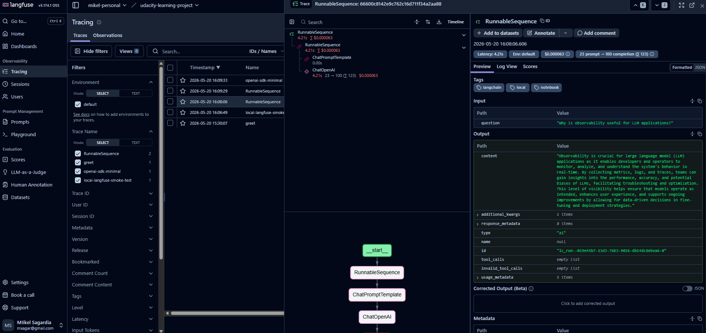

The notebook also shows the same idea without LangChain, using the OpenAI SDK
directly through Langfuse's OpenAI wrapper. This is useful when the application
does not need LangChain chains, callbacks, tools, or prompt templates:

```python
from langfuse import get_client
from langfuse.openai import OpenAI

client = OpenAI()

completion = client.chat.completions.create(
    name="openai-sdk-minimal",
    model="gpt-4o-mini",
    messages=[
        {
            "role": "system",
            "content": "You explain technical ideas clearly and briefly.",
        },
        {
            "role": "user",
            "content": "In one paragraph, explain why LLM tracing is useful.",
        },
    ],
    metadata={"example": "openai-sdk-minimal"},
)

get_client().flush()
print(completion.choices[0].message.content)
```

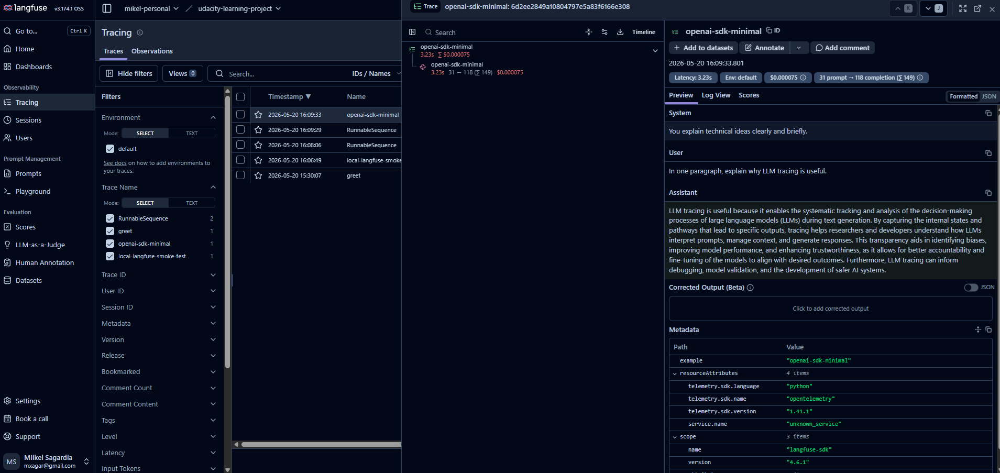

The difference is mostly where instrumentation is attached:

- With `@observe()`, Langfuse traces regular Python function calls and your own
  metadata.
- With LangChain, `CallbackHandler()` observes a LangChain run tree: prompt,
  model call, chain steps, tags, and metadata.
- With the direct OpenAI wrapper, Langfuse observes the OpenAI API request
  without adding LangChain as an abstraction layer.

Then open the Langfuse dashboard and check the project's **Tracing** view. You
should see the `local-langfuse-smoke-test` trace, the LangChain/OpenAI trace,
and the direct OpenAI SDK trace in the same project.

#### Where Is the Data Stored?

If you run:

```bash
cd langfuse
docker compose up
```

the Langfuse data is **not stored in this course repository** and it is **not
stored in the cloned `langfuse/` source folder**. By default, the data lives in
Docker-managed storage attached to the containers. In practice, this means it is
inside Docker's own volume area, which on Docker Desktop is usually inside
Docker's Linux VM rather than in a normal folder you browse from the project.

The default Langfuse Compose file uses named Docker volumes such as:

```text
langfuse_postgres_data
langfuse_clickhouse_data
langfuse_clickhouse_logs
langfuse_minio_data
langfuse_redis_data
```

You can inspect them with:

```bash
docker volume ls
docker volume inspect langfuse_postgres_data
```

If you keep the default Docker Compose setup and want to shut it down while
keeping the data, stop the containers without deleting volumes:

```bash
# From the cloned langfuse/ directory
docker compose down
```

or, if you only want to stop them without removing the containers:

```bash
docker compose stop
```

Both commands keep the named Docker volumes. Later, restart Langfuse from the
same `langfuse/` directory with:

```bash
docker compose up
```

Docker Compose will reattach the existing named volumes, so the Langfuse account,
projects, API keys, traces, and stored data should still be there.

The Langfuse application is not just one container. In the current self-hosted
Docker Compose setup, the background services include:

- **Langfuse web/API**: the dashboard and ingestion API at port `3000`.
- **Langfuse worker**: background jobs and async processing.
- **Postgres**: transactional state such as users, organizations, projects,
  datasets, settings, and encrypted API keys.
- **ClickHouse**: analytical event storage for traces, observations, scores, and
  high-volume observability data.
- **Redis/Valkey**: cache and queue-related infrastructure, including API key
  caching.
- **Blob storage**: S3-compatible storage, often MinIO in local Compose setups,
  for media and larger payloads.

If you want the data to live in an explicit folder, create a
`docker-compose.override.yml` file next to Langfuse's `docker-compose.yml` and
replace the named volumes with bind mounts:

```yaml
services:
  postgres:
    volumes:
      - ./data/postgres:/var/lib/postgresql/data

  clickhouse:
    volumes:
      - ./data/clickhouse:/var/lib/clickhouse
      - ./data/clickhouse-logs:/var/log/clickhouse-server

  minio:
    volumes:
      - ./data/minio:/data

  redis:
    volumes:
      - ./data/redis:/data
```

Then start Langfuse normally:

```bash
docker compose up
```

With this override, the persistent data is stored under:

```text
langfuse/data/
```

Without this override, assume the data remains in Docker-managed container
storage and not in a project folder. Also be careful with:

```bash
docker compose down -v
```

The `-v` flag removes Docker volumes, which deletes the local Langfuse data.
Use plain `docker compose down` for normal shutdowns if you want to keep the
data.
If you already started Langfuse once with named volumes and then switch to the
folder-based bind mounts above, Langfuse will look like a fresh installation
unless you migrate the old volume data first.

For production deployments, the managed equivalents of Postgres, ClickHouse,
Redis/Valkey, and S3-compatible object storage are usually preferred over the
single-machine Docker Compose setup.


#### CLI 101

Langfuse also provides a CLI called `langfuse-cli`. It wraps the Langfuse public
API, so it can query and manage the same project-level resources exposed by the
API: traces, observations, prompts, datasets, scores, sessions, metrics, and
more.

The quickest way to use it is with `npx`, which downloads and runs the CLI
without adding it to the project:

```bash
npx langfuse-cli api <resource> <action>
```

If you prefer a reusable global command, install it with npm:

```bash
npm install -g langfuse-cli
langfuse-cli api <resource> <action>
```

The CLI uses the same project API keys as the Python SDK. For a local self-hosted
Langfuse instance, configure:

```bash
export LANGFUSE_PUBLIC_KEY="pk-lf-..."
export LANGFUSE_SECRET_KEY="sk-lf-..."
export LANGFUSE_BASE_URL="http://localhost:3000"
```

On PowerShell:

```powershell
$env:LANGFUSE_PUBLIC_KEY = "pk-lf-..."
$env:LANGFUSE_SECRET_KEY = "sk-lf-..."
$env:LANGFUSE_BASE_URL = "http://localhost:3000"
```

There is no separate login step. The key pair belongs to one Langfuse project,
so CLI commands operate on that project. To work with another project, switch to
that project's public/secret key pair.

Because the CLI is generated from the Langfuse OpenAPI specification, the most
important first commands are help/discovery:

```bash
npx langfuse-cli --help
npx langfuse-cli api --help
```

Then inspect the resource/action help for the thing you want to do, for example:

```bash
npx langfuse-cli api traces --help
npx langfuse-cli api prompts --help
npx langfuse-cli api datasets --help
```

Typical uses are quick lookups, scripting, and CI jobs, for example listing or
fetching traces, checking prompt versions, creating datasets, adding scores, or
exporting data for evaluation workflows. The exact resource and action names can
change as the API evolves, so use `--help` as the source of truth for the
installed CLI version.

### Why LLM Observability?

- LLM observability is essential because LLM applications can become expensive, slow, unreliable, or risky without clear visibility into what is happening.
- Teams often discover problems too late:
  - runaway prompts or retry loops can create large unexpected bills;
  - token usage can spike without an obvious cause;
  - users can experience slow or low-quality responses while engineers lack
    enough context to debug them;
  - RAG systems can retrieve poor context and cause confident hallucinations.
- Observability is not just monitoring for its own sake. It protects:
  - budget, by exposing token usage, retries, and expensive workflows;
  - product quality, by revealing poor prompts, weak retrieval, and bad outputs;
  - reputation, by catching failures before users or customers escalate them.
- The hidden costs of LLM systems include:
  - API/token costs;
  - compute costs for embeddings, inference, and retrieval;
  - engineering time spent debugging;
  - incident costs from downtime, bad answers, compliance issues, or customer
    impact.
- Without observability, teams cannot manage what they cannot measure. Costs and
  failures tend to grow silently until they show up in bills, support tickets, or
  incidents.
- Key risks without observability:
  - **Token spikes**: high impact and high probability.
  - **Silent failures**: medium impact but high probability.
  - **Performance degradation**: medium impact and high probability.
  - **Compliance violations**: critical impact, even if probability is lower.

### Traditional Monitoring vs LLM Observability

- Traditional monitoring focuses on generic application health:
  - request latency;
  - error rates;
  - uptime;
  - infrastructure metrics.
- Traditional monitoring often treats the application as a black box: a request
  enters, internal work happens, and a response leaves.
- LLM observability looks inside the LLM workflow and captures details that
  traditional monitoring misses:
  - prompts and responses;
  - token input/output flows;
  - model name and model behavior;
  - retrieval quality in RAG systems;
  - tool calls and agent steps;
  - cost attribution by request, user, feature, or model.
- LLM-specific questions include:
  - Did the prompt produce a good answer?
  - Did the RAG pipeline retrieve relevant chunks?
  - Did the model hallucinate, refuse, or become overly verbose?
  - Which feature or user segment is driving cost?
  - Which step in the chain is slow or failing?
- In production, LLM observability helps teams:
  - debug issues in minutes instead of hours;
  - optimize token and model costs;
  - catch quality or latency issues before users report them;
  - explain to stakeholders where LLM budget is going.

### The Three Pillars of LLM Observability

- **Traces**
  - Show the end-to-end flow of a request.
  - Capture each step in the workflow: prompt construction, retrieval, tool
    calls, model calls, parsing, evaluation, and final response.
  - Make it easier to identify which step is slow, expensive, incorrect, or
    failing.
- **Metrics**
  - Aggregate operational and cost signals across many requests.
  - Useful metrics include token usage, latency, cost per request, cost per
    feature, cost per user, error rates, and model usage.
  - Metrics help teams spot trends, spikes, regressions, and budget issues.
- **Evaluations**
  - Measure output quality, not just system health.
  - Can track relevance, hallucination risk, correctness, safety, tone,
    groundedness, or task-specific quality.
  - Evaluation scores make it possible to compare prompts, models, retrieval
    strategies, and application versions.
- Common measurements:
  - input/output token ratio;
  - latency by workflow step;
  - cost by request, feature, model, user, or customer;
  - retrieval relevance;
  - hallucination rate;
  - error rate by type, model, prompt, or workflow.

### ROI Calculation

- Observability has a direct business case because it reduces preventable LLM
  costs and engineering effort.
- Example monthly baseline without observability:
  - LLM spend: `$20,000`;
  - estimated waste: `30%`, or about `$6,000`;
  - debugging effort: `10 hours/week * $100/hour`, or about `$4,000/month`;
  - amortized incident cost: `$5,000/month`;
  - total preventable cost: about `$15,000/month`.
- Example investment:
  - observability platform: about `$500-$2,000/month`;
  - setup time: about `8 hours` one time.
- Potential benefits:
  - lower token spend through prompt/model optimization;
  - less wasted retry traffic;
  - faster debugging with traces;
  - fewer surprise bills through cost alerts;
  - faster incident response.
- Example outcomes mentioned in the course:
  - token cost reduction from prompt optimization;
  - up to `80%` less debugging time with proper tracing;
  - fewer runaway-cost surprises with alerts.
- Simple ROI formula:

```text
savings = token_waste + (debug_time * hourly_rate) + (incidents_prevented * incident_cost)
```

- The practical question is not only "Can we afford observability?", but "How
  much are we already losing by not observing the system?"

## 2. Understanding LLM Costs

### Input and Output Tokens

- LLM pricing is based on **tokens**, not characters or words.
- A rough rule of thumb is that one token is about four English characters, but the ratio depends on the text.
- Tokenization varies by content type:
  - `"Hello, world!"` has 13 characters but only 4 tokens.
  - A normal sentence such as `"The quick brown fox jumps over the lazy dog."` has 44 characters and about 10 tokens.
  - Code often tokenizes less efficiently because syntax creates many small tokens.
  - Long words can also split into many tokens.
- Output tokens usually cost **2-5x more** than input tokens.
- Example per-1M-token prices from the course material:
  - GPT-4o: about `$2.50` input and `$10.00` output.
  - GPT-4o mini: about `$0.15` input and `$0.60` output.
  - Claude 3.5 Sonnet: about `$3.00` input and `$15.00` output.
  - Claude 3.5 Haiku: about `$0.25` input and `$1.25` output.
  - Gemini 1.5 Pro: about `$1.25` input and `$5.00` output.
- The exact prices change over time; the important pattern is the input/output ratio and the large gap between model tiers.
- Verbose responses are expensive because they increase output tokens.
- Long system prompts are usually cheaper than long responses because they are input tokens.
- Asking the model to be concise is a direct cost optimization.
- Cost estimation requires:
  - Counting input and output tokens.
  - Looking up the selected model's input and output prices per million tokens.
  - Calculating input cost and output cost separately, then adding them.
- Tokenizers can differ between model providers, so token counts for non-OpenAI models may only be approximate when using a fallback tokenizer.
- A small single-request cost can become significant at production volume.
- In the course example, the same prompt/response shape costs about `$415` per 1M monthly requests with GPT-4o, about `$25` with GPT-4o mini, and about `$50` with Claude 3.5 Haiku.
- Key optimization levers:
  - Choose the cheapest model that performs the task well.
  - Shorten prompts and remove repetitive instructions.
  - Limit output length with concise instructions and `max_tokens` where appropriate.

Examples in [`lab/udemy-langfuse/`](./lab/udemy-langfuse/):

```python
##### -- tokens-demo-1.py

import tiktoken

# Initialize the tokenizer for GPT-4
enc = tiktoken.encoding_for_model("gpt-4")

# Let's count some tokens
examples = [
    "Hello, world!",  # Simple
    "The quick brown fox jumps over the lazy dog.",  # Standard sentence
    "def calculate_total(items): return sum(item.price for item in items)",  # Code
    "supercalifragilisticexpialidocious",  # Long word
]

for text in examples:
    tokens = enc.encode(text)
    print(f"'{text}'")
    print(f"  Characters: {len(text)}")
    print(f"  Tokens: {len(tokens)}")
    print(f"  Tokens: {tokens}")
    print()


##### -- token-calculator-2.py

import tiktoken
from dataclasses import dataclass
from typing import Dict

@dataclass
class ModelPricing:
    name: str
    input_cost_per_million: float
    output_cost_per_million: float

# Current pricing (January 2026)
MODELS = {
    "gpt-4o": ModelPricing("gpt-4o", 2.50, 10.00),
    "gpt-4o-mini": ModelPricing("gpt-4o-mini", 0.15, 0.60),
    "claude-3.5-sonnet": ModelPricing("claude-3.5-sonnet", 3.00, 15.00),
    "claude-3.5-haiku": ModelPricing("claude-3.5-haiku", 0.25, 1.25),
}

def count_tokens(text: str, model: str = "gpt-4o") -> int:
    """Count tokens for a given text."""
    try:
        enc = tiktoken.encoding_for_model(model)
    except KeyError:
        enc = tiktoken.get_encoding("cl100k_base")
    return len(enc.encode(text))

def calculate_cost(
    input_text: str,
    output_text: str,
    model: str = "gpt-4o"
) -> Dict[str, float]:
    """Calculate the cost of an LLM interaction."""

    pricing = MODELS.get(model)
    if not pricing:
        raise ValueError(f"Unknown model: {model}")

    input_tokens = count_tokens(input_text, model)
    output_tokens = count_tokens(output_text, model)

    input_cost = (input_tokens / 1_000_000) * pricing.input_cost_per_million
    output_cost = (output_tokens / 1_000_000) * pricing.output_cost_per_million

    return {
        "input_tokens": input_tokens,
        "output_tokens": output_tokens,
        "total_tokens": input_tokens + output_tokens,
        "input_cost": input_cost,
        "output_cost": output_cost,
        "total_cost": input_cost + output_cost,
        "model": model,
    }
```

### Where Costs Hide: RAG and Agentic Pipelines

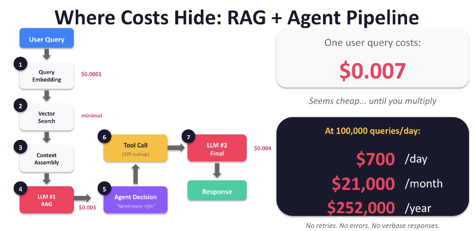

- RAG and agentic pipelines hide cost across multiple steps:
  - User query embedding is usually very cheap.
  - Vector search is usually minimal.
  - Context assembly increases the amount of text passed to the model.
  - The first LLM call processes the assembled prompt and retrieved context.
  - Agent decisions can trigger tool calls, API lookups, and additional LLM calls.
  - The final response adds another output-token cost.
- A single query can look inexpensive, but production volume changes the economics quickly.
- In the course example, a sub-cent query becomes about `$700/day`, `$21,000/month`, or `$252,000/year` at `100,000` queries per day.
- That estimate assumes the happy path: no retries, no errors, and no overly verbose responses.
- LLM calls often make up more than 95% of total pipeline cost, even as model inference prices fall.
- Top cost drivers:
  - Bloated system prompts sent with every request.
  - Excessive retrieved context; the goal is the **right** context, not the most context.
  - Agent reasoning loops that repeatedly call the model.
  - Growing chat history, which increases context size linearly.
  - Wrong model selection, which can create a very large price difference for the same workflow.

### The Hidden Cost Multipliers

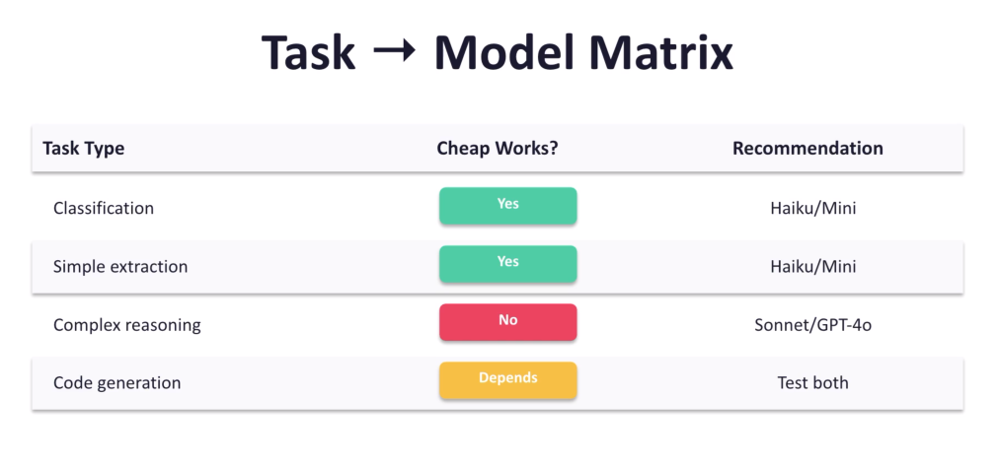

- Hidden multipliers are costs that repeat or compound quietly:
  - System prompts are sent with every request.
  - RAG context can add thousands of tokens.
  - Retries mean paying for the same work twice or more.
  - Chat history grows linearly as conversations get longer.
- The same prompt can have a dramatically different cost depending on the model, with the course material emphasizing up to a `200x` gap.
- Use a task-model matrix to match model quality to task difficulty:
  - Classification: use smaller models such as Haiku or mini models.
  - Simple extraction: use smaller models when they perform well enough.
  - Simple Q&A and summarization: prefer cheaper models unless quality requires an upgrade.
  - Complex reasoning: use stronger models such as Sonnet or GPT-4-class models.
  - Code generation: test both cheaper and stronger models; paying more can be justified when quality matters.
- Intelligent model routing selects the most cost-effective model for each task instead of sending every request to the same expensive model.
- A router can use task type and complexity to choose among cheap, mid-tier, and strong models.
- For code generation, a useful pattern is to start cheaper and upgrade only when needed.
- For complex reasoning, analysis, and creative tasks, route to stronger models that reliably produce better results.
- Model selection is one of the highest-leverage LLM cost optimizations.

## 3. LangFuse as Observability Platform

### LLM Monitoring Platforms

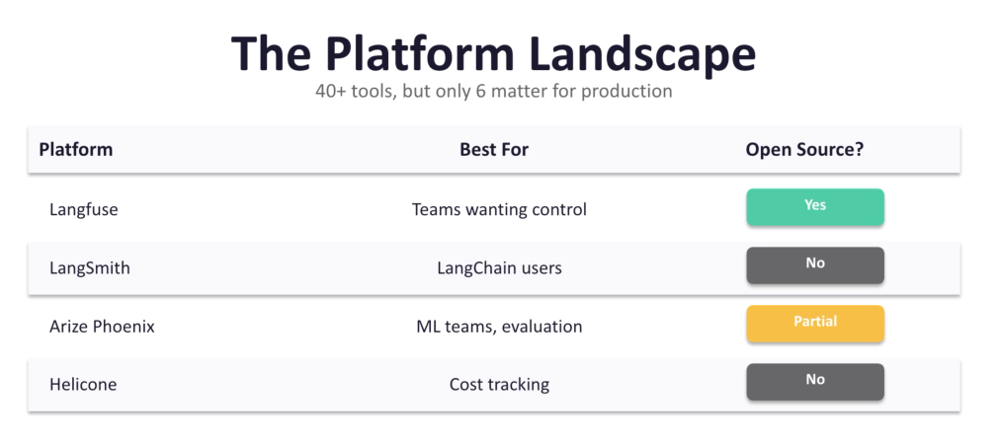

- There are many LLM observability tools, but teams usually only need to compare the main production-ready options.
- Langfuse is recommended in this course because it is open source, self-hostable, vendor neutral, framework friendly, and has a clean UI, strong tracing, metrics, evaluations, and a generous free tier.
- LangSmith is a strong choice for teams heavily invested in the LangChain ecosystem, but it is closed source.
- Arize Phoenix is useful for ML and evaluation-focused teams, with both open-source and commercial options.
- Helicone is especially useful when cost tracking is the primary concern.
- Portkey is worth considering for systems that route across multiple LLM providers.
- Platform choice depends on the team's needs:
  - Heavy LangChain usage: LangSmith.
  - Open source, self-hosting, and control: Langfuse.
  - Cost tracking: Helicone.
  - Multiple LLM providers: Portkey.
- The course uses Langfuse, but the observability concepts should transfer to other platforms.

### Setting Up LangFuse on the Cloud

To see how set up your own managed LangFuse, check [Local Setup and Quick Start](#local-setup-and-quick-start) above.

- Langfuse can be used through the managed cloud service or self-hosted with Docker.
- The cloud option is the fastest path for the course because it requires no hosting, no infrastructure management, and no credit card for the free tier (50k traces/month).
- Basic cloud setup:
  - Sign up with email, Google, GitHub, or Azure AD.
  - Create an organization.
  - Create a project.
  - Copy the project hostname/base URL.
  - Create API keys.
  - Add the Langfuse public key, secret key, and base URL to the project's `.env` file.
- For local Python usage, install the Langfuse SDK and load environment variables with `python-dotenv`.
- Instantiate a Langfuse client with the public key, secret key, and base URL from the environment.
- The Langfuse project settings include API keys, LLM connections, models, score configurations, members, integrations, exports, batch actions, audit logs, notifications, and billing.
- After setup, the next step is instrumenting a real application so traces and LLM activity appear in the dashboard.

```bash
LANGFUSE_SECRET_KEY="sk-lf-xxx"
LANGFUSE_PUBLIC_KEY="pk-lf-xxx"
LANGFUSE_BASE_URL="http://localhost:3000"
```

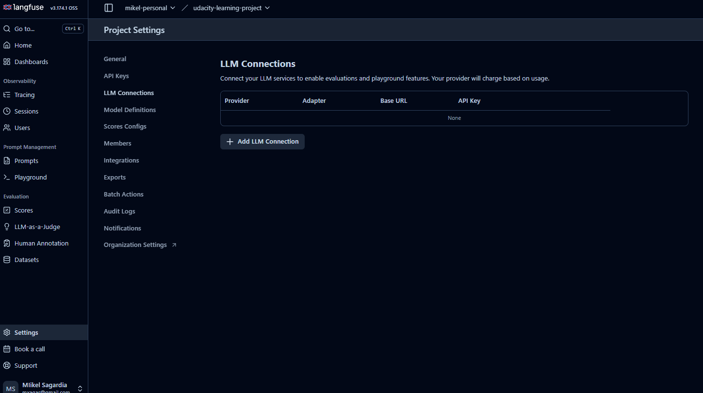

### Creating First Trace with `@observe()`

- The new SDK pattern uses `@observe` and `get_client()` instead of manually instantiating a `LangFuse` object.
- Environment variables still come from `.env`.
- Running the script creates a first trace, flushes it to Langfuse, and lets you verify it in the dashboard under **Observability > Tracing**.
- This same pattern can later be attached to real LLM calls for tracing, debugging, and cost monitoring.

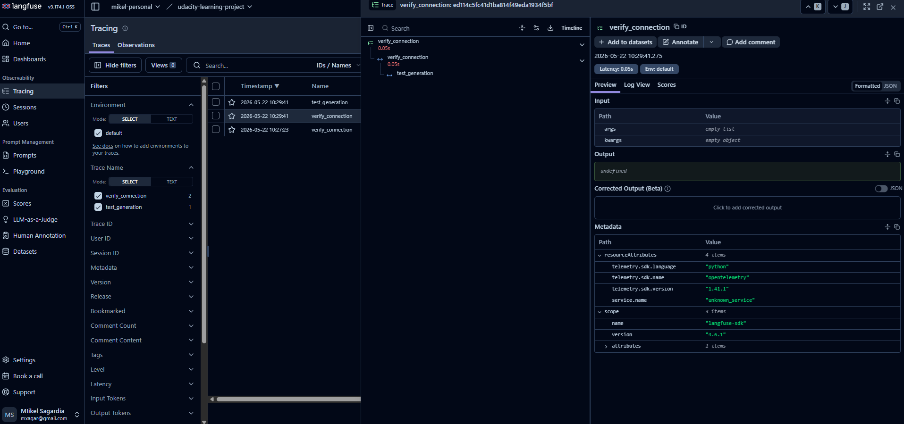

File: [`lab/udemy-langfuse/langf_obs.py`](./lab/udemy-langfuse/langf_obs.py)

```python
from langfuse import observe, get_client
from dotenv import load_dotenv

# Load LANGFUSE_PUBLIC_KEY, LANGFUSE_SECRET_KEY, and LANGFUSE_BASE_URL
# from the local .env file.
load_dotenv()

@observe
def verify_connection():
    # Nested observed functions appear as child observations inside the trace.
    test_generation()

    # Short-lived scripts and notebooks should flush before exiting so buffered
    # traces are sent to Langfuse immediately.
    client = get_client()
    client.flush()

    print("Connection to Langfuse is successful!")
    print("check your dashboard at http://localhost:3000")

@observe
def test_generation():
    """A simple test generation function to verify Langfuse connection."""

    # The @observe decorator automatically logs this function call, including
    # timing and return value, to Langfuse.
    return "Hello, Langfuse!"

if __name__ == "__main__":
    # Run the observed function, then check the Langfuse dashboard.
    verify_connection()
    test_generation()
```

#### LangFuse Data Model

- Langfuse organizes observability data hierarchically so complex LLM workflows can be inspected end to end.
- Typical LLM workflows include retrieval, processing, generation, tool calls, and response handling.
- Main hierarchy:
  - **Session**: a group of related traces, such as one chat conversation.
  - **Trace**: one request or operation inside a session, such as one user message to an LLM.
  - **Observation**: one step inside a trace, such as retrieval, processing, generation, a tool call, or an event.

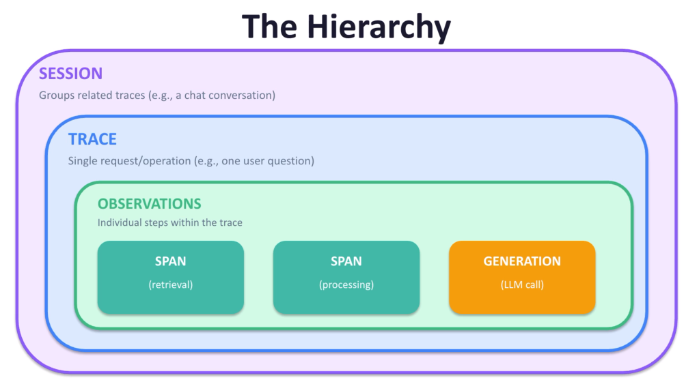

- A trace is the container for everything that happens during a single request.
- Example trace flow:
  - User asks, "What's the weather like today?"
  - The system receives the question.
  - Retrieval or other context-building steps may run.
  - The LLM call is made.
  - The response is returned.
- Important trace properties:
  - `name`: identifies the operation.
  - `input`: what went into the request.
  - `output`: what came out.
  - `user_id`: identifies who made the request.
  - `session_id`: links the trace to its parent conversation/session.
  - `tags`: labels used for filtering, grouping, and cost breakdowns.

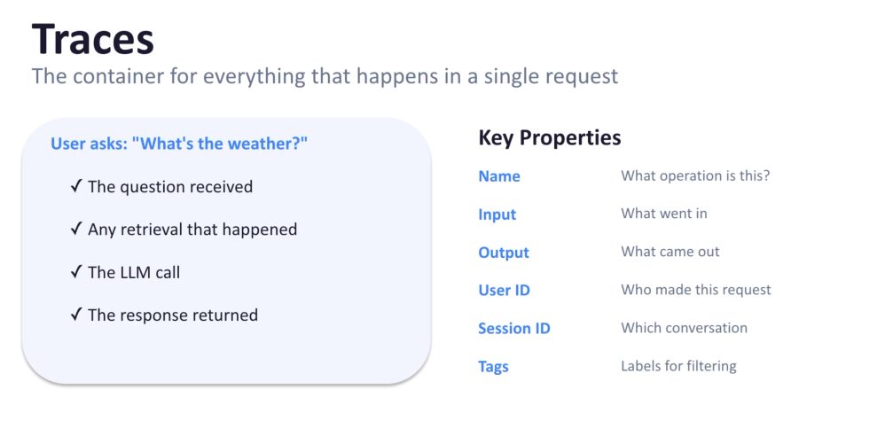

- Observation types:
  - **Generation**: an LLM API call, including completions, token counts, model information, and calculated cost.
  - **Span**: an operation with duration, such as database queries, retrieval steps, or processing logic.
  - **Event**: a point-in-time occurrence, such as a cache hit or an error.
- Observations can be nested hierarchically:
  - A generation can have child spans.
  - A span can have child events.

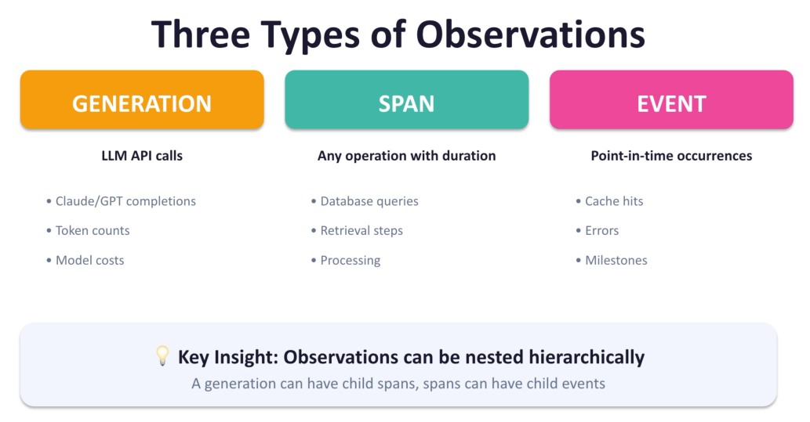

- Sessions group related traces together.
- Example session:
  - One chat conversation with ID `ABC123`.
  - A 10-message conversation can be represented as one session with 10 traces, one per message.
- Sessions are useful because they show:
  - Full conversation flow.
  - User behavior patterns.
  - How the LLM application behaves across multiple turns.
  - Conversation-level metrics such as resolution rate and turns to completion.
  - A/B test comparisons across different approaches.

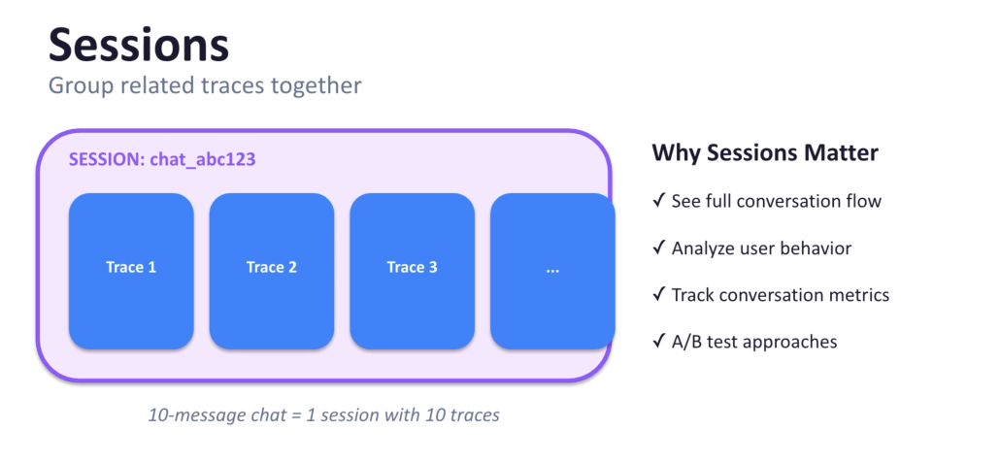

- Example end-to-end data flow:
  - A user sends a message.
  - Langfuse creates a trace with `session_id` and `user_id`.
  - A retrieval span records its duration, for example `45 ms`.
  - A generation records the LLM call, for example `150` input tokens, `50` output tokens, and the resulting cost.
  - The trace is updated with final output and total latency, for example `850 ms`.

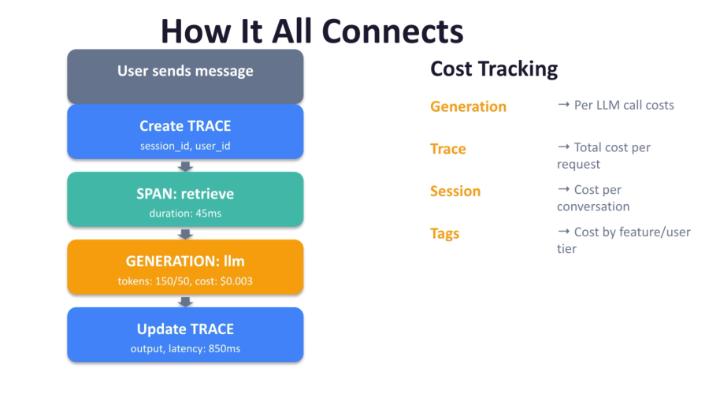

- Cost tracking happens at multiple levels:
  - **Generation level**: cost per individual LLM call, based on token counts and model pricing.
  - **Trace level**: total cost per request, aggregating all generations inside the trace.
  - **Session level**: cost per conversation, useful for chat-based products.
  - **Tag level**: cost by feature, user tier, experiment variant, or other labels.
  - **User/group level**: identify the most expensive users, cohorts, tiers, or usage patterns.
- This data model makes observability useful for debugging, performance analysis, user behavior analysis, A/B testing, and cost management.

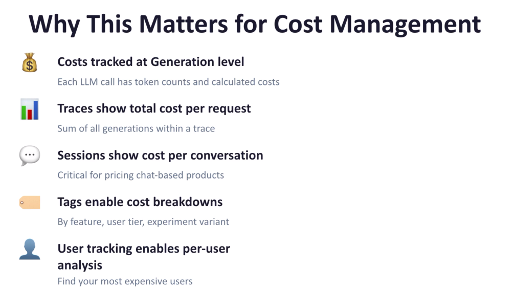


### First LLM Trace with LangFuse with OpenAI Wrapper

- This example creates a real OpenAI chat completion through the Langfuse OpenAI wrapper.
- The wrapper keeps the familiar `chat.completions.create(...)` shape while automatically logging the LLM call as a Langfuse generation.
- In the Langfuse UI, the trace appears with its timestamp, name, input, output, and total duration.
- Opening the generation shows detailed observability data:
  - Latency, for example around `1.xs` in the demo.
  - Model used, here `gpt-4o-mini`.
  - Token usage, including input tokens, output tokens, and total usage.
  - Cost breakdown for input, cached input if applicable, and output.
  - Captured system prompt, user message, assistant response, and custom metadata.
- The metadata value `project: first_trace_llm_project` confirms that application-specific fields can be attached to traces for filtering and analysis.

File: [`lab/udemy-langfuse/first_trace_llm.py`](./lab/udemy-langfuse/first_trace_llm.py).

```python
# Import the OpenAI-compatible client from Langfuse.
# The API call looks like a normal OpenAI call, but Langfuse records the trace.
from langfuse.openai import openai
from dotenv import load_dotenv


# Load OPENAI_API_KEY plus LANGFUSE_PUBLIC_KEY, LANGFUSE_SECRET_KEY,
# and LANGFUSE_BASE_URL from .env.
load_dotenv()

completion = openai.chat.completions.create(
    # This name appears in the Langfuse trace list.
    name="first_trace_llm",
    model="gpt-4o-mini",
    messages=[
        {
            "role": "system",
            # System prompt captured in the generation details.
            "content": "You are a very accurate calculator. You output only the result of the calculation.",
        },
        # User message captured as the generation input.
        {"role": "user", "content": "123 + 456 * 2 = "},
    ],
    # Custom metadata is stored with the trace and can be used for filtering.
    metadata={"project": "first_trace_llm_project"},
)

# Print the assistant response locally; the same output is visible in Langfuse.
print(completion.choices[0].message.content)

```

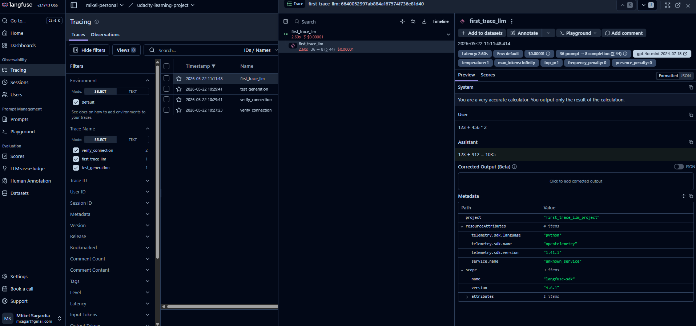

### LangFuse API Levels: Decorator, Context Manager, Low-Level, Drop-in

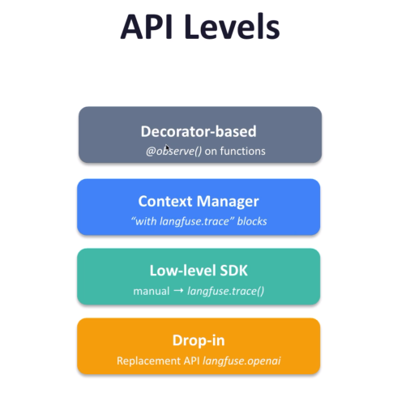

- Langfuse offers multiple API levels that can capture similar observability data with different amounts of control.
- Main API levels:
  - **Decorator-based**: use `@observe()` on functions; modern, simple, and usually the recommended default.
  - **Context manager**: use `with` blocks to create traces, spans, and generations explicitly.
  - **Low-level SDK**: manually create and update traces, spans, generations, scores, events, and other objects.
  - **Drop-in wrappers**: use provider wrappers such as the Langfuse OpenAI wrapper so normal LLM calls are traced automatically.
- The previous OpenAI wrapper example used the **drop-in** level: the code still calls `chat.completions.create(...)`, while Langfuse records traces in the background.
- The first code block below demonstrates the **decorator-based** level:
  - `@observe()` creates traces/spans automatically.
  - Nested observed functions become nested spans.
  - `update_current_span(...)` adds metadata and tags for filtering and grouping.
  - `flush()` sends buffered observations before the script exits.
- Context-manager tracing (2nd code block) is more explicit: use `with` blocks to name and structure spans/generations manually.
- Low-level tracing provides (3rd code block) the most control but requires more code, including manually starting, updating, ending, and linking spans or generations.
- Choose the API level based on how much automation vs. control the application needs.

This section uses three scripts:

- [`decorator_trace_llm.py`](./lab/udemy-langfuse/decorator_trace_llm.py) demonstrates the decorator-based API.
- [`context_manager_trace_llm.py`](./lab/udemy-langfuse/context_manager_trace_llm.py) demonstrates the context manager API.
- [`low_level_trace_llm.py`](./lab/udemy-langfuse/low_level_trace_llm.py) demonstrates the low-level API.

Additionally, the notebook [`lab/02_langfuse_api_levels.ipynb`](./lab/02_langfuse_api_levels.ipynb) walks through all three API levels interactively, using the same code as in the scripts.

#### Decorator API Example

File: [`lab/udemy-langfuse/decorator_trace_llm.py`](./lab/udemy-langfuse/decorator_trace_llm.py)

```python
# Decorator-level API: use normal Python functions and annotate them with
# @observe() so Langfuse creates traces/spans automatically.
from langfuse import observe, Langfuse
from openai import OpenAI
from dotenv import load_dotenv

# Load OpenAI and Langfuse credentials from .env.
load_dotenv()

# Use the regular OpenAI client for the LLM call.
client = OpenAI()

# Langfuse client is used here to enrich the current span and flush data.
langfuse = Langfuse()

@observe()  # Creates a trace/span automatically.
def calculator(expression: str) -> str:
    """Single calculation - becomes a span when called from another @observe function."""
    completion = client.chat.completions.create(
        model="gpt-4o-mini",
        messages=[
            {
                "role": "system",
                "content": "You are a very accurate calculator. You output only the result of the calculation.",
            },
            {"role": "user", "content": expression},
        ],
    )

    # Add metadata and tags to the active span so it can be filtered in Langfuse.
    # Other SDK helpers can update traces, spans, generations, prompts, scores,
    # datasets, and events depending on what needs to be recorded.
    langfuse.update_current_span(
        metadata={"project": "decorator_example", "tags": ["calculator", "math"]},
    )

    return completion.choices[0].message.content


@observe()  # Nested observed function = parent span with child spans.
def process_calculations(expressions: list[str]) -> list[str]:
    """Process multiple calculations - each calculator() call becomes a child span."""
    results = []
    for expr in expressions:
        # Each calculator() call is captured as a child span under this trace.
        result = calculator(expr)
        results.append(f"{expr} = {result}")
    return results


if __name__ == "__main__":
    # Running this creates one trace for the batch and child spans for each calculation.
    expressions = ["123 + 456", "789 * 2", "100 / 4"]
    results = process_calculations(expressions)

    print("Results:")
    for r in results:
        print(f"  {r}")

    # Flush is important for short-lived scripts so buffered observations are sent.
    langfuse.flush()

```

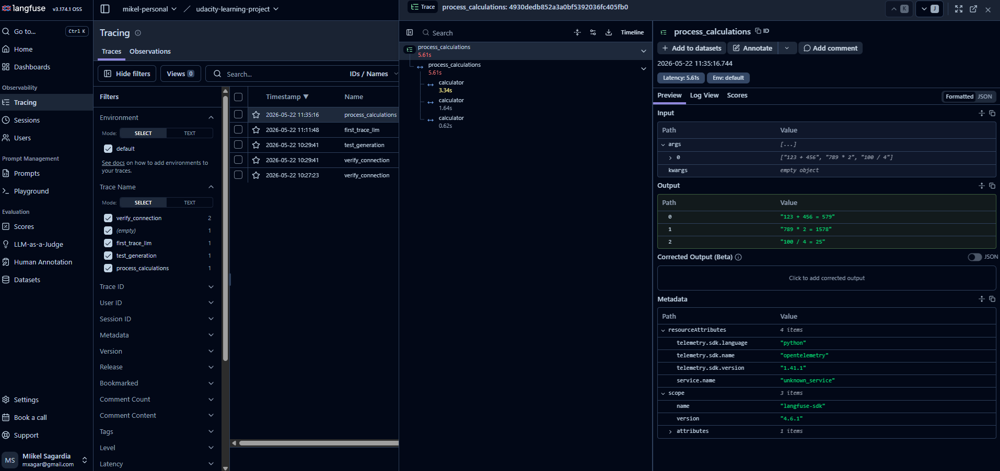

#### Context Manager API Example

File: [`lab/udemy-langfuse/context_manager_trace_llm.py`](./lab/udemy-langfuse/context_manager_trace_llm.py).

```python
# Context-manager API: explicitly open trace/span/generation scopes with
# `with` blocks, while Langfuse manages the active current object.
from langfuse import Langfuse
from openai import OpenAI
from dotenv import load_dotenv

# Load OpenAI and Langfuse credentials from .env.
load_dotenv()

# Regular OpenAI client performs the model call.
client = OpenAI()

# Langfuse client creates and updates the trace hierarchy.
langfuse = Langfuse()

expression = "123 + 456 * 2"

# Create the root span. Because it is the outermost active span, it becomes
# the root of a new trace in Langfuse.
with langfuse.start_as_current_observation(
    name="calculator_context_manager",
    as_type="span",
) as trace:

    # Add a child span for preprocessing/validation work.
    with langfuse.start_as_current_observation(
        name="input_validation",
        as_type="span",
    ) as validation_span:
        # Update the currently active span with input and output data.
        langfuse.update_current_span(
            input={"expression": expression},
            output={"status": "valid"},
        )

    # Add a generation for the actual LLM call. Generations are the right
    # Langfuse object for model requests because they track model, tokens, and cost.
    with langfuse.start_as_current_observation(
        name="llm_calculation",
        as_type="generation",
        model="gpt-4o-mini",
        input=[
            {
                "role": "system",
                "content": "You are a very accurate calculator. You output only the result of the calculation.",
            },
            {"role": "user", "content": expression},
        ],
    ) as generation:
        # The OpenAI call itself still uses the regular OpenAI SDK.
        completion = client.chat.completions.create(
            model="gpt-4o-mini",
            messages=[
                {
                    "role": "system",
                    "content": "You are a very accurate calculator. You output only the result of the calculation.",
                },
                {"role": "user", "content": expression},
            ],
        )
        result = completion.choices[0].message.content

        # Attach the LLM output, token usage, and metadata to the active generation.
        langfuse.update_current_generation(
            output=result,
            usage_details={
                "input": completion.usage.prompt_tokens,
                "output": completion.usage.completion_tokens,
            },
            metadata={"project": "context_manager_example"},
        )

    # Attach final request-level output and tags to the root span.
    trace.update(
        output={"result": result},
        tags=["calculator", "context_manager"],
    )

print(f"{expression} = {result}")

# Flush is important for short-lived scripts so buffered observations are sent.
langfuse.flush()
```

#### Low-Level API Example

File: [`lab/udemy-langfuse/low_level_trace_llm.py`](./lab/udemy-langfuse/low_level_trace_llm.py).

```python
# Low-level API: manually create, update, end, and link Langfuse objects.
# This gives maximum control, but requires more lifecycle code.
from langfuse import Langfuse
from openai import OpenAI
from dotenv import load_dotenv
import time

# Load OpenAI and Langfuse credentials from .env.
load_dotenv()

# Regular OpenAI client performs the model call.
client = OpenAI()

# Langfuse client is used directly to create spans, generations, scores, and events.
langfuse = Langfuse()

expression = "123 + 456 * 2"

# Create the root span. Starting a root span creates a new trace automatically.
root_span = langfuse.start_observation(
    name="calculator_low_level",
    as_type="span",
    input={"expression": expression},
    metadata={"project": "low_level_example"},
)

# Keep the trace ID so later objects, such as scores, can be attached to this trace.
trace_id = root_span.trace_id

# Create and manually finish a child span for preprocessing/validation.
preprocessing_span = root_span.start_observation(
    name="preprocessing",
    as_type="span",
    input={"raw_expression": expression},
)

# Update the child span with the validation result.
preprocessing_span.update(
    output={"validated_expression": expression, "status": "valid"},
)

# Low-level spans must be ended explicitly.
preprocessing_span.end()

# Track custom timing around the model call.
start_time = time.time()

# The LLM request itself is still a normal OpenAI SDK call.
completion = client.chat.completions.create(
    model="gpt-4o-mini",
    messages=[
        {
            "role": "system",
            "content": "You are a very accurate calculator. You output only the result of the calculation.",
        },
        {"role": "user", "content": expression},
    ],
)

end_time = time.time()
result = completion.choices[0].message.content

# Create the generation manually as another child observation so we can control
# its name, model, parameters, input, output, usage, status, and lifecycle.
generation = root_span.start_observation(
    name="llm_calculation",
    as_type="generation",
    model="gpt-4o-mini",
    model_parameters={"temperature": 1.0},
    input=[
        {
            "role": "system",
            "content": "You are a very accurate calculator. You output only the result of the calculation.",
        },
        {"role": "user", "content": expression},
    ],
)

# Update the generation with output, token usage, severity level, and status.
generation.update(
    output=result,
    usage_details={
        "input": completion.usage.prompt_tokens,
        "output": completion.usage.completion_tokens,
        "total": completion.usage.total_tokens,
    },
    level="DEFAULT",  # Options: "DEBUG", "DEFAULT", "WARNING", "ERROR"
    status_message="Calculation completed successfully",
)

# Low-level generations must also be ended explicitly.
generation.end()

# Update and end the root span with final request-level output and custom timing.
root_span.update(
    output={"result": result},
    metadata={"duration_ms": (end_time - start_time) * 1000},
)
root_span.end()

# Attach an evaluation score to the trace.
langfuse.create_score(
    trace_id=trace_id,
    name="accuracy",
    value=1.0,
    comment="Correct calculation verified",
)

# Create a point-in-time event for debugging or audit-style logging.
event = langfuse.create_event(
    name="calculation_complete",
    trace_context={"trace_id": trace_id},
    input={"expression": expression},
    output={"result": result},
    metadata={"duration_ms": (end_time - start_time) * 1000},
)

print(f"{expression} = {result}")
print(f"Duration: {(end_time - start_time) * 1000:.2f}ms")
print(f"Tokens used: {completion.usage.total_tokens}")
print(f"Trace ID: {trace_id}")

# Flush is important for short-lived scripts so buffered observations are sent.
langfuse.flush()

```

## 4. Instrumenting LLM Applications with LangFuse

### LLM App for Production

Files:

- [`lab/udemy-langfuse/instrumented_llm.py`](./lab/udemy-langfuse/instrumented_llm.py)
- [`lab/03_langfuse_llm_production.ipynb`](./lab/03_langfuse_llm_production.ipynb)

- The production wrapper normalizes responses from multiple providers into one `LLMResponse` dataclass.
- Each response stores `content`, `input_tokens`, `output_tokens`, `model`, `duration_ms`, and estimated `cost`.
- Pricing is kept in a model-to-price dictionary using per-1M-token input/output rates; update these values when provider pricing changes.
- Provider calls are decorated as Langfuse **generations**, the right observation type for LLM calls because it can hold model, token, cost, latency, input, and output data.
- `call_claude(...)` and `call_openai(...)` follow the same production pattern:
  - Build the provider-specific request.
  - Measure latency.
  - Read token usage from the provider response.
  - Estimate cost.
  - Enrich the current Langfuse generation with model, input/output, usage, cost, and metadata.
  - Return a normalized `LLMResponse`.
- `compare_models(...)` wraps both provider calls in one observed span so the two generations appear as child observations in the same trace.
- `propagate_attributes(...)` sets trace-level fields such as `user_id`, `session_id`, tags, metadata, and trace name so runs are easy to filter later.
- In the Langfuse UI, this setup exposes latency per provider, total trace latency, token usage, estimated cost, inputs/outputs, structured metadata, trace IDs, user IDs, tags, logs, comments, and errors.
- `langfuse.flush()` is required in notebooks and short-lived scripts so buffered observations are sent before the process exits.

```python
from dataclasses import asdict, dataclass
import time
from typing import Any

from anthropic import Anthropic
from dotenv import load_dotenv
from langfuse import get_client, observe, propagate_attributes
from openai import OpenAI

load_dotenv()

# Provider clients read their API keys from environment variables.
anthropic_client = Anthropic()
openai_client = OpenAI()

# Langfuse reads LANGFUSE_PUBLIC_KEY, LANGFUSE_SECRET_KEY, and LANGFUSE_BASE_URL.
langfuse = get_client()


@dataclass
class LLMResponse:
    """Normalized response shape used across providers."""

    content: str
    input_tokens: int
    output_tokens: int
    model: str
    duration_ms: float
    cost: float


# Example standard prices per 1M tokens, last checked 2026-05-22.
# This intentionally covers both the current course defaults and a few common
# alternatives. It does not include prompt caching, batch, flex, priority, long
# context, regional, or tool-specific pricing modifiers.
PRICING: dict[str, dict[str, float]] = {
    # Anthropic Claude API model IDs.
    "claude-opus-4-1-20250805": {"input": 15.00, "output": 75.00},
    "claude-opus-4-20250514": {"input": 15.00, "output": 75.00},
    "claude-sonnet-4-20250514": {"input": 3.00, "output": 15.00},
    "claude-3-7-sonnet-20250219": {"input": 3.00, "output": 15.00},
    "claude-3-5-haiku-20241022": {"input": 0.80, "output": 4.00},
    "claude-3-haiku-20240307": {"input": 0.25, "output": 1.25},
    # OpenAI standard short-context prices.
    "gpt-5.5": {"input": 5.00, "output": 30.00},
    "gpt-5.4": {"input": 2.50, "output": 15.00},
    "gpt-5.4-mini": {"input": 0.75, "output": 4.50},
    "gpt-5.4-nano": {"input": 0.20, "output": 1.25},
    "gpt-4o": {"input": 2.50, "output": 10.00},
    "gpt-4o-mini": {"input": 0.15, "output": 0.60},
}


def calculate_cost(model: str, input_tokens: int, output_tokens: int) -> float:
    """Calculate estimated cost from token usage."""
    pricing = PRICING.get(model)
    if pricing is None:
        return 0.0

    input_cost = (input_tokens / 1_000_000) * pricing["input"]
    output_cost = (output_tokens / 1_000_000) * pricing["output"]
    return input_cost + output_cost


@observe(name="call_claude", as_type="generation")
def call_claude(
    prompt: str,
    model: str = "claude-sonnet-4-20250514",
    system: str | None = None,
    max_tokens: int = 1024,
    metadata: dict[str, Any] | None = None,
) -> LLMResponse:
    """Call Claude and enrich the active Langfuse generation."""
    start = time.perf_counter()

    kwargs: dict[str, Any] = {
        "model": model,
        "max_tokens": max_tokens,
        "messages": [{"role": "user", "content": prompt}],
    }
    if system:
        kwargs["system"] = system

    response = anthropic_client.messages.create(**kwargs)

    duration_ms = (time.perf_counter() - start) * 1000
    input_tokens = response.usage.input_tokens
    output_tokens = response.usage.output_tokens
    cost = calculate_cost(model, input_tokens, output_tokens)
    content = response.content[0].text

    # Because this function is observed as a generation, model-specific fields
    # belong on the current generation rather than generic span metadata.
    langfuse.update_current_generation(
        model=model,
        input=[{"role": "user", "content": prompt}],
        output=content,
        usage_details={
            "input": input_tokens,
            "output": output_tokens,
            "total": input_tokens + output_tokens,
        },
        cost_details={"total": cost},
        metadata={
            **(metadata or {}),
            "provider": "anthropic",
            "duration_ms": duration_ms,
            "stop_reason": response.stop_reason,
        },
    )

    return LLMResponse(
        content=content,
        input_tokens=input_tokens,
        output_tokens=output_tokens,
        model=model,
        duration_ms=duration_ms,
        cost=cost,
    )


@observe(name="call_openai", as_type="generation")
def call_openai(
    prompt: str,
    model: str = "gpt-4o-mini",
    system: str | None = None,
    max_tokens: int = 1024,
    metadata: dict[str, Any] | None = None,
) -> LLMResponse:
    """Call OpenAI and enrich the active Langfuse generation."""
    start = time.perf_counter()

    messages: list[dict[str, str]] = []
    if system:
        messages.append({"role": "system", "content": system})
    messages.append({"role": "user", "content": prompt})

    response = openai_client.chat.completions.create(
        model=model,
        max_tokens=max_tokens,
        messages=messages,
    )

    duration_ms = (time.perf_counter() - start) * 1000
    input_tokens = response.usage.prompt_tokens
    output_tokens = response.usage.completion_tokens
    total_tokens = response.usage.total_tokens
    cost = calculate_cost(model, input_tokens, output_tokens)
    content = response.choices[0].message.content or ""

    langfuse.update_current_generation(
        model=model,
        input=messages,
        output=content,
        usage_details={
            "input": input_tokens,
            "output": output_tokens,
            "total": total_tokens,
        },
        cost_details={"total": cost},
        metadata={
            **(metadata or {}),
            "provider": "openai",
            "duration_ms": duration_ms,
        },
    )

    return LLMResponse(
        content=content,
        input_tokens=input_tokens,
        output_tokens=output_tokens,
        model=model,
        duration_ms=duration_ms,
        cost=cost,
    )


@observe(name="compare_models", as_type="span")
def compare_models(
    prompt: str,
    user_id: str = "demo-user",
    session_id: str | None = "demo-session",
    tags: list[str] | None = None,
) -> dict[str, Any]:
    """Compare Claude and OpenAI for the same prompt in one trace."""
    trace_tags = tags or ["production-example", "model-comparison"]

    # These attributes are applied to this trace and propagated to child
    # generations so the run can be filtered by user, session, tags, and metadata.
    with propagate_attributes(
        user_id=user_id,
        session_id=session_id,
        tags=trace_tags,
        metadata={"comparison": True},
        trace_name="llm-model-comparison",
    ):
        claude_response = call_claude(
            prompt,
            metadata={"comparison_role": "candidate_a"},
        )
        openai_response = call_openai(
            prompt,
            metadata={"comparison_role": "candidate_b"},
        )

    total_cost = claude_response.cost + openai_response.cost
    total_duration_ms = claude_response.duration_ms + openai_response.duration_ms

    langfuse.update_current_span(
        output={
            "claude": asdict(claude_response),
            "openai": asdict(openai_response),
            "total_cost": total_cost,
            "total_duration_ms": total_duration_ms,
        },
        metadata={
            "comparison": True,
            "total_cost": total_cost,
            "total_duration_ms": total_duration_ms,
        },
    )

    return {
        "claude": claude_response,
        "openai": openai_response,
        "total_cost": total_cost,
        "total_duration_ms": total_duration_ms,
    }


if __name__ == "__main__":
    result = compare_models("Explain the theory of relativity in simple terms.")

    print("Claude:", result["claude"].content)
    print("OpenAI:", result["openai"].content)
    print(f"Total cost: ${result['total_cost']:.6f}")
    print(f"Total duration: {result['total_duration_ms']:.0f}ms")

    # Always flush in scripts and notebooks so buffered observations are sent.
    langfuse.flush()
```

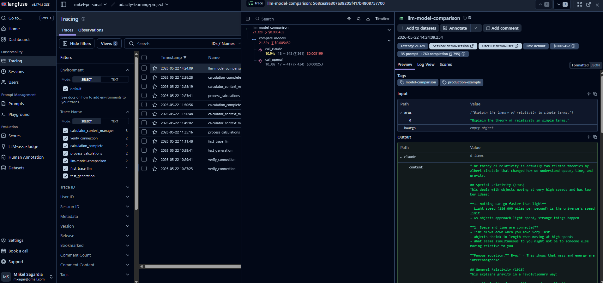

### RAG Pipeline

Files:

- [`lab/udemy-langfuse/rag_pipeline_obs.py`](./lab/udemy-langfuse/rag_pipeline_obs.py)
- [`lab/04_langfuse_rag.ipynb`](./lab/04_langfuse_rag.ipynb)

- Real applications are usually multi-step pipelines, not single LLM calls; RAG is a good example because it includes loading, chunking, embedding, retrieval, context assembly, and generation.
- Each step is traced as its own Langfuse observation so latency, inputs, outputs, metadata, and errors can be inspected independently.
- The indexing side loads Markdown files, splits them into chunks, embeds each chunk with `all-MiniLM-L6-v2`, and stores the vectors in a persistent ChromaDB collection.
- The query side embeds the user query, retrieves the top matching chunks, builds a context string with source labels, and sends the query plus context to Claude.
- Current Langfuse observation types make the trace easier to read:
  - `span` for orchestration, loading, chunking, and context assembly.
  - `embedding` for chunk and query embedding work.
  - `retriever` for ChromaDB similarity search.
  - `generation` for the final Claude call.
- Retrieval metadata includes `top_k`, number of chunks retrieved, average distance, source paths, distance scores, and content previews.
- Generation metadata includes the model, prompt/context length, input/output token counts, total tokens, and the generated answer.
- In the Langfuse UI, the trace reveals where time is spent; generation is often the slowest and most expensive step.
- Failed runs are useful too: Langfuse shows exceptions, missing outputs, and bad SDK arguments, making pipeline debugging much faster.
- This observability makes it possible to tune retrieval quality, context size, latency, and cost instead of guessing.

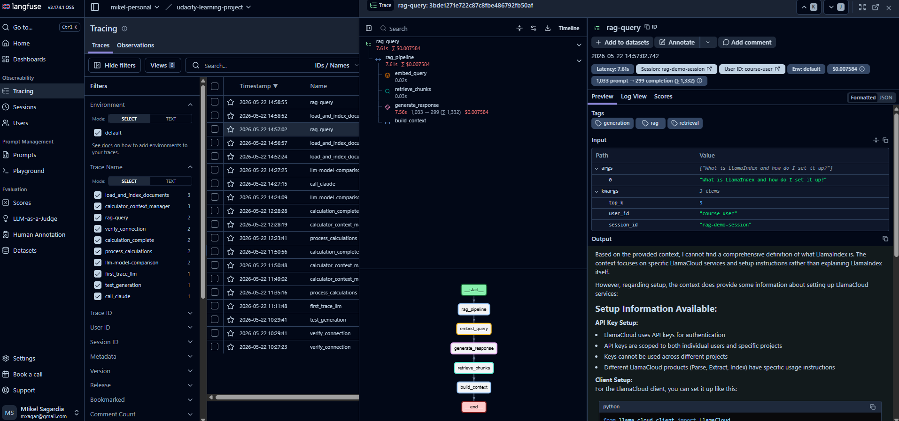

```python
from pathlib import Path
from typing import Any

import anthropic
import chromadb
from dotenv import load_dotenv
from langchain_community.document_loaders import DirectoryLoader, TextLoader
from langchain_core.documents import Document
from langchain_text_splitters import RecursiveCharacterTextSplitter
from langfuse import get_client, observe, propagate_attributes
from sentence_transformers import SentenceTransformer

load_dotenv()

# Directories need to be changed, depending on noteebook/script location
BASE_DIR = Path(".").resolve().parent
DOCS_DIR = BASE_DIR / "lab" / "udemy-langfuse" / "docs"
CHROMA_DIR = BASE_DIR / "lab" / "chroma_db"
EMBEDDING_MODEL_NAME = "all-MiniLM-L6-v2"
GENERATION_MODEL = "claude-sonnet-4-20250514"

# Langfuse reads LANGFUSE_PUBLIC_KEY, LANGFUSE_SECRET_KEY, and LANGFUSE_BASE_URL.
langfuse = get_client()

# Chroma keeps the vector index on disk so indexing can be reused across runs.
chroma = chromadb.PersistentClient(path=str(CHROMA_DIR))
collection = chroma.get_or_create_collection(
    name="documents",
    metadata={"hnsw:space": "cosine"},
)

# Load the embedding model once. all-MiniLM-L6-v2 is small and returns 384 dims.
embedding_model = SentenceTransformer(EMBEDDING_MODEL_NAME)
anthropic_client = anthropic.Anthropic()


@observe(name="load_and_index_documents", as_type="span")
def load_and_index_documents(docs_dir: str | Path = DOCS_DIR) -> int:
    """Load, chunk, embed, and index Markdown documents."""
    documents = load_markdown_docs(docs_dir)
    if not documents:
        langfuse.update_current_span(
            output={"chunks_indexed": 0},
            metadata={"reason": "no_documents"},
        )
        return 0

    chunks = chunk_documents(documents)
    chunks_indexed = index_chunks(chunks)

    langfuse.update_current_span(
        output={"chunks_indexed": chunks_indexed},
        metadata={"docs_loaded": len(documents), "chunks_created": len(chunks)},
    )
    return chunks_indexed


@observe(name="load_markdown_docs", as_type="span")
def load_markdown_docs(docs_dir: str | Path) -> list[Document]:
    """Load all Markdown files from a directory."""
    docs_path = Path(docs_dir)
    if not docs_path.exists():
        raise FileNotFoundError(f"Docs directory not found: {docs_path}")

    loader = DirectoryLoader(
        str(docs_path),
        glob="**/*.md",
        loader_cls=TextLoader,
        loader_kwargs={"encoding": "utf-8"},
        show_progress=True,
    )
    documents = loader.load()

    langfuse.update_current_span(
        output={"documents_loaded": len(documents)},
        metadata={"docs_dir": str(docs_path), "glob": "**/*.md"},
    )
    return documents


@observe(name="chunk_documents", as_type="span")
def chunk_documents(
    documents: list[Document],
    chunk_size: int = 1000,
    chunk_overlap: int = 200,
) -> list[Document]:
    """Split documents into retrieval-sized chunks."""
    text_splitter = RecursiveCharacterTextSplitter(
        chunk_size=chunk_size,
        chunk_overlap=chunk_overlap,
        separators=["\n\n", "\n", ".", "!", "?", ",", " ", ""],
    )
    chunks = text_splitter.split_documents(documents)

    langfuse.update_current_span(
        output={"chunks": len(chunks)},
        metadata={
            "documents": len(documents),
            "chunk_size": chunk_size,
            "chunk_overlap": chunk_overlap,
        },
    )
    return chunks


@observe(name="index_chunks", as_type="embedding")
def index_chunks(chunks: list[Document]) -> int:
    """Create embeddings and upsert chunks into ChromaDB."""
    ids: list[str] = []
    documents: list[str] = []
    metadatas: list[dict[str, Any]] = []
    embeddings: list[list[float]] = []

    for index, chunk in enumerate(chunks):
        chunk_id = f"chunk_{index}"
        embedding = embedding_model.encode(chunk.page_content).tolist()

        ids.append(chunk_id)
        documents.append(chunk.page_content)
        metadatas.append(
            {
                "source": chunk.metadata.get("source", "unknown"),
                "chunk_index": index,
            }
        )
        embeddings.append(embedding)

    if ids:
        collection.upsert(
            ids=ids,
            documents=documents,
            metadatas=metadatas,
            embeddings=embeddings,
        )

    langfuse.update_current_span(
        output={"chunks_indexed": len(ids)},
        metadata={
            "embedding_model": EMBEDDING_MODEL_NAME,
            "embedding_dim": len(embeddings[0]) if embeddings else 0,
            "collection": "documents",
        },
    )
    return len(ids)


@observe(name="rag_pipeline", as_type="span")
def rag_pipeline(
    query: str,
    top_k: int = 5,
    user_id: str = "demo-user",
    session_id: str | None = "rag-demo-session",
) -> str:
    """Run the full RAG query pipeline in one trace."""
    with propagate_attributes(
        user_id=user_id,
        session_id=session_id,
        tags=["rag", "retrieval", "generation"],
        metadata={"top_k": top_k, "embedding_model": EMBEDDING_MODEL_NAME},
        trace_name="rag-query",
    ):
        query_embedding = embed_query(query)
        chunks = retrieve_chunks(query_embedding, top_k=top_k)
        context = build_context(chunks)
        response = generate_response(query, context)

    langfuse.update_current_span(
        output={"response": response},
        metadata={
            "query": query,
            "chunks_retrieved": len(chunks),
            "context_length": len(context),
        },
    )
    return response


@observe(name="embed_query", as_type="embedding")
def embed_query(query: str) -> list[float]:
    """Embed the user query before vector search."""
    embedding = embedding_model.encode(query).tolist()

    langfuse.update_current_span(
        output={"embedding_dim": len(embedding)},
        metadata={"query_length": len(query), "embedding_model": EMBEDDING_MODEL_NAME},
    )
    return embedding


@observe(name="retrieve_chunks", as_type="retriever")
def retrieve_chunks(embedding: list[float], top_k: int = 5) -> list[dict[str, Any]]:
    """Retrieve relevant document chunks from ChromaDB."""
    results = collection.query(
        query_embeddings=[embedding],
        n_results=top_k,
        include=["documents", "metadatas", "distances"],
    )

    chunks: list[dict[str, Any]] = []
    documents = results.get("documents") or [[]]
    metadatas = results.get("metadatas") or [[]]
    distances = results.get("distances") or [[]]

    for index, document in enumerate(documents[0]):
        chunks.append(
            {
                "content": document,
                "metadata": metadatas[0][index],
                "distance": distances[0][index],
            }
        )

    avg_distance = (
        sum(chunk["distance"] for chunk in chunks) / len(chunks) if chunks else 0.0
    )

    langfuse.update_current_span(
        output={
            "chunks": [
                {
                    "source": chunk["metadata"].get("source", "unknown"),
                    "distance": chunk["distance"],
                    "content_preview": chunk["content"][:240],
                }
                for chunk in chunks
            ]
        },
        metadata={
            "chunks_retrieved": len(chunks),
            "top_k": top_k,
            "avg_distance": avg_distance,
        },
    )
    return chunks


@observe(name="build_context", as_type="span")
def build_context(chunks: list[dict[str, Any]]) -> str:
    """Assemble retrieved chunks into the context sent to the LLM."""
    if not chunks:
        context = "No relevant context found."
    else:
        context_parts = []
        for index, chunk in enumerate(chunks, start=1):
            source = chunk["metadata"].get("source", "unknown")
            context_parts.append(f"[Source {index} - {source}]: {chunk['content']}")
        context = "\n\n".join(context_parts)

    langfuse.update_current_span(
        output={"context_preview": context[:500]},
        metadata={"context_length": len(context), "num_chunks_used": len(chunks)},
    )
    return context


@observe(name="generate_response", as_type="generation")
def generate_response(query: str, context: str) -> str:
    """Generate an answer from the retrieved context using Claude."""
    prompt = f"""Use the following context to answer the question.
If the context doesn't contain relevant information, say so.

Context:
{context}

Question: {query}

Answer:"""

    response = anthropic_client.messages.create(
        model=GENERATION_MODEL,
        max_tokens=1024,
        messages=[{"role": "user", "content": prompt}],
    )
    answer = response.content[0].text

    langfuse.update_current_generation(
        model=GENERATION_MODEL,
        input=[{"role": "user", "content": prompt}],
        output=answer,
        usage_details={
            "input": response.usage.input_tokens,
            "output": response.usage.output_tokens,
            "total": response.usage.input_tokens + response.usage.output_tokens,
        },
        metadata={"prompt_length": len(prompt), "context_length": len(context)},
    )
    return answer


if __name__ == "__main__":
    print("Indexing documents from ./docs folder...")
    try:
        num_indexed = load_and_index_documents(DOCS_DIR)
        print(f"Indexed {num_indexed} chunks")
    except FileNotFoundError as exc:
        print(f"Error: {exc}")
        print("Create a 'docs' folder with .md files first.")
        raise SystemExit(1) from exc

    print("\nQuerying RAG pipeline...")
    result = rag_pipeline("What is LlamaIndex and how do I set it up?", top_k=5)
    print(f"\nResponse:\n{result}")

    # Always flush in scripts and notebooks so buffered observations are sent.
    langfuse.flush()
```

### LangChain Integration

Files:

- [`lab/udemy-langfuse/instrumentation_langchain.py`](./lab/udemy-langfuse/instrumentation_langchain.py)
- [`lab/05_langfuse_langchain.ipynb`](./lab/05_langfuse_langchain.ipynb)

- Langfuse can trace LangChain applications through a drop-in `CallbackHandler`.
- The handler can be attached to any LangChain runnable through the `config={"callbacks": [...]}` argument at invocation time.
- This is easier than manually instrumenting every LangChain component: chains, prompt steps, model calls, token usage, latency, metadata, tags, tools, and retrievers can be captured automatically.
- The example uses LangChain Expression Language (LCEL): `prompt | llm`.
- `ChatPromptTemplate` creates a reusable prompt with a dynamic `{topic}` variable.
- `ChatAnthropic` calls Claude through LangChain; similar wrappers exist for OpenAI and other providers.
- The code wraps the chain in `@observe(..., as_type="chain")` so the LangChain run sits inside a named parent observation.
- `propagate_attributes(...)` adds `user_id`, `session_id`, tags, metadata, and trace name for filtering and analysis in Langfuse.
- The helper `create_langfuse_handler(...)` supports both the current documented `langfuse_client=` constructor and installed SDK versions that only accept `trace_context=`.
- In the Langfuse UI, the trace shows the parent chain, prompt formatting, Anthropic generation, latency, token usage, input prompt, model response, and cost dashboards by model/use case/user where available.
- `langfuse.flush()` is required in notebooks and short-lived scripts so buffered observations are sent before the process exits.

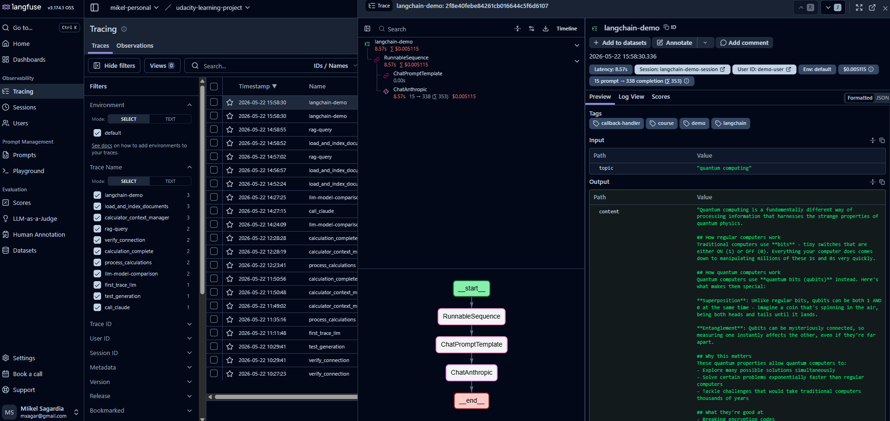

```python
from inspect import signature
from typing import Any

from dotenv import load_dotenv
from langchain_anthropic import ChatAnthropic
from langchain_core.prompts import ChatPromptTemplate
from langfuse import Langfuse, get_client, observe, propagate_attributes
from langfuse.langchain import CallbackHandler

load_dotenv()

# Langfuse reads LANGFUSE_PUBLIC_KEY, LANGFUSE_SECRET_KEY, and LANGFUSE_BASE_URL.
langfuse = get_client()


def create_langfuse_handler(trace_seed: str) -> CallbackHandler:
    """Create a Langfuse LangChain callback handler.

    Newer Langfuse SDK versions accept `langfuse_client=...`; some installed
    versions accept only `trace_context=...`. This keeps the example compatible
    while still using the current callback-based integration pattern.
    """
    trace_context = {"trace_id": Langfuse.create_trace_id(seed=trace_seed)}
    handler_params = signature(CallbackHandler).parameters

    if "langfuse_client" in handler_params:
        return CallbackHandler(
            langfuse_client=langfuse,
            trace_context=trace_context,
        )

    return CallbackHandler(trace_context=trace_context)


@observe(name="run_langchain_example", as_type="chain")
def run_langchain_example(
    topic: str = "quantum computing",
    user_id: str = "demo-user",
    session_id: str | None = "langchain-demo-session",
) -> str:
    """Run a LangChain LCEL chain and trace it with Langfuse."""
    handler = create_langfuse_handler(trace_seed=f"langchain-{topic}")

    # Trace-level attributes are propagated to the observed wrapper and child
    # LangChain callback observations where supported by the SDK.
    with propagate_attributes(
        user_id=user_id,
        session_id=session_id,
        tags=["langchain", "callback-handler", "demo"],
        metadata={"topic": topic, "framework": "langchain"},
        trace_name="langchain-demo",
    ):
        # ChatAnthropic is the LangChain chat-model wrapper for Anthropic.
        llm = ChatAnthropic(model="claude-sonnet-4-20250514")

        # The prompt variable name must match the dict passed to chain.invoke().
        prompt = ChatPromptTemplate.from_template(
            "Explain {topic} in simple terms."
        )
        chain = prompt | llm

        # Attach the Langfuse callback at invocation time. The callback captures
        # the prompt step, model generation, token usage, latency, metadata, and tags.
        response = chain.invoke(
            {"topic": topic},
            config={
                "callbacks": [handler],
                "metadata": {"use_case": "langchain_example"},
                "tags": ["course", "langchain"],
            },
        )

    langfuse.update_current_span(
        output={"content": response.content},
        metadata={"topic": topic},
    )
    return response.content


if __name__ == "__main__":
    answer = run_langchain_example("quantum computing")
    print(answer)

    # Always flush in scripts and notebooks so buffered observations are sent.
    langfuse.flush()
```

## 5. Cost Optimization Strategies

### Overview

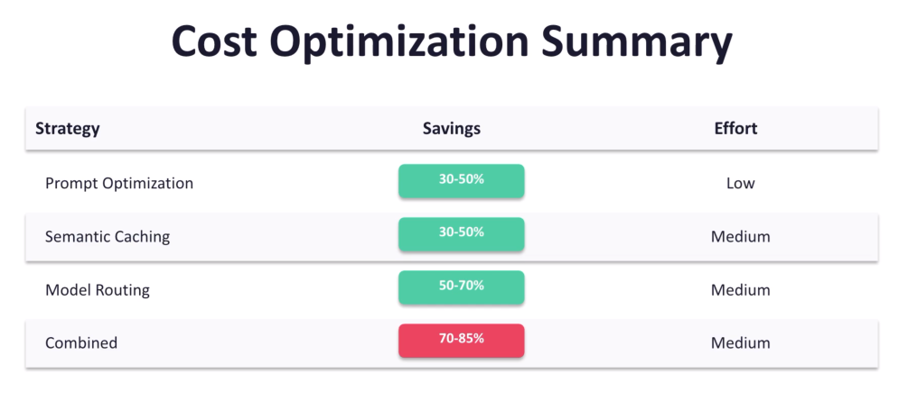

- This section focuses on cost optimization strategies that work in real LLM systems:
  - Prompt optimization to reduce unnecessary input/output tokens.
  - Semantic caching to avoid redundant model calls.
  - Smart model routing to send each task to the cheapest model that can handle it.
- Approximate savings and effort:
  - **Prompt optimization**: `30-50%` savings, low effort.
  - **Semantic caching**: `30-50%` savings, medium effort.
  - **Smart model routing**: `50-70%` savings, medium effort.
  - **Combined strategy**: `70-85%` savings, medium effort.
- Recommended implementation order:
  - Start with prompt optimization because it is free and requires no infrastructure.
  - Add caching for common or repeated queries so the system avoids unnecessary generation calls.
  - Add routing for mixed workloads so simple tasks use cheaper models.
  - Monitor and iterate continuously with Langfuse to verify whether caching, routing, and prompt changes are actually working.
- Prompt optimization is about prompt quality, not prompt length:
  - Bloated prompts often repeat obvious instructions such as "as an AI assistant."
  - A verbose prompt can be reduced from about `89` tokens to about `13` tokens.
  - That example is an `85%` prompt-token reduction and can contribute to `30-50%` total cost reduction.
- Semantic caching matches queries by meaning, not exact text:
  - "What's your return policy?" and "How do I return something?" are different strings but similar intents.
  - Similarity-based caching can produce `30-50%` cache hit rates in production.
  - A typical similarity threshold is around `0.92`.
  - A typical TTL is around `24` hours for many use cases.
- Smart model routing is high leverage:
  - Many systems can route `70-80%` of requests to cheaper models.
  - Route by task type (using a cheap model): classification, extraction, and simple requests often do not need premium models.
  - Start with the cheapest acceptable model and upgrade only when quality suffers.
  - Use A/B testing and observed quality/cost data to tune routing thresholds.
- The goal is a workflow that optimizes prompt shape, caching behavior, and model choice automatically while Langfuse tracks cost, quality, and performance.

Notebook: [`lab/06_cost_optimization.ipynb`](./lab/06_cost_optimization.ipynb). This notebook contains the code of the following sections, which is also available in separate file:

- [`lab/udemy-langfuse/prompt_optimization.py`](./lab/udemy-langfuse/prompt_optimization.py)
- [`lab/udemy-langfuse/semantic_cache.py`](./lab/udemy-langfuse/semantic_cache.py)
- [`lab/udemy-langfuse/model_routing.py`](./lab/udemy-langfuse/model_routing.py)

### Prompt Optimization

File: [`lab/udemy-langfuse/prompt_optimization.py`](./lab/udemy-langfuse/prompt_optimization.py).

- Prompt optimization removes obvious bloat before requests reach the LLM.
- The goal is not to make prompts vague; it is to keep only instructions that affect output quality.
- Common filler phrases often add tokens without adding value, for example:
  - `I want you to`
  - `You are a highly intelligent`
  - `Please note that`
  - `It's important to remember that`
  - `In your response, make sure to`
  - `As an AI assistant,`
- The helper also collapses excessive whitespace and removes repeated sentence-level instructions.
- Manual review is still the real optimization step; the helper catches obvious mechanical bloat only.
- Useful review questions:
  - Does the model actually need this instruction?
  - Can the same instruction be said in fewer words?
  - Is this repeated elsewhere in the prompt?
  - Am I sending context the model will not use?
- The updated helper records before/after prompt size, estimated tokens, and estimated reduction percentage in Langfuse with `@observe(..., as_type="span")`.

```python
import re

from dotenv import load_dotenv
from langfuse import get_client, observe

load_dotenv()

langfuse = get_client()

# Common phrases that usually add tokens without adding useful instruction.
FILLER_PHRASES = [
    "I want you to",
    "You are a highly intelligent",
    "Please note that",
    "It's important to remember that",
    "In your response, make sure to",
    "As an AI assistant,",
]


def estimate_tokens(text: str) -> int:
    """Estimate token count without adding tokenizer dependencies."""
    return max(1, round(len(text) / 4)) if text else 0


@observe(name="optimize_prompt", as_type="span")
def optimize_prompt(prompt: str) -> str:
    """Remove obvious prompt bloat while preserving unique instructions.

    This is not a replacement for manual prompt review; it only catches common
    filler phrases, excess whitespace, and repeated sentence-level instructions.
    """
    original_prompt = prompt

    # Remove common filler phrases with case-insensitive matching.
    optimized = prompt
    for filler in FILLER_PHRASES:
        optimized = re.sub(re.escape(filler), "", optimized, flags=re.IGNORECASE)

    # Collapse repeated whitespace introduced by removals.
    optimized = " ".join(optimized.split())

    # Remove repeated sentence-level instructions while preserving order.
    sentences = re.split(r"(?<=[.!?])\s+", optimized)
    seen: set[str] = set()
    unique_sentences: list[str] = []
    for sentence in sentences:
        normalized = sentence.strip().lower()
        if normalized and normalized not in seen:
            seen.add(normalized)
            unique_sentences.append(sentence.strip())

    optimized = " ".join(unique_sentences)

    original_tokens = estimate_tokens(original_prompt)
    optimized_tokens = estimate_tokens(optimized)
    reduction_pct = (
        ((original_tokens - optimized_tokens) / original_tokens) * 100
        if original_tokens
        else 0.0
    )

    # Record the optimization metrics in the current Langfuse span.
    langfuse.update_current_span(
        input={"prompt": original_prompt},
        output={"optimized_prompt": optimized},
        metadata={
            "original_chars": len(original_prompt),
            "optimized_chars": len(optimized),
            "estimated_original_tokens": original_tokens,
            "estimated_optimized_tokens": optimized_tokens,
            "estimated_token_reduction_pct": round(reduction_pct, 2),
            "fillers_checked": FILLER_PHRASES,
        },
    )

    return optimized


if __name__ == "__main__":
    bloated_prompt = """
    As an AI assistant, I want you to explain observability.
    Please note that it's important to remember that in your response, make sure to be accurate.
    In your response, make sure to be accurate.
    Be concise.
    """

    optimized_prompt = optimize_prompt(bloated_prompt)
    print("Original:")
    print(bloated_prompt.strip())
    print("\nOptimized:")
    print(optimized_prompt)

    # Flush in short-lived scripts so the span is sent to Langfuse.
    langfuse.flush()
```

### Semantic Caching

File: [`lab/udemy-langfuse/semantic_cache.py`](./lab/udemy-langfuse/semantic_cache.py).

- Semantic caching is a major cost lever because repeated or similar user questions can reuse previous answers instead of calling the LLM again.
- It matches by meaning, not exact text:
  - `What's your return policy?`
  - `How do I return something?`
  - These are different strings but can map to the same cached answer.
- The cache stores query embeddings and responses in a persistent ChromaDB collection so cache entries survive across script runs.
- `all-MiniLM-L6-v2` creates small local embeddings for cache lookup.
- A similarity threshold decides whether a query is close enough to reuse a cached answer.
  - The overview used `0.92` as a typical production threshold.
  - The demo uses `0.85` to make semantic matches easier to see.
- A TTL prevents stale answers from being reused; the default is `24` hours.
- Cache flow:
  - Embed the incoming query.
  - Search the vector cache for the closest previous query.
  - Convert cosine distance to similarity.
  - Reject the cache entry if it is below threshold or expired.
  - Return the cached response on hit, or call Claude and store the response on miss.
- The simulation groups semantically similar questions about Python list comprehensions, supervised vs. unsupervised learning, and REST APIs.
- First runs usually produce misses; later runs can hit the persistent cache and avoid API calls.
- In production, semantic caching commonly targets `30-50%` cache hit rates and corresponding cost reduction for repeated query patterns.
- Langfuse traces cache lookup, cache set, LLM calls, hit/miss status, similarity score, TTL age, and saved API calls.

```python
from dataclasses import dataclass
from datetime import datetime, timedelta, timezone
import hashlib
import json
from pathlib import Path
from typing import Any

import anthropic
import chromadb
from dotenv import load_dotenv
from langfuse import get_client, observe
from sentence_transformers import SentenceTransformer

load_dotenv()

BASE_DIR = Path(__file__).resolve().parent
CACHE_DIR = BASE_DIR / "chroma_cache_db"
EMBEDDING_MODEL_NAME = "all-MiniLM-L6-v2"
GENERATION_MODEL = "claude-sonnet-4-20250514"

anthropic_client = anthropic.Anthropic()
langfuse = get_client()


@dataclass
class CacheLookup:
    """Result returned by the semantic cache lookup."""

    response: str
    similarity: float
    cached_query: str
    age_seconds: float


@observe(name="call_claude_for_cache_miss", as_type="generation")
def call_claude(query: str) -> str:
    """Call Claude only when the semantic cache misses."""
    response = anthropic_client.messages.create(
        model=GENERATION_MODEL,
        max_tokens=1024,
        messages=[{"role": "user", "content": query}],
    )
    response_text = response.content[0].text

    langfuse.update_current_generation(
        model=GENERATION_MODEL,
        input=[{"role": "user", "content": query}],
        output=response_text,
        usage_details={
            "input": response.usage.input_tokens,
            "output": response.usage.output_tokens,
            "total": response.usage.input_tokens + response.usage.output_tokens,
        },
        metadata={"cache_hit": False},
    )
    return response_text


class SemanticCache:
    """Persistent ChromaDB-backed semantic response cache."""

    def __init__(
        self,
        similarity_threshold: float = 0.92,
        ttl_hours: int = 24,
        persist_directory: str | Path = CACHE_DIR,
    ) -> None:
        self.client = chromadb.PersistentClient(path=str(persist_directory))
        self.collection = self.client.get_or_create_collection(
            name="llm_cache",
            metadata={"hnsw:space": "cosine"},
        )
        self.encoder = SentenceTransformer(EMBEDDING_MODEL_NAME)
        self.threshold = similarity_threshold
        self.ttl = timedelta(hours=ttl_hours)

    def _get_embedding(self, text: str) -> list[float]:
        return self.encoder.encode(text).tolist()

    def _is_expired(self, timestamp: str) -> tuple[bool, float]:
        cached_time = datetime.fromisoformat(timestamp)
        if cached_time.tzinfo is None:
            cached_time = cached_time.replace(tzinfo=timezone.utc)

        age = datetime.now(timezone.utc) - cached_time
        return age > self.ttl, age.total_seconds()

    @observe(name="semantic_cache_get", as_type="retriever")
    def get(self, query: str) -> CacheLookup | None:
        """Return a cached response when a semantically similar query exists."""
        query_embedding = self._get_embedding(query)
        results = self.collection.query(
            query_embeddings=[query_embedding],
            n_results=1,
            include=["documents", "metadatas", "distances"],
        )

        documents = results.get("documents") or [[]]
        metadatas = results.get("metadatas") or [[]]
        distances = results.get("distances") or [[]]

        if not documents[0]:
            langfuse.update_current_span(
                output={"cache_hit": False},
                metadata={"reason": "empty_cache", "threshold": self.threshold},
            )
            return None

        distance = distances[0][0]
        similarity = 1 - distance
        metadata = metadatas[0][0]
        expired, age_seconds = self._is_expired(metadata["timestamp"])

        if similarity < self.threshold:
            langfuse.update_current_span(
                output={"cache_hit": False},
                metadata={
                    "reason": "below_threshold",
                    "similarity": similarity,
                    "threshold": self.threshold,
                    "cached_query": documents[0][0],
                },
            )
            return None

        if expired:
            langfuse.update_current_span(
                output={"cache_hit": False},
                metadata={
                    "reason": "expired",
                    "similarity": similarity,
                    "ttl_hours": self.ttl.total_seconds() / 3600,
                    "age_seconds": age_seconds,
                    "cached_query": documents[0][0],
                },
            )
            return None

        cached_response = json.loads(metadata["response"])
        lookup = CacheLookup(
            response=cached_response,
            similarity=similarity,
            cached_query=documents[0][0],
            age_seconds=age_seconds,
        )

        langfuse.update_current_span(
            output={
                "cache_hit": True,
                "cached_query": lookup.cached_query,
                "response_preview": lookup.response[:240],
            },
            metadata={
                "similarity": lookup.similarity,
                "threshold": self.threshold,
                "age_seconds": lookup.age_seconds,
            },
        )
        return lookup

    @observe(name="semantic_cache_set", as_type="embedding")
    def set(
        self,
        query: str,
        response: str,
        metadata: dict[str, Any] | None = None,
    ) -> None:
        """Store a query embedding and response for future semantic matches."""
        query_embedding = self._get_embedding(query)
        doc_id = hashlib.sha256(query.encode("utf-8")).hexdigest()
        timestamp = datetime.now(timezone.utc).isoformat()

        self.collection.upsert(
            ids=[doc_id],
            embeddings=[query_embedding],
            documents=[query],
            metadatas=[
                {
                    "response": json.dumps(response),
                    "timestamp": timestamp,
                    **(metadata or {}),
                }
            ],
        )

        langfuse.update_current_span(
            output={"cached": True, "doc_id": doc_id},
            metadata={
                "query_length": len(query),
                "embedding_model": EMBEDDING_MODEL_NAME,
                "embedding_dim": len(query_embedding),
                "timestamp": timestamp,
            },
        )


cache = SemanticCache(similarity_threshold=0.85)


@observe(name="cached_llm_call", as_type="span")
def cached_llm_call(query: str) -> str:
    """Check semantic cache before calling the LLM."""
    cached = cache.get(query)
    if cached:
        langfuse.update_current_span(
            output={"response": cached.response},
            metadata={
                "cache_hit": True,
                "similarity": cached.similarity,
                "cached_query": cached.cached_query,
                "api_call_saved": True,
            },
        )
        print(f"  CACHE HIT - similarity: {cached.similarity:.2%}")
        return cached.response

    print("  CACHE MISS - calling Claude API")
    response = call_claude(query)
    cache.set(query, response, metadata={"source": "claude"})

    langfuse.update_current_span(
        output={"response": response},
        metadata={"cache_hit": False, "api_call_saved": False},
    )
    return response


@observe(name="simulate_semantic_cache", as_type="span")
def simulate_semantic_cache() -> dict[str, float | int]:
    """Demonstrate semantic cache hits with similar questions."""
    question_groups = [
        {
            "topic": "Python Programming",
            "questions": [
                "What is a Python list comprehension?",
                "Explain list comprehensions in Python",
                "How do list comprehensions work in Python?",
                "What are Python list comprehensions and how to use them?",
            ],
        },
        {
            "topic": "Machine Learning",
            "questions": [
                "What is the difference between supervised and unsupervised learning?",
                "Explain supervised vs unsupervised machine learning",
                "How does supervised learning differ from unsupervised learning?",
                "Compare supervised and unsupervised learning in ML",
            ],
        },
        {
            "topic": "API Concepts",
            "questions": [
                "What is a REST API?",
                "Explain what REST APIs are",
                "What does REST API mean?",
                "Can you describe what a RESTful API is?",
            ],
        },
    ]

    total_queries = 0
    cache_hits = 0
    cache_misses = 0

    for group in question_groups:
        print(f"\nTopic: {group['topic']}")
        for question in group["questions"]:
            total_queries += 1
            print(f'Query {total_queries}: "{question}"')

            before = cache.get(question)
            if before:
                cache_hits += 1
            else:
                cache_misses += 1

            response = cached_llm_call(question)
            display_response = response[:120] + "..." if len(response) > 120 else response
            print(f"  Response: {display_response}")

    hit_rate = (cache_hits / total_queries * 100) if total_queries else 0.0
    summary = {
        "total_queries": total_queries,
        "cache_hits": cache_hits,
        "cache_misses": cache_misses,
        "hit_rate_pct": round(hit_rate, 2),
        "api_calls_saved": cache_hits,
    }

    langfuse.update_current_span(output=summary, metadata=summary)

    print("\nCache performance summary")
    for key, value in summary.items():
        print(f"  {key}: {value}")

    return summary


if __name__ == "__main__":
    simulate_semantic_cache()

    # Flush in short-lived scripts so spans are sent to Langfuse.
    langfuse.flush()
```

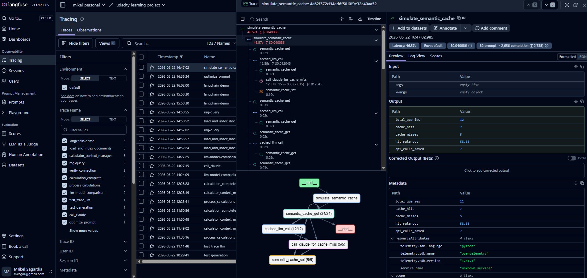

### Smart Model Routing

File: [`lab/udemy-langfuse/model_routing.py`](./lab/udemy-langfuse/model_routing.py).

Smart routing automatically selects the cheapest model that should be able to handle each request.

- Define task classes with an enum: `SIMPLE` for yes/no or classification, `MODERATE` for summarization or extraction, `COMPLEX` for analysis and reasoning, `CODE` for programming tasks, and `CREATIVE` for writing tasks.
- Map each task type to a preferred model tier; the mapping can be expanded with more providers or domain-specific models.
- Classify prompts with simple regex patterns: yes/no and classification terms route to simple models, programming verbs and language names route to code models, reasoning terms route to complex models, and story/poem/blog language routes to creative models.
- Keep an `override_model` option for cases where business rules, evaluation results, or user preferences should bypass automatic routing.
- Trace both levels in Langfuse: the outer router span stores the detected task type, selected model, provider, token counts, estimated cost, and latency; the provider call is recorded as a generation.
- In the Langfuse UI, the metadata shows why a request was routed to a model, for example a simple yes/no prompt to Haiku and a Python coding prompt to Sonnet.
- This saves cost by avoiding expensive models for small tasks while still routing code or reasoning prompts to stronger models.

```python
import re
import time
from dataclasses import dataclass
from enum import Enum
from typing import Optional

from anthropic import Anthropic
from dotenv import load_dotenv
from langfuse import get_client, observe
from openai import OpenAI

load_dotenv()


class TaskType(Enum):
    SIMPLE = "simple"  # Yes/no answers and basic classification.
    MODERATE = "moderate"  # Summarization and information extraction.
    COMPLEX = "complex"  # Analysis, comparison, and reasoning.
    CODE = "code"  # Code generation or debugging.
    CREATIVE = "creative"  # Creative writing tasks.


@dataclass
class ModelCallResult:
    """Normalized response data across Anthropic and OpenAI calls."""

    content: str
    provider: str
    model: str
    input_tokens: int
    output_tokens: int
    total_tokens: int
    estimated_cost: float
    duration_ms: float


PRICING = {
    # Prices are USD per 1M tokens; keep this table aligned with vendor pricing pages.
    "claude-haiku-4-5-20251001": {"input": 1.00, "output": 5.00},
    "claude-sonnet-4-6": {"input": 3.00, "output": 15.00},
    "gpt-4o-mini": {"input": 0.15, "output": 0.60},
    "gpt-4o": {"input": 2.50, "output": 10.00},
}


class ModelRouter:
    """Route requests to the lowest-cost model that should handle the task."""

    MODELS = {
        TaskType.SIMPLE: "claude-haiku-4-5-20251001",
        TaskType.MODERATE: "gpt-4o-mini",
        TaskType.CODE: "claude-sonnet-4-6",
        TaskType.COMPLEX: "claude-sonnet-4-6",
        TaskType.CREATIVE: "gpt-4o",
    }

    def classify_task(self, prompt: str) -> TaskType:
        """Classify a prompt with simple, explainable keyword patterns."""

        prompt_lower = prompt.lower()

        simple_patterns = [
            r"\b(yes or no)\b",
            r"\b(true or false)\b",
            r"\b(classify|categorize)\b",
            r"^is (this|it|the)",
            r"\b(which one|choose|select)\b",
        ]
        if any(re.search(pattern, prompt_lower) for pattern in simple_patterns):
            return TaskType.SIMPLE

        code_patterns = [
            r"\b(write|create|generate|fix|debug).*(code|function|class|script)\b",
            r"\b(python|javascript|typescript|java|rust)\b",
            r"```",
        ]
        if any(re.search(pattern, prompt_lower) for pattern in code_patterns):
            return TaskType.CODE

        complex_patterns = [
            r"\b(analyze|evaluate|compare|critique)\b",
            r"\b(why|how).*(work|happen|cause)\b",
            r"\b(pros and cons|trade-?offs)\b",
            r"\b(explain.*(detail|depth))\b",
        ]
        if any(re.search(pattern, prompt_lower) for pattern in complex_patterns):
            return TaskType.COMPLEX

        creative_patterns = [
            r"\b(write|create|compose).*(story|poem|essay|blog)\b",
            r"\b(creative|imaginative|original)\b",
        ]
        if any(re.search(pattern, prompt_lower) for pattern in creative_patterns):
            return TaskType.CREATIVE

        return TaskType.MODERATE

    def route(self, prompt: str, override_model: Optional[str] = None) -> str:
        """Return an explicit override or the model mapped to the detected task."""

        if override_model:
            return override_model

        task_type = self.classify_task(prompt)
        return self.MODELS[task_type]


langfuse = get_client()
router = ModelRouter()
anthropic_client = Anthropic()
openai_client = OpenAI()


def estimate_cost(model: str, input_tokens: int, output_tokens: int) -> float:
    """Estimate provider cost from the local pricing table."""

    pricing = PRICING.get(model, {"input": 0.0, "output": 0.0})
    return (
        input_tokens * pricing["input"] / 1_000_000
        + output_tokens * pricing["output"] / 1_000_000
    )


@observe(name="call_claude_routed", as_type="generation")
def call_claude(prompt: str, model: str, max_tokens: int = 1024) -> ModelCallResult:
    """Call Anthropic and record the provider request as a Langfuse generation."""

    start = time.perf_counter()
    response = anthropic_client.messages.create(
        model=model,
        max_tokens=max_tokens,
        messages=[{"role": "user", "content": prompt}],
    )

    content = response.content[0].text
    input_tokens = response.usage.input_tokens
    output_tokens = response.usage.output_tokens
    total_tokens = input_tokens + output_tokens
    cost = estimate_cost(model, input_tokens, output_tokens)
    duration_ms = (time.perf_counter() - start) * 1000

    langfuse.update_current_generation(
        model=model,
        input=[{"role": "user", "content": prompt}],
        output=content,
        usage_details={
            "input": input_tokens,
            "output": output_tokens,
            "total": total_tokens,
        },
        cost_details={"total": cost},
        metadata={"provider": "anthropic", "duration_ms": duration_ms},
    )

    return ModelCallResult(
        content=content,
        provider="anthropic",
        model=model,
        input_tokens=input_tokens,
        output_tokens=output_tokens,
        total_tokens=total_tokens,
        estimated_cost=cost,
        duration_ms=duration_ms,
    )


@observe(name="call_openai_routed", as_type="generation")
def call_openai(prompt: str, model: str) -> ModelCallResult:
    """Call OpenAI and record the provider request as a Langfuse generation."""

    start = time.perf_counter()
    response = openai_client.chat.completions.create(
        model=model,
        messages=[{"role": "user", "content": prompt}],
    )

    content = response.choices[0].message.content or ""
    input_tokens = response.usage.prompt_tokens if response.usage else 0
    output_tokens = response.usage.completion_tokens if response.usage else 0
    total_tokens = response.usage.total_tokens if response.usage else 0
    cost = estimate_cost(model, input_tokens, output_tokens)
    duration_ms = (time.perf_counter() - start) * 1000

    langfuse.update_current_generation(
        model=model,
        input=[{"role": "user", "content": prompt}],
        output=content,
        usage_details={
            "input": input_tokens,
            "output": output_tokens,
            "total": total_tokens,
        },
        cost_details={"total": cost},
        metadata={"provider": "openai", "duration_ms": duration_ms},
    )

    return ModelCallResult(
        content=content,
        provider="openai",
        model=model,
        input_tokens=input_tokens,
        output_tokens=output_tokens,
        total_tokens=total_tokens,
        estimated_cost=cost,
        duration_ms=duration_ms,
    )


@observe(name="routed_llm_call", as_type="span")
def routed_llm_call(prompt: str, override_model: Optional[str] = None) -> str:
    """Classify the prompt, route it, call the provider, and trace the decision."""

    task_type = router.classify_task(prompt)
    selected_model = router.route(prompt, override_model)

    if selected_model.startswith("claude"):
        result = call_claude(prompt, model=selected_model)
    else:
        result = call_openai(prompt, model=selected_model)

    langfuse.update_current_span(
        input={"prompt": prompt, "override_model": override_model},
        output={"content": result.content},
        metadata={
            "task_type": task_type.value,
            "routed_model": selected_model,
            "override_used": override_model is not None,
            "provider": result.provider,
            "input_tokens": result.input_tokens,
            "output_tokens": result.output_tokens,
            "total_tokens": result.total_tokens,
            "estimated_cost": result.estimated_cost,
            "duration_ms": result.duration_ms,
        },
    )

    return result.content


if __name__ == "__main__":
    examples = [
        "Is 2 + 2 = 4? Yes or no",
        "Write a Python function to sort a list",
    ]

    for prompt in examples:
        print(f"\nPrompt: {prompt}")
        print(routed_llm_call(prompt))

    langfuse.flush()
```


## 6. Monitoring, Alerting, and Debugging

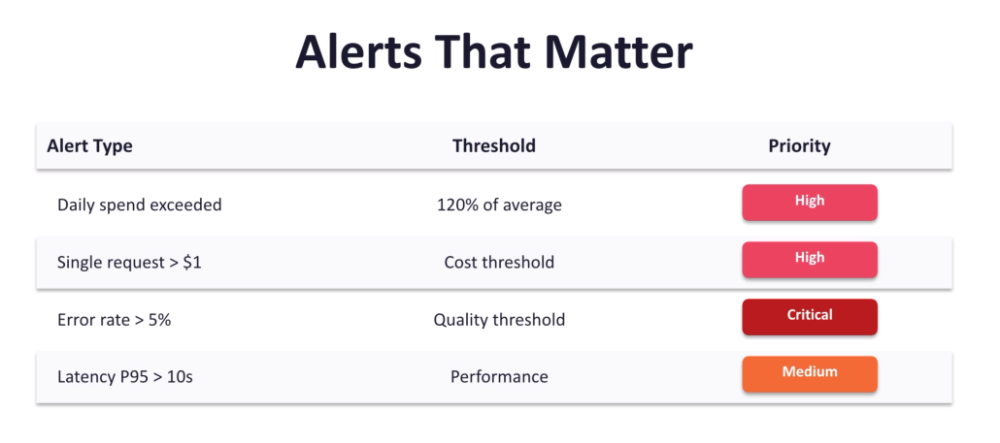

File: [`lab/udemy-langfuse/alert_webhook.py`](./lab/udemy-langfuse/alert_webhook.py)

- Alerts should tell the team about production issues before users notice them, but noisy alerts quickly become ignored.
- Useful alert types include:
  - **Daily spend exceeded**: trigger around `120%` of the average daily spend; high priority.
  - **Single request cost spike**: trigger when one request exceeds a cost threshold, for example `$1`; high priority.
  - **Error rate**: trigger when errors exceed a threshold such as `5%`; critical priority.
  - **Quality threshold**: trigger when eval or feedback scores fall below acceptable levels; critical priority.
  - **Latency p95**: trigger when p95 latency exceeds a target such as `10s`; medium priority.
- Debugging with traces gives full request visibility so bottlenecks can be found quickly:
  - Slow retrieval spans show where latency is introduced.
  - Retrieval metadata can reveal excessive chunk counts, such as retrieving `50` chunks when fewer are enough.
  - Retrieved documents and model inputs help identify hallucination sources and bad indexed content.
- Dashboards should cover three core dimensions:
  - **Cost**: cost by model, feature, user, and trend over time.
  - **Performance**: p50/p95/p99 latency, errors, and cache hit rates.
  - **Quality**: eval scores, hallucination rate, and user feedback.
- Webhooks connect monitoring to action: when a threshold is crossed, the app sends a structured payload to a receiver such as webhook.site, Slack, Discord, PagerDuty, Opsgenie, or an internal API.
- The example below simulates hourly LLM spend and sends a webhook alert when the configured threshold is exceeded.
- The webhook URL is read from `ALERT_WEBHOOK_URL` instead of being hardcoded, and the alert check itself is traced in Langfuse.

```python
"""Send a webhook alert when a simulated LLM cost threshold is exceeded."""

from __future__ import annotations

import os
from dataclasses import dataclass, asdict
from datetime import datetime, timezone

import requests
from dotenv import load_dotenv
from langfuse import get_client, observe

load_dotenv()

langfuse = get_client()


@dataclass
class CostAlert:
    """Payload sent to the alert webhook."""

    text: str
    timestamp: str
    alert_type: str
    details: dict[str, str]


def get_required_webhook_url() -> str:
    """Read the webhook URL from the environment instead of hardcoding secrets."""

    webhook_url = os.getenv("ALERT_WEBHOOK_URL")
    if not webhook_url:
        raise RuntimeError(
            "Set ALERT_WEBHOOK_URL to a webhook.site, Slack, PagerDuty, "
            "or local ngrok webhook endpoint."
        )
    return webhook_url


def build_cost_alert(hourly_cost: float, threshold: float) -> CostAlert:
    """Create a structured alert payload that any webhook receiver can parse."""

    overage = hourly_cost - threshold
    return CostAlert(
        text=f"Cost Alert: ${hourly_cost:.2f} spent in the last hour",
        timestamp=datetime.now(timezone.utc).isoformat(),
        alert_type="cost_spike",
        details={
            "hourly_cost": f"${hourly_cost:.2f}",
            "threshold": f"${threshold:.2f}",
            "overage": f"${overage:.2f}",
            "dashboard": os.getenv("LANGFUSE_DASHBOARD_URL", "https://cloud.langfuse.com"),
        },
    )


@observe(name="send_alert_webhook", as_type="span")
def send_alert_webhook(alert: CostAlert, webhook_url: str) -> requests.Response:
    """Send the alert and record the delivery status in Langfuse."""

    response = requests.post(webhook_url, json=asdict(alert), timeout=10)

    langfuse.update_current_span(
        input={"webhook_url_configured": bool(webhook_url), "alert": asdict(alert)},
        output={"status_code": response.status_code, "ok": response.ok},
        metadata={
            "alert_type": alert.alert_type,
            "delivery_target": webhook_url.split("?")[0],
        },
    )

    response.raise_for_status()
    return response


@observe(name="check_costs_and_alert", as_type="span")
def check_costs_and_alert(
    hourly_cost: float | None = None,
    threshold: float | None = None,
    webhook_url: str | None = None,
) -> bool:
    """Monitor LLM costs and send an alert when the threshold is exceeded."""

    hourly_cost = hourly_cost or float(os.getenv("SIMULATED_HOURLY_COST", "15.50"))
    threshold = threshold or float(os.getenv("ALERT_COST_THRESHOLD", "10.00"))

    print(f"Current hourly cost: ${hourly_cost:.2f}")
    print(f"Threshold: ${threshold:.2f}")

    should_alert = hourly_cost > threshold

    langfuse.update_current_span(
        input={"hourly_cost": hourly_cost, "threshold": threshold},
        metadata={
            "alert_type": "cost_spike",
            "should_alert": should_alert,
            "overage": max(hourly_cost - threshold, 0.0),
        },
    )

    if not should_alert:
        print("Costs are within budget. No alert needed.")
        langfuse.update_current_span(output={"alert_sent": False})
        return False

    print("Cost spike detected. Sending alert.")
    alert = build_cost_alert(hourly_cost, threshold)
    response = send_alert_webhook(alert, webhook_url or get_required_webhook_url())

    print(f"Alert sent. Webhook status: {response.status_code}")
    langfuse.update_current_span(output={"alert_sent": True, "status_code": response.status_code})
    return True


if __name__ == "__main__":
    try:
        check_costs_and_alert()
    finally:
        langfuse.flush()
```

### Local Webhook Server

Use webhook.site for a quick external test, or run a small local receiver when you want to inspect and control the alert handling code yourself.

1. Install the local server dependencies:

```bash
pip install fastapi uvicorn ngrok
```

2. Create a simple receiver, for example `local_alert_receiver.py`:

```python
from datetime import datetime, timezone
from typing import Any

from fastapi import FastAPI, Request

app = FastAPI()
received_alerts: list[dict[str, Any]] = []


@app.post("/langfuse-alert")
async def receive_langfuse_alert(request: Request) -> dict[str, Any]:
    payload = await request.json()
    received_alerts.append(
        {
            "received_at": datetime.now(timezone.utc).isoformat(),
            "payload": payload,
        }
    )
    print("Received alert:", payload)
    return {"ok": True, "received": payload.get("alert_type")}


@app.get("/alerts")
def list_alerts() -> list[dict[str, Any]]:
    return received_alerts
```

3. Start the FastAPI server:

```bash
uvicorn local_alert_receiver:app --reload --port 8000
```

4. In a second terminal, expose it with ngrok:

```bash
ngrok http 8000
```

5. Copy the ngrok HTTPS forwarding URL and point the alert script at the FastAPI route:

```bash
set ALERT_WEBHOOK_URL=https://YOUR-NGROK-DOMAIN.ngrok-free.app/langfuse-alert
python alert_webhook.py
```

On PowerShell, use:

```powershell
$env:ALERT_WEBHOOK_URL = "https://YOUR-NGROK-DOMAIN.ngrok-free.app/langfuse-alert"
python .\alert_webhook.py
```

The alert script does not need structural changes for local FastAPI + ngrok because it already posts JSON to `ALERT_WEBHOOK_URL`. Only the target URL changes. If the local receiver expects a different payload shape, change `build_cost_alert()` to match that contract, for example:

```python
def build_cost_alert(hourly_cost: float, threshold: float) -> CostAlert:
    return CostAlert(
        text=f"Cost Alert: ${hourly_cost:.2f} spent in the last hour",
        timestamp=datetime.now(timezone.utc).isoformat(),
        alert_type="cost_spike",
        details={
            "metric": "llm_hourly_cost",
            "value": f"{hourly_cost:.2f}",
            "threshold": f"{threshold:.2f}",
            "severity": "high",
            "dashboard_url": os.getenv("LANGFUSE_DASHBOARD_URL", "https://cloud.langfuse.com"),
        },
    )
```

## 7. Production Patterns and Security

File: [`lab/udemy-langfuse/pii_redaction.py`](./lab/udemy-langfuse/pii_redaction.py)

- Before shipping LLM observability to production, treat prompts and responses as sensitive logs.
- PII means personally identifiable information: data that can identify a person directly or when combined with other data.
- Examples include names with zip codes, birthday with gender, email addresses, IP addresses, browsing history, phone numbers, health data, financial data, SSNs, and credit card numbers.
- LLM observability can accidentally capture PII because prompts and responses often include user account details, support requests, private documents, or model outputs that repeat sensitive input.
- Redact before logging, not after: once raw PII is stored in traces, it becomes a security and compliance problem.
- Disable automatic Langfuse input/output capture for sensitive spans and generations with `capture_input=False` and `capture_output=False`.
- Manually log only redacted inputs and outputs with `update_current_span()` and `update_current_generation()`.
- Track redaction metadata, such as which PII types were removed and how many matches were found, without storing the original sensitive values.
- The example redacts common patterns: email, phone number, SSN, credit card number, and IP address.
- The recursive redaction helper also handles nested dictionaries, lists, and tuples for structured payloads.
- Regex redaction is a good starting point, but production systems should combine it with stricter data minimization, access control, retention policies, audits, and possibly specialized PII detection tools.

```python
"""PII redaction for Langfuse observability."""

from __future__ import annotations

import os
import re
from dataclasses import dataclass
from typing import Any

import anthropic
from dotenv import load_dotenv
from langfuse import get_client, observe

load_dotenv()

GENERATION_MODEL = os.getenv("ANTHROPIC_MODEL", "claude-sonnet-4-6")

langfuse = get_client()
anthropic_client = anthropic.Anthropic()


@dataclass
class RedactionResult:
    """Redacted text plus lightweight metadata for audit/debugging."""

    text: str
    redaction_counts: dict[str, int]


class PIIRedactor:
    """Redact common PII patterns before logging data to observability tools."""

    PATTERNS = {
        "email": r"\b[A-Za-z0-9._%+-]+@[A-Za-z0-9.-]+\.[A-Za-z]{2,}\b",
        "phone": r"\b(?:\+?1[-.\s]?)?(?:\(?\d{3}\)?[-.\s]?)\d{3}[-.\s]?\d{4}\b",
        "ssn": r"\b\d{3}-\d{2}-\d{4}\b",
        "credit_card": r"\b(?:\d{4}[-\s]?){3}\d{4}\b",
        "ip_address": r"\b(?:\d{1,3}\.){3}\d{1,3}\b",
    }

    def redact_with_counts(self, text: str) -> RedactionResult:
        """Redact all known PII patterns and count what was removed."""

        result = text
        counts: dict[str, int] = {}

        for pii_type, pattern in self.PATTERNS.items():
            result, count = re.subn(
                pattern,
                f"[REDACTED_{pii_type.upper()}]",
                result,
            )
            if count:
                counts[pii_type] = count

        return RedactionResult(text=result, redaction_counts=counts)

    def redact(self, text: str) -> str:
        """Return only the redacted text."""

        return self.redact_with_counts(text).text

    def redact_data(self, data: Any) -> Any:
        """Recursively redact strings inside dicts and lists."""

        if isinstance(data, str):
            return self.redact(data)
        if isinstance(data, dict):
            return {key: self.redact_data(value) for key, value in data.items()}
        if isinstance(data, list):
            return [self.redact_data(value) for value in data]
        if isinstance(data, tuple):
            return tuple(self.redact_data(value) for value in data)
        return data


redactor = PIIRedactor()


@observe(name="call_claude_secure", as_type="generation", capture_input=False, capture_output=False)
def call_claude(prompt: str) -> str:
    """Call Claude while logging only redacted prompt/response data."""

    response = anthropic_client.messages.create(
        model=GENERATION_MODEL,
        max_tokens=1024,
        messages=[{"role": "user", "content": prompt}],
    )
    response_text = response.content[0].text

    redacted_prompt = redactor.redact_with_counts(prompt)
    redacted_response = redactor.redact_with_counts(response_text)

    langfuse.update_current_generation(
        model=GENERATION_MODEL,
        input=[{"role": "user", "content": redacted_prompt.text}],
        output=redacted_response.text,
        usage_details={
            "input": response.usage.input_tokens,
            "output": response.usage.output_tokens,
            "total": response.usage.input_tokens + response.usage.output_tokens,
        },
        metadata={
            "pii_redaction_enabled": True,
            "input_redactions": redacted_prompt.redaction_counts,
            "output_redactions": redacted_response.redaction_counts,
        },
    )

    return response_text


@observe(name="secure_llm_call", as_type="span", capture_input=False, capture_output=False)
def secure_llm_call(prompt: str) -> str:
    """Call an LLM while preventing raw PII from being stored in Langfuse."""

    redacted_prompt = redactor.redact_with_counts(prompt)
    response_text = call_claude(prompt)
    redacted_response = redactor.redact_with_counts(response_text)

    langfuse.update_current_span(
        input={"prompt": redacted_prompt.text},
        output={"response": redacted_response.text},
        metadata={
            "pii_redaction_enabled": True,
            "input_redactions": redacted_prompt.redaction_counts,
            "output_redactions": redacted_response.redaction_counts,
        },
    )

    return response_text


if __name__ == "__main__":
    test_prompt = """
    Please help me with my account. My email is john.doe@example.com,
    my phone number is 555-123-4567, my SSN is 123-45-6789,
    and my card number is 4242 4242 4242 4242.
    """

    try:
        print("Testing PII redaction with an LLM call...")
        result = secure_llm_call(test_prompt)
        print(f"Response: {result}")
    finally:
        langfuse.flush()
```